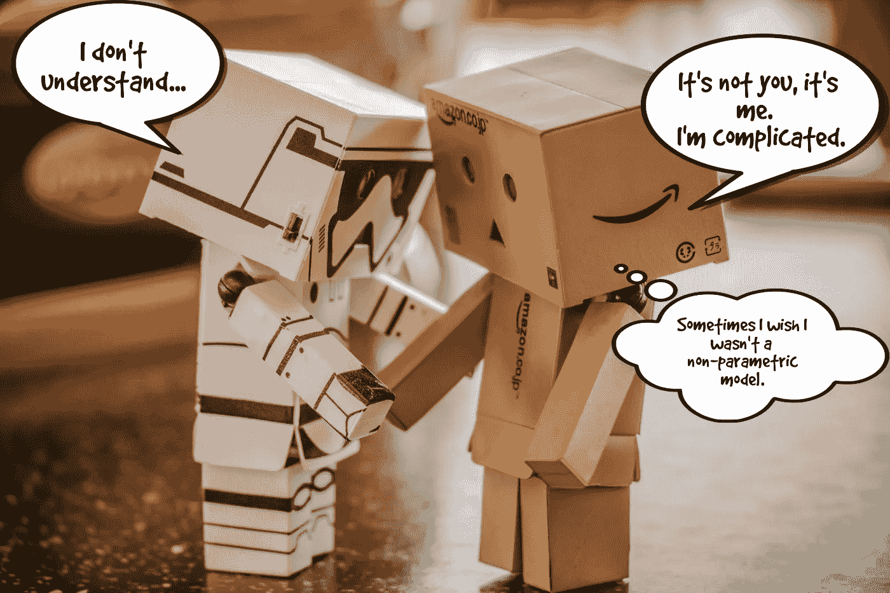
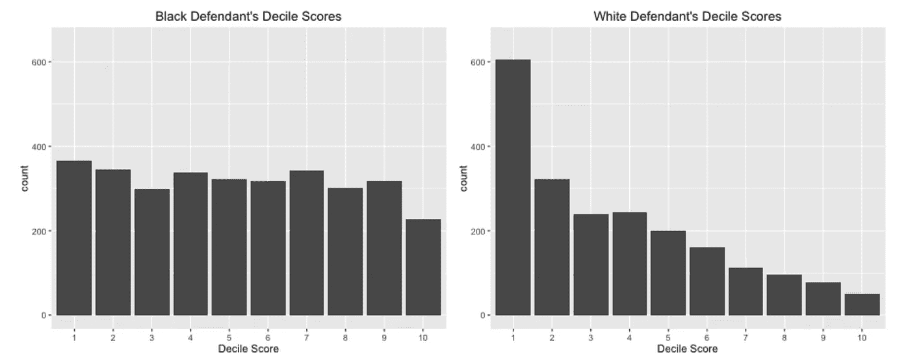
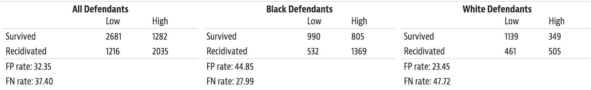

# 为什么我应该关心理解我的模型？

> 原文：<https://towardsdatascience.com/why-should-i-care-about-understanding-my-model-52a8bba2b1d8?source=collection_archive---------14----------------------->

## [现实世界中的数据科学](https://medium.com/towards-data-science/data-science-in-the-real-world/home)

## 深入分析非参数模型、非参数模型所属的系统及其在现实世界中的影响的重要性。



When parametric met non-parametric. (source: [pexels.com](http://pexels.com))

非参数机器学习(ML)模型(例如随机森林、神经网络)是高度灵活但复杂的模型，可以获得比基于回归的方法(例如逻辑、线性、多项式等)等参数模型高得多的精确度。).它们还可以更容易使用，更强大，为不当使用和误解留下更少的空间。但是这些优势是有代价的。与它们的参数模型和线性模型相比，这些模型不能产生可以解释的预测，它们的结构也不能直接可视化，也就是说，它们是不可解释的。所以让我先说:

> 理解你的模型很重要。算了吧。理解你的模型是很有必要的。

这不是哲学观点。这是一个实用的方法。我将举例说明一些关键原因。

## 为了正确性(也就是！=精确度)

强大的 ML 模型将适合数据的许多角落和缝隙中的复杂模式，分析师不可能试图直接理解这些模式，因为它们在本质上是组合的。尽管如此，在模型开始在现实世界中进行预测之前，对模型的一般行为、它与数据的交互方式以及错误所在进行某种程度的分析，可以帮助识别数据*或*与模型的问题。在脸书上提供广告的预测系统中犯错误是一回事，在医院环境中对某人的推荐治疗做出错误的预测可能是致命的。在[这篇论文](http://people.dbmi.columbia.edu/noemie/papers/15kdd.pdf)中可以找到一些关于后者可能出现的问题的很好的例子。例如，在 90 年代中期，大量资金投入到各种降低医疗诊断成本的努力中。在一个特定的例子中，目标是预测肺炎患者的死亡概率，以便低风险病例可以作为门诊患者治疗，而高风险人群将被接纳。建立了各种模型来解决这个问题，然后测量曲线下面积(AUC)以及其他指标。一些最准确的方法被证明是神经网络，然后是基于规则的模型，然后是良好的逻辑回归。理解神经网络是不可能的，但是基于规则的模型中的一个规则看起来很可疑:

```
Has Asthma (x) => Lower Risk (x)
```

这是违反直觉的。患有肺炎和有哮喘病史的患者处于高风险状态，几乎总是被送入重症监护室接受积极治疗(我自己最近也接种了肺炎疫苗，因为我有哮喘和肺部感染史)。稍加挖掘后发现，有肺炎和哮喘病史的患者被作为高危患者收治，因此得到了明显更好的治疗。因此，他们的预后通常要好得多，该模型了解到患有肺炎的哮喘患者的死亡概率较低(请看图！).这突出了一个关键问题，其中模型可以学习数据中的非预期假象，*哪些与问题*不一致，以及非参数模型的不透明性(我拒绝使用术语黑盒！)让我们很难确定到底发生了什么。

事实上， [LIME](https://arxiv.org/pdf/1602.04938.pdf) (局部可解释模型不可知解释)，一种越来越受欢迎的算法的创造者之一，*试图*解释任何预测者的预测，[做了一件伟大的工作，提出了](https://youtu.be/KP7-JtFMLo4?t=852)另一个有许多相似之处的例子。他们强调的预测问题是能够从这些图像中区分哈士奇和狼。他们是华盛顿大学的。他们的吉祥物是一只哈士奇。他们希望能够让人们带哈士奇而不是狼来参加体育赛事(自然，我感觉我的宠物狼在这里受到了歧视)。


Which one is a wolf? Or, how to build a great snow detector! (source: [pixabay.com](http://pixabay.com))

为了做到这一点，他们决定使用深度学习来训练一个分类器，它能够很好地做到这一点，并向技术人员展示他们的结果，看看他们是否认为该模型可以接受并可以使用。但是，唉，这里面有诡计，他们知道图像分类器学会了一个巧妙的技巧，他们使用的狼的图像都包含雪，而哈士奇的图像不包含雪，分类器将背景作为一个特征，而不是动物本身的特征。他们建造了一个巨大的雪探测器！这样做是为了研究精明的用户(研究生，很可能是博士，有 ML 经验)对准确但有缺陷的模型的接受程度，结果是大约一半的用户接受了该模型(另一半直接或间接指向背景或相关特征，并持怀疑态度)。虽然这项研究规模很小，但它很好地说明了在没有关于模型如何工作的定性信息的情况下可能发生的问题。

在对肺炎患者进行医学诊断的情况下，最终决定逻辑回归是更好的模型，因为与更精确的神经网络模型相关的风险太大。

# 为了责任和公平。

刑事司法系统是公正的。

我知道这是一个挑衅性的、捅马蜂窝的声明。但我们在谈论机器学习，我只是在利用一个紧张的政治环境。

ProPublica 最近发表的一项研究让我感到震惊，该研究涉及一种在全国范围内使用的算法，用于生成累犯分数(已定罪罪犯再次犯罪的趋势)。

法官、缓刑和假释官越来越多地在预审和量刑中使用这些分数，即所谓的刑事司法系统的“前端”。该研究使用了佛罗里达州一个县的数据，发现分数明显偏向非裔美国人(惊讶？).尽管任何研究都肯定有警告，进行深入审查并得出自己的结论是明智的，但研究发现的几个关键统计数据来自预测累犯时的困惑矩阵。据发现，非裔美国人被告的假阳性率为 45%，而白人被告的假阳性率为 23%。换句话说，将近一半被归类为累犯(再次犯罪)的非洲裔美国人实际上不会，而大约四分之一的白人被告被错误地归类为可能累犯，但没有。这两个数字都很高，分数被官员和法官用作“决策支持系统”的一部分，但近 2 倍的错误率的明显差异令人担忧。第二个指标是假阴性率，即算法识别为没有再次犯罪但最终犯罪的被告，白人被告(48%)明显高于非裔美国人(28%)，即白人被告获得无罪推定的机会明显更高。另一方也有公平的论点，创造该算法的公司发表了反驳，可以在[这里](https://www.documentcloud.org/documents/2998391-ProPublica-Commentary-Final-070616.html)找到，ProPublica [这里](https://www.propublica.org/article/propublica-responds-to-companys-critique-of-machine-bias-story)再次反驳。



(source: [propublica.org](https://www.propublica.org/article/how-we-analyzed-the-compas-recidivism-algorithm))

尽管如此，这些数字仍然令人不安，并引发了人们对这些工具的道德本质以及对这些模型应该给予多少考虑和研究的巨大担忧。这是一个难题，不仅因为它很难，还因为它关系到什么。模型的创建者花了多大的力气去钻透数据，分析各种角度，模拟并从本质上记录分析？请记住，“种族”不是算法中使用的变量(这将是非法的)，遗憾的是，判决委员会目前没有对风险评估中的偏见进行分析。让我们明确一下，潜在的人口统计信息通常在其他特征的数据中表示，需要非常小心地测试这些偏差。在这些情况下，很容易遵守法律条文，但却不遵守其精神。我要问读者这个问题:用一个人上学的地方来决定是否给他们提供贷款公平吗？*这不是什么技巧性的问题，*[这只是技巧性的问题。](https://www.americanbanker.com/news/is-it-ok-for-lending-algorithms-to-favor-ivy-league-schools)

## **为了更好的科学**

大约十年前，我之前的创业公司 Skytree 在纽约最大的信用卡公司之一进行概念验证，其中涉及到一个二进制分类问题，数据集有点大，但非常不平衡(正类与负类的比例为 1:1000)。我们使用*k*-最近邻居(是的，我知道你们中的一些人在想什么)并以分层的方式寻找邻居，也就是为每个班级单独寻找邻居，以解决不平衡问题。该解决方案具有较高的 AUC，但客户端的数据科学家跟踪的另一个指标存在较大误差。分层搜索扭曲了输出概率的规模，对于规模至关重要的应用，如风险(如信用评分、贷款违约)，这不是一个可行的解决方案。


(source: pixabay.com)

我们的工程师想出了一个聪明的方法(我们称之为“穴居人”解决方案)来对概率进行后处理，成功了！但是团队中的教授并不满意(我们也不满意，但是…)，决定从数学上推导出一个“合适”的解。你瞧，对我们来说幸运的是，这两种解决方案是等价的。

这个故事的寓意是，客户端的数据科学家研究了更深层次的指标，以理解算法设计者没有考虑的模型，正是由于这种数据科学，才有了由数学家设计和实现的重要突破。网-网是更好的科学和更好的模型，可以说是双赢(生命中的稀罕物等等。).

## 结束语:建立信任！

今天，有更多的工具和技术可以用来更好地理解非参数模型，应该有效地加以利用。同样重要的是，模型构建者不应孤立地看待模型，而应将其视为更广泛系统的重要组成部分。人们不再应该说

> 我只是一名工程师

当一个人的模型有可能在[严重影响](https://www.sciencemag.org/news/2018/02/artificial-intelligence-could-identify-gang-crimes-and-ignite-ethical-firestorm)人们的生活。

最终，为了我们的科学取得成功，并使 ML 模型的扩散成为现实，预测系统是负责任的，决策路径清晰*并有追索权*的空间，以及作为机器学习人员，我们需要用理解模型及其在现实世界中的影响的科学来支持构建模型的科学。

所以我再跟你说一遍:了解你的模式是必要的。预测好！