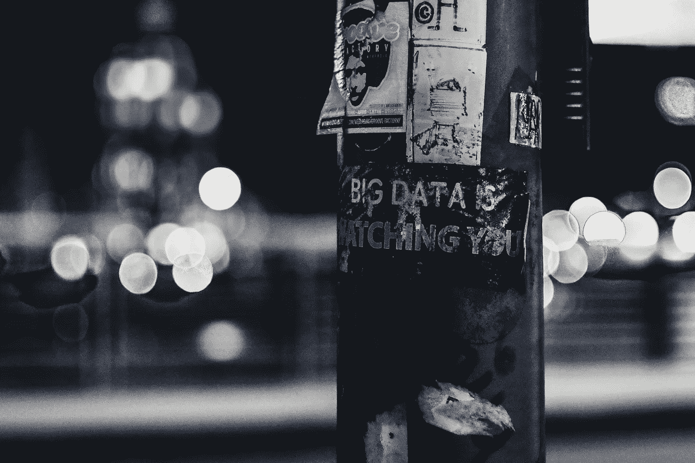

# 如果你没什么好隐瞒的，为什么还要在乎隐私呢？

> 原文：<https://towardsdatascience.com/why-should-you-care-about-privacy-if-youve-got-nothing-to-hide-2bbe663e6252?source=collection_archive---------16----------------------->

## [数据隐私](https://towardsdatascience.com/tagged/data-privacy)

## 因为你相对不道德

Photo by [ev](https://unsplash.com/@ev?utm_source=unsplash&utm_medium=referral&utm_content=creditCopyText) on [Unsplash](https://unsplash.com/s/photos/big-data-surveillance?utm_source=unsplash&utm_medium=referral&utm_content=creditCopyText)

Y 你永远也猜不到她的许多成就——剑桥大学的博士学位，一本畅销的回忆录——但是在她生命的大部分时间里，塔拉·韦斯特多弗的环境一点也不利于智力探索。当我们的父母兴高采烈地撞见我们在读课本时，塔拉惩罚了她。

在爱达荷州偏远地区的一个生存主义家庭中长大，她的童年是与世隔绝和体力劳动的。她的父亲是一个激进的宗教阴谋论者，她被严格禁止上学或与其他孩子交流。相反，她的青春都花在了家庭危险的废品场，分拣废品。无论何时发生事故——无论是金属棒穿过她的腿还是三度烧伤——她母亲的草药是唯一的治疗方法，因为医生也被禁止。

然而，最重要的是，这个家庭对书籍的审查——当然《圣经》除外——让年轻的塔拉难以忍受。她抑制不住自己好奇的心，反抗专横的父亲，开始偷偷地吞食文学。被书页赋予生命的野生世界让她着迷得无以复加，因为它们与她自己限制性的存在如此不同。她经常躲在地下室的沙发后面看书。或者在晚上，一本书真的推到她的脸上，因为月光是她唯一的照明源。

风险得到了回报。十六岁时，没有受过任何正规教育的她通过了大学入学考试，逃离了她家这座名副其实的监狱。

ara Westover 与她童年时代的立法者——她的父母——的亲密个人斗争在我们社会的大尺度上反映了整个历史。在人类道德和伦理发展的每一个值得注意的时刻，对明天有着非凡远见的小社区不可避免地与他们今天的普遍规则发生冲突。

想想一小撮理想主义者反抗专制的罗马帝国传播基督教。或者许多科学家为了揭示我们宇宙的真实运作而被烧死。或者外科医生冒着失去生计的危险闯入停尸房研究人体解剖，而当时解剖是被禁止的。也不要忘记，美国本身就是在一场叛乱中诞生的，独立宣言是对英国法律的公然违反。

当然，历史并没有结束——即使是现在，人们也在不断打破腐朽的现状，因为他们的价值观领先于法律。也许是一对同性恋情侣在一个暴虐的政权下表达爱意。也许是一个儿子在一个认为安乐死等同于谋杀的状态下，帮助父亲有尊严地离开这个世界。我敢说，也许这是一个陷入困境的年轻女子最终使用仍然非法的迷幻药战胜了她的抑郁症。

教训很简单:我们的社会朝着一个更加公正的世界前进，却因其敢于反抗自身不公正的法律而受到削弱。

优化理论家——研究一个系统，无论是整个全球经济还是一个小蚁群，达到最佳状态的条件的科学家——称之为探索-开发权衡。这是一个古老的难题，如何权衡探索新的可能性和利用旧的确定性。

过分强调探索本身就是沉溺于有害的理想主义。结果是:顽固地拒绝接受任何宪法，让位于无政府状态。我们可以在法国大革命期间最清楚地看到过度革命热情的严重后果，反叛者像一对在柏油路上旋转的轮胎一样燃烧自己。

法国资产阶级终于流血摆脱了压迫。好心但致命的优柔寡断的路易·VXI，他浮夸的妻子玛丽·安托瓦内特，以及他们宫廷的大部分人都被斩首。君主制被推翻后，是时候建立一个来之不易的共和国了。但是他们不能。这种打击将持续一年的大部分时间，因为任何站出来提出新的、更公平的宪法的人都被致命的堂吉诃德式的大众视为暴君，并被立即处决。每一项提议的法律，无论多么公正，都没有达到革命者模糊的理想。一个处于完全探索模式的社会——一个混乱的社会。

另一方面，对既定秩序的严格利用——不允许背离法律以最大限度地保持一致——不会给道德进步留下任何空间。一个法律从未被违反的世界是一个我们的价值观从未受到挑战的世界，因为前者反映并永远滞后于后者。

这样的世界将是一个隐性压迫的世界。如果不是在空间，那么肯定是在时间，因为我们会约束后代遵守他们祖先的不完整的规则。正如我们回顾过去，厌恶罗马人的野蛮习俗——厌女症、奴隶制、被斗兽场完美概括的普遍暴行——我们的后代会回顾我们，憎恶我们目前忽视的司法系统的不公正。

因此，很明显，通往公平社会的道路是通过中间路线，而不是不稳定的极端路线。一种主张在实施严格的指导方针和将它们边缘化之间保持谨慎平衡的观点。从这个角度看，隐性犯罪的存在不是制度上的缺陷，而是一种特征。

只有在一个允许违反规则和强制执行规则之间有所松懈的社会里，对既定秩序的必要违反才是可行的。偶尔，不当行为必须不受惩罚，这既是为了让人们保持勇气来测试我们目前原则的界限，也是为了让这种富有成效的不安有机会被忽视足够长的时间，以获得动力并推动我们前进。

这一本质缺陷的基础是隐私。

如果没有机会秘密行事，塔拉·威斯多佛仍然会在垃圾堆里寻找废金属。如果我们被剥夺了不公平的规则可以被偷偷打破而不被迫害的希望，我们就没有变革的催化剂。事实上，往往是那些最明显受到压迫的人，那些知道他们在实践中，而不仅仅是在理论上为之奋斗的人——被迫分开的同性恋者，[一名因堕胎而入狱的强奸受害者](https://www.independent.co.uk/news/world/americas/us-politics/south-carolina-abortion-ban-rape-incest-henry-mcmaster-a9168656.html)——他们要求解放的呼声最高。

意识到社会进步和人民隐私之间的密切关系，开国元勋们发誓将后者的权利融入他们新生国家的结构中。整部宪法的一个共同主题是，执法工作被故意变得更难，而不是更容易，为改革派叛乱的酝酿提供了急需的空间。《权利法案》概述的十项修正案中有整整一半是关于故意制造低效率和阻碍州政府行使权力和进行监督的能力。

这一点在第四条中特别清楚，该条禁止不合理的搜查和扣押，只允许“基于可能的原因……并特别说明要搜查的地方，要扣押的人或物。”正是由于这一修正案，一个明显有罪的罪犯有时会逍遥法外，因为他的凶器只是在一次*无根据的*搜查中发现的，因此不能作为证据。如果你认为这是不公平的，考虑一下这也是你不能监禁一个丈夫的原因，如果在一个不相关的 911 电话中，警察发现了他为治疗他妻子的癫痫而种植的大麻植物。

日复一日，我们正在失去不被人注意的基本自由。我们的隐私权被如此公然地侵犯，以至于引起人们对它的关注是一种平庸的行为。众所周知，我们的[“私人”信息通过社交网络与几乎任何人共享](https://en.wikipedia.org/wiki/Facebook%E2%80%93Cambridge_Analytica_data_scandal)，我们的[身体对话被虚拟助理记录](https://www.wsj.com/articles/google-contractors-listen-to-recordings-of-consumers-addressing-virtual-assistant-11562865883)，我们的[家被我们的网络摄像头窥视](https://www.theguardian.com/commentisfree/2018/apr/06/phone-camera-microphone-spying)。全面监控。

现在，当然，在目前，持续的监控并没有被广泛的起诉所补充。当我们抽大麻的私人视频偷偷从我们的手机上传到国家安全局的数据库时，我们的大门不太可能被踢开。但是，通过允许我们的隐私不断被侵犯，我们使得这种可能性非常容易发生。这就好像我们允许警察永久驻扎在我们的房子里，不停地监视我们的一举一动。目前，他们奉命对我们的个人不端行为不予理会，但一个更严厉的回应只是一个政治家的签名。

我们永远不知道什么时候一个煽动性的事件——9/11 类型，群众被愤怒弄得失去理性——可能会引发这样的反应。在动荡时期做出冲动的、有严重缺陷的政治决策的先例比比皆是，但也许最恰当的例子是美国不光彩地入侵伊拉克。当然，如果我们允许自己基于“私人”信息受到普遍压迫，就不会有随后的运动能够推翻这一短视的裁决，因为历史上为他们提供便利的地下组织将会浮出水面。

更重要的是，没有人提醒我们失去的自由，我们很快就会完全忘记它们。不知道任何更好的，社会将默认为盲目顺从，完全满足于它的停滞。从这个意义上说，它不太像奥威尔的《1984》，在那里暴政是公开和生硬的，而更像赫胥黎的《勇敢的新世界》，在那里征服和自由之间的界限是模糊和主观的。

隐私问题很像气候变化问题，我们疏忽的大部分后果都存在于未来。要解决这两个问题，我们需要首先承认我们已经入不敷出，然后为了不那么不稳定的明天，牺牲掉许多我们今天认为理所当然的舒适。

我们必须摒弃的便利之一是我们互联网平台的免费性质。正是谷歌和脸书目前基于广告的商业模式，促使他们辜负了用户的信任。这样一个系统预示着数字巨兽的成功取决于他们瞄准广告的能力，这反过来又使他们的收入与他们能够测量用户倾向的精确度成正比。

因此，这在很大程度上是我们自己吝啬态度的错——我们不愿意为我们消费的服务明确付费——这导致了我们个人数据的大规模收集。如果我们集体接受一个搜索引擎和社交网络在基于订阅的模式下运行的世界，他们在决定是否监视我们之前所做的风险回报计算无疑会对我们有利。正如剧作家伯德·布莱克特所说，“先有一个饱肚子，然后才是道德。”

赢回我们隐私之战的第二个因果关系是人工智能和机器人等数据饥渴领域目前的发展速度。像亚马逊 Alexa 和谷歌 Duplex 这样的虚拟助手能够传达如此惊人的真实性，只是因为我们允许他们的开发者在我们家中假想的隐私对话中搭载他们的发明。

这种安排本身没有什么本质上的错误，但我们需要完全确保用于训练这些机器学习模型的个人数据永远不会被存储或分析。我们的重点应该是开发系统，通过加密和操作管道的巧妙结合，使我们的数据免受窥探(以数学上可证明的方式)，而不损害其对算法开发的可用性。事实上，[这样的技术已经存在了](https://en.wikipedia.org/wiki/Differential_privacy)，但是他们的部署是缺乏的，很大程度上是由于有限的公众压力。

我这是问题的微妙本质，原因——允许我们自己在当前的个人层面上被监控—*—和结果——未来*社会层面上的道德停滞—*—之间的反差使得隐私成为我们这个时代的一个定义性问题。由于我们无法超越自己和眼前的事物，我们无法从个人原因走到客观结果。所以我们半途而废，错误地认为隐私只与有罪和可疑的人有关。*

就拿我来说，我过去常常在镇上四处宣称:“我不在乎隐私，因为我没有什么可隐瞒的。”我一点也不知道，我看起来就像是在宣布:“我不在乎言论自由，因为我无话可说！”