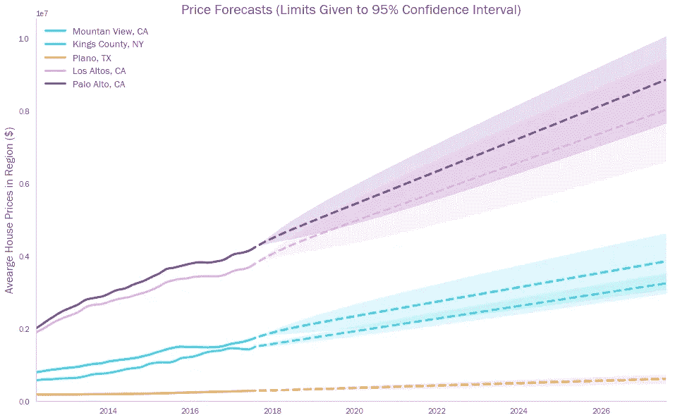

# 你为什么要搬到德克萨斯州的普莱诺？

> 原文：<https://towardsdatascience.com/why-should-you-move-to-plano-texas-ec69ad08be3d?source=collection_archive---------20----------------------->

## 使用 ARIMA 模型预测房价——并知道何时相信这些数字

在之前的一篇博客文章中，我讨论了能够预测房子价值的潜在好处(主要的好处是能够积累可观的个人财富)。

作为一个成年后大部分时间都受伦敦租赁市场支配的人，我不习惯支持房地产投机生意。然而，对于数据科学家来说，预测房价是一个有趣的应用，它让我们有机会探索预测技术、它们的优势和它们的局限性。

> 注意——包含该博客中所有数据和分析的 Github repo 可以在这里找到[。我大多使用标准库(Pandas，Matplotlib 等。)但是还有一些更奇特的功能，比如用于地图视觉效果的 Geopandas，以及 Statsmodels 的 ARIMA 功能，这些功能可能会很有意思。](https://github.com/calbal91/dsc-mod-4-project-online-ds-pt-051319)


Take your pick… (image: Pexels)

# 任务

我们分析的目的看似简单——根据美国房地产市场的历史数据，如果我们的目标是在十年内获得尽可能大的投资回报，我们会建议现在在哪五个地区购买房产？

我们从使用来自 [Zillow](https://www.zillow.com/) 的数据生成的数据集开始。这一数据相对来说比较精确，覆盖了美国 14，103 个“地区”。对于每个地区，我们得到一些基本信息(城市、大都市地区、州等。)以及该地区从 1996 年 4 月到 2018 年 4 月的每月房价中位数。


每个州都出现在数据集中，但是，正如我们所料，我们有更多来自人口更多的州的地区(加利福尼亚、德克萨斯、纽约、佛罗里达)。


Heatmap of the number of regions in dataset, by state

诱惑可能是直接投入预测。但是，数据的某些属性会显著影响我们处理和解释结果的方式。

# 美国房地产市场

你需要在过去十年左右的时间里一直住在山洞里，才知道美国房地产市场最近有些波动。


事实上，在金融危机期间(在本分析中定义为 2007 年 4 月至 2012 年 4 月之间的几个月),投资一个洞穴可能比投资一套亚利桑那州的公寓或佛罗里达州的公寓要好。在此期间，除了三个州之外，所有地区的价格增长中值都是负数，受影响最严重地区的许多房屋价值损失超过一半。


然而，如果我们再看一下 2012 年以来的情况，我们会发现，与前五年形成鲜明对比的是，所有国家的平均增长率都有所上升。我们还看到，在危机中受影响最严重的州(内华达、佛罗里达、亚利桑那和加利福尼亚)已经成为增长最快的州之一。


当我们开始拟合预测模型时，这些都是非常重要的背景:

*   我们不应该使用完整的历史数据来训练我们的模型。金融危机对时间序列的形态产生了实质性影响，但(我们只能希望)是一个反常的外生事件。如果我们不希望类似的事情再次发生，那么我们就不应该让我们的模型根据那个时期的数据来训练自己。因此，我们应该关注 2012 年 4 月以来的价格数据…
*   …但是，采用这种方法会带来自身的问题。通过只使用过去六年的数据，一个模型可能会假设像内华达州和佛罗里达州这样的地区是肯定的赌注，并热情地建议我们在那里投资。当然，我们知道在这些情况下的增长只是从严重的衰退中复苏。在任何情况下，我们都应该谨慎投资于那些一旦发生不可预见的经济冲击就有可能贬值一半的地区。

这是一个基本的例子，说明盲目地向数据集扔模型(不管有多复杂)只能让你走到这一步。如果可能的话，应该首先运用一些人类常识和批判性思维。

为此，我们绘制了所有地区的散点图，水平方向是最近的价格增长，垂直方向是金融危机期间的价格增长。


Bubble size denotes the relative value of houses in each region as at April 2018

通过观察这两项指标均高于平均水平的地区，我们可以找出那些在 2007 年至 2012 年间经受住了金融风暴(至少表现出一定的抵御经济冲击的能力)并在未来几年拥有强劲增长潜力的地区。

因此，这 1737 个*增长区域都是我们原则上可以放心推荐给投资者的区域。事实上，通过将这些地区 2007 年 4 月的价格指数化，我们发现至少自 1996 年以来，这些地区的表现优于其他地区。*

**

*有趣的是，我们也看到导致金融危机(2003 年至 2007 年)的增长实际上更慢。这支持了一种观点，即这些地区的“基本面”更强，它们的房价没有因次级贷款而过度膨胀。*

# *模特们*

*现在，我们已经缩小了数据集的时间范围和区域范围，我们可以开始考虑对数据进行建模以生成预测。我们可以使用几种不同类型的模型，选择正确的模型取决于数据的特征。*

> ***1)数据是静态的吗？***

*简而言之，平稳时间序列的均值、方差和协方差(即，如果数据是季节性的，则周期的规律性*)随着时间的推移保持不变(或者，如果您喜欢，*平稳*)。**

*目测我们的数据表明，这些条件中至少有一个不满足——平均房价或多或少是随着时间的推移而上涨的(它肯定不是恒定的)。*

*我们可以使用迪基-富勒测试从数学上证明这一点。如果我们使用 Python，那么我们可以从 Statsmodels 包中导入一个现成的函数。*

```
*p-value for all data = 0.587*
```

*注意，Dickey-Fuller 本质上是一个假设检验，其中的零假设是数据不是平稳的。因此，我们想要一个低于经典值 0.05 的 p 值来拒绝这一点，并显示数据*是*稳定的。*

*很明显，在这种情况下，p 值有一段距离。缺乏平稳性立即排除了一些更简单模型的使用，如[白噪声](https://machinelearningmastery.com/white-noise-time-series-python/)、[随机游走](https://machinelearningmastery.com/gentle-introduction-random-walk-times-series-forecasting-python/)，或基本[自动回归](https://machinelearningmastery.com/autoregression-models-time-series-forecasting-python/)。*

> ***2)数据是季节性的吗？***

*季节性是一个简单的概念，它表明数据值不仅取决于时间序列的总体时间框架，还取决于该时间框架内的定期时段。*

*例如，每月的航空乘客数量将是季节性的，尽管下图中的平均趋势明显增加，但乘客数量也取决于季节，人数在夏季增加，在冬季再次下降。*

**

*我们可以通过调查[自相关](https://www.youtube.com/watch?v=pax02Q0aJO8)来测试季节性。为此，我们复制时间序列，将其向后移动 *x* 个周期，并测试移动后的数据与原始时间序列之间的相关性。例如，如果月度数据在年度背景下是季节性的(比如，谷歌搜索“饮食”的数量，这往往在 1 月份特别受欢迎)，那么 12 个月的滞后应该会产生高水平的相关性。*

**

*An example of strong autocorrelation — we move the orange line 12 months backwards, and see how well it correlates with the blue line (which is, of course, the same data, just shifted by 12 months).*

*令人高兴的是，有 Statsmodels 函数可以生成一个图表，同时显示不同滞后期的相关性。*

**

*正如我们所看到的，房价与一个时期的滞后有很强的自相关性，但除此之外完全没有。如果我们有季节性数据，我们预计会在，例如， *x=* 12，看到一个峰值。我们没有观察到任何这样的峰值，这告诉我们，我们的数据不是季节性的，只是某个月的房价往往与上个月的价格非常相似。*

# *论 ARIMA 造型*

*上面的平稳性和季节性测试表明，我们有权利在这个练习中使用 ARIMA 模型。在这篇博客中，我不打算过多地谈论 ARIMA 的数学(看[这里](https://machinelearningmastery.com/arima-for-time-series-forecasting-with-python/)有一个比我能给自己的更好的解释)。*

*简而言之，ARIMA 模型可以分为三个主要部分:*

*   ***AR** :自回归*。模型的一部分，使用观察值和 *p* 滞后观察值之间的依赖关系。**
*   ****一** : *综合*。使用原始观测值的差分(例如，从之前的观测值 *d* 周期中减去一个观测值)以使时间序列平稳。注意— *d* 如果数据已经是静态的，可能等于 0，在这种情况下我们不做差分。**
*   ****马** : *移动平均线*。模型的一部分，使用观察值和移动平均模型残差之间的相关性，该模型应用于 *q* 滞后观察值。**

**因此，我们说 ARIMA 模型的阶数为(p，d，q) — *p* 是自回归项的数量， *d* 是我们求差的周期数量， *q* 是移动平均项的数量。**

**具有相同阶数的两个 ARIMA 模型可以具有不同的系数，因此是完全不同的模型。事实上，为每个地区创建一个定制的模型以最大限度地提高我们预测的准确性是可取的。然而，由于我们有大约 1，737 个时间序列(每个“增长区域”一个)，我们应该创建一些函数来自动化模型构建过程。**

**首先，我们定义一个函数，给定一个地区的时间序列数据，将返回该地区的“最佳”ARIMA 模型。这是我们用来预测该地区未来房价的模型。为此，我们可以依靠 Statsmodels 的 [ARIMA 建模函数](https://www.statsmodels.org/stable/generated/statsmodels.tsa.arima_model.ARIMA.html)，它采用两个关键输入:**

1.  **一些时间序列数据**
2.  **所需的模型阶数，即我们希望用于(p，d，q)的数字**

**然后，它输出最适合指定阶数的数据的模型(即系数集)。因此，我们需要找出哪一个*阶*能够为给定区域生成最佳模型。为此，我们可以采取简单的“网格搜索”方法，生成潜在“订单”列表…**

```
**[(0, 0, 1), (0, 0, 2), (0, 1, 0), (0, 1, 1), (0, 1, 2), (1, 0, 0), (1, 0, 1), (1, 0, 2), etc...]**
```

**…然后遍历这些模型，并比较 Statsmodels 为每个模型生成的模型。**

**有几种方法可以进行比较。在这种情况下，我们进行训练/测试分割，使用前 90%的数据(比如，截至 2017 年 1 月的价格)拟合模型的每个版本，然后计算每个模型对最后 10%的预测的[均方根误差(RSME)](https://en.wikipedia.org/wiki/Root-mean-square_deviation) 。然后，我们采用其预测具有最低(即最佳)RSME 的模型。**

> **注意——另一种方法可能是比较模型的[AIC](https://en.wikipedia.org/wiki/Akaike_information_criterion)或[BIC](https://en.wikipedia.org/wiki/Bayesian_information_criterion)**

**明确地说，我们用这个函数同时优化了两件事；**

1.  **ARIMA 模型的阶(p，d，q)**
2.  **模型的系数**

**在此之后，创建第二个函数来遍历我们的每个“增长区域”是相当简单的，并使用上述函数来输出每个区域的最佳模型。让我们的 *arima_selection* 函数将 arima 模型本身作为一个对象返回的好处是，我们可以存储它并在以后调用它。**

**实际上，让我们假设我们已经将所有 1737 个*模型*存储在熊猫数据帧的列中(熊猫数据帧非常乐意存储几乎任何你可以扔向它的对象)。**

****

**A Pandas dataframe, with model objects stored in the ‘FittedModel’ column**

**然后我们可以使用 Pandas 的[映射函数](https://pandas.pydata.org/pandas-docs/stable/reference/api/pandas.Series.map.html)调用模型对象方法，并将结果存储为新列。**

**例如，假设我想计算并存储每个模型的 AIC。然后我可以做以下事情:**

```
**df[‘ModelAIC’] = df[‘FittedModel’].map(lambda x: x.aic)**
```

**这将在数据帧中生成一个新列:**

****

**当然，我们可以使用这种技术提取关于每个模型的大量信息，使用 Statsmodels 内置的许多方法。这些方法的完整列表可以在[这里](https://www.statsmodels.org/stable/generated/statsmodels.tsa.arima_model.ARIMAResults.html#statsmodels.tsa.arima_model.ARIMAResults)找到，但是我们将在本练习中使用的关键方法是:**

*   **[T1。预测()](https://www.statsmodels.org/stable/generated/statsmodels.tsa.arima_model.ARIMAResults.forecast.html#statsmodels.tsa.arima_model.ARIMAResults.forecast) —使用模型预测时间序列的下 n 个值**
*   **[**。conf_int()**](https://www.statsmodels.org/stable/generated/statsmodels.tsa.arima_model.ARIMAResults.conf_int.html#statsmodels.tsa.arima_model.ARIMAResults.conf_int) —给出预测的范围(基于定义的置信区间)**
*   ****。arparams()** —告诉我们自动回归参数的模型系数是什么**
*   ****。maparams()** —告诉我们移动平均参数的模型系数是什么**
*   ****。pvalues()** —给我们参数的 t-stat 的双尾 p 值**

**这些额外的统计数据非常有用，因为我们可以使用它们来进一步过滤我们的区域(例如，我们可以排除模型参数具有统计上不显著的 p 值的任何区域)。**

**我们还注意到，一些预测的范围非常广(如。conf_int()方法)。例如，我们的模型预测，10 年后，科罗拉多州普韦布洛县的回报率可能在 21%到 766%之间。**

****

**虽然这可能对风险偏好强烈的投资者有吸引力，但这种不确定的回报并不会给大多数人带来明智的建议。在选择推荐的最终地区时，我们需要平衡增长潜力和增长不确定性。**

**为此，我们可以在另一个散点图上比较各个区域，在水平方向上显示预测价格增长，在垂直方向上显示预测范围的宽度(占预测值的百分比)。**

****

**通过这种方式，我们可以隔离出潜在增长强劲、预测值范围相对较窄的地区，从而将风险降至最低。为了做到这一点，我们选择了绿色阴影区域中最右边的五个区域。**

# **结果呢**

**我们选择的五个地区相当多样化，并带来了一些惊喜——加利福尼亚州的帕洛阿尔托可能看起来是一个相对明显的房地产热点，但德克萨斯州的普莱诺不太可能引起投资者的注意。**

****

**假设我们在这五个地区平均投资 100 万美元，我们预计我们的投资组合价值将在十年内翻一番以上。我们有 95%的把握预测，该投资组合的价值将在 178 万美元至 243 万美元之间**

****

**查看此“推荐”投资组合与由五个预测增长最高的地区(不考虑风险，即“高增长”地区)组成的不太细微的投资组合的对比。**

****

**虽然我们的预测表明，到 2028 年，这种“高增长”投资组合的价值可能达到 454 万美元(回报率超过 350%，远高于“推荐”投资组合的 110%)，但它也有可能在此期间损失 86%的价值；这是有闲钱的风险爱好者可能会去做的事情，但对普通投资者来说不是明智的建议。**

**所以，如果你确实在寻找一个新的美国社区，为什么不去德克萨斯州的普莱诺试试呢？据说这是一个非常适合居住的城市[。而且，如果 ARIMA 模型是可信的，你的投资可能会获得可观的回报。](https://livability.com/tx/plano/real-estate/why-plano-tx-is-a-best-place-to-live)**

> **感谢你一直读到博客的结尾！我很乐意听到任何关于上述分析的评论，或者这篇文章涉及的任何概念。欢迎在下面留言，或者通过 [LinkedIn](https://www.linkedin.com/in/callum-ballard/) 联系我。**