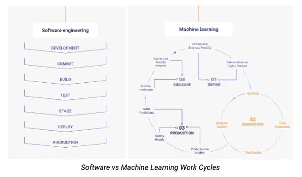
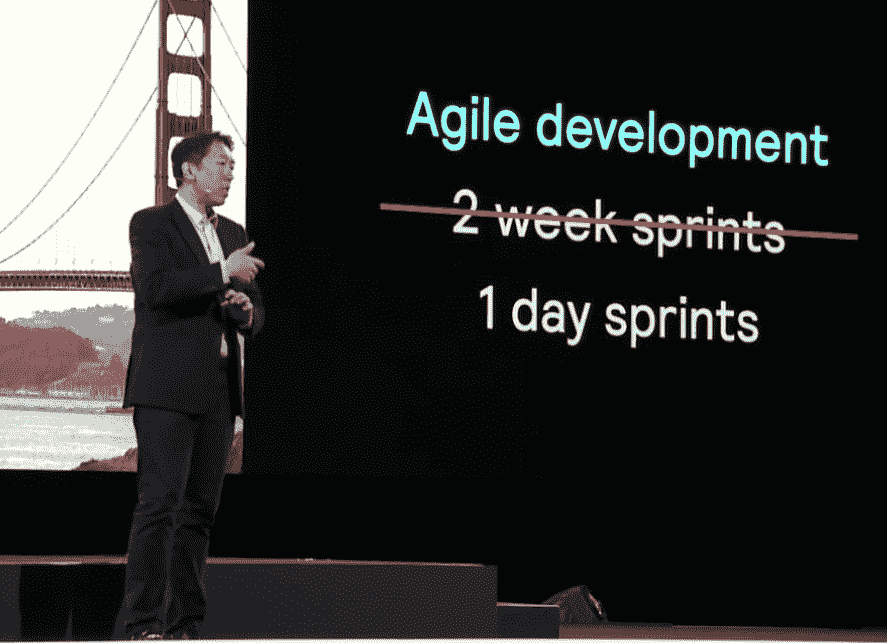

# 为什么软件工程过程和工具不适用于机器学习

> 原文：<https://towardsdatascience.com/why-software-engineering-processes-and-tools-dont-work-for-machine-learning-975cc774888c?source=collection_archive---------20----------------------->

作者:Niko Laskaris，Comet.ml 数据科学家

“人工智能是新的电力。”至少，这是吴恩达在今年的[亚马逊火星](https://remars.amazon.com/)会议上提出的建议。在他的[主题演讲](https://www.youtube.com/watch?v=j2nGxw8sKYU)中，Ng 讨论了人工智能(AI)的快速增长——它稳步进入一个又一个行业；人工智能突破、技术或恐惧每天都在头条新闻中无情地出现；巨额投资，既来自寻求现代化的老牌企业(见:[索尼](https://www.engadget.com/2019/11/19/sony-ai/)，几周前)，也来自乘着专注于人工智能的创始人的浪潮空降到市场的风险投资者。

“人工智能是下一个重大变革，”Ng 坚持认为，我们正在观察这场变革的展开。

虽然人工智能可能是新的电力(作为一名[彗星](http://comet.ml)的数据科学家，我不需要太多的说服力)，但该领域要实现这一潜力仍面临重大挑战。**在这篇博文中，我将谈论为什么数据科学家和团队不能依赖软件工程团队在过去 20 年中一直用于机器学习的工具和过程** **(ML)。**

对软件工程的工具和过程的依赖是有意义的——数据科学和软件工程都是以代码为主要工具的学科。然而*数据科学团队所做的*与软件工程团队所做的完全不同。考察这两个学科之间的核心差异是一个有益的练习，可以澄清我们应该如何考虑构建我们的工具和过程来进行人工智能。

在 Comet，我们相信采用专门为人工智能设计的工具和流程将有助于从业者开启并实现 Ng 所说的革命性变革。

# 不同的学科，不同的过程

软件工程是一门学科，从广义上讲，它的目标是设计和实现计算机可以执行的程序，以实现定义的功能。假设软件程序的输入在预期的(或约束的)输入范围内，它的行为是可知的。在 2015 年 ICML 的一次[演讲](https://leon.bottou.org/talks/2challenges)中，Leon Bottou 很好地阐述了这一点:在软件工程中，一个算法或程序可以被证明*是正确的*，在某种意义上，给定关于输入的特定假设，当算法或程序终止时，某些属性将为真。

软件程序的可证明的正确性塑造了我们为进行软件工程而构建的工具和过程。考虑从可证明的正确性得出的软件编程的一个必然特征:如果一个程序对于某些输入值是可证明正确的，那么该程序包含对于那些输入值也是可证明正确的子程序。这就是为什么像[敏捷](https://en.wikipedia.org/wiki/Scaled_agile_framework)这样的工程过程，从广义上讲，对软件团队来说是成功的和多产的。将这些项目分解成子任务是可行的。大多数[瀑布](https://en.wikipedia.org/wiki/Waterfall_model)和 [scrum](https://en.wikipedia.org/wiki/Scrum_(software_development)) 实现也包括子任务。

我们看到许多数据科学团队使用与这些软件方法相同或大致相似的工作流程。不幸的是，它们不太好用。原因？软件工程可证明的正确性并没有延伸到 AI 和机器学习。在(监督的)机器学习中，我们对我们建立的模型的唯一保证是，如果训练集是来自某个分布的 [iid](https://en.wikipedia.org/wiki/Independent_and_identically_distributed_random_variables) (独立且同分布)样本，那么来自同一分布的另一个 iid 样本的性能将*接近*训练集的性能。因为不确定性是机器学习的固有属性，子任务可能会导致不可预见的下游影响。

# 为什么不确定性是机器学习固有的？

部分答案在于这样一个事实，即(a)我们感兴趣的问题和(b)机器学习解决方案(自动驾驶汽车、物体识别、标记图像和生成语言模型，仅举几个例子)的问题都没有明确的可重复的数学或编程规范。为了检测模式并生成预测，机器学习系统会输入大量数据，而不是规范。换句话说，机器学习的*目的是创建一个统计代理，可以作为这些任务*之一的规范。我们希望我们收集的数据是真实世界分布的代表性子样本，但实际上我们无法确切知道这个条件满足得有多好。最后，我们使用的算法和模型架构非常复杂，复杂到我们无法总是将它们分解成子模型来准确理解正在发生的事情。

从这个描述中，机器学习系统的*可知性*的障碍应该是显而易见的。适合机器学习的问题类型的固有特点是缺乏明确的数学规范。我们在缺乏规范的情况下使用的统计代理正在积累大量的环境数据，我们*希望*是独立的和有代表性的。我们用来从这些收集的数据中提取模式的模型非常复杂，我们无法可靠地将它们分开并准确理解它们是如何工作的。我在 Comet 的同事 Dhruv Nair 写了一个关于机器学习中的不确定性的三部分系列(这里有一个链接指向第一部分的[),如果你想更深入地了解这个主题的话。](https://www.comet.ml/blog/?p=662)

然后，考虑一下机器学习项目中使用的敏捷方法的含义。我们不可能希望将机器学习任务分解为*个子任务*，作为某个更大的 sprint 的一部分来处理，然后像乐高积木一样拼凑成一个完整的产品、平台或功能，因为我们无法可靠地预测子模型或模型本身将如何运行。

Ng 在 re:MARS 上也讨论了这个话题。他透露了他的团队如何采用专门为 ML 设计的工作流程系统: **1 天冲刺**，结构如下:

1.  每天构建模型和编写代码
2.  设置培训并通宵运行实验
3.  早上分析结果，然后…
4.  重复

Ng 的一天冲刺方法论反映了对于理解和设计实践机器学习的团队至关重要的东西:它是一门内在的实验科学。因为正在建立的系统缺乏明确的规范，因为数据收集是一门不完善的科学，因为机器学习模型非常复杂，*实验是必要的*。相对于围绕几周的冲刺来构建团队过程，快速测试许多不同的架构、特性工程选择和优化方法，直到开始出现什么可行什么不可行的粗略图像，通常更有成效。1 天冲刺允许团队快速行动，在短时间内测试许多假设，并开始围绕建模任务建立直觉和知识。

# ML 工具:实验管理

假设你采用了吴恩达的一天冲刺法或类似的方法(*，你应该*)。您正在设置新的超参数，调整您的功能选择，并每晚运行实验。您使用什么工具来跟踪每次模型培训的决策？你如何比较实验来了解不同的配置是如何工作的？你如何与同事分享实验？你的经理或同事能可靠地重现你昨天做的实验吗？

除了过程，你用来做机器学习的工具也很重要。在 Comet，我们的使命是通过提供一个工具来帮助公司从机器学习中提取商业价值。我们采访的大多数数据科学团队都坚持使用 git、电子邮件和(信不信由你)电子表格的组合来记录每个实验的所有工件。

考虑一个建模任务，其中您跟踪 20 个超参数、10 个度量、几十个架构和特性工程技术，同时快速迭代并每天运行几十个模型。手动跟踪所有这些工件会变得非常乏味。构建一个好的 ML 模型常常类似于用 50 个旋钮调谐一台收音机。如果您不跟踪您尝试过的所有配置，在您的建模空间中寻找信号的组合复杂性会变得很麻烦。

我们基于这些需求(以及我们自己在谷歌、IBM 以及作为哥伦比亚大学和耶鲁大学研究小组的一部分从事数据科学和机器学习工作时的需求)构建了 Comet。每次你训练一个模型的时候，应该有*的东西*来捕获你实验的所有工件，并把它们保存在某个中央账本中，在那里你可以查找、比较和过滤你(或你的团队)的所有工作。Comet 的建立就是为了给机器学习的实践者提供这个功能。

测量工作流效率是一件众所周知困难的事情，但是我们的用户平均报告说使用 Comet 节省了 20-30%的时间(注:Comet 对个人和研究人员是免费的，你可以在这里注册)。这还没有考虑到独特的见解和知识，这些见解和知识来自对超参数空间的视觉理解、实时度量跟踪、团队范围的协作和实验比较等事物的见解。获取这些知识可以节省时间，或许更重要的是，能够*构建更好的模型*。

# 展望未来

人们很容易忽略关于 ML 工具和过程的问题。在一个负责自动驾驶汽车、语音助手、面部识别和许多更具开创性的技术的领域，人们可能会被原谅跳入自己构建这些工具的争论中，而不考虑如何最好地构建它们。

如果你确信软件工程栈对于人工智能来说足够好，你将不会被证明是绝对正确或错误的。毕竟这是一个由不确定性定义的领域。但也许最好用数据科学家考虑建模任务的方式来考虑这个问题:可能的未来的概率分布是什么？可能性大还是小？像人工智能这样强大和有前途的领域将继续依赖于为不同学科建立的工具和过程，或者新的工具和过程将出现，以最大限度地赋予从业者权力？

*如果你对这些 ML 工具很好奇或者有什么疑问，可以随时联系我*[*niko @ comet . ML*](mailto:niko@comet.ml)*。*

**补充阅读**
关于机器学习和软件工程区别的博客:

1.  [关于 ML vs 软件工程的 Futurice 博客](https://www.futurice.com/blog/differences-between-machine-learning-and-software-engineering/)
2.  [KD 掘金博客 ML vs 软件工程](https://www.kdnuggets.com/2017/03/software-engineering-vs-machine-learning-concepts.html)
3.  [Concur Labs 关于 ML vs 软件工程的博客](https://blog.concurlabs.com/10-differences-between-ml-and-software-development-part-1-3e21a83094d1)
4.  [微软关于构建 ML 团队流程的案例研究](https://www.microsoft.com/en-us/research/uploads/prod/2019/03/amershi-icse-2019_Software_Engineering_for_Machine_Learning.pdf)
5.  [利昂·博图 2015 年 ICML 演讲幻灯片](https://icml.cc/2015/invited/LeonBottouICML2015.pdf)

*原载于 2019 年 12 月 4 日*[*https://www . comet . ml*](https://www.comet.ml/blog/?p=1183)*。*