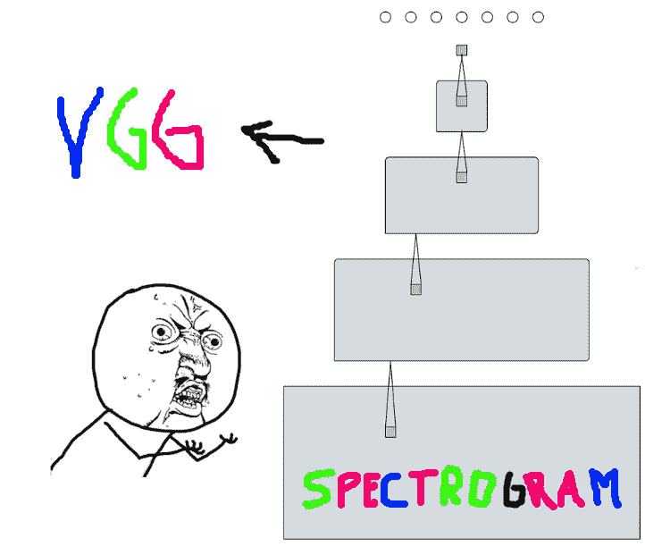
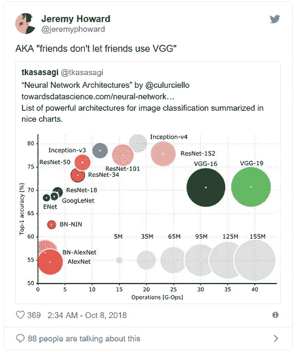

# 为什么基于声谱图的 vgg 很烂？

> 原文：<https://towardsdatascience.com/why-spectrogram-based-vggs-suck-36ca9b5b0b40?source=collection_archive---------18----------------------->

我:vgg 很烂，因为它们的计算效率很低，还因为它们是对计算机视觉架构的幼稚采用。

**网上随便一个人:**乔迪，你可能错了。人们大量使用 vgg！

不需要更多的介绍，这一系列的帖子是关于:我想分享我对这场讨论的诚实想法，因为思考计算机视觉深度学习架构在音频领域的作用。

*   帖子一:[为什么基于声谱图的 vgg 很烂？](/why-spectrogram-based-vggs-suck-36ca9b5b0b40)【本帖】
*   帖子二:[为什么基于声谱图的 VGGs 会摇滚？](/why-do-spectrogram-based-vggs-rock-6c533ec0235c)
*   帖子三:[基于波形的 VGGs 是怎么回事？](/whats-up-with-waveform-based-vggs-15ff7c3afc28)

在这些帖子中，我将围绕 VGG 模型进行讨论，这是一种被音频研究人员广泛使用的计算机视觉架构。简而言之，[vgg](https://arxiv.org/pdf/1409.1556.pdf)基于一个非常小的过滤器与最大池相结合的深度堆栈(见上面的简化图)。

值得注意的是，这种讨论不仅影响了音乐和音频深度学习研究人员，也挑战了语音社区——语音社区似乎只关心使用计算机视觉架构的集合来减少 [WER](https://en.wikipedia.org/wiki/Word_error_rate) 。

# 为什么我不喜欢基于声谱图的 vgg？

## 我总是发现使用计算机视觉架构来解决机器听力问题是非常不令人满意的。

让我觉得特别不舒服的是下面这个假设:光谱图就是图像。然而，图像具有空间意义，而光谱图的轴代表时间和频率。

为了清楚起见，我们是不是应该开始修改我们的简历，加入我们是研究光谱图的计算机视觉研究员？

也就是说，请注意，计算机视觉架构的设计考虑到了它们问题的本质:可以组合几个边来符合一个形状，可以组合几个形状来构建一个鼻子或眼睛，可以进一步组合来绘制一张脸。VGG 模型的设计就是基于这一原理，这就是为什么他们分层堆叠非常小的过滤器——因为这些过滤器可以捕捉第一层中的边缘，可以分层组合来绘制面部。但是音乐/音频游戏是关于组合形状的？我不确定。

自然语言处理研究人员也成功地将领域知识整合到他们的设计中。例如，通常利用一组 *k* 维单词向量作为输入(每个对应于句子中的第 *i* 个单词)。考虑到这个输入，并且为了学习[*n*-克](https://en.wikipedia.org/wiki/N-gram)，观察[这些 CNN 滤波器中的任何一个跨越 *n* 个单词是很常见的。我不知道有什么 VGG 网可以处理这种输入，因为它基本上没有意义。](https://arxiv.org/pdf/1408.5882.pdf)

更不用说最近由 Hinton 等人提出的[胶囊](http://papers.nips.cc/paper/6975-dynamic-routing-between-capsules.pdf)，旨在捕捉图像中物体之间的方位和相对空间关系。通过这种方式，他们可以构建对不同视角更鲁棒的潜在表示——这显然是受人类视觉系统工作方式的启发。

***为什么计算机视觉和自然语言研究者都有自己的架构，而音频社区几乎没有？*** 是否有我们正在错过的研究机会？这是一个死胡同，这就是为什么人们不发表许多音频专用架构？

## 它不仅仅是关于模型的概念化。我们可能会遇到不必要的计算成本。

考虑到上述原因，计算机视觉架构使用非常小的 CNN 过滤器的堆栈是有意义的。但是，考虑到小的过滤器设置(例如，整个图像)，要看到合理的上下文，需要考虑一个相当深的模型-具有许多层，处理几个特征地图。

假设 GPU 中的 VRAM 是有限的，并且 VGGs 中的每个特征地图表示占用相当大的空间，那么尽可能地提高内存效率似乎并不是一个坏主意。GPU 中的 VRAM 是我们的小(也是贵)宝！

现在让我们考虑一下音频的情况，其中一个相关的线索是音色(沿声谱图的纵轴表示)。如何在小型 CNN 滤镜设置下捕捉 timbral 轨迹？嗯，尽可能深入。请记住，每层只能扩展一个小的上下文(使用一个小的滤波器和一个小的 max-pool)，为了“看到”谱图的整个垂直轴，需要堆叠几层。

然而，具有垂直滤波器的单个 CNN 层已经可以捕获 timbral 轨迹(沿着相对较大的垂直感受野表达),而无需支付深入的存储成本。发生这种情况是因为垂直滤波器已经捕获了重要的东西:音色，并且不需要存储几个层的输出(大型特征地图)来捕获该上下文。不仅如此:利用垂直滤波器的模型所需的计算量远少于 VGG 模型，因为只需运行一个层。

请注意，一个非常简单的信号观察为一个设计提供了信息，该设计使我们的深度学习模型更加有效(在时间和空间复杂性方面)。现在，节省下来的计算能力可以用来构建更具表现力的模型！

最后，值得注意的是[最近的研究](https://arxiv.org/abs/1703.06697)表明这些带有垂直过滤器的单层 CNN 可以工作得一样好(如果不是更好的话！)比 VGGs。此外，这些垂直滤波器可以被设计成音高不变的——这正是[极大地提高了模型的性能](http://jordipons.me/media/CBMI16.pdf)。

***如果有更高效更简单的音频模型存在，为什么人们还要继续使用 vgg？！*** 我会在下面的帖子里回答这个问题:为什么要基于声谱图的 VGGs 摇滚？敬请关注。

