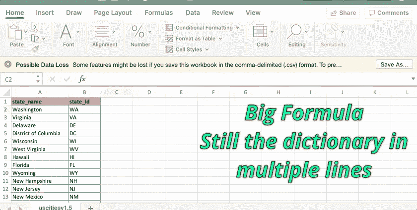
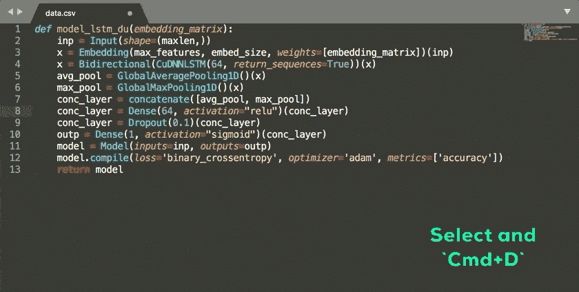

# 为什么数据科学的崇高文本比詹妮弗·劳伦斯更热？

> 原文：<https://towardsdatascience.com/why-sublime-text-for-data-science-is-hotter-than-jennifer-lawrence-651afc54d67?source=collection_archive---------8----------------------->

## [数据科学工具](https://towardsdatascience.com/tagged/tools-for-data-science)

## 有些东西你知道你需要，有些东西你不知道你需要。我们将讨论后者

A Sublime Tool

开玩笑，没有比詹妮弗·劳伦斯更热的了。但是既然你在这里，我们继续吧。

对于任何领域的从业者来说，它们和他们使用的工具一样好。数据科学家也不例外。但有时我们甚至不知道我们需要哪些工具，也不知道我们是否需要它们。*我们不知道是否有更自然的方式来解决我们面临的问题。我们可以使用像吴恩达的[机器学习](https://www.coursera.org/learn/machine-learning?ranMID=40328&ranEAID=lVarvwc5BD0&ranSiteID=lVarvwc5BD0-IlsUicNUO2OWJZj6q7k7Hw&siteID=lVarvwc5BD0-IlsUicNUO2OWJZj6q7k7Hw&utm_content=3&utm_medium=partners&utm_source=linkshare&utm_campaign=lVarvwc5BD0)这样的令人敬畏的 MOOCs 来学习数据科学，但是没有人教这个行业的笨拙工具。这促使我在我的新系列短文中写下了在任何课程中都没有教授的工具和技能— **数据科学工具。**诚如其所言:*

> 我们塑造工具，然后工具塑造我们。

在这篇文章中，我将尝试在数据科学的背景下谈论 Sublime 文本编辑器。

崇高的文本是这样一个救生员，我们作为数据科学家甚至没有意识到我们需要它。我们对我们的 Jupyter 笔记本和 R studio 非常满意，所以我们从来没有尝试过使用其他编辑器。

因此，*让我试着让你从 Jupyter 笔记本上稍微改变一下，在你的工作流程中集成另一个编辑器。下面我会试着提供一些用例。关于这一点，这些用例并不详尽，在这里只是为了展示功能和 ***超越*** 的力量。*

# 1.创建一个字典/列表或其他东西:

有多少次我们希望 ***从电子邮件文本*** 中获得的列表中为我们的 Python 代码制作一个列表或字典？我赌了无数次。
**我们如何做到这一点？我们在 Excel 中讨价还价，将文本加载到 Excel 中，然后尝试连接操作。对于我们这些使用 Mac 的人来说，这甚至更麻烦，因为 Mac 的 Excel 不如 windows(委婉地说)**

因此，例如，如果您有关于州名和州简称的信息，并且您必须为 Python 创建一个字典，那么您最终会在 Excel 中做类似这样的事情。或者你可能会在 pandas 中加载 CSV，然后在 Python 本身中使用它。

How we do it in Excel

以下是你在 Sublime 中如何做同样的事情。看看它看起来有多棒。我们最终得到了一行字的字典。我花了大约 27 秒来做这件事。

我还记得我第一次看到我的一个开发者朋友这么做的时候，我很惊讶。在这方面，我们应该总是向其他领域学习。

Sublime!!!

**那么我是怎么做到的呢？**
这里是一个循序渐进的思路。您可能想在 Sublime 中获取一些数据，并亲自尝试一下。您最常使用的命令是`Cmd+Shift+L`

*   使用`Cmd+A`选择 sublime 窗口中的所有文本
*   `Cmd+Shift+L`将光标放在所有行上
*   使用带箭头键的`Cmd`和`Opt`将这些光标移动到需要的位置。`Cmd`有始有终。`Opt`一点一点带你走
*   施展你的魔法，写吧。
*   按下`Delete`键将所有内容放在一行中
*   按`Esc`退出多光标模式
*   尽情享受吧！

# 2.有选择地挑选，做的时候要好看:

Sublime 中另一个我喜欢的功能。我们都在许多文本编辑器中使用过替换功能。这个功能是`Find and Replace` ***加一个转折。***

所以，事不宜迟，让我用一个例子来演示一下。假设我们有一个用 Python 写的代码片段，我们想替换一些单词。我们可以用`Find and Replace`功能很好地做到这一点。我们会找到并替换每个单词，最终会点击很多次。Sublime 让它变得简单多了。它看起来也令人印象深刻。*你看起来知道自己在做什么，这在我看来会给你加分。*

Select Only what is needed and work interactively

那我是怎么做到的呢？

*   选择您想要替换的单词
*   多次按下`Cmd+D`，仅选择您想要删除的单词的实例。
*   选择所有单词后，书写新单词
*   仅此而已

Hope I provided you with at least a Nail Gun or maybe more like a Shovel

我关于我所知道的最有效率的编辑之一的帖子到此结束。你可以尝试用 Sublime 做很多事情，但是上面的用例是我认为最有用的。这些简单的命令将使你的工作更有效率，并消除有时占我们工作很大一部分的手工劳动。希望你最终能在工作流程中使用它。相信我，你最终会爱上它的。

让我知道你是否喜欢这篇文章。我将在一系列的帖子中继续写这样的技巧和窍门。此外，[是否在媒体上关注](https://medium.com/@rahul_agarwal)我，以获得关于我未来帖子的通知。

***PS1:*** *上面所有的东西也可以在 Mac 上使用完全相同的命令与 Atom 文本编辑器一起工作。*

***PS2:*** *对于窗口用户，将* `*Cmd*` *替换为* `*Ctrl*` *，将* `*Opt*` *替换为* `*Alt*` *以获得相同的功能。*