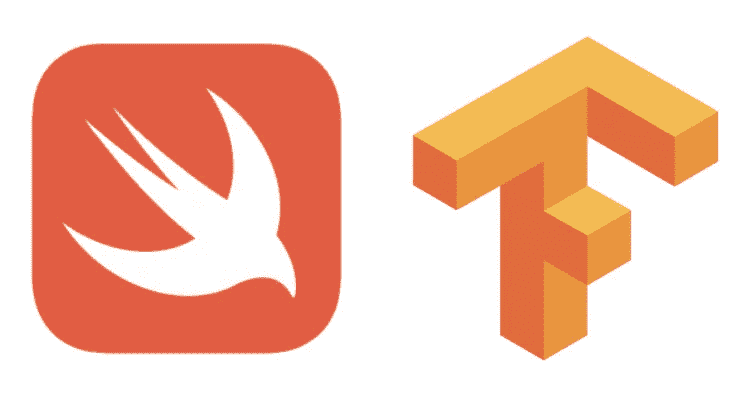

# 为什么 Swift 可能是深度学习领域的下一个大事件

> 原文：<https://towardsdatascience.com/why-swift-may-be-the-next-big-thing-in-deep-learning-f3f6a638ca72?source=collection_archive---------5----------------------->

## 如果你对深度学习感兴趣，那么 Swift 是一门你应该开始学习的语言

# 介绍

如果你对编程感兴趣，当你听到 Swift 时，你可能会想到 iOS 或 MacOS 的应用程序开发。如果你对深度学习感兴趣，那么你一定听说过 Tensorflow 的 [Swift(缩写为 S4TF)。然后，你可以问自己:“谷歌为什么要为 Swift 创建一个 TensorFlow 版本？已经有 Python 和 C++的版本；为什么要加另一种语言？”在这篇文章中，我将尝试回答这个问题，并概述为什么你应该仔细遵循 S4TF 以及 Swift 语言本身的原因。这篇文章的目的不是给出非常详细的解释，而是提供一个带有大量链接的概述，这样如果你感兴趣，你就可以去更深入地挖掘。](https://www.tensorflow.org/swift/)

# 🧠·斯威夫特背后有强大的支持

T2·克里斯·拉特纳·T3 在苹果公司工作时创造了斯威夫特。现在，克里斯·拉特纳在世界上最好的人工智能研究团队之一的[谷歌大脑](https://ai.google/research/teams/brain)工作。Swift 语言的创造者现在在一个研究深度学习的实验室工作，这一事实应该告诉你这是一个严肃的项目。

前一段时间，谷歌的人意识到，尽管 Python 是一种优秀的语言，但它有许多难以克服的局限性。TensorFlow 需要一种新的语言，经过长时间的考虑，Swift 被选为候选人。我不会在这里详述，但是[那里](https://github.com/tensorflow/swift/blob/master/docs/WhySwiftForTensorFlow.md)有一个文档描述了 Python 的缺点，以及考虑过的其他语言，以及如何最终缩小到 Swift。

# 💪面向 TensorFlow 的 Swift 不仅仅是一个库

TensorFlow 的 Swift 不仅仅是另一种语言的 TF。它本质上是 Swift 语言本身的另一个分支。这意味着 S4TF 不是库；它本身就是一种语言，内置的特性支持 TensorFlow 所需的所有功能。比如 S4TF，里面有非常强大的[自动微分](https://github.com/tensorflow/swift/blob/master/docs/AutomaticDifferentiation.md)系统，这是计算梯度所需的深度学习的基础之一。与 Python 相比，在 Python 中，自动微分并不是语言的核心组成部分。最初作为 S4TF 的一部分开发的一些功能后来被集成到 Swift 语言本身中。

# ⚡️Swift 速度很快

当我第一次得知 Swift 的运行速度和 C 代码一样快时，我惊呆了。我知道 C 经过了高度优化，允许达到非常高的速度，但这是以微管理内存为代价的，这导致 C 不是内存安全的)。此外，C 语言并不是一门非常好学的语言。

现在，Swift [在数值计算上运行速度和 C](https://www.fast.ai/2019/01/10/swift-numerics/) 一样快，*和*没有内存安全问题，*和*更容易学习。Swift 背后的 LLVM 编译器非常强大，具有非常高效的优化功能，可确保您的代码运行非常快。

# 📦您可以在 Swift 中使用 Python、C 和 C++代码

由于 Swift for machine learning 正处于非常早期的阶段，这意味着 Swift 的机器学习库并不多。你不用太担心，因为 Swift 有惊人的 [Python 互操作性](https://github.com/tensorflow/swift/blob/master/docs/PythonInteroperability.md)。您只需在 Swift 中导入任何 Python 库，它就能正常工作。同样，您可以[将 C 和 C++库](https://oleb.net/blog/2017/12/importing-c-library-into-swift/)导入 Swift(对于 C++，您需要确保头文件是用普通 C 编写的，没有 C++特性)。

综上所述，如果你需要特定的功能，但在 Swift 中还没有实现，可以导入相应的 Python、C 或 C++包。印象深刻！

# ⚙️·斯威夫特可以去很低的地方

如果您曾经使用过 TensorFlow，很可能是通过 Python 包完成的。在引擎盖下，Python 版本的 TensorFlow 库下面有 C 代码。所以当你调用 TensorFlow 中的任何函数时，在某种程度上你会碰到一些 C 代码。这意味着你能检查源代码的程度是有限的。例如，如果你想知道卷积是如何实现的，你将看不到 Python 代码，因为那是用 c 实现的。

在 Swift，这是不同的。克里斯·拉特纳称 Swift 为“LLVM[汇编语言]的语法糖”。这意味着本质上，Swift 非常靠近硬件，中间没有用 C 编写的其他代码层。这也意味着 Swift 代码非常快，如上所述。作为开发人员，这一切使你能够从很高的层次到很低的层次检查代码，而不需要进入 c 语言。

# 📈下一步是什么

Swift 只是谷歌深度学习创新的一部分。还有一个非常密切相关的组成部分:，代表多层次中间代表制。MLIR 将成为谷歌的统一编译器基础设施，允许用 Swift(或任何其他支持的语言)编写代码，并将其编译到任何支持的硬件上。目前，针对不同目标硬件的编译器多如牛毛，但 MLIR 将改变这种情况，不仅允许代码重用，还允许编写定制的编译器低级组件。它还将允许研究人员应用机器学习来优化低级算法:

> *当 MLIR 作为 ML 的编译器时，我们也看到它在编译器中使用机器学习技术！这一点尤其重要，因为开发数值库的工程师不能以与 ML 模型或硬件多样化相同的速度扩展。*

想象一下，能够使用深度学习来帮助优化数据上的低级内存平铺算法(类似于 [Halide](https://www.youtube.com/watch?v=3uiEyEKji0M) 试图完成的任务)。此外，这只是机器学习在编译器中的开始和其他创造性应用！

# 摘要

如果你对深度学习感兴趣，那么 Swift 是你应该开始学习的一门语言。与 Python 相比，它带来了许多优势。谷歌正在大力投资使 Swift 成为其 TensorFlow ML 基础设施的关键组成部分，Swift 很有可能成为深度学习的*语言。因此，尽早参与 Swift 将为您带来先发优势。*

*原发表于*[*https://pechyonkin . me*](https://pechyonkin.me/portfolio/why-swift-for-tensorflow/)*。*