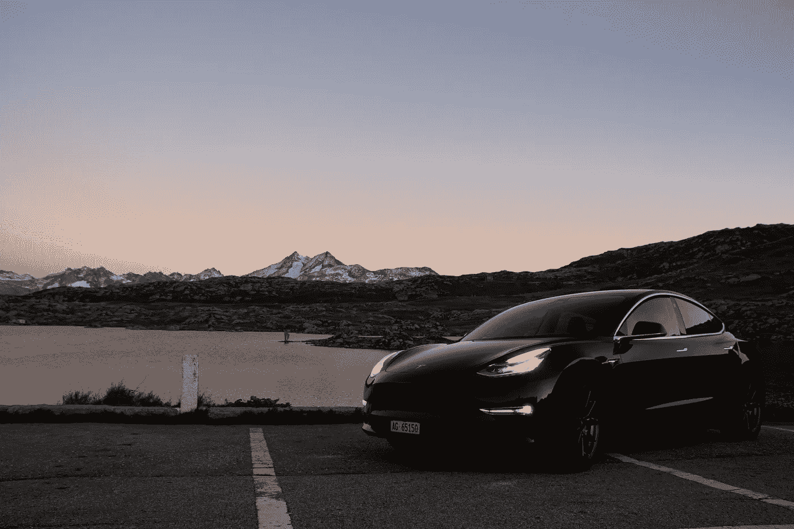

# 为什么特斯拉的车队里程对自动驾驶很重要

> 原文：<https://towardsdatascience.com/why-teslas-fleet-miles-matter-for-autonomous-driving-8e48503a462f?source=collection_archive---------14----------------------->

Photo by [Stefan Lehner](https://unsplash.com/@st_lehner)

## 有趣的训练样本的自动标记和自动标记消除了对人工劳动的需要，并使数据变得有价值

最近我一直在看国际机器学习会议(ICML)关于自动驾驶这个话题的演讲。我将记下这些谈话激发的一些想法。

特斯拉大约有 65 万辆 [HW2/3](https://lexfridman.com/tesla-autopilot-miles-and-vehicles/) 汽车在路上行驶。这些车辆每个月大约行驶 1000 英里，或者作为一个车队行驶 6.5 亿英里。相比之下，Waymo 每月行驶约 100 万英里。因此，特斯拉的车辆行驶速度提高了 650 倍。

这重要吗？如果特斯拉需要一个人来标记这些英里的每一帧视频才是有用的，那就没有关系。但事实上，特斯拉可以在没有人为标记的情况下使用这些里程。

来自 Zoox 的 ICML 演讲[解释了如何通过预测——预测汽车和行人的轨迹——获得“自由地面真相”。你的感知系统跟踪车辆周围物体的轨迹，所以你有一个真实轨迹的来源，可以用来训练预测。在特斯拉自主日，安德烈·卡帕西](https://slideslive.com/38917893/perception-and-prediction-at-zoox)[称](https://youtu.be/A44hbogdKwI)这是“自动贴标签”。我相信这将属于自我监督学习的范畴，这是一种深度学习的形式，其中神经网络试图使用一部分数据来预测其余的数据(例如，向它显示图像的一半，它生成另一半；向它展示 10 秒钟驾驶场景记录的前 5 秒钟，它会预测接下来的 5 秒钟)。不是人类通过将预测标记为正确或错误来提供监控信号，而是数据本身通过向神经网络显示其预测是正确还是错误来提供监控信号。

预测是自动驾驶的一个重要领域，特斯拉可以使用每月 6.5 亿英里的数据进行自我监督学习，而不需要人力。此外，特斯拉只能标记和上传特斯拉预测器失败的实例(如其感知系统在预测后的几秒钟内所示)。理论上，这应该允许特斯拉在预测方面显著改善最先进的学术成果。

令人鼓舞的是，Yann LeCun 认为预测是一个容易解决的问题:

来自 Aurora 的 ICML 演讲[指出，当涉及到规划和决策时，人类驾驶是一种有价值的学习来源。奥罗拉特别强调了人类干预对于模仿学习的重要性。此外，Aurora 演讲者谈到了在没有干预的情况下标记有趣的人类演示。当人类驾驶员选择一条轨迹时，Aurora 的软件可以确定这条轨迹由 Aurora 的规划者产生的可能性有多大。如果概率很低，这表明人类驾驶员和规划者之间存在分歧。Aurora 在存储在 Aurora 服务器上的记录数据(“离线数据”)的背景下讨论了这一点，但我不明白为什么你不能在汽车上实时(“在线”)运行这一点。](https://slideslive.com/38916646/the-promise-and-challenge-of-ml-in-selfdriving?locale=cs)

自动驾驶、召唤和完全自动驾驶的人类干预是标记或“挖掘”有用数据的一种方式。检测特斯拉的规划者和人类驾驶行为之间不一致的技术是另一种潜在的方式。随着每一次软件更新，规划者应该学会在更多的情况下做正确的事情。当它做正确的事情时，人类干预不会发生，人类驾驶和规划者之间也不会再有分歧。因此，每次更新后，特斯拉都会筛选失败案例。如果出现干预或分歧，其余的失败案例将触发上传。

预测和计划都涉及从车队中提取错误示例、使用这些示例来训练神经网络、部署新软件、然后上传更多错误示例的高度自动化的循环。理论上，这个过程可以扩展到数十亿个例子。

极光演讲者和另一位 ICML 演讲者， [Sergey Levine](https://slideslive.com/38917941/imitation-prediction-and-modelbased-reinforcement-learning-for-autonomous-driving) ，谈到了结合神经网络和手工工程系统的混合规划者。Mobileye 的 RSS 和 Nvidia 的 SFF 采取了同样的方法。这减轻了人们对神经网络不可靠、可能输出愚蠢而危险的行为的担忧。混合动力规划者可以强制执行一套常识性的规则，比如“不要撞上其他车辆”、“不要在人行道上行驶”、“不要越过双黄线”。Sergey Levine 谈到了一种混合规划器，每当神经网络没有足够的训练数据来做出自信的决定时，车辆就会依靠显式的手动规划器。

对我来说，模仿学习是一种可行的规划方法的最强有力的迹象是 DeepMind 用它来掌握星际争霸的事实:

一个钻石星际玩家比 70%排名[的](https://www.rankedftw.com/stats/leagues/1v1/#v=2&r=-2&sx=a)星际玩家强。

计算机视觉(感知的子集)是自动驾驶中最耗费人力的领域。任何训练数据集的核心都将是大量带有高质量标签的图像和视频，这些标签是由人类仔细应用的。与每月行驶 6500 万英里相比，每月行驶 6.5 亿英里不会帮助特斯拉获得更多贴有标签的汽车，因为汽车无处不在，特斯拉首先会遇到的限制是贴标签的成本。但是规模仍然可以在两个方面有所帮助。

首先，并不是所有重要的对象都是普遍存在的。熊和驼鹿极其罕见。路上的牛和马也很少(但更少)。假设特斯拉有一个神经网络，可以检测到特斯拉遇到的 5%的熊。此外，对于它检测到的每只熊，它都会错误地将十个物体识别为熊。出于安全目的，这将是一个可怕的熊探测器。但是对于建立一个熊图像的数据集来说，它可能是非常有用的。65 万特斯拉遇到的所有熊中的 5%可能是很多熊。人类可以很容易地丢弃假阳性(非熊的图像)。这些图像可用于重新训练熊检测器。当部署下一版本的熊探测器时，它将更好地捕捉真阳性和避免假阳性，因此它将更好地建立熊图像的数据集。理论上，这种良性循环可以推动特斯拉获得大型稀有物体数据集。

第二，新兴技术可能能够使用大量嘈杂的标记数据来补充标记良好的图像的核心数据集。“弱监督学习”是指从低质量的标签中学习。例如，假设特斯拉想要训练一个神经网络来识别可驾驶空间(相对于被汽车、行人或护栏等障碍物或水等不安全区域占据的空间)。一种弱监督的方法是将任何人工驾驶特斯拉(没有碰撞，可以通过突然减速来识别)的区域自动标记为可驾驶空间。或许用 1000 倍的自动标注样本来补充手动标注的可行驶空间的样本，将比单独手动标注的样本产生更好的准确性。

A hacked Tesla computes drivable space, shown in green.

脸书的研究实验室[展示了](https://engineering.fb.com/ml-applications/advancing-state-of-the-art-image-recognition-with-deep-learning-on-hashtags/)弱监督学习对于图像识别非常有效。脸书使用 Instagram 标签来预测由付费的人类标签员分配的图像标签，这些标签通常与图像的内容有细微的对应。通过 10 亿张带有标签的 Instagram 照片，脸书获得了比 100 万张标签良好的图片更好的结果。

预测、规划和计算机视觉中的自动标签以及稀有物体的自动挖掘意味着特斯拉在某些任务上的性能将随着其车队里程的增加而提高(可能是次线性的)。

克鲁斯[公司预计](https://www.forbes.com/sites/bradtempleton/2019/06/10/gmcruise-leaks-show-them-ridiculously-behind-waymo-its-time-for-better-more-public-metrics/)到今年年底，它的车辆将比普通人类司机安全 5-11%。也许有了三个数量级的行驶里程，特斯拉将能够开发出比 Cruise 安全一个数量级的完全自动驾驶汽车。这与深度学习中[观察到的扩展趋势](https://arxiv.org/abs/1712.00409)大致一致。如果克鲁斯的预测是准确的，那么一个数量级的改善将使特斯拉达到平均人类安全的 50-110%。

如果 Waymo 成功实现其计划从车辆中移除安全驾驶员，并且如果 Waymo 有安全指标来证明这一计划，那么这将表明完全自主是当前技术的一个容易解决的问题。与 Waymo 不同，特斯拉没有激光雷达的传感器冗余，但它确实有能力为预测、规划和计算机视觉的核心问题编译更大、更好的训练数据集。总的来说，我认为特斯拉更好。如果 Waymo 成功了，我怀疑特斯拉不会很快跟上。