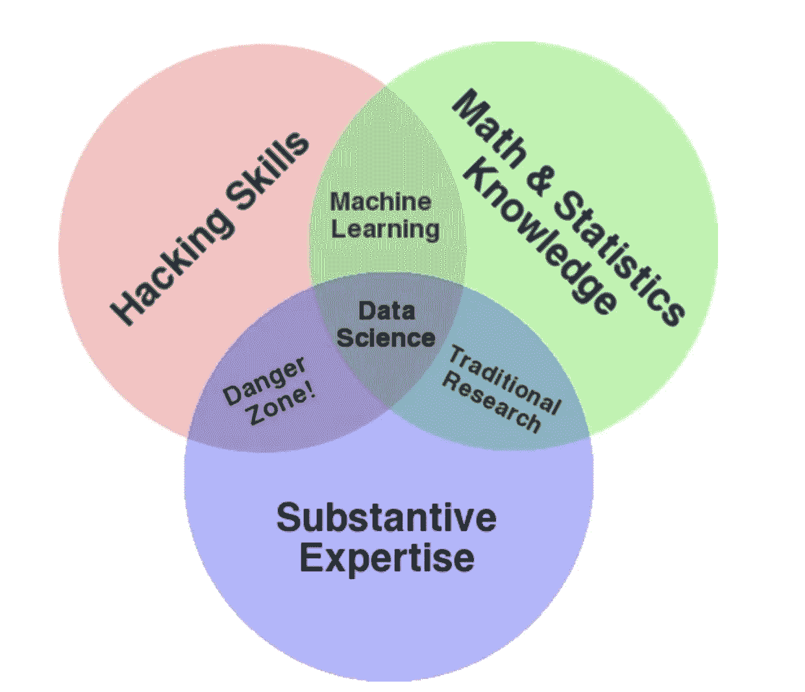

# 为什么数据科学维恩图是误导性的

> 原文：<https://towardsdatascience.com/why-the-data-science-venn-diagram-is-misleading-16751f852063?source=collection_archive---------19----------------------->

## 或者为什么数据科学家不应该忽视软技能

# 什么是数据科学？

数据科学是一个相对较新的行业，尽管其组成部分已经存在了很长时间。那么，为什么数据科学到底是什么还不清楚呢？谷歌搜索“什么是数据科学”产生 1.590.000.000 个结果，而谷歌搜索“什么是计算机科学？”仅产生 1.220.000.000 个结果。考虑到计算机科学比数据科学存在的时间更长，这是相当惊人的。

如果你曾经想知道什么是数据科学，那么你很可能遇到过所谓的“数据科学维恩图”。据我所知，2010 年,[德鲁·康威是 Alluvium 的创始人兼首席执行官。](https://www.oreilly.com/library/view/doing-data-science/9781449363871/ch01.html#drew-conway-venn-diagram)我在研究过程中偶然发现的另一篇文章，Nathan Yu 在 2009 年发表的，详细阐述了可视化的组成部分。让我们来看看“数据科学维恩图”:

Drew Conway’s Venn diagram of data science

这种可视化的吸引力是显而易见的。这很容易理解，它传达了数据科学是几个学科的结合。在这个维恩图中，三个组成部分是黑客技能、数学和统计知识以及实质性的专业知识。现在，互联网上有许多维恩图的变体，但本质上，几乎所有的都是基于这三个相同的组成部分。

# 为什么数据科学维恩图是误导性的

数据科学维恩图没有错。它提到了数据科学的基本组件，同时说明了数据科学发生在这些组件的交叉点上。因此，如果你不知道什么是数据科学，只是想知道它的意思，这个文氏图是给你的。然而，如果你想更深入地研究似乎无穷无尽的数据科学领域，那么这个文氏图充其量只是一个起点，在最坏的情况下会产生误导。让我引用传奇统计学家 John Tukey (1962)的话来结束这一段，这句话非常准确地总结了我对数据科学维恩图的感受:

> “对正确的问题给出一个近似的答案，通常是模糊的，要比对错误的问题给出一个精确的答案好得多，因为后者总是可以变得精确。”

许多试图解释什么是数据科学的文章迟早会利用这种可视化。从描述如何成为数据科学家的文章数量来看，这些读者中很大一部分可能渴望成为数据科学家。这就是维恩图的问题所在。

## 为什么软技能在(有效的)数据科学中很重要

文氏图是一种抽象。根据定义，抽象概念[并不试图捕捉现实的复杂性。然而，这个文氏图更合适的标题可能是类似于“数据科学硬技能文氏图”的东西。维恩图的所有组成部分都是硬技能，也就是说，这些技能可以很容易地通过，例如，参加笔试来衡量。另一方面，软技能，有时被称为人际交往技能，通常不能通过笔试来衡量。这些技能包括能够有效地在团队中工作，与组织中的其他人沟通(*包括非技术员工*)，以及能够领导和管理团队。](https://dictionary.cambridge.org/de/worterbuch/englisch/abstraction)

现在，公司不再雇佣数据科学家在远离组织的地方工作。他们雇佣数据科学家，因为他们期望数据科学家从创造价值的数据中提取可操作的见解。因此，首先也是最重要的是，数据科学家应该熟悉他或她公司的商业模式，并了解它如何创造价值。只是为了确保我们在同一页上:我指的是利润。如果没有足够的软技能，即使是最有能力的数据科学家也很难实现这个目标。

让我来想象一下大多数公司是如何看待数据科学的:

今天从事数据科学项目的现实是，大多数公司的管理层并不真正关心中间数据科学部分的细节。这就是他们雇用你的原因。他们的工作是做出有助于公司增加利润的决策。因此，不仅要掌握成功实践数据科学所需的技术方面，还要掌握必要的软技能，这一点至关重要。

在我看来，成功完成数据科学项目的三个最突出的软技能包括:

## 1.(头脑的)灵活性

让我们从业务问题开始。为了能够解决一个问题，你必须首先理解它。在公司环境中，你将面临一个商业问题，也就是说，一个一旦解决就会带来价值的问题。这可以是任何事情，从创建简化和加速管理决策过程的仪表板到使用机器学习来预测销售增长。没有技术背景的业务主管不一定了解数据科学的所有细节(他们也不需要了解)。他们遇到了一个问题，想探索新的方法来解决它。因此，这些业务问题通常不会提前非常明确地提出来。数据科学家的任务是确定问题的哪些方面可以用数据科学来解决。由于大多数数据科学家没有商业背景，这可能是一个具有挑战性的障碍。能够在业务和技术思维之间转换是有效解决业务问题的一项基本技能。

## 2.协力

在我可视化的第二阶段，数据科学维恩图中提到的技能绝对至关重要。但是，软技能还是需要的。最重要的是，数据科学家需要能够在任何类型的团队中有效地工作。根据组织的组织结构，数据科学家可以作为团队中唯一的数据科学家工作，或者作为更大的分析团队的一部分，与其他数据科学家、数据仓库专家等一起工作..高效地分配任务并作为一个团队朝着一个共同的目标努力是成功的另一个重要因素。

## 3.有效沟通和展示

在这种情况下，沟通主要是指与组织内没有技术背景的员工的互动。能够用通俗易懂的语言解释数据科学团队目前正在从事的工作，弥合了装饰性数据科学和有效数据科学之间的差距。完成技术部分后，数据科学家必须将他们的发现传达给管理层。做吸引人和有趣的演讲是一项必须通过反复练习才能获得的技能。此外，软技能很少在技术专业的课程中广泛涉及。这包括从有效的幻灯片设计到准备一个能在整个演示过程中抓住并保持听众注意力的脚本。

# 结论

当试图成为一名有效的数据科学家时，努力学习软技能和努力学习硬技能同样重要。因此，我认为，在一个人试图成为数据科学家的过程中，应该更多地关注软技能。无论是通过自学还是在大学里参加通信课程，提高一个人的软技能总是一项值得的投资。