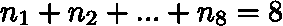
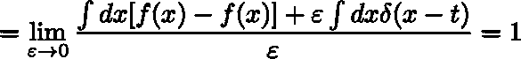

# 为什么高斯分布是“自然”的选择(第一部分)

> 原文：<https://towardsdatascience.com/why-the-gaussian-distribution-is-a-natural-choice-part-1-bee0569b79df?source=collection_archive---------27----------------------->

## 停止引用中心极限定理

所有科学理论都有一个共同点，那就是从某个抽象模型中推导出可观察量的*野心*。理论的*参数*通常被认为是已知的，例如，基于第一原理、直接测量或对称性考虑等更复杂的东西。另一方面，在**大数据时代**，人们对*从观察到参数估计的逆向路径*越来越感兴趣。在这种逆向操作中，前所未有的存储和计算能力使数据科学家——在越来越多的行业中工作——能够探索广阔的参数区域，并可能(并有希望)找到与他们感兴趣的一些现象的数学描述相关的“正确参数”,无论是(仅举一些非常著名的例子)预测房价、检测欺诈等。

Fig.1: In the Big Data era, the path from observation to theory is being taken in reverse.

然而，无论数据科学家的武器库有多强大，处理太大的数据——从定量(许多许多例子)和定性(大量信息内容)的角度来看——在大多数时候都是一个真正的挑战。一方面，探索整个宇宙的可能参数实际上是一项不可能的任务；另一方面，虽然为一般类型的数据开发过程是可取的，但许多算法是在对输入数据做出一些假设的基础上构建的。在这方面，高斯分布(GD)在机器学习中占据中心位置。高斯朴素贝叶斯、线性和二次判别分析是假设数据遵循 GD 的算法的例子。

GD 的普遍存在通常根据中心极限定理来证明，该定理指出(在大数 *N* 的极限中)随机变量的和遵循 GD。例如，让我们掷四个骰子，得到 3，1，4，4。结果总计 12 个，我们注意到了它。我们第二次重复这个实验，得到的总数是 18。如果我们重复实验 *N > >* 1 次，我们将获得一个高斯钟，描述一个介于 4(最小和)和 24(最大和)之间的特定数字被观察到的次数。一个简单的计算将显示钟形以值 3.5*4= 14 为中心[注意，事实上，3.5 是单个骰子滚动的预期值]。现在，如果你是一名抽象数学家，我敢肯定你会非常乐意用中心极限定理来证明像 GD 这样的特权物体的存在。然而，我发现基于中心极限的直觉，虽然是一种相对容易的方法来可视化如何建立一个正态分布的随机变量，但并不能完全令人满意地解释*为什么*自然为上帝保留了这样一个特殊的位置。

有没有其他方法可以把正态分布冠上概率分布函数女王(pdf)的桂冠？是的，实际上有很多。在下文中，我将集中讨论其中一个，并用一个非常基本的物理概念向你解释 GD 是如何出现的:熵。在这篇文章(第 1 部分)中，我们将通过查看最简单的*统一 PDF 来介绍基本概念，*表明它是最大化系统*的熵的 PDF。在第二篇文章(第二部分，即将发表)中，我们将把注意力放在 GD 上，并看到这类 pdf**最大化了描述系统/过程的分布的熵，这些系统/过程的均值和标准差是已知的。***

## 理解熵的概念

熵的概念起源于热力学理论，它最初是在卡诺循环的背景下定义的。然而，关于这个特殊方面的讨论已经超出了本文的范围。我们唯一需要知道的是下面的陈述(热力学第二定律):

> 在孤立系统中(即假设不与其他系统交换能量/质量)，总熵永远不会随时间减少。

这意味着，除了一类特定的系统(即时间可逆的)——随着时间的推移与恒定的熵相关联，大自然会让系统以熵最大化的方式进化。我们在日常生活中都经历过这个原则。我来说一个例子；这需要一点练习，但是你总是可以从一瓶杜松子酒和一瓶奎宁水(可能还有一片柠檬，一些胡椒等)开始得到一瓶美味的杜松子酒。).但是，你很难逆转这个操作。这一事实背后的原因是杜松子酒+奎宁水+玻璃杯(+冰+柠檬+…)系统的熵会减少。换句话说，我们可以从一个有序的状态变成一个混乱的状态，而不是相反。显然，大自然喜欢凌乱！

Fig.2 : entropy of last Saturday night.

为了从技术上更好地理解熵是什么，我们可以考虑奎宁水和杜松子酒的粒子(众所周知，它们是元素周期表中的基本元素……)混合在一起形成球和盒子形式的鸡尾酒。在很高的层次上，这种观点是统计力学的观点之一，事实上在这个领域和热力学之间有着深刻的联系。

让我们想象我们的玻璃杯由八个盒子组成——我将按顺时针方向从 1 到 8 标记它们，见图——我们的杜松子酒和滋补品水瓶每个包含 4 个颗粒。我们可以按照自己喜欢的方式将球排列在盒子里，唯一的约束是杜松子酒和 TW 的粒子数量必须保持不变，意味着在将瓶子的内容物倒入玻璃杯之前和之后，我们总共有 8 个粒子。以下图中的配置为例

Fig. 3: Gin and tonic distribution function 1

我们在盒子 1 中有 1 个杜松子酒和 1 个奎宁水颗粒，在盒子 2 中没有颗粒，等等。该配置对应于下图中的“杜松子酒和奎宁水分配功能”。然而，这只是所有可能的粒子配置和相关的杜松子酒和奎宁水分配函数中的一种！其他可能的配置在下面的图 4 中示出

Fig. 4: Other gin and tonic distribution functions

**我们更容易观察到哪种配置？**我不认为需要解释什么来说服你，一款性能良好的杜松子酒&滋补品会将杜松子酒和滋补品水颗粒适当混合。好好摇一摇之后，我们的直觉和期望会与下面的东西相对应

Fig. 5: The “real” gin and tonic distribution function

也就是在一款好的鸡尾酒中，杜松子酒和奎宁水的分配函数*尽可能的均匀。*这一事实背后的原因可以根据对应于特定分布函数的**可能配置**来理解。为了简单起见，让我们只考虑两个盒子和两个粒子(无论你想考虑什么物质)。下面图 6 中的简单例子表明，分布越均匀，实现该分布的可能配置的数量就越多。反过来，可用配置越高，系统越混乱，熵越大**。**

Fig. 6: 2 boxes and 2 balls world. n_1 and n_2 denote the number of balls in box 1 and 2 respectively

因此，**均匀分布函数是最大化熵的函数，**包括我们的杜松子酒和滋补品**。**更专业地说，均匀分布函数是与最大可能数量的*微观状态相关联的函数。更全面地解释这意味着什么也超出了这篇文章的范围，但是我很乐意和任何想知道更多细节的人一起讨论(就在下面评论吧)！*

到目前为止，我们已经从熵的角度，更重要的是从分布函数的角度，以一种更技术性的方式，理解了鸡尾酒制作过程的动力学。我们仍然缺乏对上述观点的数学翻译(和论证)。这就是我们在下一段要做的事情。在继续之前，读者应该记住一点:我们使用的唯一假设是，在配制鸡尾酒时，杜松子酒和奎宁水的数量是守恒的(即，它们既没有被破坏也没有被创造)(对于更简单的 2 盒/2 球世界也是如此)。在我们的例子中，所有盒子中的粒子总数为 8

Eq. 1: particles conservation

如果我们将最后一个等式的两边除以 8，定义为 *p_i = n_i/8* (符号 *_i* 表示下面等式中的下标)我们会发现，任何曾经处理过 pdf 的人都应该对某种等式很熟悉:

Eq. 2: box occupation probability conservation

新定义的*盒子占用概率 p* 之和为 1。这就证明了上面介绍的**(概率)** **分布函数**的思想。换句话说，我们简单的说就是粒子的**守恒可以看成是某些 PDF 的守恒。**

## 警告:数学来了！

我们在这里的目标是通过最大化系统的熵来正式导出一个分布函数，给定粒子数量守恒的约束条件——正如我们刚刚了解到的，这相当于概率守恒。这是我们在对系统一无所知的情况下所能做的最简单的假设，除了它的各种配置由一个分布函数来描述这一事实之外，它同样满足等式的第二部分。2.为了概括和简化计算，我们在连续的情况下工作，用整个玻璃体积上的积分代替总和——这在具有无限数量盒子的玻璃的极限中是精确的

Eq. 3: switching from a discrete to a continuous world

有了分布函数，与之相关的熵 *S* 由[吉布斯熵公式](https://en.wikipedia.org/wiki/Entropy_(statistical_thermodynamics)#Gibbs_entropy_formula)给出:

Eq.4: Gibbs entropy formula (Boltzmann constant set to 1)

我们定义了另一个*泛函*(即函数的函数)，它只是上面介绍的熵的一个巧妙扩展。这个扩展很聪明，因为它引入了一个额外的项，用[拉格朗日乘数](https://en.wikipedia.org/wiki/Lagrange_multiplier) (LM ) λ，它编码了等式。2 必须遵守(我们用更通用的 *V 代替“玻璃”，*表示任何种类的体积):

Eq.5: The functional *J*

不要害怕！这个泛函 *J* 最后只是一个数……要计算它，需要 *p* 和λ的知识。我们还不知道他们，但实际上计算 *J* 并不是我们的目标。事实上，我们感兴趣的是 p 的形式，使得 J 最大化，熵最大化。在拉格朗日乘数存在的情况下，我们真正追求的是

> 最大化 J (以及 S)的 *p* 的值，具有 p 是 PDF 的附加约束，即它积分为 1

现在，为了找到使一般函数*f(x)*最小化或最大化的 *x* 的值，通常要做的是对 *x* 进行微分，并求解方程 *df(x)/dx=0。*类似地，当处理像等式 5 中那样的泛函时，可以定义一个*泛函导数*

Eq. 6: functional derivative of J with respect to p

最小化 *J* 的分布函数是方程 6 消失的分布函数。我将在这里提供函数导数的结果，给那些对我下面附录中的数学步骤感兴趣的人。我们获得

Eq. 7

从哪

Eq. 8

为了完全揭示由通常的 LM 技术规定的*p(x)*的形式，我们还需要求解下面的方程——T42 关于 LM 的导数

Eq. 9

进行这样的求导，将其设置为 0，并用等式中的内容替换 *p(x)* 。8 我们有

Eq. 10

我用了体积上的积分就是体积本身的事实。比较等式 8 和等式。10、我们终于找到了

Eq. 11

那就是**最大化熵的 PDF 是均匀的 PDF！**因此，我们发现，在没有关于 PDF 的任何信息，但事实上它是 PDF 的情况下，最“自然”和最少偏差的选择是**均匀分布函数。**这个结果既惊人又明显！对统计过程一无所知，你难道不会自然地给所有可能的结果分配一个**相等的概率**吗？

在下一篇文章中，我将遵循类似的步骤，来看看高斯分布函数是在什么条件下被自然“选择”的。敬请期待！

# 附录:函数导数

首先，泛函可以定义为从向量空间到其标量 *域的 [*线性映射。*粗略地说，为了限制我们在这里的需求，我们可以把一个函数想象成一个操作，它接受一个函数并把一个数字与它相关联。最简单的泛函之一是积分，它采用定义在某个支持面 *V —* 上的函数 *f(x) —* 并返回一个标量](https://en.wikipedia.org/wiki/Functional_(mathematics))*

Eq. 12

人们可以定义 *I* 关于它的自变量*f*的导数。为了理解如何做，让我们看看普通的微分(我们在这里考虑从实数域到实数域的函数 *f: R → R* )。这需要对某个函数 *f(x)* 的增量差求一个非常小的增量ε。函数 *f(x)* 现在本身就是运算， *x* 就是它的自变量。我们有

Eq. 13

后者意味着问我们自己这个问题:当我们稍微改变我们正在评估它的点时， *f(x)改变了多少？我们可以更一般地陈述后一个问题:当我们稍微改变它的参数时，映射的结果如何变化？从这个角度来看，函数导数的定义是适定的:它要求我们评估当我们对函数 *f* 本身做一些小的改变时 *I* 改变了多少。唯一需要注意的是，我们需要在 *f(x)* 的支撑中选择一个点来取这个小增量。在下图中，我们展示了一个可能的例子:我们在精确的点 *t 处向 *f(x)* 添加了一个小的位。*在数学上，这可以通过使用 [delta 函数](https://en.wikipedia.org/wiki/Dirac_delta_function)来表示*

Fig, 7: Varying the function at a precise point t

现在让我们尝试计算上面定义的泛函的导数——f 的积分

Eq. 14

简单的计算表明

Eq. 15

这里我们使用了 delta 函数的主要性质，也就是说，如果它的自变量在积分域内消失，它就积分为 1。就是这样！上面的函数导数(等式 7)已经用相同的逻辑计算过了。

下一个帖子将很快发布！

鸣谢:感谢[米恰伊尔·帕莱奥科斯塔斯](https://medium.com/u/2d8e90b6694c?source=post_page-----bee0569b79df--------------------------------)阅读了这篇文章的第一版并提出了一些改进建议！