# 为什么 UMAP 优于多伦多

> 原文：<https://towardsdatascience.com/why-umap-is-superior-over-tsne-faa039c28e99?source=collection_archive---------5----------------------->

## [生命科学的数理统计和机器学习](https://towardsdatascience.com/tagged/stats-ml-life-sciences)

## 初始化真的很重要吗？

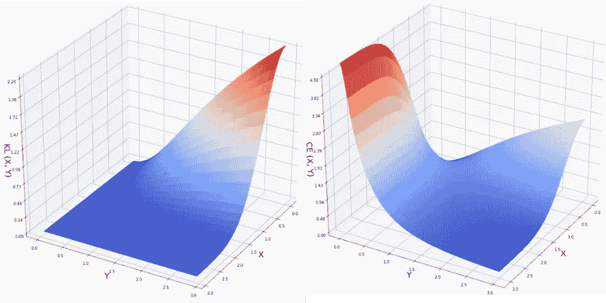

这是来自 [**生命科学的数理统计和机器学习**](https://towardsdatascience.com/tagged/stats-ml-life-sciences?source=post_page---------------------------) 专栏的第十四篇帖子，在这里我试图以简单的方式解释**一些在生物信息学、生物医学、遗传学等领域使用的神秘分析技术。在我之前的文章 [**中，UMAP 到底是如何工作的**](/how-exactly-umap-works-13e3040e1668) 和 [**如何从头开始为 UMAP 编程**](/how-to-program-umap-from-scratch-e6eff67f55fe) 中，我解释了**tSNE 的局限性**以及 **UMAP 克服它们的方式**。从我收到的反馈来看，这些帖子的主要信息似乎没有得到足够的强调。所以在这里我想再次强调一下 tSNE 的**关键问题，即 **Kullback-Leibler (KL)散度**，并检验一下[最近关于**初始化**影响 tSNE 和 UMAP 降维的假设](https://www.biorxiv.org/content/10.1101/2019.12.19.877522v1.full.pdf)。****

# **KL-散度作为 tSNE 问题的根源**

**如果你试图理解 tSNE 和 UMAP 之间的区别，你在阅读 [UMAP 论文](https://arxiv.org/abs/1802.03426)时注意到的第一件事是，UMAP 使用**图拉普拉斯**进行初始化，而 tSNE 默认实现**随机初始化**。因此，如果你是一个好侦探，你会忍不住说，正是非随机初始化使 UMAP 优于 tSNE。**

**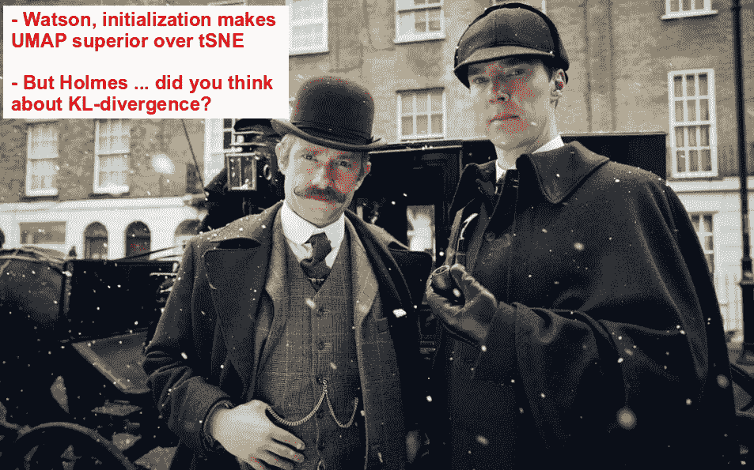**

**我们将检查下面几个真实世界单细胞 RNAseq (scRNAseq)数据集的初始化假设。然而，首先我想简单回顾一下为什么优化 KL-divergence 会使 tSNE **在执行降维时无法保持全局距离**。通过简单地**绘制**tSNE(KL-散度)和 **UMAP(交叉熵(CE))** 的成本函数，下面，我们可以观察到，在高维度的点之间的**大距离**，X，低维度的点之间的距离 Y**在 KL 损失的意义上不能保证大**。相比之下，在 Y 很小的情况下，X 很大会导致巨大的交叉熵(CE)损失。因此，UMAP 对成本函数的**更明智的选择确实确保了高维空间中彼此远离的点在低维空间中仍然远离。****

**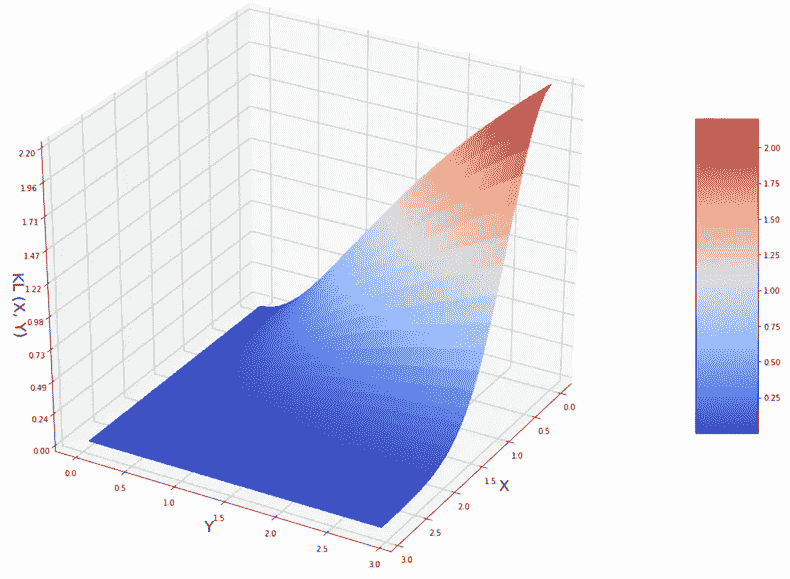**

**Kullback-Leibler (KL) divergence cost function of tSNE, X is the distance between points in high dimensions, Y is the distance between points in low dimensions**

****

**Cross-Entropy (CE) cost function of UMAP, X is the distance between points in high dimensions, Y is the distance between points in low dimensions**

**我在之前的文章中详细解释了 tSNE 和 UMAP 在成本函数上的主要差异[UMAP 到底是如何工作的](/how-exactly-umap-works-13e3040e1668)。tSNE 更好地保持全局距离的唯一方法是远远超出推荐的(从 5 到 50)困惑值范围。然而，这是**计算上昂贵的**，并且仍然不能保证全局距离保持，因为你永远不能确定在下面的等式中观察距离 X 处的点的概率的困惑度或者 ***σ* 参数**，**比 X** 更快地达到无穷大。**

**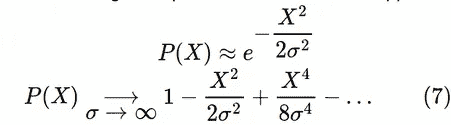**

**再次检查[UMAP 到底是如何工作的](/how-exactly-umap-works-13e3040e1668)以获得详细信息。如果你真的想对一个数据集进行大规模的复杂测试，比如 100 万个单元，其中大规模的复杂测试对于解析全局结构变得特别重要，并且你想达到 500-1000 的复杂测试，你最好至少有 1TB 的 RAM，并且耐心等待几天。我之前在《单细胞生物学的深度学习》一文中描述了达到大型困惑的计算挑战，在该文中，我从未能够在具有 512 TB RAM 的 HPC 集群节点上对 1.3M 细胞数据集达到困惑= 500。在这里我想再次强调**

> **只要 tSNE 使用 KL-divergence 作为代价函数，它就不能在全局距离保持上与 UMAP 竞争**

**然而，如果 tSNE 使用另一个更智能的成本函数，它就不再是 tSNE 了，不是吗？**

# **tSNE:不同的初始化场景**

**这里，我们将检查随机、主成分分析(PCA)和拉普拉斯特征映射(即，图拉普拉斯)初始化是否以及如何影响 tSNE 维数缩减图。为此，我将利用我以前的帖子[如何在高维空间中聚类](/how-to-cluster-in-high-dimensions-4ef693bacc6)和[如何调整 tSNE 的超参数](/how-to-tune-hyperparameters-of-tsne-7c0596a18868)中的几个 scRNAseq 数据集，在这些帖子中，我展示了选择最佳困惑、主成分(PC)数量的一些规则，以及适用于**特定 scRNAseq 数据集**的聚类算法。这里，我们将循环读取 scRNAseq 数据集，计算 PCA 和拉普拉斯特征映射，如下所示**

**并使用上述前两篇文章中确定的聚类结果(单元格着色)和最佳超参数( **optPerp** 和 **optPC** )来计算不同初始化场景的 tSNE 图。**

**为随机、PCA 和拉普拉斯特征映射初始化的几个 scRNAseq 数据集计算的 tSNE 降维图如下所示。**

**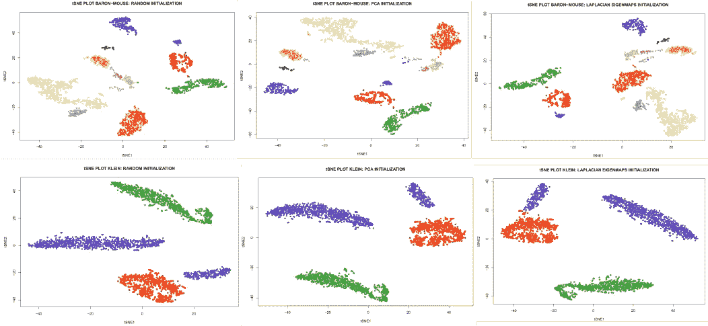****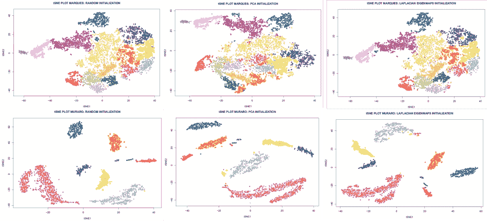****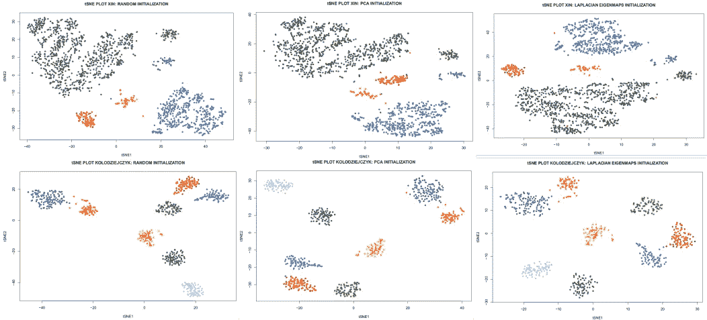****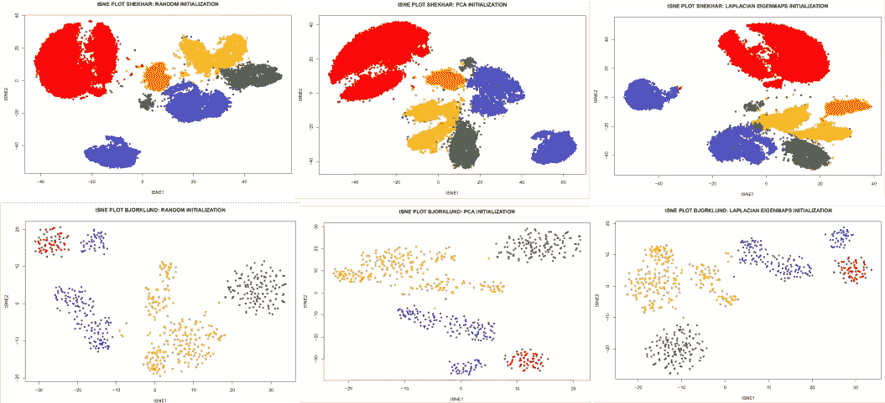****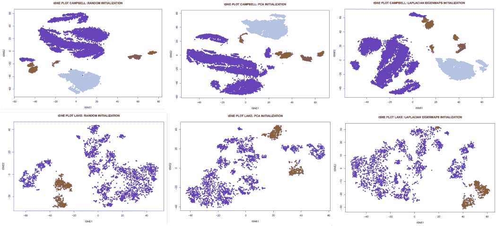**

**我个人没有观察到不同初始化场景之间的 tSNE 降维图有太大的差异。然而，考虑到上面描述的 KL-divergence 的**单调**函数形式，我期望**给定足够的时间/迭代用于训练**，tSNE 算法应该对初始化条件不敏感。换句话说，如果你从 PCA 初始化开始，并且**过早地中断 tSNE**，它将仍然类似于 PCA，因此保留了许多全局结构。然而，如果你继续训练 tSNE，**KL-divergence**对全局距离保持的损害将越来越明显，并最终克服“良好”初始化的积极影响。**

# **UMAP:不同的初始化场景**

**在这里，我们将在 scRNAseq 数据集上重复相同的循环，但针对不同的初始化场景绘制 UMAP 降维图。**

**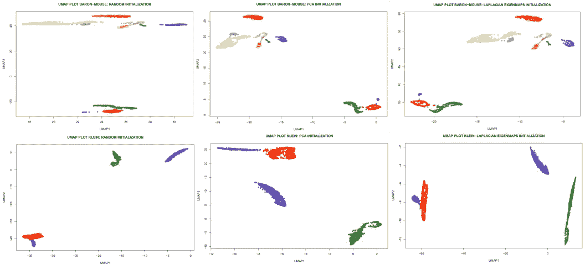****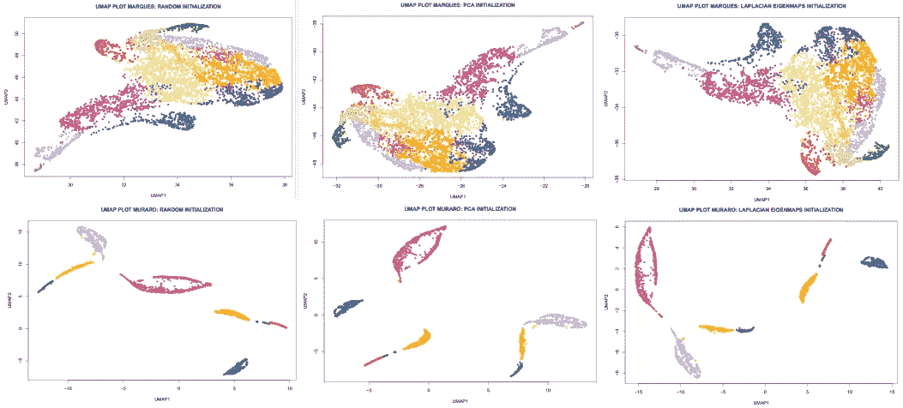****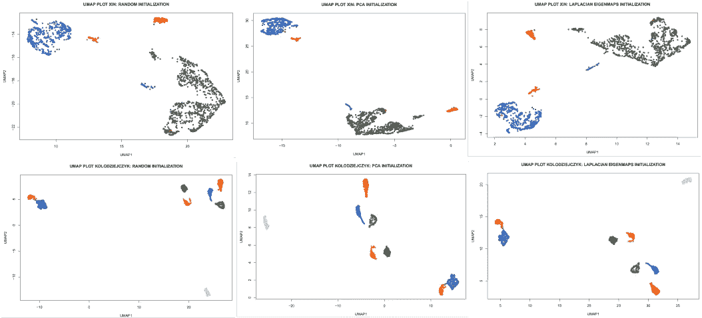****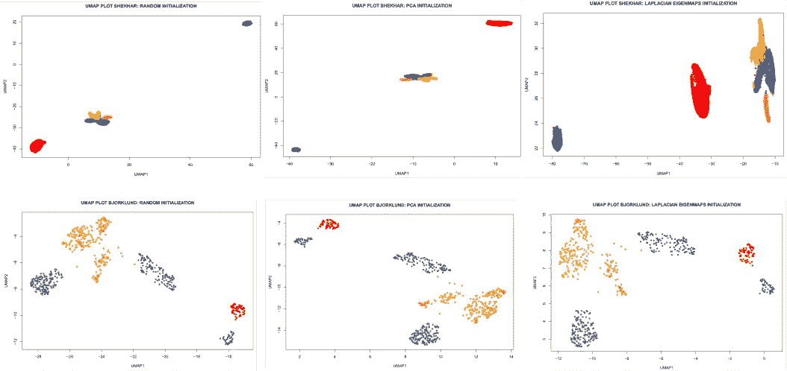****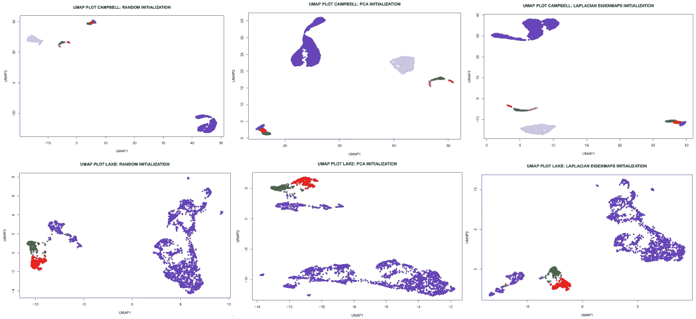**

**同样，不同初始化场景的 UMAP 降维图的差异**不明显**。我们可以观察到，有时 UMAP 情节会导致**【太多空白】**。然而，这实际上对于集群来说是极好的。几乎任何聚类算法都能够将分离良好的密集数据点“滴”识别为聚类。因此，在 2D UMAP 图上使用基于密度的聚类算法，如 **HDBSCAN，似乎很简单。在数据的**固有**维度不是 2 的情况下，仍然可以直接利用多个重要的 UMAP 分量来进行基于图的聚类，这对于高维数据是最鲁棒的。**对重要 UMAP 成分**上的** scRNAseq 数据**进行聚类**因此应该比在大多数 scRNAseq 分析管道中实现的[当前对多个**重要主要成分(PC)**进行的](https://satijalab.org/seurat/)黄金标准聚类[更能提供](https://satijalab.org/seurat/)**信息。相比之下，在**数量的 tSNE 组件**上进行聚类是一项非常具有挑战性的计算任务。****

# 最终意见

我从之前的帖子[UMAP 到底是如何工作的](/how-exactly-umap-works-13e3040e1668)和[如何从零开始为 UMAP 编程](/how-to-program-umap-from-scratch-e6eff67f55fe)中收到了很多反馈，我想简单地回答几个最常见的问题。

*   有什么大不了的？UMAP 和 tSNE 对我们来说同样有效

事实上，2D 可视化的质量在 tSNE 和 UMAP 之间是相当的。然而，这两者背后的数学是非常不同的。虽然 tSNE 纯粹是为了可视化的目的，但 UMAP 远不止于此。对于 scRNAseq 社区来说，最重要的可能是在 UMAP 组件上集群是很好的，而在 tSNE 上却不是这样。

*   **我们通常在高性能计算集群上运行 UMAP 和 tSNE，并没有看到你所说的计算挑战**

事实上，有经验的数据科学家不会看到运行 tSNE 或 UMAP 有多大区别，这对于具有生物学背景的人来说不是这样，他们代表了 scRNAseq 社区的大多数。虽然 UMAP 可以在笔记本电脑上运行相当大的数据集，但您通常需要大量的 RAM 和 CPU，因此需要一个 HPC 集群来在这些数据集上运行 tSNE。

*   **tSNE 实际上可以在大困惑时保持全局距离**

理论上，是的。在实践中，对于大型数据集来说，达到大的困惑是不可行的。产生单个 tSNE 图可能需要几天和几吨 RAM，这使得基本上不可能对 tSNE 算法应用重采样过程。

*   你为什么对 tSNE 这么不公平？

实际上，我是 tSNE 的忠实粉丝，认为它是一种最先进的技术，革新了数据科学的许多领域。然而，tSNE 需要应对不断增长的数据量和对更智能分析的需求，这目前受到 tSNE 算法的非常核心的假设(例如 KL-divergence)的约束。类似于为什么进化更喜欢适应度更好的个体，新数据需要适应度/成本函数更好的更灵活、更智能的降维算法，即 UMAP。

# 摘要

在这篇文章中，我们了解到 **KL 散度是 tSNE 算法保持全局距离的主要障碍**。基于对几个 scRNAseq 数据集的检查，**我们无法确认 tSNE 和 UMAP 降维受不同初始化场景的影响**。

在下面的评论中让我知道生命科学中的哪些分析技术对你来说是特别神秘的，我会在以后的文章中介绍它们。检查我的 [github](https://github.com/NikolayOskolkov/HowToInitializeUMAPtSNE) 上的帖子中的代码。在 Medium [关注我，在 Twitter @NikolayOskolkov 关注我，在 Linkedin](https://medium.com/u/8570b484f56c?source=post_page-----faa039c28e99--------------------------------) 关注我。下一次，我将转向进化生物学，并展示如何利用古代 DNA 来估算种群数量，敬请关注。