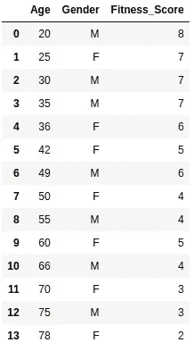
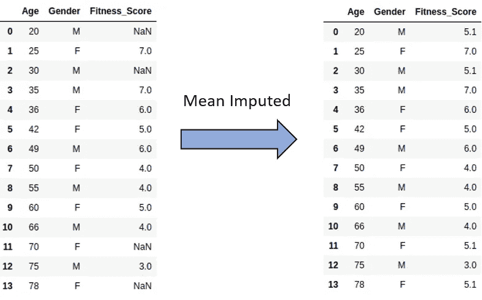
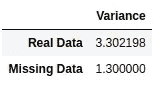

# 为什么对缺失数据使用平均值是个坏主意。替代插补算法。

> 原文：<https://towardsdatascience.com/why-using-a-mean-for-missing-data-is-a-bad-idea-alternative-imputation-algorithms-837c731c1008?source=collection_archive---------12----------------------->

Photo by [Franki Chamaki](https://unsplash.com/@franki?utm_source=unsplash&utm_medium=referral&utm_content=creditCopyText) on [Unsplash](https://unsplash.com/search/photos/missing-data?utm_source=unsplash&utm_medium=referral&utm_content=creditCopyText)

当我们想要用于机器学习的数据集包含缺失数据时，我们都知道这种痛苦。快速简单的解决方法是用平均值代替数字特征，用模式代替分类特征。更好的是，有人可能只是插入 0 或丢弃数据，然后继续训练模型。在下面的文章中，我将解释为什么使用平均值或模式会显著降低模型的准确性并使结果产生偏差。我还将向您介绍几种替代插补算法，它们都有各自的 Python 库，您可以开箱即用。

需要注意的关键事实是，当缺失数据为 MAR(随机缺失)时，使用平均值的缺点就会出现。在这里可以找到关于马尔、MCAR 和马尔的很好的解释[。](/how-to-handle-missing-data-8646b18db0d4)

# 均值和模式忽略特征相关性

让我们看一个非常简单的例子来形象化这个问题。下表有 3 个变量:年龄，性别和健康得分。它显示了不同年龄和性别的人的健身得分结果(0-10)。

Table with correct, non-missing data

现在，让我们假设健康评分中的一些数据实际上是缺失的，这样在使用均值插补后，我们可以使用两个表来比较结果。

Mean Imputation of the Fitness_Score

估算值实际上没有意义——事实上，在训练我们的 ML 模型时，它们会对准确性产生负面影响。例如，78 岁的妇女现在的健康指数为 5.1，这对于年龄在 42 至 60 岁之间的人来说是典型的。**均值插补没有考虑到适合度得分与年龄和性别特征相关的事实。**它只插入了 5.1，即适合度得分的平均值，而忽略了潜在的特征相关性。

# **均值减少数据的方差**

基于前面的例子，真实健康分数和他们的平均估算等值的方差将会不同。下图显示了这两种情况的差异:

Fitness Score variance of the real and mean imputed data

正如我们所看到的，在使用均值插补后，方差减小了(变化如此之大是因为数据集非常小)。再深入到数学中，**方差越小，导致** [**概率分布中的置信区间越窄【3】**](https://statistical-programming.com/mean-imputation-for-missing-data/)。这只会给我们的模型带来偏见。

# 替代插补算法

幸运的是，除了均值和众数插补，还有很多出色的替代方法。其中很多都是基于已经存在的用于机器学习的算法。下面的列表简要描述了最流行的方法，以及一些鲜为人知的插补技术。

## **老鼠**

根据[4]，它是仅次于平均值的第二种最流行的插补方法。最初，执行简单的插补(例如平均值)来替换每个变量的缺失数据，我们还记录它们在数据集中的位置。然后，我们取每个特征，用回归模型预测缺失数据。其余的特征被用作我们回归模型的因变量。该过程迭代多次，更新插补值。常见的迭代次数通常为 10 次，但这取决于数据集。更详细的算法解释可以在[这里找到](https://www.ncbi.nlm.nih.gov/pmc/articles/PMC3074241/)【5】。

## **KNN**

这种流行的插补技术基于 K 近邻算法。对于具有缺失数据的给定实例，KNN 估算返回***n*** 最相似的邻居，并用邻居的平均值或模式替换缺失元素。模式和均值之间的选择取决于特征是连续的还是分类的。更深入理解的伟大论文是这里的【6】。

## 错过森林

这是一个非标准的，但相当灵活的插补算法。它以 RandomForest 为核心来预测缺失的数据。它可以应用于连续变量和分类变量，这使其优于其他插补算法[。看看 MissForest 的作者写了什么关于它的实现[7]。](https://watermark.silverchair.com/btr597.pdf?token=AQECAHi208BE49Ooan9kkhW_Ercy7Dm3ZL_9Cf3qfKAc485ysgAAAnEwggJtBgkqhkiG9w0BBwagggJeMIICWgIBADCCAlMGCSqGSIb3DQEHATAeBglghkgBZQMEAS4wEQQMVeDnsmYOvD5Ed4EPAgEQgIICJP96CQV33CXqul1oqu78h5nb3w6W42K9Jy_a7nFnNsu691GtdcrViZutWu9FVNOJWxOePk76sbrFfhfUM7R0t_fPVOnYQh2Pi3Q-V6Wx-WQnEulsztuvw_u3ziVrBrVkKXjctPr4AD2M0W3qu0vCztbLwVi0Jwg4qqCVfG11jPZoX3sP1rxZKNxj3lTlqzLjd7B-Afm5DJv2BnWp7d_GZVp-Au3U0SoQefJwLVWq_SFbHUnPce6Q8sONu3e2caNLJHOBPB1e5cvkYd_scT3SjYvZg8V3Cm4RnJlZxp2fEqu8FRIoK15DCNOsJQDJ4f-sOBdUw65W4V_4Ve8nwWCWGk1IY7961QCEQH4S0UUb0D0QKzsGDGH_b08kvnytXtG9TUJ7vbVwxD88C1e1qYKI7dzMx9RHC_odpHpxkxUpJa4NkQpHUj2i41uhHv-LKZ_Yx0921tYv3JCO2W_VCjekkN2mq8As5DRnlZPJy-sOF_Y3ixNRkCtLO6U8grOZ1GOUkTh7NtFhpGEMcx0Eqe6Ubnw9ox3XRjmR0yVCYQKJAPP8EB65q6AcyoWjBWmd0cUsGkyNQOXYFhDzljR7PTE2_F9Vn5GTx4QaWKL-F3NTRBmkxZnJJ9VknL8em2G2hemKHDoGESqzIBc-cRlMriB5d6FYOFr89hmOrSkUBiudHp8dkVgeNRIrFgXXyUv7D0nvhDr12_DiaY3wlqblvH5_e3mTUMlb)

## 模糊 K 均值聚类

这是一种鲜为人知的插补技术，但它被证明比[8]中的基本聚类算法更准确、更快速。它计算实例的聚类，并根据丢失数据的实例属于哪个聚类来填充丢失的值。

# Python 插补库

不幸的是，在撰写本文时，Scikit-Learn 库中没有这些插补方法。反正有相当多的 Python 库可用于插补，但它们没有那么多贡献者，文档也可能很少。

## 范西姆普特

最受欢迎的 Python 包。Github 上的 700 颗星。它们可用的插补算法有:*简单填充、KNN、软输入、迭代奇异值分解、矩阵分解、核最小化、双小数*。这里的链接是。

## impyute

Github 上有大约 100 颗星，它可以处理 *KNN、鼠标、期望最大化、最后一次观察结转、移动窗口和 WIP* 算法。

## 失踪人口

虽然它不是最常用的插补包(30 星)，但它实现了米斯福里斯特和 KNN 插补

感谢您阅读文章。如果你有任何问题，请让我知道。你也可以在 [Linkedin](http://www.linkedin.com/in/kacperkubara) 上找到我或者去我的[个人网站](http://kacperkubara.com)

# 参考

[1][http://www.stat.columbia.edu/~gelman/arm/missing.pdf](http://www.stat.columbia.edu/~gelman/arm/missing.pdf)

[2][https://blogs . SAS . com/content/IML/2017/12/06/problems-mean-tulation . html](https://blogs.sas.com/content/iml/2017/12/06/problems-mean-imputation.html)

[3][https://statistical-programming . com/mean-tumming-for-missing-data/](https://statistical-programming.com/mean-imputation-for-missing-data/)

[4][https://www . omics online . org/open-access/a-comparison-of-six-methods-for-missing-data-插补-2155-6180-1000224.php？aid=54590](https://www.omicsonline.org/open-access/a-comparison-of-six-methods-for-missing-data-imputation-2155-6180-1000224.php?aid=54590)

[https://www.ncbi.nlm.nih.gov/pmc/articles/PMC3074241/](https://www.ncbi.nlm.nih.gov/pmc/articles/PMC3074241/)

[6][https://www . semantic scholar . org/paper/A-Study-of-K-Nearest-neighbor-as-an-attitude-Batista-Monard/6db 308779954 A 4006d 87 ce 68148 ff 2 AAA 176 DFB 2](https://www.semanticscholar.org/paper/A-Study-of-K-Nearest-Neighbour-as-an-Imputation-Batista-Monard/6db308779954a4006d87ce68148ff2aaa176dfb2)

[7][https://academic . oup . com/bio informatics/article/28/1/112/219101](https://academic.oup.com/bioinformatics/article/28/1/112/219101)

[8][https://www . semantic scholar . org/paper/forward-Missing-Data-attitude % 3A-A-Study-of-Fuzzy-Li-deo gun/ede 4a E4 e 86 E1 f 88 efda 17 ed 84 BBC 07 a5d 692033 f](https://www.semanticscholar.org/paper/Towards-Missing-Data-Imputation%3A-A-Study-of-Fuzzy-Li-Deogun/ede4ae4e86e1f88efda17ed84bbc07a5d692033f)