# 为什么使用 CRISP-DM 会让你成为更好的数据科学家

> 原文：<https://towardsdatascience.com/why-using-crisp-dm-will-make-you-a-better-data-scientist-66efe5b72686?source=collection_archive---------0----------------------->

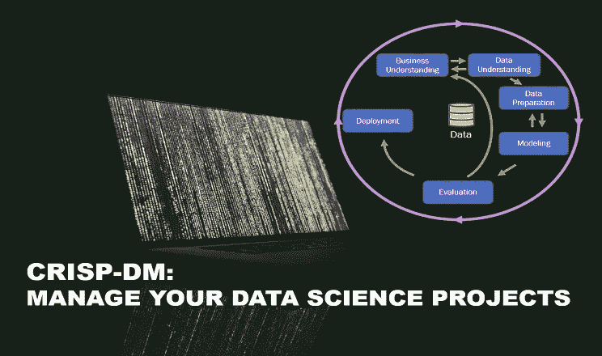

## 案例研究:使用 CRISP-DM 比较洛杉矶和纽约的 Airbnb 房源和趋势

因此，您可以编写一个优雅的数据库查询，掌握最新的机器学习算法，精通多种统计技术，对海量数据集进行分布式计算没有问题，在睡觉时编写有价值的生产代码，甚至参加一两门数据可视化课程，并可以编写一个看起来很酷的演示文稿。你一定是人人都信誓旦旦的独角兽数据科学家，但没人真正见过！嗯，别担心，即使像你这样的人也有进步的空间:)

事实证明，即使是我们当中最优秀、最有知识的人，更不用说年轻渴望入门的人了，也会成为缺乏组织这样平凡事情的受害者，尤其是在从事大型复杂项目时。

您有没有遇到过这样的情况:在模型训练阶段，您发现关键信息丢失了，或者您设计的功能导致了各种各样的收敛或性能问题？或者，你部署的机器学习模型在真实环境中表现严重不佳，尽管在坚持测试集上表现良好，这是一个怎样的噩梦场景？

通过遵循名为 CRISP-DM 的数据分析流程，可以及早发现甚至完全避免这些问题。

你可能会问，什么是 CRISP-DM？根据维基百科:

> " **CRISP-DM 是一个跨行业的数据挖掘标准流程—** 一个描述数据挖掘专家常用方法的开放标准流程模型。"

通俗地说，它是一套帮助计划、组织和执行您的数据挖掘或数据分析项目的指南。下图清晰地描述了这一点:

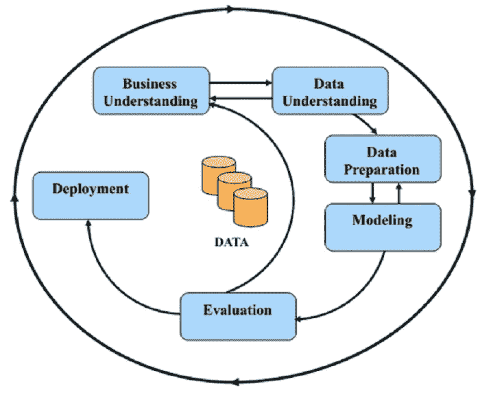

Figure 1\. CRISP-DM Process Flow Diagram.

在这篇文章中，我们展示了 CRISP-DM 在从 2018 年 10 月开始到 2019 年 10 月结束的一年中对洛杉矶和纽约之间的 Airbnb 房源和价格趋势进行比较分析的应用。在我们的分析中，我们将使用 **python** 和 **pandas** 进行数据操作，使用 **scipy** 进行统计，使用 **seaborn** 和 **matplotlib** 包进行可视化。

# **业务理解**

遵循 CRISP-DM 指南，我们从业务理解开始。在没有正确定义问题和目标的情况下开始项目是一个惊人的普遍错误。这个错误不是数据分析特有的，而是所有类型的问题解决活动共有的。因此，所有主要的问题解决方法，包括 8-D、6-sigma DMAIC，当然还有 CRISP-DM，都放在第一位，强调*问题定义或业务理解*的重要性。

在我们的案例中，从这篇文章的小标题转述的问题是:“洛杉矶和纽约之间 Airbnb 房源和趋势有什么不同？”

我们甚至还没有开始，但已经遇到了一个问题。如果听之任之，所提出的问题是宽泛的，不具体的，并且可以用许多完全不同的方式来回答(幸运的是，没有一种方式会令我们的假设客户满意，因为他在向我们提出这个问题时“实际上心里有别的想法”。

因此，我们的首要任务是理解分析的目的，并对问题给出清晰明了的定义。这就是我们去找我们的商业伙伴并问:“嗯？”(希望能多一点口才)。在这个练习的最后，我们应该会有一系列的问题。例如:

1.  洛杉矶和纽约的房产面积分布有什么不同吗？请注意，“大小”仍然是一个有点模糊的属性，但我们可以通过检查多个与物业大小相关的特征来管理它，如卧室和浴室的数量，或每个列表的床位数量。
2.  全年城市平均价格趋势是否存在差异？
3.  周末前后价格暴涨有差异吗？

在本文中，我们将仅限于三个示例，但文章结尾链接的完整分析有一个更大的问题集。

# **数据理解**

CRISP-DM 流程的下一阶段是理解数据。它通常包括以下步骤:

*   确定需要什么数据
*   如果所需数据不可用，则收集数据
*   浏览数据
*   验证数据质量

让我们遵循数据理解步骤:

我们认为，要回答提出的问题，我们需要描述 Airbnb 列表的数据和包含每日列表价格的数据。幸运的是，这两个都可以在 Airbnb 数据网站的[内部分别在【listings.csv.gz】的和**的【calendar.csv.gz】的**文件中找到。](http://insideairbnb.com/get-the-data.html)

注意，数据文件并不小，所以通过只加载我们需要的特性来节省空间和时间是有意义的。

**提示**:在没有补充文档的情况下处理大型数据文件时，只需加载前几行即可快速检查文件内容。用 **pandas.read_csv** 参数 *nrows* 很容易完成。

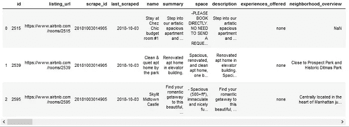

Table 1\. Raw **listings** data set (first three rows).

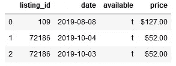

Table 2\. Raw **calendar** data set (first three rows).

预览数据文件的潜在好处:

*   获取列名(如果有)
*   获取功能数量
*   可视化数据
*   初步了解列数据类型。注意不要假设前几行完全代表一列中的所有数据。

例如，在我们的分析中，原始的**清单**文件包含 96 列；然而，这些专栏中只有 11 个与我们相关。原始**日历**文件中的*可用*特征被编码为字符串“t”或“f”，而*价格*特征被编码为包含美元符号的字符串。然而，对于我们的分析，我们需要 *1/0* 或*真/假*编码的可用性和*浮动*编码的价格。

因此，预览数据允许我们仅选择我们需要的特征，并在文件加载时重新格式化数据。

我们加载数据并添加一个*城市*特征。

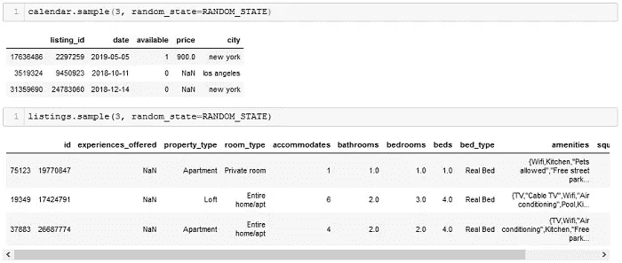

Table 3\. Loaded and formatted **calendar** and **listings** data sets.

一旦加载了数据，我们就以理解数据的维度、数据类型和值的分布为目标来研究数据。下面的代码块演示了典型的探索流程。

最后，我们通过寻找缺失值和异常值或其他不可用的数据来验证数据质量。请注意，上面代码块中的探索图应该有助于识别异常值。

在进入下一步之前，我们总结一下我们的发现:

## 数据理解摘要

*   从 Airbnb 网站内部下载了洛杉矶和纽约的 **calendar.csv** 和 **listings.csv** 数据集
*   将两个城市的数据分别合并到**日历**和**列表**熊猫数据框中
*   新增功能城市，以跟踪列表位置
*   探索数据

**日历:**

*   5 个变量的 34，232，620 个条目
*   超过 60%的*价格*条目缺少值
*   价格的非正态分布偏右，远高于 20，000 美元的异常值
*   不匹配的日期在洛杉矶和纽约之间的 *date* tail-ends，不是所有的列表都有条目

**列表:**

*   12 个变量的 93，804 个条目
*   *experience_offered* 特性缺少所有值
*   *平方 _ 英尺*特征丢失>所有值的 99%
*   *浴室*、*卧室*、*床*功能缺失< 0.15%的数值
*   所有数值特征都是右偏的，具有很大的异常值
*   *与*房间、*浴室、*、*卧室、*、*床、*之间的显著相关(> 0.5)
*   字符串编码的*便利设施*功能包含混合格式的关键字和短语列表

## 重要的:永远记录你的发现！

是的，即使是一个小项目…是的，即使这个项目是为你自己使用。

# **数据准备**

既然我们已经了解了我们正在处理的原始数据，我们就为我们的分析和建模做准备。

数据挖掘，有时被称为数据挖掘，同时也是数据挖掘过程中最耗时、回报最少、但可以说是最重要的部分——记住:“垃圾进，垃圾出！”

CRISP-DM 流程的这一阶段可分为以下步骤:

*   干净的数据
*   生成分析所需的新属性(也称为*特征工程*
*   集成数据(合并和聚合)

先说数据清理。这是我们决定如何处理缺失值、异常值和其他在前一阶段确定的不可用数据的地方。在我们的案例中，我们执行以下清洁步骤:

**历**:

*   删除洛杉矶日历和纽约日历之间不匹配的日期
*   删除在整个时间间隔内不可用的列表
*   放弃每晚 2 万美元以上的超贵房源

**房源**:

*   从**列表**中删除*体验 _ 提供的*和*平方 _ 英尺*特征(列)
*   删除使用**日历**数据集计算的平均刊登价格不可用的刊登物品(行)
*   删除 0.15%缺少数字特征值的列表(行)

接下来，我们转向移动**特征工程。**

> “特征工程
> 
> 改进模型的最有效方法”，Kaggle

正如我们在上面的数据理解总结一节中提到的，价格的分布包含几个异常值。我们需要确定这些异常值是否是由典型价格列表中的差异引起的，其中一小部分昂贵的列表作为异常值出现，或者即使对于更昂贵的列表，一些每日列表价格也是异常值。我们可以通过检查**中值**标价来做到这一点。

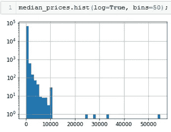

Figure 2\. Distribution of listing median prices (log-scale)

事实证明，很少有房源确实极其昂贵。此外，中值价格的分布是非正态的，并明显向右倾斜(越来越贵)。为了最小化这些远异常值和其他昂贵列表对我们的总体趋势分析的影响，我们将列表分为低中值价格箱和高中值价格箱，并分别对这些箱进行分析。

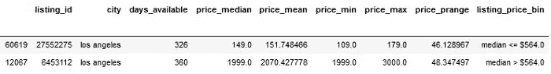

Table 4\. Sample of listing price summary statistics with labeled median listing price bin.

## 数据准备摘要

我们执行了以下清洁和特征工程步骤:

**数据清理**

*   删除缺失/不匹配的值
*   删除洛杉矶日历和纽约日历之间不匹配的日期
*   删除在整个可用时间间隔内不可用的列表
*   放弃每晚 2 万美元以上的超贵房源
*   删除使用**日历**数据集计算的平均刊登价格不可用的刊登物品
*   删除 0.2%缺少数字特征值的列表

**特色工程**

*   *listing_price_bin* :挂牌价格中值 bin:挂牌价格中值< = $564，挂牌价格中值> $564，用于探索性分析
*   *便利设施* : 197 项功能

**输出**:

*   **日历**:包含每日可用性和每个列表的定价的干净数据集
*   **列表**:用生成的 listing_price_bin 和市容特征清理列表数据
*   **便利设施 _df:** 列表便利设施的整齐数据集，其中每行对应一个 Airbnb 列表，每列对应一个便利设施。单元格值为 1 表示列表具有舒适性，单元格值为 0 表示列表不提供舒适性。

# **建模**

我们已经准备好进入 CRISP-DM 过程的有趣部分，通过执行建模和统计分析，我们实际上找到了问题的答案。

让我们从比较两个城市的列表大小分布开始。此外，我们分离出高中值价格的列表，并分别检查它们。我们使用 violin 图来可视化分布情况，并在表格中总结相关的统计数据。

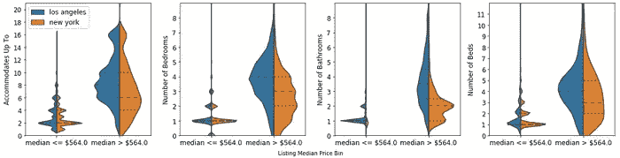

Figure 3\. Violin plots comparing Los Angeles and New York Airbnb listing property size related attribute distributions.

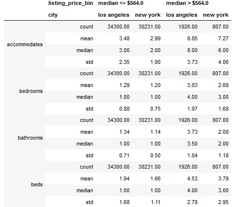

Table 5\. Comparison of Los Angeles and New York Airbnb listing property size related attributes.

## 回答问题 1:

现在我们有了第一个答案——表 5 显示洛杉矶的房产平均比纽约的大。

接下来，我们研究全年城市平均价格趋势的差异。因为我们想要比较两个城市之间的价格趋势，而不是检查原始价格，我们将查看每个城市的日平均价格与年平均价格的百分比偏差。

**提示:**当比较具有不相等平均值的多组值之间的内部趋势时，通过减去然后除以每组值的平均值来标准化这些值会有所帮助。实际上，不使用原始值进行比较，而是查看百分比偏差比较，或者执行相对比较。

请注意，我们还没有完成特征工程。这是典型的数据挖掘流程。因此，在图 1 的 CRISP-DM 图上，在**数据准备**和**建模**之间有一个双向箭头。我们现在生成数据框架，其中包含合计的日平均价格以及这些价格与年平均价格的百分比偏差。

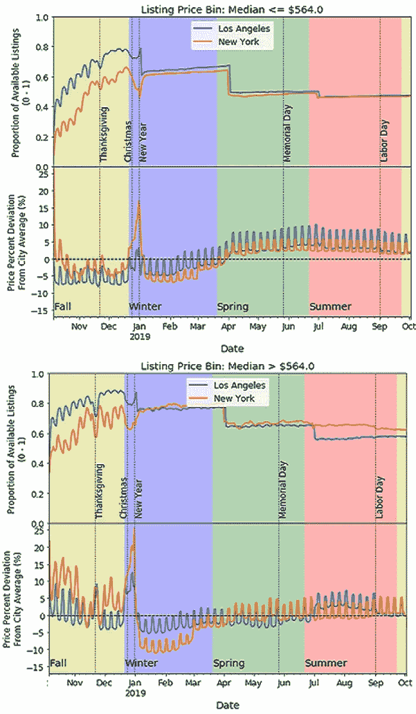

Figure 4\. Comparison of Los Angeles and New York Airbnb average listing price and availability trends.

## 回答问题 2:

第二个问题的答案是，总体而言，洛杉矶和纽约之间的 Airbnb 年平均价格和可用性趋势相似，不同季节的价格变化幅度有所不同。关于图 4 中趋势的更详细的分析可以在文章末尾链接的分析笔记本中找到。

从图 4 中可以清楚地看到，全年平均价格有 5–10%的周期峰值。你可以猜到，这些对应的是周末价格。让我们更仔细地检查这些。在计算每个列表和每个星期的工作日和周末价格之间的百分比差异后，我们查看每个城市和列表价格箱的平均周价格差异的分布，忽略假日周:

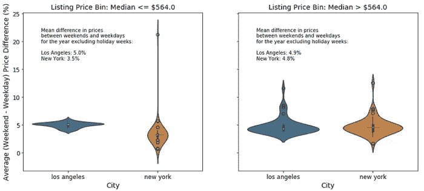

Figure 5\. Violin plot comparison of Airbnb Los Angeles and New York weekly average (weekend — weekday) price percent differences for non-holiday weeks.

## 回答问题 3:

图 5 显示，洛杉矶低价房源(挂牌价格中值≤＄564)的周末平均价格峰值比纽约高出 1.5 个百分点(5%对 3.5%)。高价房源(中位标价> 564 美元)的差价也是 0.1 个百分点。

# 估价

我们已经回答了所有提出的商业问题，是时候给自己一点鼓励了！嗯……不完全是。根据 CRISP-DM 流程，我们现在应该评估我们的模型和/或分析。

对于构建预测模型的项目，这将是在保留测试集上评估模型性能的时候。对于像我们这样需要统计分析的项目，应该评估结论的统计显著性。此外，我们评估我们制作的模型/分析是否正确，我们没有忽略任何东西⁴.

为了了解洛杉矶和纽约之间 Airbnb 房源和价格趋势的任何差异是否重要，我们对较小样本量的聚合数据进行了显著性测试(t-test ),并在其他情况下进行了效果大小测试(克里夫的德尔塔或科恩的⁵)。

为了使本文至少简短一点，我们将只展示周末-工作日价格差异评估。

首先，让我们了解一下我们上面发现的差异是否具有统计学意义。

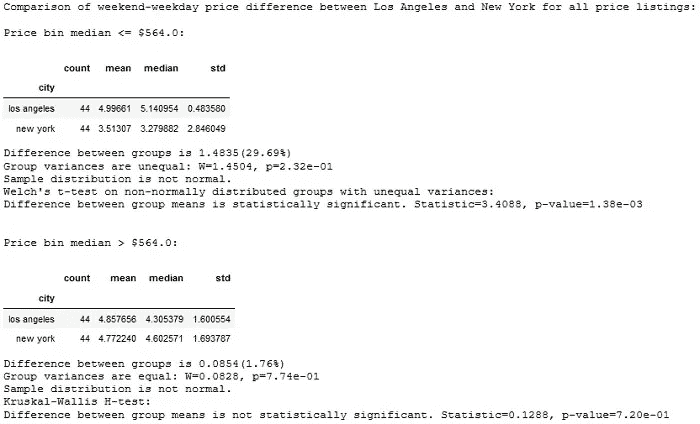

我们的显著性测试表明，洛杉矶和纽约之间的低价房源差异具有统计学意义，而高价房源则没有！

我们还没有完成…我们已经模拟了所有列表的平均周末-工作日价格差异。这将回答租房者预计房价平均会有多大变化的问题。

然而，如果我们从主持人的角度提出同样的问题，即主持人平均会将周末价格提高多少呢？在这种情况下，我们的模型是不够的。为了提供对后一个问题的估计，我们至少需要排除全年所有固定价格的列表。现在情况看起来有些不同:

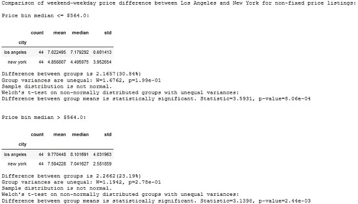

显然，不仅两个城市的非固定价格房源的平均周末价格峰值更大，洛杉矶和纽约之间的差异也更大(低价房为 7%对 4.9%，高价房为 9.8%对 7.5%)，并且在统计上更显著！

# **部署**

分析完成后，我们进入 CRISP-DM 流程的最后阶段— **部署**。

在我们的探索性分析的例子中，部署比，例如，部署一个在线预测模型来推荐产品要简单得多。我们的部署策略必须简单地确保我们的分析是可读的、可重复的和可维护的。我们通过生成一个 Jupyter 笔记本来满足这些要求，该笔记本详细描述了分析过程的每个步骤，并记录和证明了在数据清理和特征生成、模型选择和评估中所做的所有选择。此外，我们在自述文件中提供了笔记本电脑的安装和使用说明。

这个分析的笔记本和说明可以在 GitHub 库找到:[https://github.com/LexiAM/comparative_analysis_airbnb](https://github.com/LexiAM/comparative_analysis_airbnb)

# 结论

我们回顾并应用 CRISP-DM 流程分析了洛杉矶和纽约之间 Airbnb 房源和价格趋势的差异。我们讨论了 CRISP-DM 如何帮助我们组织高效的数据挖掘工作流，并确保我们的分析是相关的、充分的、可读的和可重复的。

希望这篇文章已经说服你在**的**分析项目中使用 CRISP-DM 过程。(如果不是为了自己，那就为了你的客户！)

# 你认为 CRISP-DM 会让你成为更好的数据科学家吗？

## 如果你喜欢这篇文章，并想阅读更多像这样的故事，请点击下面的链接关注我。

## 参考资料:

1.  跨行业数据挖掘标准流程，[https://en . Wikipedia . org/wiki/Cross-industry _ standard _ process _ for _ data _ mining](https://en.wikipedia.org/wiki/Cross-industry_standard_process_for_data_mining)
2.  CRISP-DM 图表，[https://www . IBM . com/support/knowledge center/en/ss3ra 7 _ 15 . 0 . 0/com . IBM . SPSS . CRISP DM . help/CRISP _ overview . htm](https://www.ibm.com/support/knowledgecenter/en/SS3RA7_15.0.0/com.ibm.spss.crispdm.help/crisp_overview.htm)
3.  卡格尔特征工程，[https://www.kaggle.com/learn/feature-engineering](https://www.kaggle.com/learn/feature-engineering)
4.  什么是 CRISP-DM 方法论，[https://www.sv-europe.com/crisp-dm-methodology/](https://www.sv-europe.com/crisp-dm-methodology/)
5.  效果大小，[https://en.wikipedia.org/wiki/Effect_size](https://en.wikipedia.org/wiki/Effect_size)