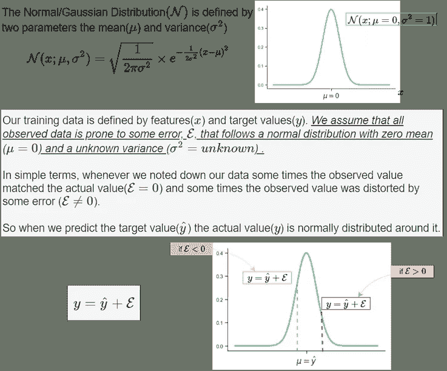
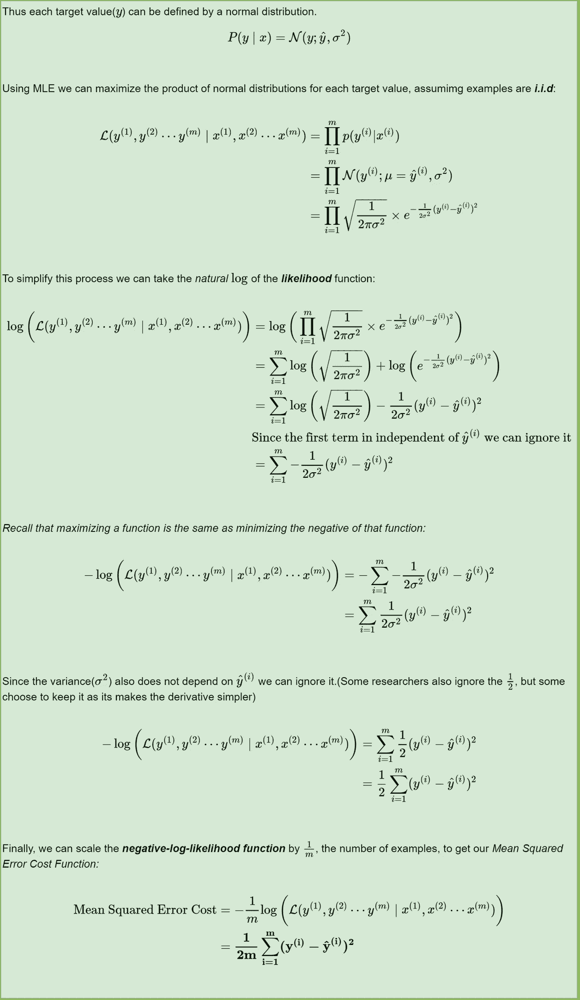
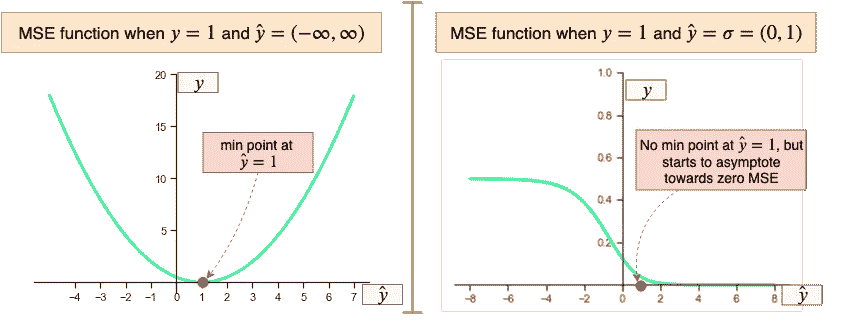
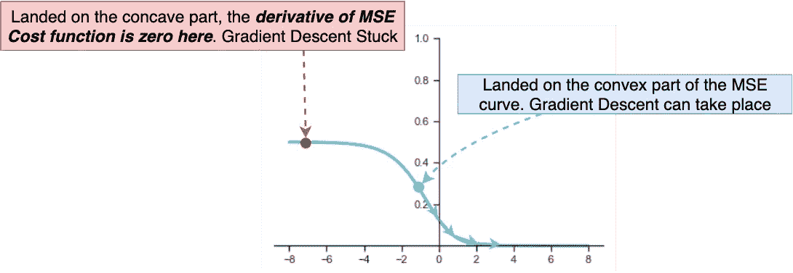
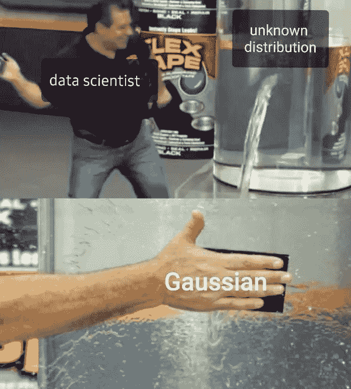

# 为什么使用均方误差(MSE)代价函数进行二分类不是一个好主意？

> 原文：<https://towardsdatascience.com/why-using-mean-squared-error-mse-cost-function-for-binary-classification-is-a-bad-idea-933089e90df7?source=collection_archive---------4----------------------->

*博文补充部分"* [*无非 NumPy:理解&从零开始用计算图创建二分类神经网络*](https://medium.com/@rafayak/nothing-but-numpy-understanding-creating-binary-classification-neural-networks-with-e746423c8d5c)

*对于二元分类问题，均方误差(MSE)不是一个好的选择，原因有两个:*

****首先*** *，使用 MSE 意味着我们假设底层数据已经由一个正态分布(一个钟形曲线)*生成。在贝叶斯术语中这意味着我们假设一个 [***高斯先验***](https://en.wikipedia.org/wiki/Conjugate_prior) 。而在现实中，可以分为两类(即二进制)的数据集并非来自正态分布，而是来自 [*伯努利分布*](https://en.wikipedia.org/wiki/Bernoulli_distribution) (查看 [*的答案二进制交叉熵损失函数从何而来？*](https://medium.com/@rafayak/where-did-the-binary-cross-entropy-loss-function-come-from-ac3de349a715) ”了解更多详情以及最大似然估计的介绍)。*

*如果我们使用最大似然估计(MLE)，假设数据来自正态分布(顺便说一下，这是一个错误的假设)，我们将 MSE 作为优化我们模型的成本函数。*

**

*Fig 1\. The Normal Distribution of the observed target/label value*

**

*Fig 2\. Deriving MSE through MLE*

****其次*** ，MSE 函数对于二分类是非凸的。简单来说，如果用 MSE 代价函数训练一个二元分类模型，*不保证*最小化代价函数。这是因为 MSE 函数期望范围 *(-∞，∞)，*内的实值输入，而二元分类模型通过 sigmoid/logistic 函数输出范围(0，1)内的概率。让我们想象一下:*

**

*Fig 3\. Non-convexity of MSE when output is from a Sigmoid/Logistic function*

*当 MSE 函数被传递一个无界值时，一个漂亮的 U 形(凸形)曲线就是在目标值处有一个清晰的最小点的结果( ***y*** )。另一方面，当来自 Sigmoid 函数的有界值被传递给 MSE 函数时，结果不是凸的；一方面，函数是凹的，而另一方面，函数是凸的，没有明确的最小点。因此，如果偶然地，二进制分类神经网络被初始化为具有大幅度的权重，使得其落在 MSE 成本函数的凹入部分，梯度下降将不起作用，因此，权重可能不会非常缓慢地更新或改善(在编码部分中尝试这一点)。这也是为什么神经网络在训练时要小心翼翼地用小值初始化的原因之一。*

**

*Fig 4\. MSE convex on one side while concave on the other when using outputs from a Sigmoid/Logistic function*

**最后一点，当我们进行线性回归(即通过数据拟合直线进行外推)时，MSE 是一个很好的成本函数选择。* ***在不知道数据如何分布的情况下，假设正态/高斯分布是完全合理的。****

**

*Courtesy [Nas Mouti](https://www.facebook.com/nas.mooty)*

*如有任何问题，请随时在[Twitter](https://twitter.com/RafayAK)[**@**RafayAK](https://twitter.com/RafayAK)上联系我，并查看“[二元分类](https://medium.com/@rafayak/nothing-but-numpy-understanding-creating-binary-classification-neural-networks-with-e746423c8d5c)上的其余帖子。*

*

If you enjoyed it!*