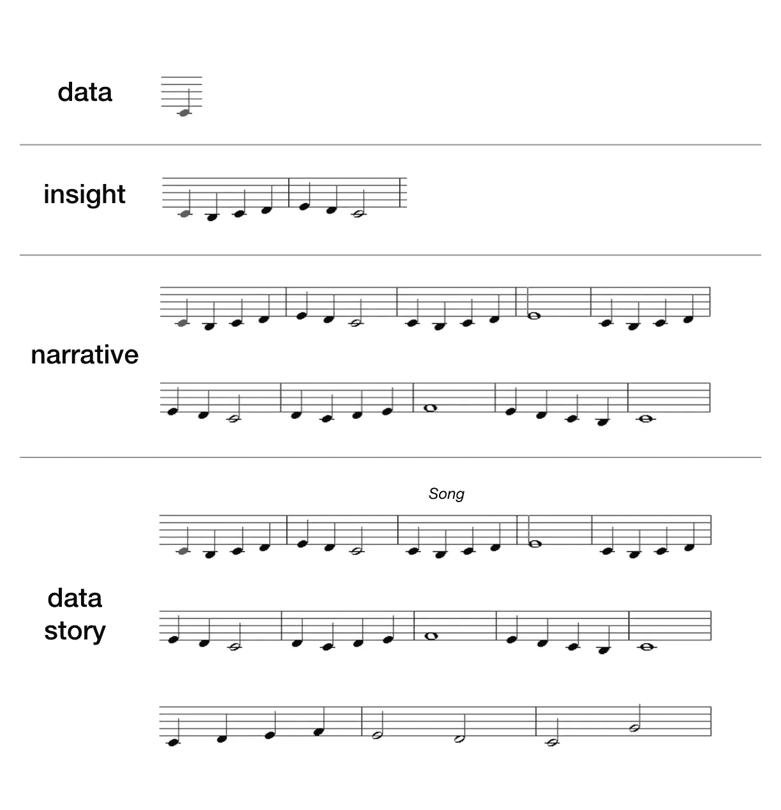
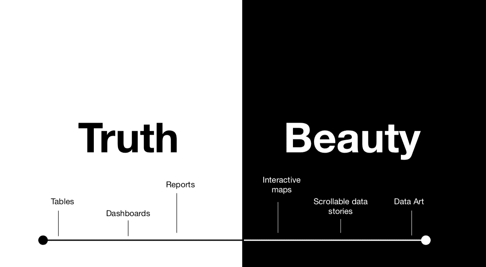

# 为什么视觉素养对于良好的数据可视化至关重要

> 原文：<https://towardsdatascience.com/why-visual-literacy-is-essential-to-good-data-visualization-5b9dffb5aa6f?source=collection_archive---------8----------------------->

## 我们知道数据素养很重要。但是视觉素养也很重要。原因如下。

Photo by [Markus Spiske](https://unsplash.com/@markusspiske?utm_source=medium&utm_medium=referral) on [Unsplash](https://unsplash.com?utm_source=medium&utm_medium=referral)

数据无处不在，人们的工作方式也因此而改变。公司现在更多地投资于首席数据官等角色，建立他们的数据科学团队，并谈论组织中的“数据素养”等问题。数据素养甚至在最近成为为子孙后代维护民主的重要组成部分。

但是视觉素养呢？我们了解视觉机制如何处理数据吗？有些人可能会认为这是一回事，但我认为这里有一个重要的区别。以这段引自 data viz legend 汉斯·罗斯林的话为起点:

> “我们大多数人需要听音乐才能理解它有多美。但这通常是我们展示统计数据的方式:我们只展示音符，不演奏音乐。”
> 
> —汉斯·罗斯林

我喜欢这样想:良好的数据素养就是理解笔记。它是知道平均值和中间值之间的区别，以及何时使用一个而不是另一个。意识到什么时候从研究中得出结论，或者什么时候对小样本的研究持怀疑态度。

但是视觉素养就是音乐。它是音符的策略性连接以形成旋律，旋律重复或演变以形成合唱。思考视觉素养(以及你的听众的视觉素养)可以让你开始将数据的音符连接成一首有凝聚力的歌曲。正如这个有用的[维基百科条目](https://en.wikipedia.org/wiki/Visual_literacy)所说，它有效地让你“从信息中获取意义”。

数据建立了洞察力，这可以形成一个故事。叙事是构建数据故事的基础。

Not an actual song. Pardon my very quick mockup of the sheet music analogy.

# 真善美

我们如何连接和可视化数据来传达信息是任何数据专业人员的基本任务。这意味着要做一些艰难的决定。在这一点上，我们几乎达到了该领域的古老争论:简单还是复杂？单纯展示数据还是讲故事？展示原始信息还是允许用户探索？

我们已经到达了真善美的光谱。

Tables are the fall on the left side of truth: raw numbers, in all their glory. It’s the most precise form of visualization. On the opposite side, abstract representations of data as art allow for exploration, even on the emotional side, of complex networks. In between are a few examples of other possible formats, which depending on the use case, can shift further to either side of the spectrum.

公平地说，光谱图可能不是这里最好的。伟大的数据可视化应该既真实又美观，在信息和审美趣味之间达到恰当的平衡。但我仍然发现，当考虑数据时，将真善美视为一个光谱是一个有益的起点，尤其是当与可能不太习惯使用数据的受众合作时。

数据素养与理解数据本身有关。视觉素养主要关注数据作为信息的呈现。

这是另一个说明它们不同的例子:良好的数据素养允许你为你的数据选择正确的图表，一个最准确和信息最丰富的图表。数据素养讨厌误解的风险，在紧要关头，总是会为了简单而牺牲视觉天赋。想想条形图，而不是辐射图。如果你在推特上关注数据，想想爱德华·塔夫特和 T2。

视觉素养包括这种对细节的关注，但更进了一步，问了一个简单但或许令人沮丧的问题:*我的观众会在乎吗？*

以下是在考虑数据中的视觉素养时可能会出现的一些其他问题，即:

*   这张图表在视觉上足够有趣吗？
*   人们会想要与它互动并进一步探索吗？
*   有纪念意义吗？
*   漂亮吗？
*   意思清楚了吗？如果不是，那么更多的信息是否足够直观可以找到？

数据素养是一个重要的起点。但是让我们现实一点:大多数人都不想看满满一页的条形图。随着可用数据比以往任何时候都多，世界正遭受洞察力疲劳，日复一日地盯着显示积极和消极表现的红色和绿色指标的仪表板。

Just look at this generic business guy. He’s been staring at 3d pie charts and bar graphs all day.

我最喜欢数据可视化的一点是它不断挑战现状。它邀请用户自己探索数据。有时候，快速、简单的外卖是你最终需要的。但是如果我们将数据可视化减少到这个领域的狭窄子集，那么我们就完全失去了探索和发现的潜力。

为了继续推进这一领域，数据 viz 从业者需要超越数据素养。我们需要痴迷于色彩理论、某些形状的感觉、网络用户的阅读模式以及终端用户中数据疲劳感的传播。视觉素养是思考这些基本技能的一种方式。这是我们让数据可视化变得有趣、令人兴奋并让每个人都可以访问的方式。

如果这类事情像我一样让你着迷，这里有一些额外的推荐读物:

*   [大数据时代的视觉素养](https://source.opennews.org/articles/visual-literacy-age-data/)
*   [ODI:数据素养将有助于解决全球最大的挑战](https://www.telegraph.co.uk/technology/news/10414071/ODI-data-literacy-will-help-solve-worlds-biggest-challenges.html)
*   [如何成为一名受过教育的信息图表消费者](https://www.brainpickings.org/2013/10/08/best-american-infographics-david-byrne/)
*   [新的读写能力，以及视觉信息的世界](http://www.conradiator.com/downloads/pdf/literacies4eigvil_ct2003.pdf)

> 我随时准备接受讨论！请在评论中留下你的想法，或者在 Twitter 上找到我。我还写了一份名为“数据好奇”的每周时事通讯，其中包含数据可视化方面的资源，你可以在这里注册**。**