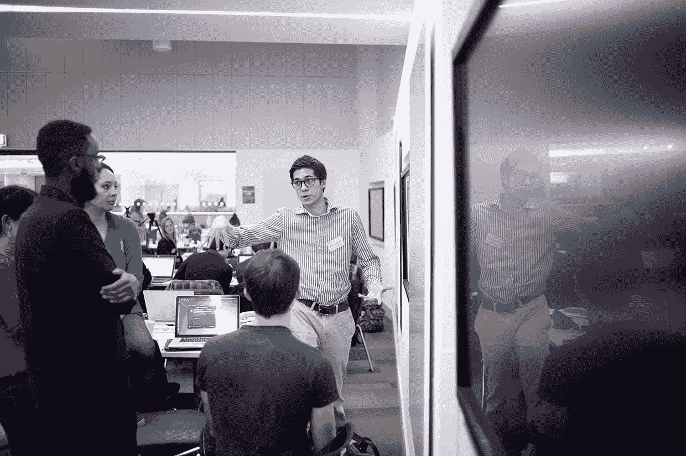
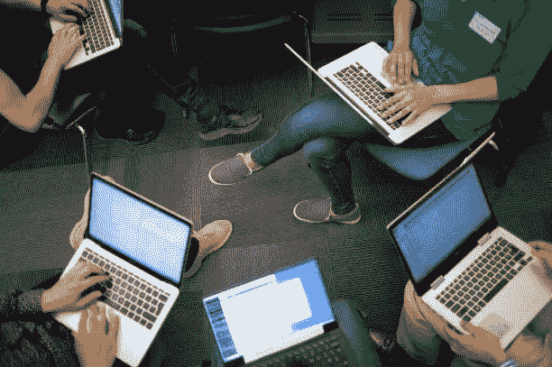

# 为什么我们为痴呆症举办数据马拉松

> 原文：<https://towardsdatascience.com/why-we-do-datathons-for-dementia-dbcc81282907?source=collection_archive---------21----------------------->

## 除了和你的数据伙伴一起享用无限*披萨，还有更多理由加入数据马拉松(即使那真的是一个很棒的亮点！)数据通将数据科学家和学科专家结合起来，当你处理复杂的真实世界健康数据时，这真的很重要。

痴呆症是我们社会最紧迫的健康问题之一，也是数据科学家可以做出巨大贡献的问题之一。科学理解的当前前沿——它是如何从大脑开始的？最早的征兆是什么？怎么才能早期治疗？众所周知，当疾病发展到晚期才出现明显症状时，很难发现。如果你以前从未处理过真实世界的健康数据，变量的复杂性以及如何访问这些数据——更不用说了解足够多的信息来形成你的研究问题——可能会感觉像一个不可扩展的挑战。痴呆症是一个太大的问题，不能只留给神经科医生。我们需要各种背景的数据科学家来研究它，这就是我们设立 datathon 系列的原因。

*痴呆症数据通是如何工作的？*

我们的[数据马拉松](https://www.dementiasplatform.uk/for-researchers/datathon)本质上是“黑客马拉松”,但有额外的结构和学习机会。各种各样的研究人员都来了三天。在以前的数据马拉松中，我们有一位具有天体物理学背景的研究员，一位具有遗传学背景的研究员，还有一些具有纯数学背景的研究员。他们都了解了我们工作的人群健康群组数据集，我们组成团队，然后每个人都登录到 [DPUK 数据门户](https://portal.dementiasplatform.uk/)中的虚拟分析环境。分析环境是一个虚拟桌面(例如 32GB，8 个 CPU，预装了包括 R 和 Python 在内的软件)。它是完全安全的——任何参与者都不可能错误地下载原始数据文件或破坏原始文件。

与典型的黑客马拉松的一个重要区别是没有竞争元素。数据马拉松是关于团队工作的，然而如果可能的话，哪个数据研究者不想出版呢？这是一个启动论文的机会，在场的首席科学家将随时帮助与会者完成这一任务。

The last DPUK datathon took place at the University of Exeter

*我们学到了什么*

我们与艾伦图灵研究所和英国阿尔茨海默氏症研究所合作运行我们的数据马拉松，我们学到的最重要的事情之一是对数据和领域的介绍非常重要。并不是所有的参与者都有痴呆症研究的背景——事实上，新的想法正是我们想要的。我们发现，与会者喜欢与主题专家一起工作——这是我们发现伟大想法的激动人心的火花可能发生的地方。到目前为止，我们所有的数据马拉松都是由具有联合数据心理学背景的研究人员领导的，这是我们将在下一个系列中继续进行的事情。

我们知道，我们需要数据科学家处理的真实世界群组数据是杂乱而复杂的。数据科学家可能有处理大量数据的经验，但不一定了解我们需要观察的变量的复杂性。我们有必要处理这样的数据，但我们已经知道，让 datathon 与会者对我们处理的数据集有一个良好的概述非常有帮助——不仅是数据字典，还有对数据收集历史的介绍，它是如何编码的，可能缺少什么，文件夹结构。

我们发现与会者相互学习。数据科学中有如此多的技术，当人们不同的专业知识聚集在一起时会发生什么，这是令人兴奋的。我们肯定会继续鼓励各种背景的研究人员参加。

结果呢？我们的先驱 datathoners 非常喜欢它！房间里的人们对这种形式充满了热情，来自以前通常不会在一起工作的人们的思想也真正融合在一起。我们看到以前的与会者在他们在数据马拉松中开始的工作的基础上建立了完整的研究提案，许多人计划回来。

