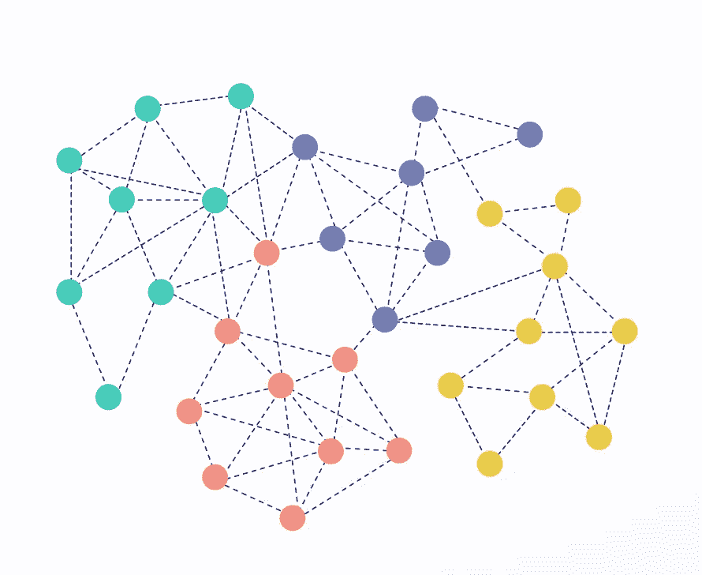
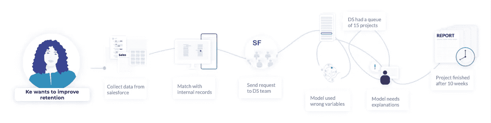
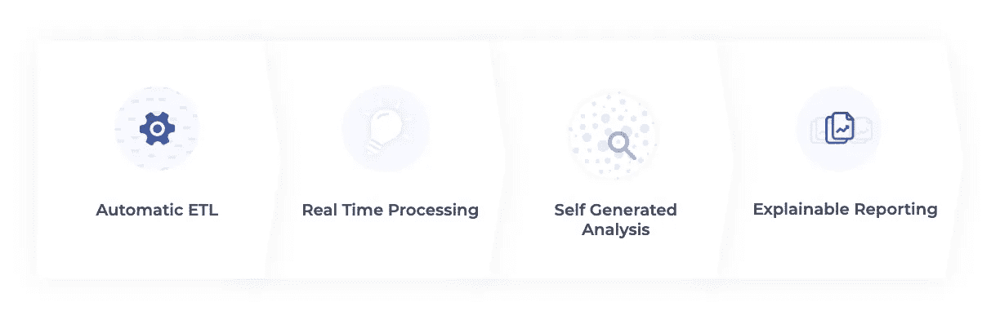

# 为什么我们必须让数据科学民主化

> 原文：<https://towardsdatascience.com/why-we-must-democratize-data-science-baacfea650c3?source=collection_archive---------19----------------------->

几年前，我在伦敦总部经营一家跨国公司的 B2B 业务。我们的业务在下滑，我拼命想找出我们如何才能防止客户流失。我过去得到的销售报告没有用，因为它们只是总结了我已经知道的被搅动的客户。我需要的是一种预测未来谁会流失的方法，这样我就可以采取先发制人的行动。

我发现该公司最近在旧金山成立了一个数据科学团队，他们可以解决我的头痛问题。因此，我打电话给我的 Salesforce 分析师，以获取客户记录列表(花了 2 周时间来匹配父帐户和子帐户)，然后我打电话给财务团队，以将该信息与客户合同进行匹配(花了 3 周时间来协调两个数据集)。经过大量的数据清理，我终于有了一个足够好的样本数据集，可以将它发送给数据科学团队。但是他们礼貌地告诉我，由于他们有这么多高优先级的项目，他们只能在一个月后才能进行我的分析。我耐心地等待，当他们最终回复我时，我花了很多时间向他们解释业务背景，以便他们可以建立自己的模型。讨论来来回回至少 4 次，直到我最终得到我的报告。这份分析很奇特，但充满了专业术语，我绞尽脑汁把它呈现给我的销售经理，这样他们就会相信我的建议。最后，我的财务团队通知我，由于我使用了“高度要求”的资源来支持我的业务，因此我将为此项目支付 5000 美元的“内部费率”。

经过这么多的争论，我仍然有一个小问题——我不知道这个预测是否准确。因为拿到报告既麻烦又费钱。我只愿意每三个月请求一次更新，这意味着我不能建立一个反馈循环来检查结果。但作为一个技术的信徒，我每个季度都努力重复所有痛苦的步骤，并付费获得分析。

我的经历你听起来熟悉吗？

几年后，我终于离开了企业界，加入了一家初创公司， [Graphext](http://graphext.com) ，致力于为商业用户打造一款数据科学软件。我坚信这一愿景，在这篇博文中，我想告诉你更多关于为什么数据科学民主化至关重要，以及这在实践中意味着什么。

那么，为什么我们必须让数据科学民主化呢？

在 90 年代，Excel 成为第一个具有图形用户界面的主要电子表格程序。它自动化了许多手动数字处理任务，并使电子表格计算对普通大众来说是可及的。事实上，这是人们在互联网出现之前购买电脑的主要原因。

如今，公司正在处理更大、更复杂的数据集。机器学习的新发展使得分析这些数据集来回答复杂的问题和预测未来成为可能。数据驱动的决策流程已经成为一个巨大的竞争优势，并且在全球经济中已经势在必行。

虽然每个人都希望更多地由数据驱动，但只有少数精英“数据科学家”能够执行分析复杂数据的任务。市场上的“数据科学”工具是为这些“数据科学家”设计的，使用起来不友好，普通公众无法访问。这样做的结果是沮丧，就像我在尝试将数据科学融入我的业务决策流程时经历的一样。

在为普通大众，特别是没有编程和统计背景的商业用户创建可访问的“数据科学”工具的市场中存在差距。创建这样的工具有很多好处。它将释放分析更多隐藏数据集的能力，现在每个人都可以成为自己的数据科学家。用户带来的业务经验和专业知识将提高分析的质量。从分析中产生的建议将更容易转化为执行，从第一天起就得到业务决策者的支持。最后，“数据驱动”文化将不再只是自上而下的战略，一家公司实际上可以与员工一起自下而上地建立这种文化。

创建这样一个工具需要做些什么？这个工具应该是什么样的？我认为在设计这样一个工具时，以下几个组件将是至关重要的。

首先，一个自动化的 ETL 过程。在一天结束时，任何数据项目的 80%都花费在查找和清理数据上。让这一步变得简单，将为用户消除任何数据分析项目的第一个主要障碍。这看起来很有挑战性，但是随着越来越多的公司开始采用行业标准解决方案来取代他们的内部基础设施(Salesforce、Workday、Eloqua 等)。)，数据集在格式上开始看起来很熟悉。因此，不难想象创建一个自动化流程来提取、整合和处理这些数据集以供进一步分析。

第二，实时处理。为了将数据驱动的决策作为业务流程的一部分，分析不仅需要处理典型问题，更重要的是需要处理在关键时刻突然出现的意外问题。通常，快速做出明智的决策会对业务产生巨大影响，尤其是对于金融、物流、医疗保健、媒体和娱乐行业的公司。因此，支持实时分析的数据流需要成为设计通用数据科学工具的主要组成部分。

接下来，自动化分析补充了进行数据探索的灵活性。由于该工具是为非技术用户设计的，我们不能指望用户知道 XGboost 和 Word2vec 之间的区别，以及它们应该如何应用于不同的用例。该工具应该具有嵌入式机器学习算法，这些算法经过优化，可以处理每个用例，并基于不同的场景生成自动化分析。同时，它还需要具有灵活性，允许用户自行探索他们的数据并创建定制的分析。毕竟，基于他们的经验和专业知识，用户也有很多可以提供的。这整个过程需要直观和易于使用(没有 Python 编码请！).

最后，可解释的报告。为了确保所有决策者与建议保持一致，用户需要能够引导他们完成分析并解释他们的发现。如果分析又长又复杂，这可能会变得复杂。因此，拥有一种“回放”分析的方法，而不仅仅是静态地报告结果，将会给用户带来巨大的好处。

在 [Graphext](http://graphext.com) ，我们踏上了为业务转变数据科学的征程。我们已经考虑到上述许多挑战和要求，为每个人开发一个通用的数据科学软件工具。我们的旅程才刚刚开始，还有很多事情要做。如果你对我们正在建设的未来感兴趣，请联系我们！