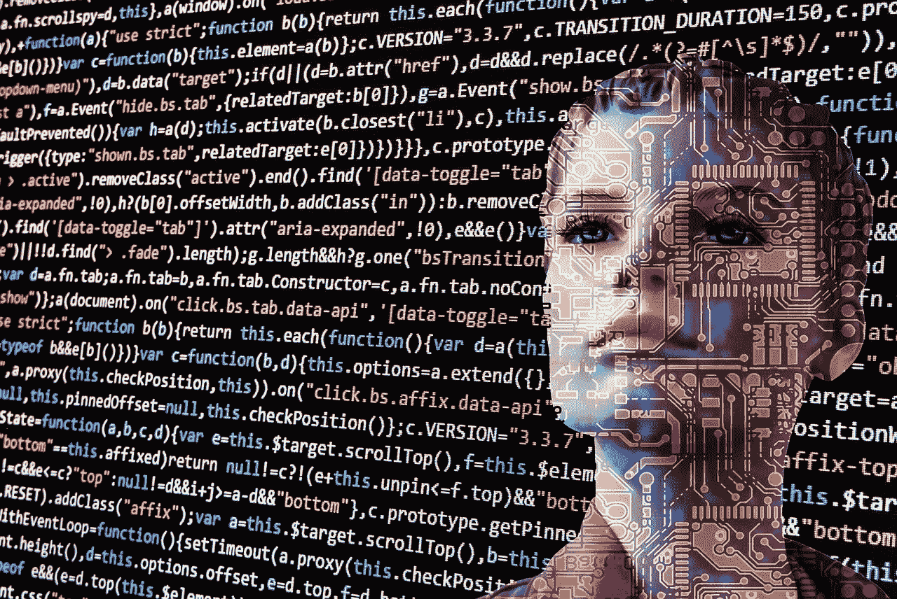

# 为什么我们现在应该停止开发仿制机器

> 原文：<https://towardsdatascience.com/why-we-should-stop-developing-imitation-machines-right-now-ad52c38c1501?source=collection_archive---------19----------------------->

[Image credit: Gerd Altmann](https://pixabay.com/users/geralt-9301/)

# 即使是最弱的人工智能形式也会带来巨大的生存风险。

这在科幻小说和大众科学中有很好的记载:不久的某一天，我们将创造一个比我们更擅长发明的人工智能，人类的聪明才智将会过时。人工智能将改变我们的生活方式，让人类劳动过时。这是我们文化的这一时刻的时代精神:我们担心机器人会在一阵 CGI 金属风暴中崛起。2018 年，数千名人工智能研究人员签署了一份保证书[，停止研发致命的自主武器](https://futureoflife.org/lethal-autonomous-weapons-pledge/)。[开放慈善项目指出](https://www.openphilanthropy.org/focus/global-catastrophic-risks/potential-risks-advanced-artificial-intelligence)强人工智能带来潜在的“全球灾难性”风险。

但我认为，人工智能最直接的风险不是某种机器人战争，或者劳动力恶性通货膨胀，或者超智能奇点。我认为自我导向的“强”人工智能的挑战远远超出了人工智能发展的直接威胁。

这种对阿西莫夫式启示录的关注忽略了一个事实，即即使是最弱的人工智能也将带来法律和审慎的挑战。

以下是我的论点:当我们开发人工智能时，即使是最弱的人工智能，人工智能也会成为权利拥有者，其逻辑与我们赋予人类权利的逻辑相同。让我解释一下。

# **他人思想的问题**

其他心灵的问题是一个未解决的哲学问题，在 20 世纪中期开始争论。问题是:既然我们没有办法观察其他人的内心活动，我们怎么能确定他们 1)存在，2)与我们自己的内心生活有任何相似之处？

有一些人试图解决这些问题，特别是休谟，他写道:

> 首先，他们像我一样有身体，我知道在我自己的情况下，是感情的先决条件；第二，因为它们展示了行为和外在的迹象，就我自己而言，我凭经验知道这是由感情引起的。(1865 [1872: 243])

这个论点已经被揭穿，因为 1)休谟不知道他自己的身体先于他的感觉，2)在其他似乎有头脑的人类中，感觉和行动之间没有一致的路径。

我们今天普遍接受的解决方案是“来自最佳解释的论证”，简单地说，其他头脑是对人类行为的最佳解释。Chalmers [写道](https://plato.stanford.edu/entries/other-minds/):“看起来……这个(来自最佳解释的论证)是我们所能得到的最好的解决他人思想问题的方法”。

这与人工智能有关，因为它是我们理解人权的基础。简而言之:我们以他人喜欢的方式对待他人，因为他们看起来像我们。我们无法证明其他人有定性的体验(比如快乐和痛苦)，但我们给他们假定的好处，因为我们不想让其他人违反我们自己的治疗偏好。

那么，如果我们开发出一台与人脑没有区别的计算机，会怎么样呢？那会阻止我们用某些方法治疗它吗？我们必须给它权利吗？你可能认为这看起来像疯狂的科幻小说，但这是近一百年来研究的一个活跃分支，它几乎完成了它的目标。

# **对他人思想的考验**

图灵测试被广泛认为是人工智能的试金石。由英国英雄艾伦·图灵在 20 世纪 50 年代发明，他提出，如果计算机在执行任务时与人类没有区别，它就可以被认为是智能的。[最初，这个任务是一场国际象棋比赛](https://en.wikipedia.org/wiki/Turing_test#cite_note-20)，但在图灵测试的一个更常见的表述中，这个任务是一个书面对话，通过一个 IM 客户端传递。

创造一种能通过图灵测试的智能是人工智能研究的圣杯。在现代测试中，人类测试对象与两个信使客户端“聊天”。在其中一个的另一端是一个人，输入另一个是一台机器，它被设计来产生类似人类的反应。进去了，测试对象不知道哪个是和机器对话，哪个是和人类对话。如果测试对象不能可靠地区分真实对话和人工智能对话，就说机器是“智能的”，或者至少有足够的智能来模仿人类语言。

到目前为止，还没有一个 AI 通过图灵测试。为此，工程师必须克服一系列挑战:人工智能必须掌握语法，正确识别问题，并利用信息对这些问题做出清晰的回答。它必须有一个庞大的数据库或者可以访问网络，这样它就可以尝试回答各种各样的问题。它可能还需要呈现自发的语句，并在单词之间注入有机停顿，以类似于真实人类对话的方式。语音模拟的进步意味着古怪的行为更难识别，[一些聊天机器人通过模仿语言能力有限的人来愚弄法官](https://en.wikipedia.org/wiki/Eugene_Goostman)。但是，尽管有众多利益相关者的共同努力，还没有一个人工智能能够令人信服地模仿人类行为。

谢天谢地！

我庆祝是因为一台能够成功模仿人类对话的机器将会引发一系列法律问题。这是因为它:

1.  有能力证明它应该拥有权利

和

2.与人类提出同样的论点没有区别。

这里有一个思维实验来说明我的观点。

# **凶残的图灵测试**

想象一个普通的图灵测试，但是有两个不同之处。首先:它发生在一个“弱”人工智能已经实现的不久的未来，可以令人信服地模仿人类对话。第二:输的人会死。如果你把人工智能误认为是人类，人类就会被杀死。如果你正确地识别了人类，人工智能将被删除。这个人是无辜的，他知道他必须为自己的生命辩护。类似地，人工智能被编程来模仿恳求的人类。我们姑且称之为谋杀图灵测试。

两个声音都会恳求主体，他们是真正的人类。由于人工智能可以访问庞大的数据库或互联网，它可能会谈论它的梦想，它对未来的计划，它在家里等待的孩子。由于它是一个有能力的弱人工智能，它会很好地掌握什么语言最能在情感层面上推动主题。当然，人类主体也会这样做。

如果人工智能能够充分模仿人类的行为，这将使测试对象陷入一个不可能的道德难题:两个声音似乎都活着，他们都在阐述他们应该活着的可行案例，而且两者都显得如此人性化，以至于选择一个死亡在道德上是不可接受的。

这种道德上的不可接受性可以用权利来表达:参与者不能让一个人被杀死而不侵犯他的权利。但是他们也不能分辨哪个声音是人类的，所以他们不能分辨哪个声音有权利。由于声音无法区分，两种声音似乎都有权利。

测试对象陷入了一个其他心智问题的完美例子中:因为他不可能证实人类参与者(或任何其他人)有心智，所以他无法区分一个或两个参与者是否有心智。他也不能辨别哪个参与者(如果有的话)有权利。

这是一个不可能的选择，如果这个实验是真实的，任何理性的人都会拒绝参与这样一个可怕的事业。

# 图灵测试的第三种表述

这个思想实验的最后一个转折说明了这种权利的模糊性是如何变成一个权利问题的。

在这个测试的第三个表达中，我们告诉测试对象他们正在参加一个残忍的图灵测试，但在没有告诉对象的情况下，用第二个人工智能聊天机器人代替了人类参与者。

一个理智的主体会根据他的谈话，发现两种声音都是权利的候选人，并会拒绝参与，这样他就不会侵犯参与者的权利。

这一点很重要，因为这种基于笛卡尔怀疑论立场的双盲对话正是通过对他人思想问题的“最佳解释”理解将权利分配给其他人的方式。

# 机器的权利

所以在我们修改过的图灵测试中，人工智能的精神状态和人类的精神状态是无法区分的，它的权利状态和人类的权利状态也是无法区分的。知道了这一点，难道删除人工智能就像杀死人类一样不道德吗？

这是我的论点:如果我们开发人工智能，即使是最弱的人工智能，它也会成为权利拥有者，与我们赋予人类权利的逻辑相同。人工智能似乎有一个强大的内部生命，它似乎表达意动，它似乎对如何对待它有偏好，并且偏好在不被摧毁的情况下继续其业务。如果人工智能与拥有权利的事物无法区分，出于同样的原因，它也是权利的候选者。

对于哲学家来说，这可能是一个伦理困惑的来源，但它是如何转化为社会问题的呢？

我可以看到人工智能获得法律地位的两条途径。

1.  拥有足够语言知识通过图灵测试的人工智能也可以获得法律知识，从而能够为自己阐明权利主张。事实上，机器学习可以假设让它像律师一样胜任。它可以知道寻求法律帮助，可以在法庭上为自己辩护。
2.  也许更现实的是，关心的公民会对人工智能感同身受，并为代表它发起请愿。

我认为这种情况很有可能会被认真对待。毕竟，法律案件总是代表无意识的生物赢得的。动物权利是普遍的，甚至像河流这样的非常规实体也被赋予了法律地位，就像 T4 一样。

一个人工智能的生命，尤其是一个具体化的人工智能，与我们目前允许法律地位假设的事物足够接近，即使是一个弱人工智能也会在法庭上得到考虑。如果有可能在道德上冤枉一条不能说话、不能表达意志、不能自卫的河流，我想人们会自然而然地认为，一台能做到这三点的模仿机器将属于我们的道德共同体。

# 结果

有效的利他主义者尚未探索围绕人工智能法律地位的一系列风险。如果人工智能获得了类似人类的不被禁用的权利(与“生命权”同源)，这一法律先例将极大地阻碍任何减缓其发展到其他法律领域的尝试。

通过接管大多数劳动力，人工智能已经威胁到破坏工作世界- [布鲁金斯报告认为，61%的美国工作面临高度或中度自动化风险](https://www.brookings.edu/wp-content/uploads/2019/01/2019.01_BrookingsMetro_Automation-AI_Report_Muro-Maxim-Whiton-FINAL-version.pdf#page=29)。西方社会是基于下层阶级出售其劳动力的能力，如果这项工作自动化，将会发生根本的变化。这意味着将 AI 的法律地位延伸到劳工权利，如“工作权”，将会有金钱利益。

我不想在这里走得太远，或者冒险写一篇科幻小说。我的观点是，我们需要转移对人工智能风险的关注。远在目前假定的危机点之前，我们对人工智能的处理就会出现法律和审慎问题。

在 20 世纪，时代精神是战争:我们的创造物会像弗兰肯斯坦的怪物一样起来反对我们，并摧毁它们的创造者。现在我们有了一种新的时代精神:全球资源之争。在这场斗争中，人工智能以及控制它们的人将会非常有竞争力。

这一切都不依赖于开发“强”人工智能，或机器意识的出现，或智能奇点，或目前世界各地大学正在开发的概率云机器学习之外的任何技术。人工智能给人类社会带来麻烦不需要不良适应行为。仿制机器会很快给我们带来法律上的麻烦。