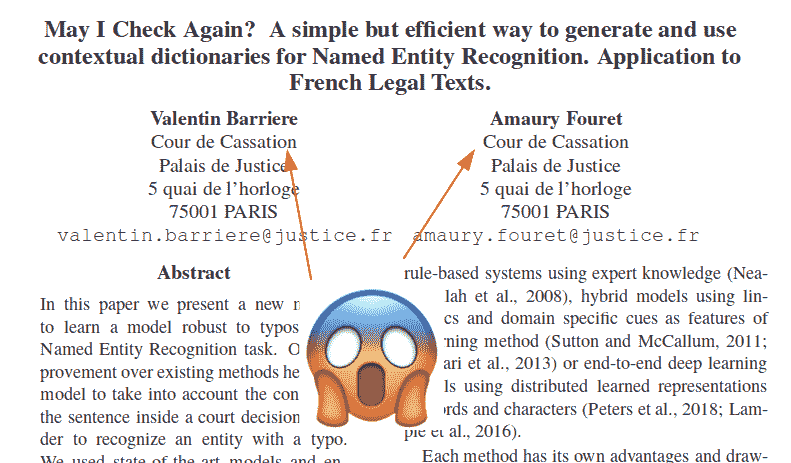
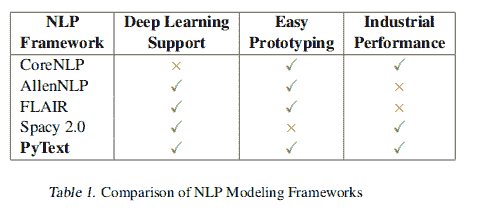
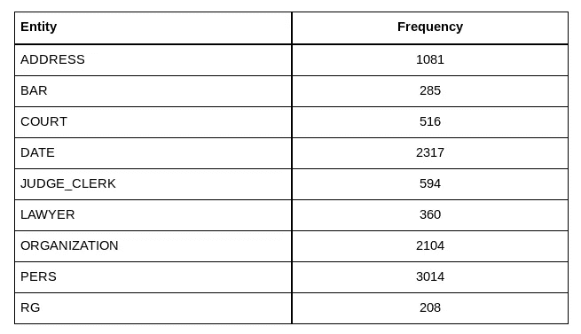
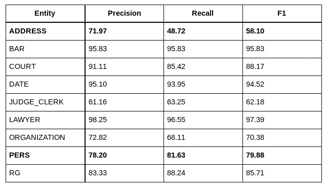
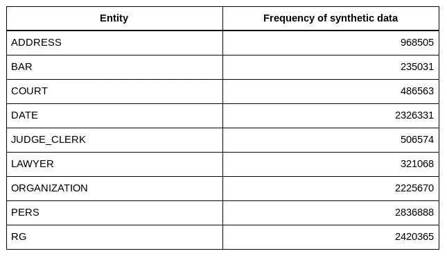
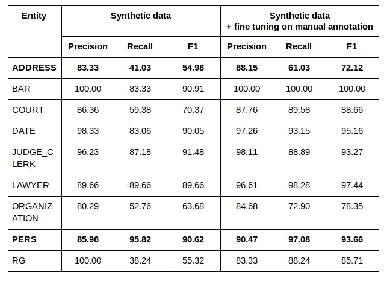
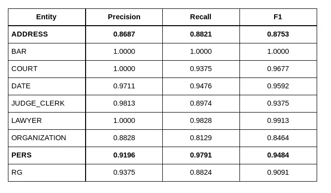

# 为什么我们从 Spacy 转向 Flair 来匿名化法国判例法

> 原文：<https://towardsdatascience.com/why-we-switched-from-spacy-to-flair-to-anonymize-french-legal-cases-e7588566825f?source=collection_archive---------8----------------------->

## …以及为什么您应该经常审视自己的选择

#anonymization #ner #spacy #flair #legal #gdpr #opensource

**本文详细介绍了我们与法国行政部门(**[**【DINSIC】**](https://www.numerique.gouv.fr/dinsic/)**)和法国最高法院(**[**Cour de cassation**](https://www.courdecassation.fr/)**)围绕两个知名实体识别(NER 以下简称)库、** @ **spacy 和 Zalando**[**Flair**空间精度对我们的需求来说太有限了，而且速度太慢了。最后，我们对 Flair 进行了优化，直到推理时间除以 10，使其足够快，可以匿名化大量的法国判例法。我们方法背后的主要思想描述如下。****](https://github.com/zalandoresearch/flair)

我在 Lefebvre Sarrut 出版社工作，这是一家出版公司，是欧洲法律行业的主要参与者。除此之外，我们还发布包括法国在内的许多国家的法律案例。由于隐私保护法(GDPR 和一项与判例法相关的法国法律)，我们必须删除出现在判决中的自然人姓名。为了自动化这个过程，我们在我们的注释数据上训练了一个专用的 NER 模型。

这个任务有几个选项，2 个开源库，每个实现不同的选择，意味着不同的权衡，已经被探索: [Spacy](https://spacy.io/) ，是非常好的工程和文档，它主要针对机器学习产业化，在经典 NER 数据集中具有无与伦比的速度和体面的准确性，以及 [Flair](https://github.com/zalandoresearch/flair) 来自 [Zalando Research](https://research.zalando.com/) 是一个开源库，旨在达到 NER 的艺术水平，模块化足以轻松集成所有类型的 NLP 演进，但已知速度较慢。

> *如果你对这个话题感兴趣，在推特上关注我:*[*https://twitter.com/pommedeterre33*](https://twitter.com/pommedeterre33)

一年前，我有机会帮助建立一个基于空间的匿名系统。我花了 1 个半月的时间来提高它的准确性。

几个月后，法国最高法院(Cour de cassation)在法国行政部门 IT 部门的帮助下开始着手这项工作。在法院、法国政府和 Lefebvre Sarrut 集团看来，讨论我们各自对这个问题的看法显然是有意义的。

为了[合作](https://www.etalab.gouv.fr/la-mission-etalab-et-le-groupe-lefebvre-sarrut-collaborent-accelerer-louverture-des-decisions-de-justice)我们开始讨论我们遇到的挑战，我们如何解决它们，我们使用开源作为平台来分享我们的工作。

在考虑了几种选择后，最高法院的数据科学家最终决定将他们的工作建立在天赋的基础上。在我们这边，自从开源发布以来，我们的需求不断发展，我们得到了不同来源的案例法和更多的语言来支持。因为，如下所述，我们的 Spacy 解决方案不适应，我们还尝试了 Flair。我为此工作了 1 个月，主要是为了减少推断时间。

另一方面，法国最高法院致力于利用 Flair 模型的模块化设计来提高其准确性，这不在本文的讨论范围之内。他们通过更好地利用整个数据集的知识，而不是仅仅在句子层面上工作，实现了 32%的错误率下降！更多关于 [Valentin Barriere，Amaury Fouret 的信息，“我可以再检查一次吗？—为命名实体识别生成和使用上下文词典的简单而有效的方法。适用于法国法律文本”，2019](https://arxiv.org/pdf/1909.03453.pdf) 。

**Have you ever read a NLP paper from a national supreme court?** [**Here**](https://arxiv.org/pdf/1909.03453.pdf) **is your chance :-)**

根据我们与法国政府的协议，我们基于 Spacy 的代码从去年开始[开源](https://github.com/ELS-RD/anonymisation)(并且已经更新到最新的 Spacy 版本)，我们在 Flair 上的工作已经合并到 master branch 上(将包含在下一个 PyPi 版本中)。

本文试图总结这两部作品和我们的发现。

**TL；**博士在 NER **对我们的数据**的开箱即用空间准确性太低(不符合我们的要求)，随着时间的推移和具体的工作，我们大大改善了它，但这个项目是专门针对判例法库存(即上诉法院)。此外，我们在比利时、西班牙、荷兰等地的同事。无法轻易从中获益。在我们的数据上，天赋的开箱即用准确性比空间**好很多，即使在我们对空间进行改进之后也是如此(例如 F1 在地址上有 15 分的差异)。然而，这个库比 Spacy 慢。将它应用于我们的法国上诉法院案件清单，在一个最近的 GPU (Nvidia 2080TI)上需要花费近 30 天的时间。**

> **没有修改模型(及其准确性)，也没有增加分布式计算的复杂性或成本，而是“仅仅”通过改进执行计算的方式，推理时间被除以 10****【1】**(对于 100 种情况，从 1mn 16s 到 11s)。

完整的库存处理不到 3 天，而不是 30 天。3 天的处理是我们一年可以执行 1 到 2 次的事情(当模型显著改进时，例如因为更多的注释数据)。我们的 Spacy 模型依赖于 AWS lambda**【2】**，使得推理速度成为一个无关紧要的问题。

我们认为这些结果很有趣，因为 Flair 有时被描述为不符合“工业性能”的库，例如下表中来自脸书论文 [Ahmed A .等人的“PyText:从 NLP 研究到生产的无缝路径”，2018](https://arxiv.org/pdf/1812.08729.pdf) 。另一方面，斯帕西得益于一个非常好的形象，应该只是稍微低于 SOTA，但速度却是无与伦比的。然而，**根据我们的法律数据**，Spacy 分数低于我们的要求。

**Table extracted from the PyText paper comparing several NLP “framework”**

你有时在机器学习博客或 Twitter 讨论中看到的隐含想法是，有一些权衡(不，不是偏差/方差):你需要在准确的模型(想想像 Bert 这样的大型语言模型)和速度之间做出选择。我们认为，这种陈词滥调在必要时可能会受到挑战。

> 天下没有免费的午餐，但是有时候，如果你足够努力，你可以得到免费的甜点:-)

我们在这里使用的数据集由 100 个人工标注的判断组成，每个实体的出现频率为:

Entity frequencies in our manually annotated dataset

关于与每个命名实体相关的困难的几句话:

*   自然人姓名( **PERS** )是要检测的最重要的命名实体。**律师**和法官(**法官 _ 书记员**)的名字被检测出来是因为我们需要避免对他们进行匿名，所以是为了提高 **PERS** 上的 NER 精度。
*   **地址**是第二个要删除的最重要的实体。检测它们是相当棘手的，因为在这个单一类别下，您会发现各种各样的东西，包括街道名称、城市名称、建筑物名称、监狱名称以及许多其他本地化名称。对这个世界有一些了解(通过维基百科上预先训练的嵌入或预先训练的语言模型)对这一类很有帮助。
*   **组织**也很难找到，它包括有时与自然人姓名相同的公司名称，有时看起来像本地化，或者只是一个普通名词等。由于法官使用大量的大写单词，需要一种上下文理解。来自维基百科的常识可能还不够。
*   **酒吧**名称、**法院**和**日期**都比较容易抓，几个正则就有很高的召回率。

最后，这些数据具有挑战性，因为它们包含许多错别字(包括空格错别字，其中两个单词合并成一个)，名称可能看起来像名词(缺少大写字母)，在同一个句子中，您可以有两次相同的文本，首先设计一个自然人，然后设计一个组织，等等。

> 这些判断是真实生活中的数据，比大多数经典的 NER 数据集更脏。

这个案件目录(上诉法院)并不是最难匿名的，但是我们在 Spacy 上的工作只适用于它。我们限制为 100 个判决，因为它代表了我们在 Lefebvre Sarrut 的一些法院的人工注释案件的数量(我们每个来源有 100 到 600 个案件)。

在要建立数据集的工业应用中，**注释可能代表项目**成本的很大一部分。这就是为什么我们使用的模型不需要成千上万的数据点来达到我们的要求，这对我们来说很重要。

在所描述的工作中，两个算法都使用了默认的超参数，因为两个库都应该使用它们来提供良好的结果。

**Flair 是模块化设计**，这意味着您可以选择您想要使用的表现形式。Zalando Research 分享了许多模型，我们使用了 Zalando Research 论文 [Akbik A .等人在 2018 年](https://alanakbik.github.io/papers/coling2018.pdf)发表的“用于序列标记的上下文字符串嵌入”中描述的组合:FastText 嵌入(在法语维基百科上训练)和基于字符的预训练语言模型(在法语维基百科上训练)的组合。没有对法律数据的语言模型进行微调。

对于 Spacy 来说，没有现成的可以下载的法语预训练**通用**语言模型。有一个特性是存在的，但是还没有关于它的 Python API 的很好的文档。在网站上，有一些称为“语言模型”的文件，但这里使用的表达是指已经为一个特定的任务模型(NER，分类等)进行了训练。).不幸的是，我们进行的快速测试显示，使用法国预训练的 NER 模型，我们的法律数据的结果真的很差。

对于本文的其余部分，数据的分割是这样进行的:训练(80%)，测试(20%)，没有使用专用的开发集(它是训练集的一部分)，因为根本没有模型超参数调整(只是在训练期间提前停止，它应该不会对我们的发现产生太大影响)。

测量由每个库自己完成。

我们使用的是 Spacy 的最新版本(Spacy 团队于 2019 年 8 月发布的 V2.1.8)和 Flair 的 master branch(截至 2019 年 9 月 24 日的 commit [899827b](https://github.com/zalandoresearch/flair/commits/899827ba9893a4b94677eb2348d4ffddd63adf47) )。

> *下面，我们仅发布与我们的上诉法院案例法清单相关的结果，但我们在我们拥有的每个法律案例清单上观察到 Flair 和 Spacy 之间的相同差异(有时更强)(有些案例有 6 倍多的人工注释判决)。*

首先，我们描述我们的工作，以提高空间的准确性，然后我们解释我们如何使 Flair 快 10 倍。

# 1.在空间感和天赋准确性上下功夫

已经运行了针对训练数据集的不同经验来提高空间准确性。

## 1.1 空间+手动注释的数据

在该设置中，我们仅使用手动标注的数据(100 个法国判断)。没什么特别的，数据被每个库转换成期望的格式，并且，如上所述，使用默认参数进行训练。

Spacy on the manually annotated dataset

**开箱即用的结果很低:该模型在最重要的实体上不符合我们的预期**(召回 90%的自然人姓名和 80%以上的地址)。

> 有趣的是，黑石项目(BlackStone project)报告称，英国判例法中的 Spacy 在 NER 的得分“很低”。他们正在努力增加数据集的大小，看看空间行为是否与我们得到的相似将会很有趣。

大多数错误是大写的单词，当它们只是专有名词甚至普通名词时，被视为实体，任何数字组合看起来都像算法的判断标识符，等等。**对我们来说，Spacy 似乎对数据进行了欠拟合，可能是因为与任务的复杂性相比，数据集太小了。**

然而，这种算法在有更多数据的情况下能走多远还不清楚。值得注意的是，Spacy 有一个非常原始的内部设计(面向时间性能)，比传统的 CRF 更接近于依赖解析器。据我所知，还没有文献用不同种类的数据来研究这种设计的性能。

> **推理在 1 个 CPU 核上耗时 25 秒**！

与我们之前为此任务尝试的其他解决方案相比，这是一个很好的时机。在下面的其他体验中，Spacy 推断时间是稳定的。空间内存足迹使得在 AWS Lambda 中加载模型成为可能。

## 1.2 空间+人工注释数据+合成数据

为了提高准确性，我们试图生成大量的合成数据，对它们进行训练，最后对人工注释的数据进行微调。

想法如下:对于简单的模式，基于规则的捕捉实体的方法很容易编写。为了捕捉更复杂的模式，您倾向于添加更多的规则，然后整个事情开始变得既缓慢又难以维护。

例如，使用像" *Mr [A-Z][a-z]+* "这样的正则表达式很容易在句子中找到一个名字。然后你需要捕捉前面没有 Mr 的名字，以及没有大写字母的名字，等等。直到你的正则表达式太复杂而无法修改。

> **然而，生成复杂合成数据的难度远低于捕捉真实命名实体。**

以一个简单句型的现有句子为例，“嗨，马丁先生，你好吗？”，计算整个实体(Mr. Martin)的偏移量，然后在实体内搜索“Mr .”并将其删除。现在的句子是“嗨，马丁，你好吗？”。想要更努力学习数据点:去掉大写(嗨马丁，…)等。现在，你有了不同复杂程度的新数据点来为你的机器学习模型提供信息。

这是我们方法背后的主要思想，唯一的区别是我们为几种实体添加了大量复杂的数据生成器(如果您感兴趣，可以查看我们的 [repo](https://github.com/ELS-RD/anonymisation) 的自述文件)。这并不是一个原创的想法，最近推荐系统行业的著名人物 [Xavier Amatriain](https://medium.com/u/dfc102dddf47?source=post_page-----e7588566825f--------------------------------) 、[写了](https://medium.com/@xamat/data-as-prior-innate-knowledge-for-deep-learning-models-23898363a71a)关于同样的方法。

对我们来说，这种方法的目的是试图获得两个世界的最佳结果:高精度和低推理时间。

我们在完整库存的子样本上生成了数百万个实体。然后，我们对它们训练了一个模型，并根据人工注释的数据对它进行了微调。

Frequencies of the generated named entities

我们的结果如下:

Comparison of results of learning based on synthetic data, without and with manually annotated data

我们注意到最重要的匿名实体(人)的质量有了很大的提高:召回率+15 点。地址离我们的要求还是太远了。

我们仍然可以添加规则，但是这种方法的缺点是不够通用。如果我们想转换语言，或在另一个法庭工作，我们需要编写新的规则或修改现有的规则。

> 我们已经用编程和维护源代码的成本交换了手工注释的成本。

基本上，这种方法产生了很高的技术债务，但是提供了质量上的显著提升。

我们还尝试在 Spacy 中提取 Flair 预测(使用 Flair 和 pretrain Spacy 生成一个非常大的数据集)，它不断提供性能提升，但结果质量低于合成数据方法。一个可能的原因是合成数据模式更容易被空间捕获。

## 1.3 Flair +预训练 LM +手动注释数据

Flair 提供了一个模块化框架。例如，你可以决定你想要如何表示每个单词，在快速文本嵌入(维基百科训练的)、基于预先训练的字符 LSTM 的语言模型(维基百科训练的)、所有新的 transformer 材料(Bert、XLnet 等)之间进行选择。)由来自多产的 HuggingFace 团队的时髦的 [Transformer 库](https://github.com/huggingface/pytorch-transformers)提供，或者甚至是一个简单的未经预训练的基于字符的表示，如在 [Lample G .,“命名实体识别的神经架构”，2016](https://arxiv.org/abs/1603.01360) 等中。

按照 Zalando 论文描述的 SOTA 方法，我们使用了在法语维基百科上训练的快速文本嵌入和在法语维基百科上训练的 Flair 语言模型。

如前所述，我们保留了默认的超级参数，没有进行语言微调。根据最高法院的文件，这样的微调应该会给我们带来+1 点的准确度。

结果如下:

Flair scores on the manually annotated dataset

与空间相比，分数非常高，超过了我们的要求，甚至超过了我们的期望。

推理在我们的 Nvidia 2080 TI GPU 上使用已发布的 Flair 0.4.3 版本进行 **1mn 16s** 。然而，公平地说，我们应该记住，还有 Zalando 研究团队在他们的 V100 上完成的语言模型的训练(准备下载),在某种程度上，包括训练 FastText 所花费的时间。

计时已经测了几次，稳定，在秒级。

如前所述，我们的法律案件清单很大，这种时间安排是不可接受的，这就是为什么我们花了一些时间在推理时间上。

# 2.让天赋快 10 倍！

正如已经说过的，天赋比空间慢。

下面我们解释一下用于减少推理时间的主要策略。如果你想检查代码，获得更长的描述或者甚至在时间上有所改进，我们提供了原始 PR 的链接。

这些措施已经用 c profile**【3】**执行。需要记住的重要一点是 PyTorch 主要是异步的。正因为如此，如果不采取任何措施来处理异步计算，一些操作将会显得非常慢，因为它们需要同步(大多数 CPU ⇔ GPU 传输，一些张量复制等)。).为了避免假慢操作，你需要先设置 *CUDA_LAUNCH_BLOCKING=1* 。

## 2.1.又老又迟钝的 a .维特比教授

> [https://github.com/zalandoresearch/flair/pull/1038](https://github.com/zalandoresearch/flair/pull/1038)
> 
> [https://github.com/zalandoresearch/flair/pull/1053](https://github.com/zalandoresearch/flair/pull/1053)

使用 cProfile，我们注意到 Viterbi 算法花费了大部分时间。Viterbi 算法是 CRF 算法的关键部分，即使在基于深度学习的 NER 中，CRF 也可以带来很大的改进(在我们的情况下，禁用 CRF 会使 micro F1 降低 6 个点，这与 Lample 论文中描述的关于德国 CONLL 数据集的效果降低类似)。

Flair Viterbi 实现的源代码是 PyTorch 官方网站[页面](https://pytorch.org/tutorials/beginner/nlp/advanced_tutorial.html)。维特比算法的描述可以很容易地找到，但是概括地说，它的目的是当标签之间存在相关性时，为序列找到最可能的标签组合。它的工作方式需要中间状态，这使得这项工作更加复杂。

该实现非常容易阅读、理解和调试，但是没有经过很好的优化。

为了减少推理时间，我们做了两件事:

*   通过将维特比部分的计算从图形处理器转移到中央处理器，推理时间减少了 20%。基本上，我们几乎只是把*叫做【CPU】*方法。这可能令人惊讶，但如果你看看代码，你很快就会明白 GPU 不是很有用，加上一些操作是从 GPU 到 CPU 进行许多小的内存传输，而不是一个大的；
*   在 Numpy 中重写 Viterbi 部分并对尽可能多的操作进行矢量化，将优化时间缩短了 40%。

矢量化基本上是用矢量运算替换 for 循环的过程。时间的减少是因为两件事，第一，您限制了 Numpy 内部 C 和 Python 端之间交换信息的需要，第二，因为 Numpy 在连续的内存块上工作，并且可以进行一些计算优化，包括例如 [SIMD 运算](https://github.com/numpy/numpy/blob/master/numpy/core/src/umath/simd.inc.src)(在一个 CPU 内核上的并行化)。

另一个有趣的优化是利用广播。在计算过程中，我们需要向矩阵的每一列添加一个向量。在优化之前，该向量被复制足够多次，以获得与要添加的矩阵相同的形状。广播是一种避免创建新矩阵(及其内存副本)的方法，通过 C 部分的 for 循环让 Numpy 模拟它的存在。简单实用的小窍门。

总而言之，随着对单个函数的重写，计时几乎被缩短了一半。

## 2.2 克隆人的攻击()

> [https://github.com/zalandoresearch/flair/pull/1074](https://github.com/zalandoresearch/flair/pull/1074)
> 
> [https://github.com/zalandoresearch/flair/pull/1089](https://github.com/zalandoresearch/flair/pull/1089)
> 
> [https://github.com/zalandoresearch/flair/pull/1095](https://github.com/zalandoresearch/flair/pull/1095)

当您对张量进行子集化时，新的张量会获得指向原始存储层张量(内存中包含数据的“简单”数组)的指针。这就是为什么操作几乎不需要时间，新对象只是由偏移和步幅信息组成。

调用 clone()会生成存储层的真实副本，从而使操作慢得多。

在训练和推理过程中，为该批每个句子的每个字符计算一个表示。我们唯一感兴趣的字符是每个标记的开头和结尾(Flair 语言模型是双向的)。

在训练期间，有几个纪元，计算每个令牌表示需要时间，所以我们希望将它们保存在内存中。为了避免内存溢出异常，我们需要克隆我们想要保留的字符表示，并删除原来的大矩阵，其中仍然存储着所有不必要的字符。

在推理过程中，事情是不同的，我们可以在计算过程中在内存中保存完整的矩阵，并在批处理结束时丢弃所有的表示。这样，我们避免了调用 clone()及其缓慢的内存复制，并获得了显著的速度提升。

## 2.3 永远不要忘记！

> [https://github.com/zalandoresearch/flair/pull/1084](https://github.com/zalandoresearch/flair/pull/1084)

Flair 语言模型是基于上下文的，这意味着标记表示依赖于其上下文，因此没有简单的方法来在共享一些标记的不同句子之间循环使用它们。这不是静态的快速文本嵌入的情况。

由于 GPU 内存有限的原因(在 Flair 上，您可以同时使用大量的令牌表示)，它们没有预加载到 GPU 内存中，因此对于每个令牌，我们从 CPU Ram 中提取其表示，并将其移动到 GPU RAM 中。你可能已经猜到了，记忆转移需要时间，我们不喜欢他们。

由于 [Zipf 定律](https://en.wikipedia.org/wiki/Zipf%27s_law)，很少的令牌代表大部分传输，所以我们只设置了一个简单的 LRU 缓存，在那里我们存储了 10000 个已经移动到 GPU 内存的 FastText 张量。简单高效:我们几乎获得了整个 GPU 负载的性能，而只占用了一小部分内存。

## 2.4 懒于快

> 【https://github.com/zalandoresearch/flair/pull/1093 
> 
> [https://github.com/zalandoresearch/flair/pull/1130](https://github.com/zalandoresearch/flair/pull/1130)

为了表示令牌，我们同时使用了 FastText 和 Flair 语言模型(您可以自由添加更多)。Flair 语言模型非常强大，但当上下文是新的时，它就不太好用了。在这些情况下，快速文本嵌入会带来更多有用的信息。

为了合并两种表示的知识，我们只是在标记级别将它们连接起来。

稍后，我们在句子级别连接每个标记表示，并且每个句子表示被连接在一起以获得批量表示。

这里的主要思想是通过尽可能的懒惰来避免内存复制，并且只在进程的最后执行一次连接。

## 2.5 杂项

其他几个 PR 已经集中在一些操作(分离、设备检查等)呼叫减少上。)，或者只是修复 bug。它们没有列出，因为非常具体的项目源代码和相当无聊。

> [https://github.com/zalandoresearch/flair/pull/1022](https://github.com/zalandoresearch/flair/pull/1022)
> 
> 【https://github.com/zalandoresearch/flair/pull/1142 号
> 
> 【https://github.com/zalandoresearch/flair/pull/1031 

还做了一些工作来改进 API，例如使其易于使用第三方 tokenizer(如速度极快的 Spacy one)，或更易于使用 NER 可视化模块(主要受 Spacy 的启发)。

> [https://github.com/zalandoresearch/flair/pull/1068](https://github.com/zalandoresearch/flair/pull/1068)

当 CRF 不用于大的性能增益时，矢量化优化也被应用于推理。这对我们的项目没有影响，因为我们使用的是通用报告格式。

## 2.6 未来的优化？

仍然存在剩余的机会，例如在维特比算法上。问题是如何接触到他们。

例如， [Ray](https://github.com/ray-project/ray) 似乎是一个有趣的选项，通过仔细的批处理，我们可以将花费在 Viterbi 上的时间除以 4(剩余的 11 秒增加 1.5 秒)。为此，Ray 执行了非常智能的多处理，并利用 Reddis 和 Apache Arrow 在 CPU 内核上分配计算。如果由于某种原因 Flair 崩溃，Redis 服务器留在内存中，这不是超级酷。

另一种方法是通过 cytonize，但是现在，我还没有达到 Ray 的性能，而且这将意味着引入一种新的语言，使维护更加困难，释放轮子等等。值得吗？不确定。

在某个时候，当大多数低挂的果实已经被收集时，优化开始变得更加昂贵，也许是时候关注其他事情了。

此外，还有我们到目前为止还没有考虑的优化，那些影响模型本质的优化。正如多次编写的那样，Flair 是模块化的，可以使用几种语言模型，其中一些计算成本较低。更多的混合精度还没有被测试(有一个小错误要先修复)，但从我们的快速经验来看，NER 的改进似乎是有限的。

# 结论

本文的目的并不是以任何方式证明某个库优于另一个库。事实并非如此，Spacy 仍然更快，但上述优化使 Flair 成为我们用例的更好解决方案。

另一个值得强调的是 Flair 的模块化设计。在我看来，它在很大程度上被低估了，它有助于快速整合 NLP 领域的许多发展。

也许一个更深思熟虑的观点是工程在机器学习中是多么重要。尽管它对这个领域和它的大多数社区来说似乎并不那么重要。例如，在今年的 SIGIR 2019(主要的信息检索会议)上，在我参加的所有会议中，我只在商业搜索引擎研讨会上听说过性能和速度。

在过去的几个月里，不同的团队已经发布了几种基于蒸馏的方法，试图间接使用像 Bert 这样的大型模型。这种工作往往不会“累加”，几个月后就会被遗忘。

也许一些工程方面的工作会对社区有更多的好处。例如，像 [TVM](https://tvm.ai/) (一个多框架机器学习模型编译器)或 [Glow](https://github.com/pytorch/glow/blob/master/README.md) (一个 PyTorch 专用编译器)这样的项目可能会给当前和未来的模型带来巨大的性能增益，即使现在它仍然需要对框架内部的良好知识。他们确实应该得到社区更多的了解和支持。

**最后，我要感谢 Flair 背后的 Zalando 研究团队，特别是**[**@ alanakbik**](https://github.com/alanakbik)**，感谢他们的建议，感谢他们快速审核了许多 PR(并提供了足够的建议来改进它们)。**

**注意事项**

**【1】**在著名的公共数据集 CONLL 2003 上，推理时间在相同的 GPU 上被除以 4.5(从 1mn44s 到 23s)，优化效果的差异主要是由于法国判例法数据集中存在许多非常长的句子，使得一些优化更加关键。根据 Zalando 研究团队的测量，在强大的 Nvidia V100 上观察到了该数据集的相同改进。每个时间差异在每个 PR 的描述或注释中报告。

**【2】**顺便说一句，如果你正在考虑将 Spacy 放入 AWS lambda，请三思，lambda 冷启动很慢，需要小心管理…

我发现 Pycharm 的分析器 viz 非常有用。