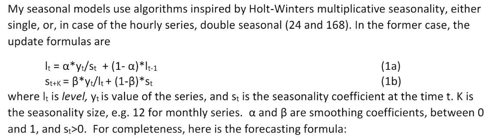
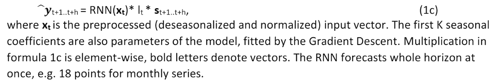

# 为什么我们在预测中毫无歉意地使用深度学习

> 原文：<https://towardsdatascience.com/why-we-unapologetically-use-deep-learning-in-our-forecasts-2923a5773073?source=collection_archive---------18----------------------->

许多观察数据科学领域机器学习接管的人开始警告深度学习算法的误用和过度使用。[从对深度学习的“黑箱”性质的担忧使模型难以解释或解释](https://www.wired.com/story/inside-black-box-of-neural-network/)、[到深度学习算法有效所需的大量数据](/three-reasons-that-you-should-not-use-deep-learning-15bec517b622)、[到怀疑深度学习方法可能已经达到极限的建议](https://www.forbes.com/sites/kalevleetaru/2019/04/18/deep-learning-and-the-limits-of-learning-by-correlation-rather-than-causation/#41bd94ae7487)、，最初对深度学习的大肆宣传推动了最近对人工智能的广泛兴趣，现在正让位于对实践的失望低谷。在 DemandForecasting.com，我们相信，只有通过在预测中利用深度学习方法，我们才能看到需求预测准确性的范式转变。

在神经网络(由旨在模拟人脑神经结构的节点组成的计算机化网络)中，数据通过一系列跨层转换从输入转换为输出。当输入和输出数据之间有许多层时，就说神经网络是深的。当机器学习应用于深度神经网络，使得模型的输出受到先前输出的质量的影响(即，从中学习)并被优化时，深度学习发生。

预测是一个特别适合使用深度学习模型进行改进的领域。从历史上看(直到过去 18 个月)，主要的预测竞赛已经抛出了一个有点令人惊讶的发现，即复杂的模型不一定比简单的模型更准确，特别是在预测一组一般的时间序列时。直到去年，在世界上最著名的预测比赛 M 竞赛(M 代表比赛的组织者和预测行业的教父 Spyros Makridakis)中，这是一个既定的逻辑，最近一次比赛的基本模型是 2000 年的 M3 比赛，由三种常见的指数平滑方法( *Comb* )组成，胜过所有更复杂的参赛者(只有一个例外，它只是刚刚击败 *Comb* )。一次又一次，计量经济学家和预测从业者不得不夹着尾巴回家，因为他们知道他们复杂的预测方法不如基本方法。

这一切都在 2018 年发生了变化，当时举办了第四届 M 比赛，被恰当地命名为 M4 比赛。其中，17 个模型的表现超过了 Comb 基准，大多数模型都以某种方式利用了机器学习。排名前两位的车型分别以 6.6%和 9.4%的优势击败了*和*。两者都利用深度学习来做到这一点。

[第二个表现最好的模型是由莫纳什大学的预测专家 Rob Hyndman](https://robjhyndman.com/papers/fforma.pdf)与 Pablo Montero-Manso 和 George Athanasopoulos 一起开发的(hynd man 在 2005 年至 2018 年期间编辑了《国际预测杂志》)。Hyndman 的模型有效地采用了九种合理的常见时间序列方法(所有方法都可以通过 R 预测包获得)，并将它们组合起来生成一个预测。一种被称为梯度推进(一种决策树)的机器学习技术被用来计算每个时间序列的九个模型中每个模型的优化权重。在使用梯度推进方法时，Hyndman 能够利用传统时间序列方法没有利用的数据的外围特征。他还能够预测每个时间序列的最佳时间序列模型，并利用这一知识优化每个模型的权重。

**hynd man 等人的方法论:**

1.  将数据集拆分为训练数据集和测试数据集。
2.  将九个时间序列模型中的每一个应用于训练期，并在测试期的 100，000 个时间序列中的每一个上为九个模型中的每一个生成预测。
3.  计算训练期间时间序列的一组特征。
4.  根据训练期间每个时间序列模型预测的实际损失，计算测试期间每个预测的预测损失(误差项，在这种情况下是平均绝对比例误差和对称平均绝对百分比误差的平均值)。
5.  创建每个时间序列的一组特征(例如，时间序列的长度、趋势强度、时间序列的季节性强度、时间序列的集中性、与时间序列的自相关和偏自相关函数相关的其他特征)。
6.  训练梯度推进模型以优化每个时间序列的权重，从而最小化损失函数(使用时间序列的预测损失和特征)。
7.  通过组合预测期的时间序列模型预测和使用预测日期的时间序列特征由训练的梯度推进模型生成的每个模型的权重，对预测期进行新的预测。

竞赛的获胜者，优步实验室的 Slawek Smyl 在其解决方案中进一步关注深度神经网络，开发了一种混合模型，该模型将指数平滑模型(在这种情况下，是具有乘法季节性的 Holt-Winters 方法)与混合模型中的递归神经网络相结合。根据 Smyl:

*Description of Slawek Smyl’s winning entrant to the M4-competition*

这允许在提取时间序列特征(特别是季节性)时跨时间序列的交叉学习。最终，这种方法远远超过了基准。

这只是预测从业者越来越多的观点中的一个最近的数据点，我们只是刚刚到达一个拐点，在不久的将来，深度学习方法将主导预测应用的其他方法。以下是我们认为基于深度学习的预测方法将成为严重预测问题的事实标准的八个原因:

1.  许多经典的时间序列模型是专门为预测而开发的。相反，关键的深度学习模型已被开发用于通用目的，并因其强大而适应用例。RNNs(由于其处理序列数据的能力)和梯度推进方法最近被证明对于预测目的是有用的，但是仍然具有固有的弱点。例如，即使是 rnn 也倾向于过度计数/过度平均早期数据，未能说明最近的数据往往比历史数据更有用，这是时间序列数据的一个特点。随着深度学习模型的开发考虑到时间序列预测，它们在此用例中的性能将会提高。
2.  我们刚刚看到 DNN 模型开始超越经典模型。随着这些发现成为既定的经验事实，更多的商业和学术兴趣将转向改善 DNN 预测。我们最近已经看到基于商业 ML 的预测模型开始量产，从 Smyl 的模型([被优步](https://eng.uber.com/m4-forecasting-competition/)使用)到[脸书的 Prophet 模型](https://research.fb.com/prophet-forecasting-at-scale/)和[亚马逊的 DeepAR 模型](https://docs.aws.amazon.com/sagemaker/latest/dg/deepar.html)(以及最近[亚马逊发布的 GluonTS 包](https://aws.amazon.com/blogs/opensource/gluon-time-series-open-source-time-series-modeling-toolkit/))。
3.  dnn 只是在横截面水平上具有更强的解释外围特征和数据的能力，或者在进行预测时利用来自其他时间序列的信息，增加了模型的预测能力。
4.  在预测中，简单平均模型的能力已被证明是一种非常有效的方法，可以提高平均预测的准确性，并超越单个组件模型，类似于使用中心极限定理或使金融投资组合多样化的好处。DNNs 可以用来改进这一发现，通过以比简单的平均方法更复杂的方式对集合中的不同模型进行加权。DNNs 将预测误差与时间序列特征相关联的能力提高了它这样做的能力。
5.  DNNs 随着时间学习。随着 dnn 的继续使用，它们从历史预测的质量中学习，这些预测可用于预测它们的误差，然后可以优化掉这些误差，这是传统预测技术通常不考虑的二阶问题。
6.  与传统方法相比，DNNs 需要更少的数据来提供准确的预测。部分由于能够利用周围的数据，部分由于 DNNs 的感应能力，DNNs 比传统的时间序列预测技术需要更少的来自单个时间序列的数据来做出准确的预测。这在处理小数据集时很有用，但也有助于专业人员修剪大数据集，从而节省计算能力。
7.  dnn 能够以概率的方式进行预测，并且仅提供点预测或预测区间。这也可以用于 DNN 的各个层面，以提供概率预测。当使用现实世界用例的预测时，从业者可以看到概率加权的结果，这可能会影响决策。传统方法下的概率预测使用太多的计算能力而不可行。
8.  复杂的统计方法只能在特定的环境下使用，或者当数据以特定的方式转换时使用。当数据没有被正确配置时，在统计模型中做出的假设可能被违反(通常对于从业者来说是无意的),这使得结果预测不准确，或者至少对它们提出警告。例如，统计方法很难处理稀疏或缺失值、包含负值的数据集，或者出现尖峰、违反错误假设或通常不稳定的时间序列的数据集。