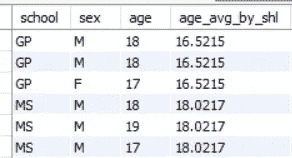
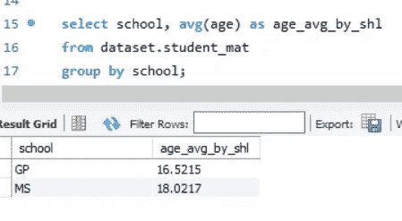
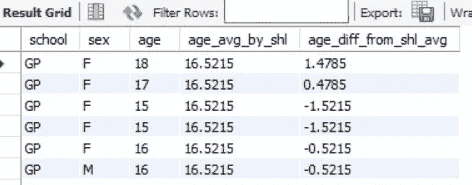
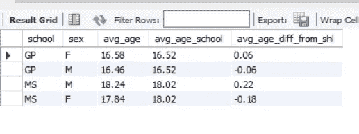
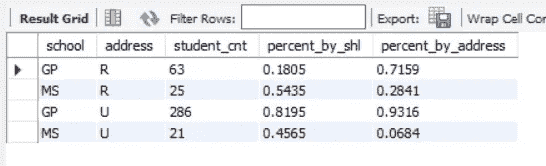
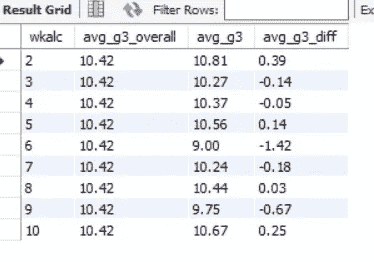
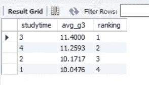

# 为什么 SQL 中的窗口函数如此重要，你应该马上学习它

> 原文：<https://towardsdatascience.com/why-window-function-in-sql-is-so-important-that-you-should-learn-it-right-now-1274b6096a86?source=collection_archive---------8----------------------->

## 在你下次面试被问到之前，现在就学会它

在我的上一篇文章中，我提到我被多次问到如何使用一个窗口函数。在掌握它之后，我确信我应该更早地学习，因为它可以帮助我通过 SQL 进行更深入的分析。

> 我上一篇关于使用 SQL 进行数据分析的文章

[](/how-to-use-sql-to-perform-data-analysis-house-property-sales-time-series-bf36cd3c2528) [## 如何使用 SQL 进行数据分析(房产销售时间序列)

### 回到 basic，使用 SQL 从数据集中获取所有必要的信息

towardsdatascience.com](/how-to-use-sql-to-perform-data-analysis-house-property-sales-time-series-bf36cd3c2528) 

与会减少行数的 group by 函数不同，window 函数可以在不减少行数的情况下对每一行执行聚合。有许多不同的窗口功能。但今天我将告诉你如何使用窗口函数的基本知识，以及如何在你的数据分析中应用。

我今天将使用的数据集是从 Kaggle 获得的“学生饮酒量”中的“学生垫”。然后数据集存储在 dataset.student_mat 中。您可以从以下链接下载数据集:

[](https://www.kaggle.com/uciml/student-alcohol-consumption) [## 学生饮酒

### 下载数千个项目的开放数据集+在一个平台上共享项目。探索热门话题，如政府…

www.kaggle.com](https://www.kaggle.com/uciml/student-alcohol-consumption) 

一般来说，有两种类型的窗口函数；一个是内置函数，如 row_number、dense_rank、lag 和 lead 另一个是聚合，就像通常的聚合函数一样。对于窗口功能，有一个意义重大的关键词“过”。一旦注意到查询中有“over ”,就可以知道有一个窗口函数。

在第一部分，我将解释如何使用聚合窗口函数，因为我相信你已经有一些使用普通聚合函数的知识。在了解了窗口函数的基础知识之后，理解内置函数就更容易了。

1.  [聚合窗口函数](#e267)
2.  [内置窗口功能](#29d8)

## 聚合窗口函数

聚合窗口函数的基本语法是普通的聚合函数，但在 over 子句语句之后。这里我就用数据来论证。数据集中的前三列是学校、性别和年龄。现在你想知道每所学校中男女学生的年龄差异。然后就可以使用窗口功能了。

第一步是计算每个学校的平均年龄。这可以从“avg(年龄)over(按学校划分)”中获得。over 之前的第一部分与正态平均函数相同。over 之后的第二部分称为“partition by”子句，需要用括号括起来。“按学校划分”意味着选择学校中具有相同值的所有记录并进行计算。

```
select school, sex,age, 
avg(age) over (partition by school) as age_avg_by_shl , 
age - avg(age) over (partition by school) as age_diff_from_shl_avg 
from dataset.student_mat
```



age_avg_by_shl is not a constant in the whole column but varies by school.

16.5215 为学校相当于“GP”，18.0217 为学校相当于 MS 与学校正常平均函数组匹配。



因此，现在您可以计算每个学生与平均值之间的差异，就像 age_diff_from_shl_avg 在查询中执行的操作一样。



最后可以按学校和性别得出平均年龄差。

```
select school, sex, round(avg(age),2) as avg_age , round(avg(age_avg_by_shl),2) as avg_age_school, round(avg(age_diff_from_shl_avg),2) as avg_age_diff_from_shl
from 
(
select school, sex,age, avg(age) over (partition by school) as age_avg_by_shl , age - avg(age) over (partition by school) as age_diff_from_shl_avg 
from dataset.student_mat 
) a
group by school, sex
```



从现在你可以看出女性在全科医生中的年龄比男性大，但在多发性硬化症中却不是这样。

还有一栏地址显示学生是住在城市还是农村。然后你可以使用一个窗口函数，按学校和地区计算每个地区居住的学生的百分比。

第一步是通过聚合计算学校和地址的每个组合中作为通常组的学生人数。然后使用窗口函数计算每个学校和每个地址区域的学生总数。“sum(student _ CNT)over(partition by school)”将返回 GP 和 MS 的学生总数，而“student _ CNT/sum(student _ CNT)over(partition by address)”将返回城市和农村地区的学生总数。因此，您可以按学校和地址区域获得学生的百分比。

```
select school, address, student_cnt
, student_cnt / sum(student_cnt) over (partition by school) as percent_by_shl
, student_cnt / sum(student_cnt) over (partition by address) as percent_by_address
from 
(
select school, address, count(1) as student_cnt
from dataset.student_mat 
group by school, address
) a
```



所以你可以看出更多的全科医生学生生活在城市地区，而更多的理学硕士学生生活在农村地区。如果你发现一个学生住在城市地区，你几乎可以肯定这个学生来自 GP，因为超过 93%的城市学生在 GP 学习。这已经成为一种预测性分析，你可以用它来根据地址给学生分类。

聚合窗口函数的第三个示例稍微复杂一些。既然数据集叫“学生饮酒量”，当然要对其做一些分析。有两个分类栏“Dalc”和“Walc”显示工作日和周末的消费。然后，我们可以发现酒精消耗量是否会影响“g3”栏所示的最终结果。

为了简化，我将把两列加在一起，而不是把它们分开。然后计算 g3 的总平均值以及单个 g3 和 g3 的总平均值之间的差值。为了计算 g3 的整体平均值，这里我们不能使用 group by 函数，因为这样会减少行数。相反，我们使用 window 函数来获取结果并放入每一行。

语法“avg(g3) over()”的 over 之后的第二部分是空的，因为我们不需要对数据集进行分类。我们需要整个数据集来计算整体平均值。因此括号里面是空的。

现在，您可以计算每个 wkalc 组的平均差异。

```
select wkalc, round(avg(avg_g3_overall),2) as avg_g3_overall, round(avg(g3),2) as avg_g3, round(avg(g3_diff),2) as avg_g3_diff
from 
(
select (Dalc + Walc) as wkalc, g3, avg(g3) over () as  avg_g3_overall, g3 - avg(g3) over () as g3_diff
from dataset.student_mat
) a 
group by wkalc
order by wkalc
```



饮酒量和 g3 结果之间没有明确的关系。所以还是喝吧(？)

## 内置窗口函数

现在我希望你知道聚合窗口函数的基本用法。接下来我就说说内置的窗口功能。下面是 11 个内置窗口函数的列表:

CUME_DIST()，密集 _ 等级()，第一个值()，滞后()，最后一个值()，领先()，第 n 个值()，不完整()，百分比 _ 等级()，等级()，行数()

我就不详细解释了。您可以从以下链接获得详细信息:

 [## MySQL :: MySQL 8.0 参考手册::12.21.1 窗口函数描述

### 在以下函数描述中，over_clause 表示 over 子句，如第 12.21.2 节“窗口…”所述

dev.mysql.com](https://dev.mysql.com/doc/refman/8.0/en/window-function-descriptions.html) 

我将以 rank()为例演示如何使用它。

与聚合窗口函数类似，需要一个 over 子句语句。

从 1 到 4 有一个分类列“学习时间”。而且我们想知道学习时间是不是 g3 的一个因素。除了用 studytime 计算 g3 的平均值，我们还可以用 rank()来得到顺序。

在获得每个学习时间的 g3 的平均值后，我们可以使用平均结果按降序排列顺序。然后我们就可以排序排名直接得到对比。这种方法非常有用，尤其是当有许多组无法通过肉眼进行排序时。

```
select studytime, avg_g3, rank() over (order by avg_g3 desc) as ranking 
from 
(
select studytime, avg(g3) as avg_g3
from dataset.student_mat
group by studytime
) a
order by ranking
```



所以，学习越多，成绩越好，这仍然是事实。

PS:还有另外两个内置函数也提供排名，一个是 dense_rank()，另一个是 row_number()。区别在于当存在具有相同值的行时，它们如何返回等级。您可以通过以下链接了解更多信息:

[https://dev . MySQL . com/doc/ref man/8.0/en/window-function-descriptions . html # function _ rank](https://dev.mysql.com/doc/refman/8.0/en/window-function-descriptions.html#function_rank)

## 结局

掌握窗口功能可以为您提供更深入的数据分析，有时甚至可以帮助您执行预测分析。正如我在上一篇文章中所说的，掌握 SQL 是获得数据分析师职位的必要条件，窗口函数在面试中经常被问到(我不记得在面试中被问了多少次)。因此你也应该在读完我的文章后开始学习窗口函数。我希望你也能掌握它，并得到你梦想的工作。今天的文章到此为止。如果你喜欢它，请留下你的评论，给我一个掌声。并分享这篇文章让更多人知道窗口功能的重要性。下次见。