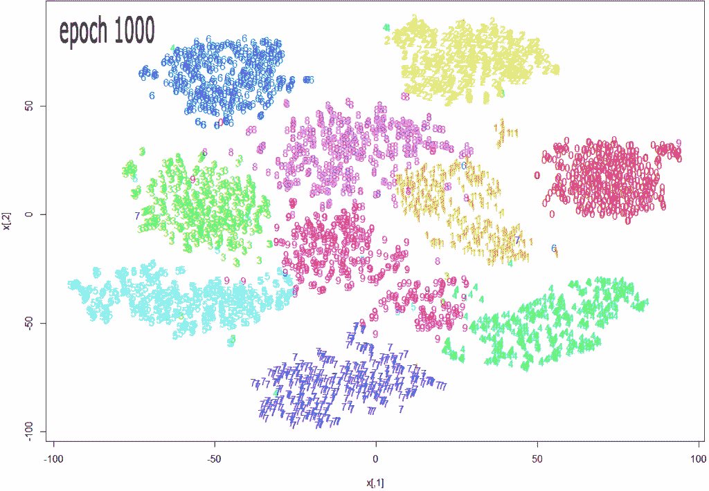
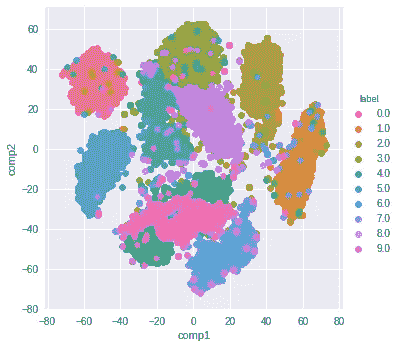

# 为什么你错用了 SNE 霸王龙

> 原文：<https://towardsdatascience.com/why-you-are-using-t-sne-wrong-502412aab0c0?source=collection_archive---------2----------------------->

## 以及如何避免常见的陷阱(带代码！)



Source: [https://datascienceplus.com/multi-dimensional-reduction-and-visualisation-with-t-sne/](https://datascienceplus.com/multi-dimensional-reduction-and-visualisation-with-t-sne/)

t-SNE 已经成为一种非常流行的可视化高维数据的技术。从深度学习模型的内层提取特征，并使用 t-SNE 在二维空间中绘制它们以降低维度，这是非常常见的。不幸的是，大多数人只是使用 scikit-learn 的实现**，而没有真正理解**结果和**曲解**它们的意思。

虽然 t-SNE 是一种降维技术，但它主要用于可视化，而不是数据预处理(就像 PCA 一样)。出于这个原因，你几乎总是用 t-SNE 把维数降低到 2，这样你就可以用二维来绘制数据。

t-SNE 常用于可视化的原因是，该算法的目标是获取高维数据，并在低维中正确地表示它-因此，在高维中接近的点在低维中应该保持接近。它以一种**非线性和局部的方式**实现这一点，因此不同区域的数据可以进行不同的转换。

t-SNE 有一个超级参数叫做**困惑**。困惑平衡了 SNE 霸王龙对数据的局部和全局方面的关注，并对结果图有很大影响。关于此参数的几点说明:

*   这是对每个点的近邻数量的粗略猜测。因此，越密集的数据集通常需要越高的困惑值。
*   建议在 5 到 50 之间。
*   它应该小于数据点的数量。

人们在 t-SNE 问题上犯的最大错误是只使用一个值来表示困惑，而不测试结果如何随其他值变化。如果在 5 和 50 之间选择不同的值会显著改变您对数据的解释，那么您应该考虑其他方法来可视化或验证您的假设。

还忽略了一点，由于 t-SNE 使用梯度下降，您还必须为您的学习速率和优化器的步骤数调整适当的值。关键是要确保算法运行足够长的时间来稳定。

有一篇关于 t-SNE 的非常好的[文章，讨论了以上大部分内容以及您需要注意的以下几点:](https://distill.pub/2016/misread-tsne/)

*   **在 t-SNE 图中你看不到聚类的相对大小**。理解这一点至关重要，因为 SNE 霸王龙会自然地扩大密集星团，缩小备用星团。我经常看到人们通过比较可视化中集群的相对大小来进行推断。不要犯这个错误。
*   t-SNE 图中分离良好的簇之间的距离可能没有任何意义。另一个常见的谬误。因此，如果你的“海滩”集群比“湖泊”集群更靠近“城市”集群，不要感到沮丧。
*   **一簇簇的点——尤其是具有小困惑值的点——可能只是噪声**。因此，在使用小的困惑值时一定要小心。并且要记住总是测试许多困惑值的健壮性。

现在——正如承诺的一些代码！这段代码的一些注意事项:

*   在运行 t-SNE 之前，我首先使用主成分分析将维数减少到 50。我发现这是很好的实践(当有超过 50 个特性时),因为否则，t-SNE 将永远无法运行。
*   我没有显示上面提到的各种困惑值。我将把它留给读者做练习。只需用不同的困惑值多运行几次 t-SNE 代码，并比较可视化效果。

```
from sklearn.datasets import fetch_mldata
from sklearn.manifold import TSNE
from sklearn.decomposition import PCA
import seaborn as sns
import numpy as np
import matplotlib.pyplot as plt # get mnist data
mnist = fetch_mldata("MNIST original")
X = mnist.data / 255.0
y = mnist.target # first reduce dimensionality before feeding to t-sne
pca = PCA(n_components=50)
X_pca = pca.fit_transform(X) # randomly sample data to run quickly
rows = np.arange(70000)
np.random.shuffle(rows)
n_select = 10000 # reduce dimensionality with t-sne
tsne = TSNE(n_components=2, verbose=1, perplexity=50, n_iter=1000, learning_rate=200)
tsne_results = tsne.fit_transform(X_pca[rows[:n_select],:])# visualize
df_tsne = pd.DataFrame(tsne_results, columns=['comp1', 'comp2'])
df_tsne['label'] = y[rows[:n_select]]sns.lmplot(x='comp1', y='comp2', data=df_tsne, hue='label', fit_reg=False)
```

这是结果可视化:



我希望这是一个关于如何更有效地使用 t-SNE 和更好地理解其输出的有用指南！

你也可以在这里找到这篇文章。

**加入我的** [**邮箱列表**](https://upscri.be/lg7gvt) **保持联系。**