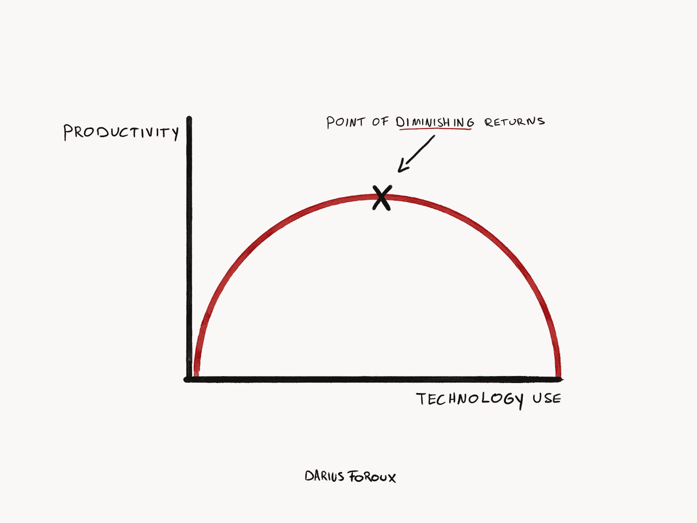
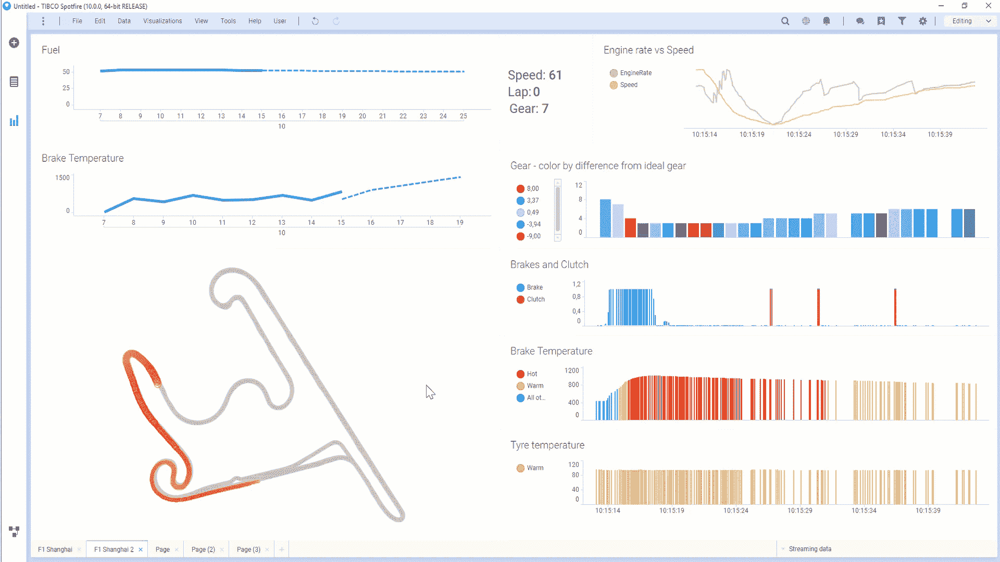

# 为什么您需要 Spark 的统一分析数据结构

> 原文：<https://towardsdatascience.com/why-you-need-a-unified-analytics-data-fabric-for-spark-c8b5d252cd0f?source=collection_archive---------16----------------------->

[Darius Foroux](https://medium.com/u/54163a1723f6?source=post_page-----c8b5d252cd0f--------------------------------), from [Why More Technology Does Not Equal More Productivity](https://medium.com/darius-foroux/why-more-technology-does-not-equal-more-productivity-4ad039a416d0)

*如何优化 Spark 进行分析而不降低工作效率*

Apache Spark 已经被大数据处理广泛采用。最初开发它是为了加速存储在 Hadoop 中的数据的 map-reduce 操作。今天，它仍然最适合于面向批处理的高吞吐量数据操作。

尽管 Spark 在继续改进，但它充其量仍是一个不完整的分析解决方案，特别是在涉及不断变化的数据的实时交互式工作负载时，这是 BI、数据科学和物联网应用程序所需的类型。

Databricks 和 AWS 等软件供应商通过简化大数据解决方案的整合来解决这一问题，内部 it 团队通常会在 Spark 上部署额外的数据管理工具。但是，正如 [Darius Foroux](https://medium.com/u/54163a1723f6?source=post_page-----c8b5d252cd0f--------------------------------) 指出的那样，[更多的技术并不等于更多的生产力](https://medium.com/darius-foroux/why-more-technology-does-not-equal-more-productivity-4ad039a416d0)。

缺少的一环是为 BI 用户、数据工程师和数据科学家优化 Spark 的方法，而不是在上面堆积更多消耗生产力的非 Spark 工具。

统一分析数据结构(UADF)解决了这个问题。它增加了对流和交易数据的支持，并针对闪电般的 BI、数据科学和物联网应用优化了 Spark。因为它是 Spark 的原生产品，所以您可以利用现有的人员技能、操作流程和工具。

> UADF 通过将 Spark 扩展为面向 BI、数据科学和物联网应用的闪电般快速的平台来提高生产力。

作为 TIBCO 的分析 SVP，我们看到我们的客户正在努力应对这一挑战。我们认为 [SnappyData](https://github.com/SnappyDataInc/snappydata) ，一个由 Gemfire 背后的[远见团队创建的 UADF，有助于克服 Spark 在分析方面的缺点。本文解释了它如何帮助您从 Spark 获得更多，同时提高您的工作效率。](https://www.snappydata.io/company)

## 什么是统一分析结构技术？

UADF 为 Spark 增加了对流、交易、机器学习和分析的支持。目标是为 Spark 增加四项功能:

*   Spark 数据的数据可变性和事务一致性
*   高并发性的跨用户和应用程序的数据共享
*   支持低延迟查询(例如，键值读/写操作)*和*高延迟操作(昂贵的聚合查询或 ML 训练作业)。
*   在高速交易更新数据的同时，畅通分析查询访问

## 为什么不直接用<insert-database-here>？</insert-database-here>

Spark 开发人员经常会问:“当我想对我的 Spark 数据进行 BI、数据科学和流处理时，我应该使用哪个数据库？”

答案往往是“视情况而定。”选项包括柱状商店(Vertica、Teradata、Redshift)、立方体类型商店(Jethro、AtScale、Kyvos)、以数据科学为中心的分析平台(Databricks)和 NoSQL 商店(Cassandra、MongoDB)。这些选择都有其优点，但是作为一个整体，它们都有类似的缺点:

*   他们添加了更多的工具来增加复杂性和降低生产力。
*   商业智能和数据科学工具很难针对世界上的每个数据库进行优化，从而导致性能不佳。
*   这些数据存储专门存储历史数据，而不是流数据。实时流数据是数字业务越来越重要的一个方面，例如物联网感知应用和自动算法系统。

## 为什么您需要统一分析数据结构

以下是您应该考虑使用统一分析数据结构的五个原因:

## #1:事务和流就像花生酱和果冻一样形影不离

越来越多的公司希望他们的所有数据都在一个地方——Spark——包括交易和物联网数据。

例如，一家能源公司使用 SnappyData UADF 在 Spark 中存储他们的交易数据、流数据和参考数据。它们存储实时物联网天气预报更新，以及来自 CRM 和运营系统的客户和设备维护记录。一个 BI 图表可以生成跨三个数据域的查询，例如:

> “根据实时天气预报数据，显示可能遭受财产损失的前 100 名客户，以及哪些客户最近没有得到维护。将这些数据放在地图上，这样我就可以决定下一个服务对象，并实时更新。”

如果没有 UADF，这种查询将需要复杂的 Spark 软件开发、定制数据集成，并且可能需要购买、安装和配置非 Spark 数据存储。

UADF 的技术扩展为 Spark 添加了近似查询、缓存和 MVCC，因此它可以同时处理所有这些数据域。所以 Spark 和你所有的数据一起更好，就像花生酱和果冻一样。

## #2:利用你所拥有的

要在 Spark 中使用 UADF，您只需下载、配置并运行即可。您可以利用您对 Spark 已经了解和喜爱的一切，包括您的数据、技能和基础设施。

而且，因为它是基于 SQL 的，大多数 BI 和数据科学工具“只需与 UADF 一起工作”。因此，您可以利用您在已经使用的 BI 和数据科学工具上的投资。

结果是，你提高了生产力，同时也[清理了你的技术结构](https://link.medium.com/1GUEKomJMU)。

## #3:快如闪电的商务智能

单就 BI 性能而言，统一分析数据结构令人叫绝。开箱即用的简单分析查询的性能是普通 Apache Spark 的 12 到 20 倍。你可以在这里亲自尝试一下。

例如，一家大型企业集团通过统一财务报告和税务数据，将 120 个 ERP 系统减少到 45 个，节省了数百万的基础设施成本，并减少了因税务报告延迟而导致的罚款。

一个 Spotfire pharmaceutical 客户使用它就是为了:提高他们 Spark 存储库的 BI 性能。

## #4:将流式商务智能与流式历史统一起来

流式 BI 是分析领域的一项最新创新。当附加到流数据时，它提供了[连续、实时的分析体验](/why-you-should-learn-about-streaming-data-science-2f603ad24aea)。这些成果首次将 BI 引入运营系统。

下面的例子显示了一级方程式赛车的 BI 流。当汽车在赛道上加速时，嵌入式物联网传感器会传输数据流。分析师看到汽车位置和数据的实时、连续视图:油门、转速、制动压力——可能有数百或数千个指标。通过可视化其中的一些指标，竞赛战略家可以看到静态快照永远无法揭示的东西:运动、方向、关系、变化率。比如分析监控摄像头。

Streaming Business Intelligence allows business analysts to query real-time data. By embedding data science models into the streaming engine, those queries can also include predictions from models scored in real time.

但是请注意图表上写着:“齿轮颜色与理想齿轮的差异？”给定当前的天气条件、赛车配置和这条特殊的赛道，分析师如何知道理想的档位是什么？这种比较可能需要深入的流历史，将当前状况与以前的比赛进行比较，甚至是几分钟前的练习圈；这些数据可以理想地存储在 UADF 中，以便与实时数据进行比较，并在以后用于深度学习和机器学习。

## #5:掌握数据的新机会

通过统一主数据管理、数据虚拟化和集成技术，Spark 可以成为完整数据管理平台的基础。通常，这些工具生活在他们的岛上；通过小心地连接它们，您可以更好地掌握企业数据。

## 统一分析数据结构走向全球

如果您已经接受了用于 BI、数据科学和物联网应用的 Spark，那么可能是时候了解一下 UADF 技术了。我们已经在 TIBCO 上全力以赴，并期待着与开源社区合作，使它变得更好。我们认为这是一项关键技术，可以同时为分析提供闪电般的性能并提高工作效率。