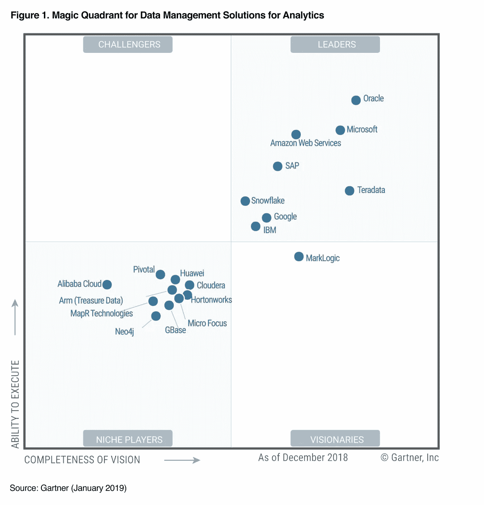
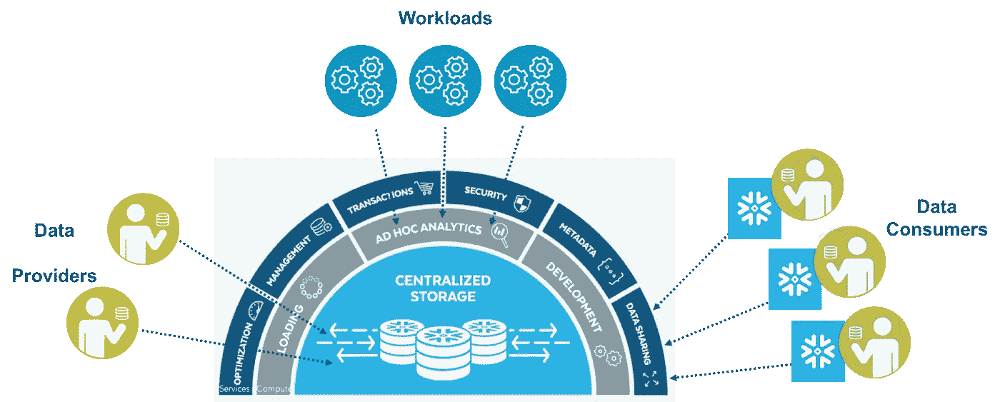

# 作为一名数据科学家，您为什么需要了解雪花

> 原文：<https://towardsdatascience.com/why-you-need-to-know-snowflake-as-a-data-scientist-d4e5a87c2f3d?source=collection_archive---------3----------------------->

## 唯一为云构建的数据仓库

可能这是你第一次听到这个公司——[雪花](https://www.snowflake.com/)。

也许你在某个地方听说过这个名字，但仍然不确定雪花作为数据仓库到底是做什么的，以及它与其他平台相比有什么不同。

嗯…你猜怎么着？

最近，在 Gartner 发布了其 2019 年**数据管理解决方案分析魔力象限(MQ)报告**并将雪花评为领导者之一后，我才开始更多地了解雪花。

[Snowflake Recognized as a Leader by Gartner in the Magic Quadrant](https://www.snowflake.com/blog/snowflake-recognized-as-a-leader-by-gartner-third-consecutive-year-positioned-in-the-magic-quadrant-report/)

这引起了我的注意，我开始了解更多。

如果您在数据科学领域，并且编写 SQL 查询从数据仓库(或数据库)获取数据是您的日常工作，那么本文是从数据科学家的角度为您编写的。

到本文结束时，您将对 Snowflake 和它的一些关键特性有更多的了解，并了解它是如何慢慢改变作为数据仓库的游戏的。

我们开始吧！

# 雪花是什么？

[Snowflake Introduction & Demo](https://www.youtube.com/watch?v=dUL8GO4ZK9s)

雪花是一个完整的 SQL 数据仓库，完全是为云而构建的。

事实上，它的**架构**是它区别于其他平台的地方。

它提供了传统数据仓库或已转移到云的大数据平台无法实现的灵活性和效率。

如果您想更多地了解雪花的架构，以及它如何以传统解决方案的一小部分成本结合数据仓库的强大功能、大数据平台的灵活性和云的弹性，我强烈建议您查看下面的视频。

[Introducing Snowflake Architecture in 90 Seconds](https://www.youtube.com/watch?v=Z2OYJFI2P8I)

# 雪花的主要特征

[Snowflake Architecture](https://www.doyouevendata.com/2018/02/28/snowflake-architecture-database/)

到目前为止，您应该已经知道，Snowflake 的专利架构分为三层— **存储、计算和服务**。

与传统的数据仓库相比，这是非常不同的，传统的数据仓库受到严格的数据建模和不灵活性的困扰。

## 1.存储层

这是所有数据集中存储的地方。

雪花管理如何存储这些数据的所有方面——组织、文件大小、结构、压缩、元数据、统计和数据存储的其他方面都由雪花处理。

客户不能直接看到或访问雪花存储的数据对象。它们只能通过使用雪花运行的 SQL 查询操作来访问。

更令人惊奇的是，存储层的扩展完全独立于计算资源。

这意味着雪花能够处理数据加载或卸载，而不会影响正在运行的查询和其他工作负载。

## 2.计算层

计算层旨在以最高的速度和效率处理大量数据。

雪花中所有的数据处理能力都是由虚拟仓库执行的，这些虚拟仓库是一个或多个计算资源集群。

当执行查询时，虚拟仓库从存储层检索满足查询所需的最少数据。

在检索数据时，数据会与查询结果一起缓存在本地计算资源中，以提高未来查询的性能。

更好的是，多个虚拟仓库可以同时对相同的数据进行操作，同时通过完全的 ACID 合规性全面实施全球系统范围的事务完整性！

## 3.服务层

想象一下，计算层(我们刚才谈到的)是雪花的肌肉，那么服务层就是控制计算层的大脑。

雪花的服务层认证用户会话，提供管理，[执行安全功能](https://www.youtube.com/embed/Qzge2Mt84rs?autoplay=1&rel=0)，执行查询编译和优化，并协调所有事务。

服务层由无状态计算资源构成，跨多个可用性区域运行，并利用高度可用的分布式元数据存储进行全局状态管理。

本质上，您不需要担心您的查询被抢走计算资源，因为服务层跨所有虚拟仓库执行事务协调。

# 最后的想法

[Source](https://unsplash.com/photos/rk_Zz3b7G2Y)

感谢您的阅读。

我刚才描述的只是雪花为云构建的架构的简要概述。

事实上，雪花还提供了许多其他有趣的关键功能，如 [**【时间旅行】**](https://docs.snowflake.net/manuals/user-guide/data-time-travel.html)**[**快速克隆**](https://www.snowflake.com/blog/snowflake-fast-clone/)**[**自动查询优化**](https://www.snowflake.com/blog/automatic-query-optimization-no-tuning/) 等等。****

****到目前为止，我希望你已经了解了更多关于雪花的一些关键特性。****

****如果您对学习其他关键特性感兴趣(这是我强烈推荐的！)，查看他们的网站 [**这里**](https://docs.snowflake.net/manuals/user-guide/intro-supported-features.html) ！****

****一如既往，如果您有任何问题或意见，请随时在下面留下您的反馈，或者您可以随时通过 [LinkedIn](https://www.linkedin.com/in/admond1994/) 联系我。在那之前，下一篇文章再见！😄****

## ****关于作者****

****[**阿德蒙德·李**](https://www.linkedin.com/in/admond1994/) 目前是东南亚排名第一的商业银行 API 平台 [**Staq**](https://www.trystaq.com) **—** 的联合创始人/首席技术官。****

****想要获得免费的每周数据科学和创业见解吗？****

****你可以在 [LinkedIn](https://www.linkedin.com/in/admond1994/) 、 [Medium](https://medium.com/@admond1994) 、 [Twitter](https://twitter.com/admond1994) 、[脸书](https://www.facebook.com/admond1994)上和他联系。****

**** [## 阿德蒙德·李

### 让每个人都能接触到数据科学。Admond 正在通过先进的社交分析和机器学习，利用可操作的见解帮助公司和数字营销机构实现营销投资回报。

www.admondlee.com](https://www.admondlee.com/)****