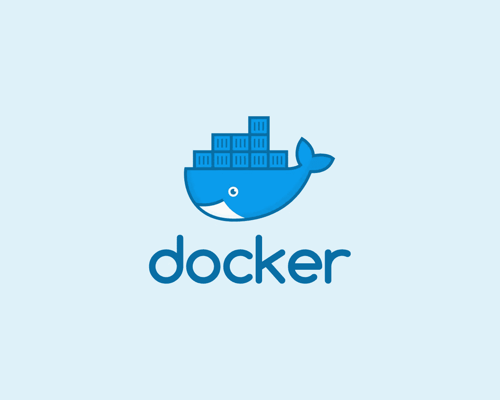
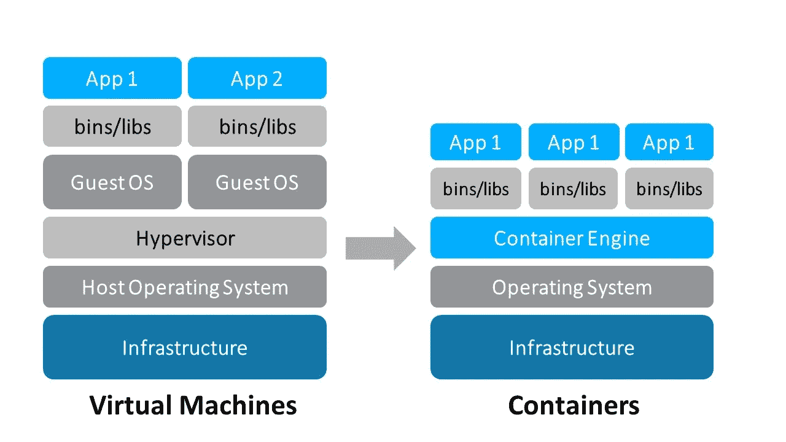
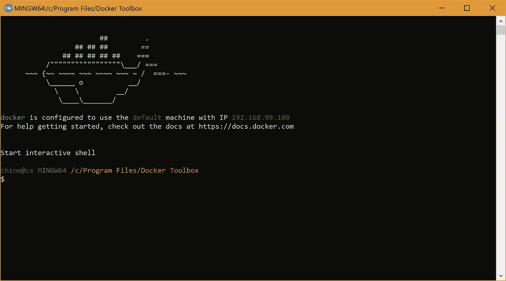
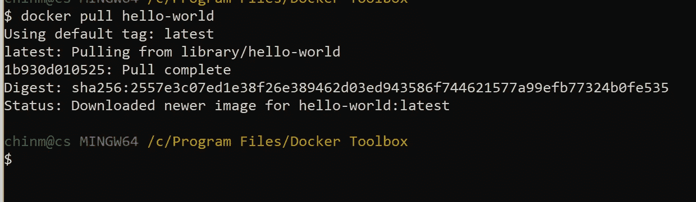
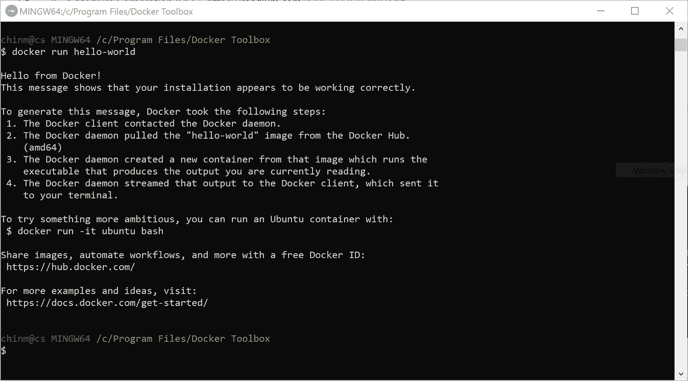
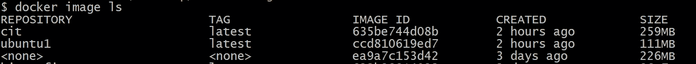

# 你为什么要关心 Docker？

> 原文：<https://towardsdatascience.com/why-you-should-care-about-docker-9622725a5cb8?source=collection_archive---------5----------------------->

如果您是一名软件工程师或数据科学家，您现在可能已经听说过 docker 了。

它引起我注意的方式是我在互联网上浏览深度学习框架，几乎所有其他框架都有 docker 支持，这让我思考 docker 到底是什么。

乍一看肯定不直观。



但是在我们深入 docker 之前，我们需要了解什么是虚拟机和容器。

# 什么是“容器”和“虚拟机”？

容器和虚拟机的目标相似:将应用程序及其依赖项隔离到一个自包含的单元中，该单元可以在任何地方运行。

此外，容器和虚拟机消除了对物理硬件的需求，允许在能耗和成本效益方面更有效地使用计算资源。

容器和虚拟机之间的主要区别在于它们的架构方法。



VMs and Container architecture

如上图所示，虚拟机构建在主机操作系统之上，因此增加了一个额外的层，这在容器中是完全没有的。

如果你和我一样，就把它(docker)当成一个更好的 VM，在那里你可以做大量的实验，而不必担心环境变量。

# Docker 是什么？

Docker 真正做的是将应用程序代码从基础设施需求和需要中分离出来。它通过在一个称为“容器”的隔离环境中运行每个应用程序来实现这一点

这意味着开发人员可以专注于在 Docker 容器中运行的实际代码，而不用担心它最终将在哪个系统上运行，DevOps 可以专注于确保在 Docker 容器中安装正确的程序，并减少所需的系统数量和部署后维护所述系统的复杂性。

# 你为什么要关心它？

每一个 Docker 容器都是从一无所知的纯普通 Linux 机器开始的。

然后，我们告诉容器它需要知道的一切——为了运行应用程序，它需要下载和安装的所有依赖项。这个过程是用一个`Dockerfile`完成的。

对于本节，可以说，Docker 消除了部署应用程序的猜测(和花费的调试时间),因为它总是作为一台全新的、隔离的机器启动，并且添加了完全相同的依赖项。每一个。单身。时间。

没有安装了不同版本依赖项的环境。没有完全缺少依赖关系的环境。不要和 Docker 胡闹。

1.**易用性:** Docker 让任何人——开发人员、系统管理员、架构师和其他人——更容易利用容器来快速构建和测试可移植的应用程序。它允许任何人在他们的笔记本电脑上打包一个应用程序，反过来可以在任何公共云、私有云甚至裸机上不加修改地运行。咒语是:“构建一次，运行在任何地方。”

2.**速度:** Docker 集装箱非常轻便快速。由于容器只是运行在内核上的沙盒环境，它们占用的资源更少。您可以在几秒钟内创建并运行 Docker 容器，相比之下，虚拟机可能需要更长时间，因为它们每次都必须启动完整的虚拟操作系统。

3. **Docker Hub:** Docker 用户也受益于 Docker Hub 日益丰富的生态系统，你可以把它想象成一个“Docker 图片的应用商店”Docker Hub 拥有数万张由社区创建的公共图片，随时可供使用。搜索符合您需求的图像非常容易，只需很少或不需要修改就可以下载和使用。

4.模块化和可伸缩性: Docker 使得将应用程序的功能分解到单独的容器中变得容易。例如，您可能在一个容器中运行 Postgres 数据库，在另一个容器中运行 Redis 服务器，而 Node.js 应用程序在另一个容器中运行。有了 Docker，将这些容器链接在一起创建应用程序变得更加容易，使得将来独立扩展或更新组件变得更加容易。

# Docker 入门

前往 docker 网站，如果你使用的是 Windows 10 家庭版，你需要 Docker 工具箱。

一旦你成功安装了 Docker，让我们试着在它上面运行 ubuntu image 稍后会详细介绍。

现在 Docker 允许你使用一个已经预先构建好的映像或者在一个已经存在的映像上构建。这个建立在现有图像上的建筑确实令人兴奋。

您可以定制图像，只定制您需要的图像并对其进行处理。

在我们开始研究 Dockerfile 之前，让我们确保我们的安装已经完成。

前往码头快速启动终端



Docker Quick Start Terminal

为了确保我们的设置配置正确，让我们运行 Docker 提供的默认映像。

```
docker pull hello-world
```



docker pull command

要查看您刚刚提取的图像，请键入以下命令:

```
docker image ls
```

最后，此刻，你在等待，你好，Docker 中的世界



running the hello-world container

```
docker run hello-world
```

## Dockerfile —一切开始的地方

Docker 是一个强大的工具，但是它的力量是通过使用称为 **Dockerfiles** 的东西来利用的(如上所述)。

> `*Dockerfile*`是一个文本文档，包含用户可以在命令行上调用的所有命令，以组合一个图像。使用`*docker build*`,用户可以创建一个连续执行几个命令行指令的自动化构建。- Docker，Docker 文件参考

Docker 映像由只读层组成，每一层代表一条 Dockerfile 指令。这些层是堆叠的，每一层都是前一层的变化的增量。

当 Docker 容器启动时，需要告诉它做什么，它没有安装任何东西，它知道如何不做任何事情。真的没有。

Dockerfile 首先需要的是一个**基础映像**。基础映像告诉容器要安装什么作为它的操作系统——Ubuntu、RHEL、SuSE、Node、Java 等等。

接下来，您将提供设置说明。这些都是 Docker 容器需要知道的事情:环境变量、要安装的依赖项、文件所在的位置等等。

最后，你必须告诉容器做什么。通常，它将运行安装说明中指定的应用程序的特定安装和命令。

## 在 Docker 上尝试 Ubuntu

这里有几个 docker 文件示例，包括解释每一行和每一层发生了什么的注释。

```
# Get the base ubuntu 18.04 from Docker hub# Head to https://hub.docker.com/_/ubuntu for other variationsFROM ubuntu:18.04# Get the necessary updatesRUN apt-get update# This ensures that the first directory that is opened once image is # build is /homeWORKDIR /home
```

将此文件保存为 Dockerfile。

现在前往 DockerQuick 启动终端，确保当前目录和存储 *Dockerfile* 的位置是相同的。

```
docker build .
```

现在当你这样做的时候，虽然 docker 创建了一个图像，但是你必须记住 docker 给它的随机名称，因为我们还没有给它命名。

```
docker build -t ubuntu1:latest .
```

现在，这确保了这个刚刚构建的映像被命名为 ubuntu1

```
docker image ls
```



Docker images

您可以看到，映像大小只有 111MB，相比之下，我们使用虚拟机时至少要分配 10GB。

还要注意，当我们在构建时没有 *-t* 标签时，存储库名称和标签是 none。所以当我们试图使用这个图像时，我们需要通过图像 ID 来记住它。

*-t* 基本上是格式*储存库:标签*

如果你忘记放置标签，docker 默认将其标记为 *latest。*

最后

```
docker run --rm -it ubuntu1:latest
```

*— rm* 确保容器运行后，立即删除。

*-it* 因为我们想使用终端进行交互。

你可以在 docker 终端中输入你在 Ubuntu 系统上输入的所有命令。

# 结论

我希望你现在已经具备了在自己的系统上开始入侵 Docker 所需要的知识，并且能够意识到这个不可思议的工具的威力！

如果你喜欢这个，这里有第二部分关于 Python 开发的 Docker。

你可以随时联系推特、领英、T21 或电子邮件。