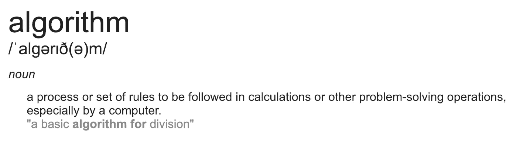
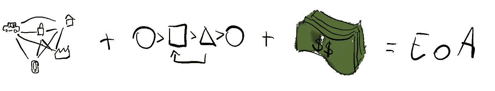

# 为什么你应该关注算法的经济增长

> 原文：<https://towardsdatascience.com/why-you-should-care-about-the-rising-economy-of-algorithms-cb33959acfe0?source=collection_archive---------20----------------------->

2016 年，一位 Reddit 用户表白。FiletOfFish1066 将所有工作任务自动化，花了大约六年时间“无所事事”。而原来的帖子似乎已经从 Reddit 上消失了，[那里](https://interestingengineering.com/programmer-automates-job-6-years-boss-fires-finds) [正在](http://www.govtech.com/question-of-the-day/Question-of-the-Day-for-06212016.html) [无数](https://developers.slashdot.org/story/16/06/13/2021216/programmer-automates-his-job-for-6-years-gets-fired-realizes-he-has-forgotten-how-to-code) [关于录取的报道](https://boingboing.net/2016/06/08/coder-fired-after-6-years-for.html)。原帖暗示他(所有故事都把 FiletOfFish1066 称为男性)花了大约 50 个小时做“真正的工作”。剩下的——“什么都没有”。当他的雇主发现后，FiletOfFish1066 被解雇了。我认为这是雇主可能犯的最严重的错误。他应该得到加薪。但这是另一篇文章的主题。让我们来谈谈雇佣算法为你工作——就像 FiletOfFish1066 有一堆算法为他工作一样。

> 如果你的员工把他们的任务自动化到“什么都不做”，不要解雇他们。给他们加薪，并向他们学习。他们将向你展示如何扩展你的业务。

算法不仅仅是为应用程序、脚本提供动力，或者以其他方式自动化任务。他们逐渐成为我们的私人代理人，代表我们做出决定。例如，总部位于波士顿的 Quantopian ，一家专注于众包的投资公司，允许人们提交简单的算法，然后代表投资者做出资金分配决定。算法还不像 Siri 快捷键那样简单，但是即使是初级程序员也应该能够编写简单的量子算法。想象一下成百上千个这样的算法，它们中的每一个都可以访问由 [quantopian](https://medium.com/u/ca01998bb067?source=post_page-----cb33959acfe0--------------------------------) 提供的信息，决定如何处理它们创造者的钱。它不是科幻小说；它正在发生。一群算法不断决定如何分配资金。

> 你最近有没有雇过算法？

当算法代表我们做出决定时，当它们与其他组织互动、购物、订购服务或安排会议时，它们充当我们的*经济代理*。经济主体是[经济某个方面的模型中的参与者或决策者](https://en.wikipedia.org/wiki/Agent_(economics))。

还记得大公司最为重要的“旧”经济吗？它还没有去任何地方。然而，在过去的 20 年里，一种新的经济——人的*经济——已经出现在企业*经济的旁边。它给了个人前所未有的参与全球价值创造和交换的机会。当我们惊叹于人的经济时，另一种经济，算法的经济正在出现。在这种新经济中，算法和运行算法的设备(例如机器人)成为经济主体。他们在经济价值创造中发挥着积极的、往往是独立的作用。

三大发展对算法经济的出现至关重要:物联网、算法和商业模式。

Internet of Things + Algorithms as economic agents + Business Models = Economy of Algorithms

**物联网**

连接和交换数据的庞大电子设备网络创造了我们所说的物联网(IoT)。物联网有助于数据收集、分发、监控、趋势预测等。但最重要的是(对我们来说)，它有助于连接我们可能拥有的所有设备。我们可以将物联网视为管道，通过这些管道，数据可以在所有设备之间向各个方向流动。尽管一些供应商希望我们认为物联网主要是管道末端的设备(传感器、服务器等)，但网络——管道——才是最重要的。

**作为经济代理的算法**

管道本身并不创造价值。只有当我们使用管道中流动的数据，并聪明地使用它，我们才能创造价值。这就是代表我们的算法可以介入的地方。我车上的一个智能[传感器](https://automatic.com/)，将它的引擎电脑连接到我的手机和[自动](https://medium.com/u/56ddfb4a29b9?source=post_page-----cb33959acfe0--------------------------------)的服务器，现在可以通知我的机械师我的引擎是否有问题，或者在我离开时启动我家的警报器。我写了一个简单的脚本——一个算法——来完成这个任务。 [Koola](https://medium.com/u/39d48ab1a654?source=post_page-----cb33959acfe0--------------------------------) 试验使用预测算法向经销商提供“服务机会”(即:汽车 X 可能很快会坏)。如果你的汽车修理工告诉你你需要修理你的车，因为它很快就要坏了，你会相信吗？这让我想到了第三个部分。

**商业模式**

创造价值的互联设备和算法是伟大的，但如果没有商业模式，它们只是一个有趣的练习。当创造经济价值时，橡胶就上路了。而且在追踪汽车数据的情况下，值得关注的商业模式越来越多。美国保险公司 Progressive 提供[快照](https://www.progressive.com/auto/discounts/snapshot/)。这项服务要求司机在他们的车上安装一个传感器，类似于[自动](https://medium.com/u/56ddfb4a29b9?source=post_page-----cb33959acfe0--------------------------------)的传感器。然后，累进减少或增加你的保险费的基础上，来自传感器的数据。想铺地板吗？它可能会让你失去优惠折扣！新的保险模式(商业模式)现在有了名字:[黑箱保险](https://www.investopedia.com/terms/b/black-box-insurance.asp)。哦，还有[科拉](https://medium.com/u/39d48ab1a654?source=post_page-----cb33959acfe0--------------------------------)？他们的推特已经沉寂了一年多。或许他们的商业模式没有那么好？

# 你为什么要在乎？

## 1.算法的经济性可以让你变得富有(呃)

是的，你已经可以节省保险费了。但是还有更多的。随着技术的进步，你的设备和算法将能够主动产生收入(是的，你可能已经有了太阳能电池板，可以将能量卖回给电网，但它们完全是被动的)。在未来，你的家可以知道你的车库在接下来的八个小时内将是空的，并将这个空位提供给一辆自动驾驶汽车，寻找一个安全的地方停一会儿。与许多人不同，算法看不出在大型多层广告停车场停车和在两个街区外的私人车库停车有多大区别。如果汽车的偏好功能优先选择便宜的停车点，私人车库比商业车库便宜，汽车就会选择私人车库。不问任何问题。所以，让你的家庭管理算法检查你的日历，广告点，自动打开和关闭车库门，并代表你接收汽车的微支付。

> 有算法可以帮你省几个钱！如果你对他们有足够的控制权，雇佣他们可能是有意义的。

说到太阳能电池板:运行你家的算法可能会决定在白天不将能量送回电网，而是为附近的电动汽车提供一个弹出式充电站，使用车道上的无线充电垫，就是你通常用来给汽车充电的那种。使用网络(物联网)，你的算法将能够为充电站做广告，并可能自动出价，假设其他房屋可能也想出售电力。听起来科幻？不应该。像[park hound](https://www.parkhound.com.au/)这样的服务已经可供人类使用。他们开发用于算法的[API](https://en.wikipedia.org/wiki/Application_programming_interface)只是时间问题。

## 2.你会做更少的决定

就像 FiletOfFish1066 想在重复性任务上花更少的时间一样，我们许多人都试图将每天做出的选择数量减到最少。有人称之为[选择极简主义](https://medium.com/startup-grind/choice-minimalism-why-mark-zuckerberg-wears-the-same-thing-every-day-2f132f1b5706)，我称之为便利。我不想在家里做每一个购买决定。卫生纸、牛奶或更换液化石油气容器？我很想摆脱记得买这些东西的负担。

大约两年前，迈克尔·罗斯曼、[保拉·杜森和我发表了一份关于零售业未来的报告:](https://medium.com/u/9721d2c12278?source=post_page-----cb33959acfe0--------------------------------)[零售 5.0](https://www.chairdigitaleconomy.com.au/wp-content/uploads/2018/04/Retail-5.0-Check-out-the-Future.pdf)。在该出版物中，我们认为“便利购物”(与“体验购物”相对)将会被技术减少到最低限度。换句话说，算法将接管很多这样的决策。根据今天出版的《泰晤士报》的一篇报道[，杰夫·贝索斯似乎同意尝试零点击购物。当杰夫·贝索斯尝试一些东西时，很有可能会改变世界。](https://www.thetimes.co.uk/article/next-trick-for-amazon-boss-jeff-bezos-is-the-end-of-shopping-c0w90mhsc)

> 零售业的未来是没有零售，或者零点击零售。算法的经济性使之成为可能。

是好是坏？它可以双向进行。如果我的冰箱一直点垃圾食品让我“开心”怎么办？如果我的家庭助理让我的账户透支，而我又被银行大量收费，该怎么办？如果我的车库让我变富了呢？如果我周围的所有算法最终允许我专注于完成我去年承诺要完成的那本书，会怎么样？不管怎样，这是我们应该关注算法经济性的另一个原因。

## 3.你需要重新思考你与技术的关系

算法只是计算机解释的指令。但是，不管喜欢与否，我们需要改变我们对他们的看法。从两个方面来说:我们需要像对待我们的人类经济代理人一样对待他们，我们需要花时间真正理解他们，并找出如何让他们作为一个团队工作。

第一个可能有点意外。但是，你有没有像看待购物者那样看待智能冰箱呢？你如何给冰箱做广告？你如何确保量子运算法则的价值与你的一致？这些问题只是看起来很可笑。它们可以揭示算法的经济性可能带来的机遇或挑战。

> 你如何给冰箱做广告？

让你的算法像团队一样工作？一旦你雇佣了一堆算法为你工作(或者和你一起工作)，你可能会很快看到它的价值。像 FiletOfFish1066，六年每年领 95k 左右的工资。但是，就像人类团队一样，算法作为一个团队工作将会取得更大的成就。希望对你来说。

无论你是像 FiletOfFish1066 一样，寻找雇用算法的机会，还是像他的经理一样，寻找保持世界不变的机会，即将到来的算法经济都将让你忙个不停。有一点可以肯定，那将是一个激动人心的时刻！