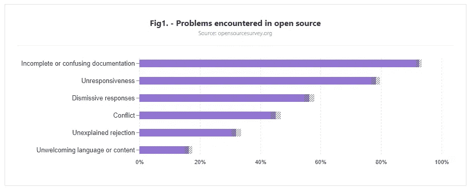
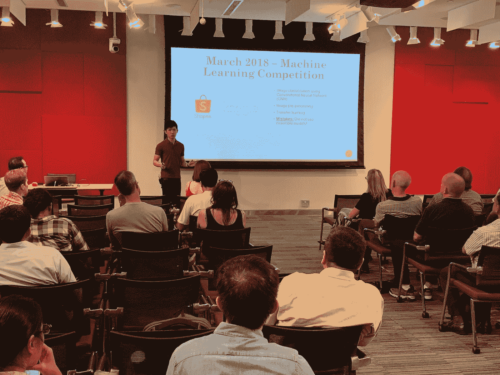

# 为什么您应该记录您作为数据科学家的工作

> 原文：<https://towardsdatascience.com/why-you-should-document-your-work-as-a-data-scientist-a265af8a373?source=collection_archive---------7----------------------->

你看。

每当我们谈论数据科学时，我们很可能会首先想到那些新奇的东西，如人工智能、深度学习、机器学习等。

但是没有人谈论文档，原因之一我们都知道——它听起来不性感(或者听起来很无聊)。

我完全同意文档通常不是数据科学家最感兴趣的事情之一。但是，它的重要性不亚于其他数据科学工作流，尤其是在数据科学项目管理方面。

事实上，文档不再仅仅是程序员或开发人员完成的任务。这是我们作为数据科学家应该知道的事情，并且只能定期执行这项任务。

有趣的是，一份 [2017 Github 开源调查](http://opensourcesurvey.org/2017/)显示**“不完整或混乱的文档”**是关于开源软件的头号投诉。

[2017 Github Open Source Survey](http://opensourcesurvey.org/2017/)

> **文档被高度重视，但经常被忽视。**

这不仅仅是针对开源文档。类似的重要性也适用于我们的实际工作场所，我们必须记录数据科学工作流程，并确保随时更新。

在接下来的文章中，您将了解为什么文档在数据科学中很重要。

我们开始吧！

# 那么，为什么文档在数据科学中很重要呢？

# 1.再现性

是的，再现性。

我特别赞同 [Matt.0](https://medium.com/u/459e62b88a2a?source=post_page-----a265af8a373--------------------------------) 写的那篇关于 **T** [**他对于数据科学项目管理**](/the-gold-standard-of-data-science-project-management-13d68c9e85d6) 的“黄金标准”。他有一个 [Github repo](https://github.com/moldach/project-directory) 用于建立一个新的数据科学项目目录的**黄金标准**工作流。去看看那个！

在他的文章中，他提到了这一点:

Daniele Procida 的这篇关于软件文档的**黄金标准**的 [*优秀*帖子很好地总结了这一点，他说:](https://www.divio.com/blog/documentation/)

> “你的软件有多好并不重要，因为**如果文档不够好，人们就不会使用它**。
> 
> 即使出于某种原因他们不得不使用它，因为他们没有选择，没有好的文档，他们不会有效地使用它或以您希望的方式使用它。"

没有一个好的和有组织的文档，人们不会使用你日以继夜工作的代码，更不用说复制你的结果了。

因为面对现实吧。

即使你在为一个项目编写代码库方面做得很好，并为此感到非常自豪。有一天，你团队中的一位同事打算对你现有的代码进行改进。

因此，您的同事希望重现您的结果，但由于文档不完整，他/她不知道该如何做。见鬼，你的同事可能甚至不理解你的代码。

> 没有好的文档和注释，阅读别人的代码总是一种折磨。

**这里的要点是:**让文档尽可能清晰简单。当你在做项目时(而不是在完成项目后)，一致地记录你的工作流程。为了帮助其他人理解你的工作流和代码，以便他们在将来重现你的结果——修复一些错误或进行改进。如果可能的话，找人看一下你的文档，确保其他人能够理解你的解释。

# 2.确保项目成功完成

这很重要。

不管你是实习生还是全职员工。

因为你猜怎么着？

没有员工会永远在一家公司。如果他们已经不在公司了，并且没有留下任何文档就把他们完成了一半的项目传给了其他人，那么只有两种结果**——项目将会悬而未决，或者项目将会需要比预期更多的时间来完成。**

**我在第一次实习时，作为[的数据科学家实习生，学到了这重要的一课。](/my-first-data-scientist-internship-7f7aa2ee4040)**

**起初，当我被要求制作文档时，我根本无法理解背后的原因，从我如何收集、清理和分析数据，到我使用和比较的机器学习模型，以及我在整个实习期间获得的结果。**

**只有当我在这个领域获得了更多的经验后，我才意识到文档对于数据科学项目是多么重要，我对我在第一次实习中学到的东西感激不尽。我指的是详细的文档，包括你犯过的所有错误、尝试过的方法、获得的见解以及未来的行动建议等等。**

**我们不能假设其他人在没有向他们展示我们的项目是什么，以及当你不在的时候，他们如何在你的遗产之上进行建设的情况下，会理解我们的项目是关于什么的。**

**这将确保您的项目仍将继续运行，并得到良好的管理。**

**负责任，对他人表现出同理心。**

# **最后的想法**

****

**Sharing my data science learning journey at a meetup**

**感谢您的阅读。**

**我希望通过与您分享我的个人经验和文档的重要性，能够让您在数据科学之旅中更加清晰。**

**事实上，如果你一直在关注我的工作，我一直在 ***【记录】*** 通过写作和在 LinkedIn、Medium 和许多其他出版物上与他人分享我的知识，来“记录”我的学习之旅。**

**我觉得这种方式可以帮助我更好地了解数据科学。最重要的是，我喜欢分享！分享是我日复一日生活和呼吸的内容。**

**一如既往，如果您有任何问题或意见，请随时在下面留下您的反馈，或者您可以随时通过 [LinkedIn](https://www.linkedin.com/in/admond1994/) 联系我。在那之前，下一篇文章再见！😄**

## **关于作者**

**[**Admond Lee**](https://www.linkedin.com/in/admond1994/) 目前是东南亚排名第一的商业银行 API 平台[**Staq**](https://www.trystaq.com)**—**的联合创始人/首席技术官。**

**想要获得免费的每周数据科学和创业见解吗？**

**你可以在 [LinkedIn](https://www.linkedin.com/in/admond1994/) 、 [Medium](https://medium.com/@admond1994) 、 [Twitter](https://twitter.com/admond1994) 、[脸书](https://www.facebook.com/admond1994)上和他联系。**

** [## 阿德蒙德·李

### 让每个人都能接触到数据科学。Admond 正在通过先进的社交分析和机器学习，利用可操作的见解帮助公司和数字营销机构实现营销投资回报。

www.admondlee.com](https://www.admondlee.com/)**