# 为什么你应该双浸自然图像分解

> 原文：<https://towardsdatascience.com/why-you-should-double-dip-for-natural-image-decomposition-ee65b1c1c9bc?source=collection_archive---------20----------------------->

## 基于耦合深度图像先验的无监督图像分解

许多计算机视觉任务都希望将图像分解成单独的部分。在图像分割中，图像被分解成有意义的子区域，例如前景和背景。在透明分离中，图像被分离成其叠加的反射和透射。另一个例子是图像去雾的任务，其目标是将有雾的图像分成其基本的无雾图像和模糊的雾层。

虽然起初看起来不相关，但是这些任务可以被视为将图像分解成单独层的特殊情况。例如，如图 1 所示；图像分割(分离成前景和背景层)；透明层分离(分成反射层和透射层)；图像去雾(分离成清晰图像和模糊贴图)，等等。

在这篇文章中，我们将重点关注“双 DIP”，这是一个基于几个[“深度图像优先”(DIP)](/how-to-perform-image-restoration-absolutely-dataset-free-d08da1a1e96d) 网络的单一图像无监督层分解的统一框架。

> **对于热心读者:** 关于[“深度图像优先”(DIP)](/how-to-perform-image-restoration-absolutely-dataset-free-d08da1a1e96d) 的更多细节，查看我以前的帖子。

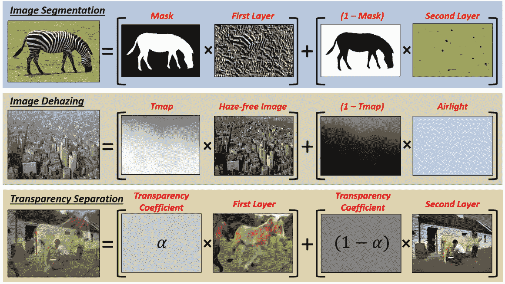

Figure 1: A unified framework for image decomposition.

# 一些直觉

“双倾角”主要建立在“深度图像先验”(倾角)之上；Ulyanov 等人在 DIP 中的工作表明，DIP 网络的结构足以捕获单个自然图像的低级统计。

DIP 网络的输入是随机噪声，它训练以重建单个图像(作为其唯一的输出训练示例)。这种网络被证明是非常强大的解决图像恢复任务，如去噪，超分辨率和修复，在一个无监督的方式。下面是一个图像去噪的例子，摘自我在[之前发表的关于深度图像的文章](/how-to-perform-image-restoration-absolutely-dataset-free-d08da1a1e96d):

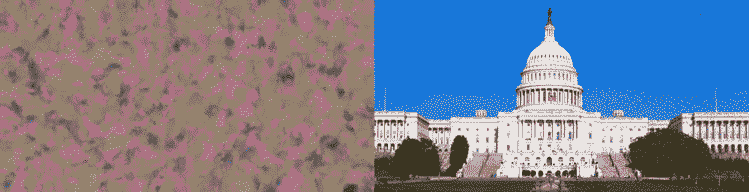

Figure 2: (Left) — Clean image *x** restoration result using Deep Image Prior starting from random initialization up to convergence , (Right) — The Noisy image x^

“双倾角”的作者观察到，通过使用多个倾角的组合来重建图像，这些倾角往往会“分裂”图像，就像人类自然分裂图像一样。此外，他们展示了如何将这种方法用于额外的计算机视觉任务，包括图像去雾、图像和视频的 Fg/Bg 分割、水印去除以及图像和视频中的透明分离。

# “双下降”:通过耦合深度图像先验的无监督图像分解

双下降的关键方面是固有的，即每个分解层内小块的*分布比原始混合图像中的**【更简单】**(更均匀)。我们用一个例子来简化一下；*

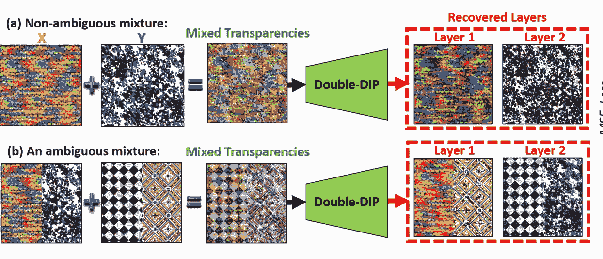

Figure 3: The complexity of mixtures of layers vs. the simplicity of the individual components

让我们观察图 3a 中的示例。两种不同的纹理， *X* 和 *Y* ，混合起来形成一个更复杂的图像 *Z* ，呈现出图层透明。每个纯纹理( *X* 和 *Y* )内部的小块和颜色的*分布比组合图像( *Z* )中的块和颜色的分布更简单**。此外，跨两种纹理的补片的相似性非常弱。***

声称一幅图像可以用一种自然而简单的方式分离成它的子成分是从 [*信息论*](http://staff.ustc.edu.cn/~cgong821/Wiley.Interscience.Elements.of.Information.Theory.Jul.2006.eBook-DDU.pdf) *中推导出来的。*这里证明了对于两个*独立的*随机变量 *X* 和 *Y* ，它们的和 *Z = X+Y* 的联合熵大于它们各自的熵。

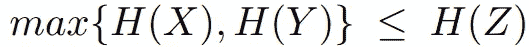

## 单倾角与耦合倾角

单一 DIP 网络用于学习 pusre 图像与混合图像之间的差异可以在下面的图 4 中示出。

Figure 4\. MSE Reconstruction Loss of a single DIP network, as a function of time

在图 4 中，对于图 3a 中的 3 个图像中的每一个，示出了单个倾角网络的 MSE 重建损失，作为时间的函数(训练迭代)。

*   橙色橙色图是为重建纹理图像 *X* 而训练的下降的损失
*   蓝色图——经过训练以重建纹理的倾斜 *Y*
*   绿色图-经过训练以重建其叠加混合物(图像透明度)的倾斜。

请注意，与单个分量的损失相比，混合图像的损失更大，收敛时间更长。这意味着混合图像的损失大于两个单独损失的总和。这可能与混合图像中的小块分布更加复杂和多样(更大的熵；更小的内部自相似性)。

最后，应用多个 DIP 显示它们倾向于在它们之间“分裂”图像碎片。也就是说，图像内类似的小块往往都是由单个 DIP 网络生成的。换句话说，每个倾角捕获图像内部统计数据的不同组成部分。

## “双底”框架

图 5。演示了双 DIP 框架:两次 DIP 将输入图像 *I* 分解为层(y1 和 y2)，然后根据学习到的遮罩 m 对这些层进行重组，从而重建 I 的近似图像。

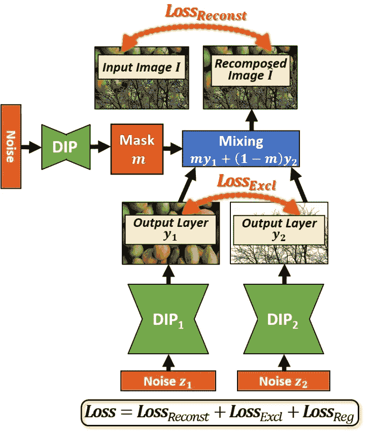

Figure 5\. Double-DIP Framework

## 什么是好的图像分解？

一幅图像有无限多种可能的分层方式。作者提出以下特征来定义有意义的分解:

*   当重新组合时，恢复的层重建输入图像
*   每一层都应该尽可能“简单”
*   恢复的层之间不应该有依赖性或相关性

这些建议转化为用于训练网络的损耗。第一个标准是通过“重建损失”来实施的，该“重建损失”测量所构建的图像和输入图像之间的误差。第二个标准是通过采用多次倾斜(每层一次)获得的。第三个标准是通过不同骤降的输出之间的“排除损失”来实施的(最小化它们的相关性)。

每个 DIP 网络重建输入图像的不同层 y _ I*I。*每个 DIP 的输入是随机采样的均匀噪声 z_i

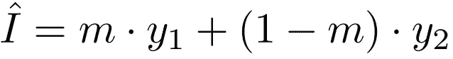

，其应尽可能接近输入图像 *I.* 因此，优化损失为

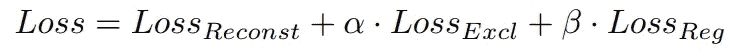

其中，损失第一元素，即重建损失定义为

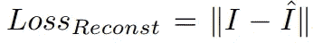

第二个要素是排除损失，它使 y1 和 y2 的梯度之间的相关性最小化。最后，正则化掩模项将掩模 *m* 拉至尽可能接近二进制图像。

# 结果

如上所述，这种方法适用于许多计算机视觉任务，如图像分割、透明层分离、图像去雾等。

## 分割

将图像分割成前景和背景可以表示为将图像分解成标记为 y_1 的前景层和标记为 y_2 的背景层。这两层与二进制掩模结合将产生分解的图像，并且可以用公式 1 表示:

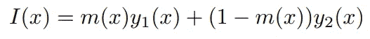

Equation 1

这个公式自然地适合双倾角框架，服从符合自然图像先验的 y_1 和 y_2，并且每一个都比 *I.* 更“简单”地生成

正则化项在这里被定义为鼓励分割掩模被二进制化和定义

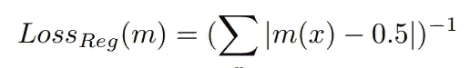

下面的结果显示了双 DIP 的优点，实现了仅基于层分解的高质量分割，而无需任何额外的训练数据。

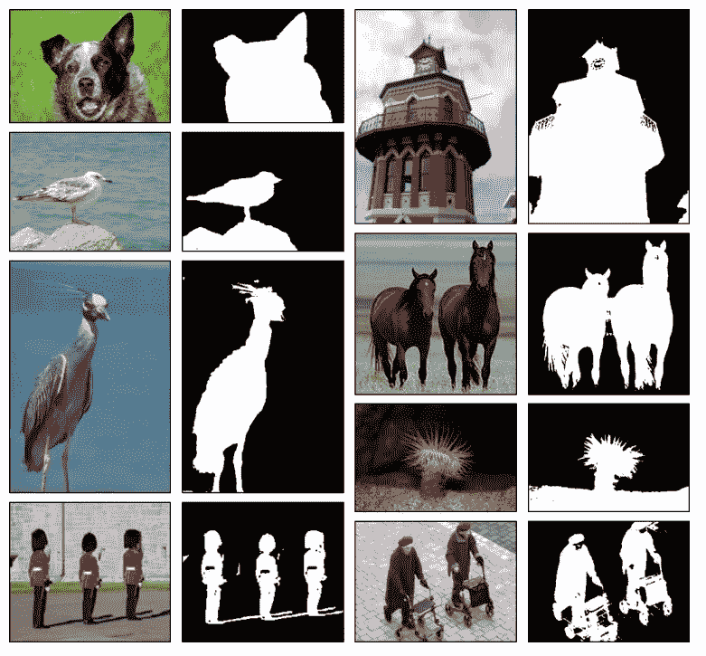

Figure 6\. Foreground/Background separation results

## 水印去除

水印广泛用于照片和视频的版权保护。双浸通过将水印视为图像反射的特殊情况来消除水印，其中 y1 是清除的图像，y2 是水印。

这里，与图像语义相反，掩模不是常数*m。*固有的透明层模糊通过两种实际方法之一解决:(I)当只有一个水印图像可用时，用户提供围绕水印位置的粗略提示(边界框);(ii)给定几个共享相同水印的图像(通常 2-3 个就足够了)，模糊性自行解决。

图 7。下图显示了双浸法去除水印的显著效果。

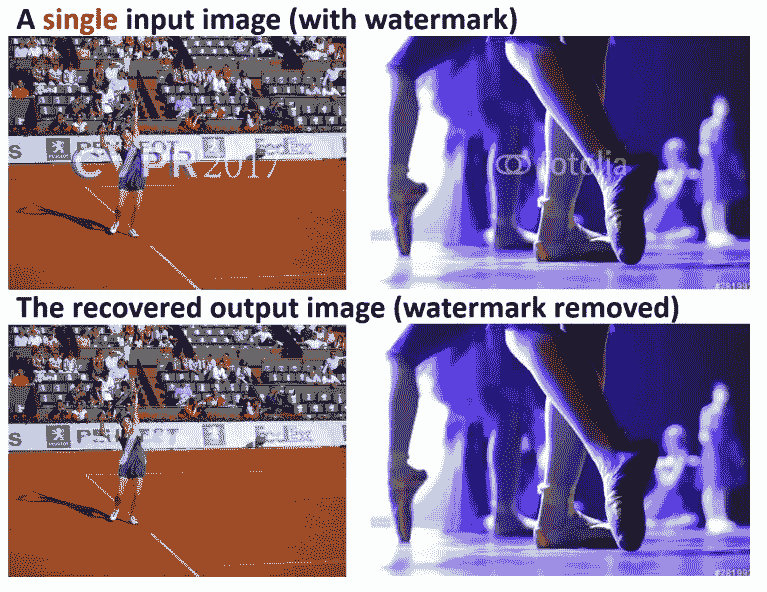

Figure 7\. Watermark removal from a single image

## 透明层分离

在图像反射的情况下，图像 *I(x)* 中的每个像素值是来自透射层 *y_1(x)* 的像素和反射层 *y_2(x)中的对应像素的组合。*这也可以用等式 1 来表示。其中 *m(x)* 是反射掩模。

下面的动画展示了真实透明图像的成功分离。

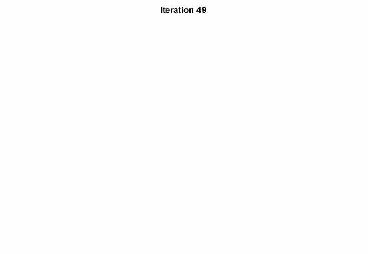

# 结论

双 DIP 为单个图像的无监督层分解提供了一个统一的框架，并且需要额外的数据集。这个框架适用于各种各样的计算机视觉任务。

如果你对源代码感兴趣，可以在我的 [Double-DIP — GitHub 库](https://github.com/erezposner/DoubleDIP)中找到。

一如既往，如果您有任何问题或意见，请随时在下面留下您的反馈，或者您可以随时通过 [LinkedIn](http://www.linkedin.com/in/erezposner) 联系我。

在那之前，下一篇文章再见！😄