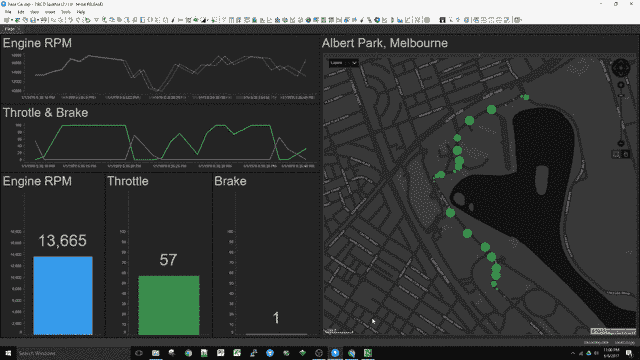

# 为什么您应该了解流数据科学

> 原文：<https://towardsdatascience.com/why-you-should-learn-about-streaming-data-science-2f603ad24aea?source=collection_archive---------8----------------------->

*自适应学习和数据流数据科学的独特用例。由* [*汤姆希尔*](https://www.linkedin.com/in/drthomashill) *和* [*马克帕*](https://about.me/mark.palmer)

传统的机器学习基于历史数据训练模型。这种方法假设世界本质上保持不变，即过去观察到的相同模式、异常和机制将在未来发生。因此，*预测性*分析实际上是*展望过去*而非未来。

最近可用的工具可以帮助商业分析师基于来自任何来源的流数据“查询未来”，包括物联网传感器、网络交互、交易、GPS 位置信息或社交媒体内容。类似地，我们现在可以将数据科学模型应用于流数据。

不再局限于只看过去，流数据科学的影响是深远的。

## 基于历史数据的数据科学模型是好的，但不是万能的

今天，机器学习的大多数应用程序都试图在历史数据中识别预测未来事件的重复且可靠的模式。当维度和“概念”之间的关系稳定并能预测未来事件时，这种方法是可行的。

例如，海滩的预期游客数量可以根据天气和季节进行预测——在冬天或下雨时，较少的人会去海滩，这些关系将随着时间的推移而保持稳定。

同样，大多数消费者进行的信用卡消费的数量、金额和类型将遵循可从历史消费数据中预测的模式，任何与这些模式的偏差都可以作为欺诈警报的有用触发器。

此外，即使变量之间的关系随着时间的推移而改变，例如当信用卡消费模式改变时，有效的模型监控和模型的自动更新(称为重新校准或重新建立基础)也可以产生有效、准确而又适应性强的系统。

## 流数据科学在流中应用算法

然而，在某些情况下，将学习算法应用于实时流数据是有优势的。有时，推动应用价值的一个关键因素是新发现和新出现的见解转化为行动的速度。

> 在某些用例中，对流式数据应用自适应学习算法比等待它在数据库中静止下来更有优势。

例如，为了识别预测公众意见、时尚选择和消费者偏好的关键因素，持续建模和模型更新的适应性方法可能是有帮助的。

## 流式 BI——流数据科学的使能技术

为了理解流数据科学，首先理解[流商业智能](https://link.medium.com/JsjYLliFkV)(流 BI)是有帮助的。

下面的视频展示了一级方程式赛车中的 BI 流。当汽车在赛道上加速时，嵌入式物联网传感器会传输数据流。分析师看到汽车位置和数据的实时、连续视图:油门、转速、制动压力——可能有数百或数千个指标。

通过可视化其中的一些指标，竞赛战略家可以看到静态快照永远无法揭示的东西:运动、方向、关系、变化率。比如分析监控摄像头。

*Streaming Business Intelligence allows business analysts to query real-time data. By embedding data science models into the streaming engine, those queries can also include predictions from models scored in real time.*

流式 BI 的创新之处在于，您可以查询实时数据，由于系统会注册并不断重新评估查询，因此您可以有效地查询未来。

也就是说，一旦您创建了可视化，系统会记住您的问题，这些问题为可视化提供了动力，并不断更新结果。你只要设置好，然后忘记它。

在这种情况下，BI 工具记录了这个问题:

*“选择连续*[位置，转速，油门，刹车]”*

当数据流中的任何数据(位置、转速、油门、制动压力)发生变化时，可视化会自动更新。计算会改变。关系会变。视觉元素会改变。

> 流式 BI 的突破性创新在于，您可以查询实时和未来的情况。

## 新问题成为可能

如果可以查询未来，你会问什么问题？比赛团队可以询问赛车何时将采用次优路径进入发夹弯；在给定的赛道条件下，找出轮胎何时会开始出现磨损迹象，或者了解天气预报何时会影响轮胎性能。

因此通过带有查询注册的连续查询，业务分析师可以有效地查询未来。

但是，如果这些查询也可以结合数据科学算法呢？嗯，他们可以！

## 适应性学习用例

流式数据的自适应学习是数据科学中人类通过不断观察环境来学习的等效方法。

> 流式数据的自适应学习是数据科学中人类通过不断观察环境来学习的等效方法。

例如，在高科技制造业中，可能会出现几乎无限多种不同的故障模式。为了避免此类故障，流式数据有助于在质量问题出现时尽快识别出相关模式。

当前所未见的根本原因(机器、制造投入)开始影响产品质量时(有概念漂移的证据)，员工可以更快地做出反应。

来自流数据的自适应学习意味着基于最新数据的模型的持续学习和校准，有时将专门的算法应用于流数据以同时改进预测模型，*和*同时做出最佳预测。

持续自适应学习非常有用的其他例子包括保险产品或消费品的价格优化、金融服务中的欺诈检测应用，或者快速识别不断变化的消费者情绪和时尚偏好。

## 走向流式数据科学的未来

从连续的流数据中学习不同于基于历史数据或静态数据的学习。大多数机器学习和人工智能的实现依赖于相关历史数据的大型数据仓库，并假设历史数据模式和关系将有助于预测未来的结果。

然而，当使用流数据来监控和支持业务关键型连续流程和应用程序时，通常会出现数据模式的动态变化。与静态数据相比，分析动态数据需要不同的分析和架构方法。

流式 BI 提供了独特的功能，支持几乎所有流式使用案例的分析和人工智能。这些能力可以带来关键的竞争优势和成功。

*Thomas Hill 博士是 TIBCO 分析集团高级分析(Statistica 产品)高级总监。他曾在 Statistica、Quest 和戴尔信息管理集团担任分析执行总监。*

*马克·帕尔默是 TIBCO 软件公司的 SVP 分析师。作为 StreamBase 的首席执行官，他被《时代》杂志评为将改变你生活的技术先锋之一。*