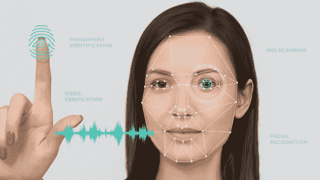
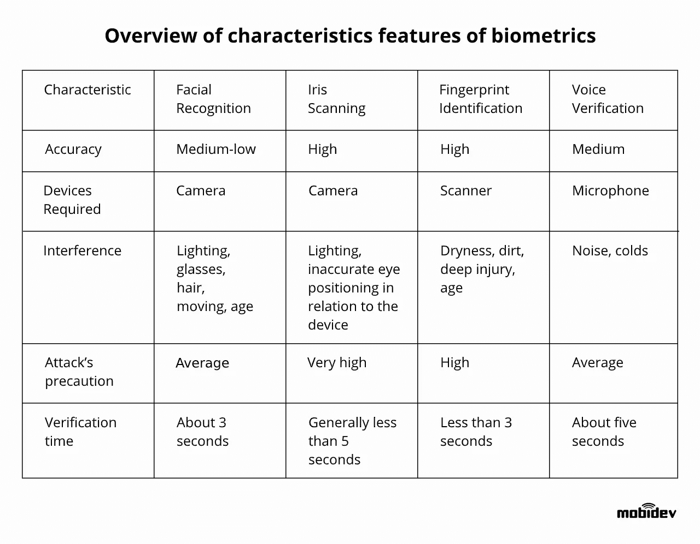
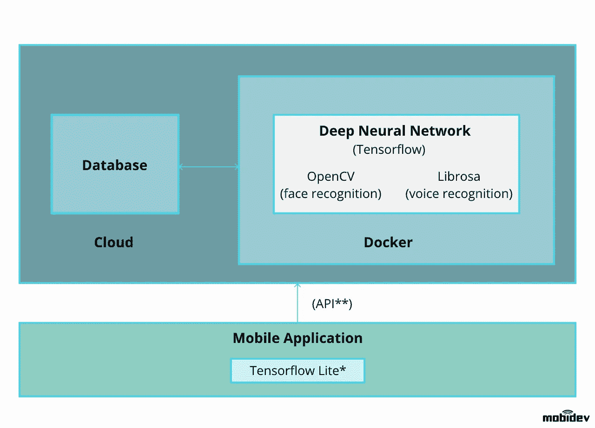

# 为什么应该在安全系统中使用多模式生物识别验证

> 原文：<https://towardsdatascience.com/why-you-should-use-multimodal-biometric-verification-for-security-systems-f345134ffd05?source=collection_archive---------29----------------------->

## 深度神经网络，TensorFlow，OpenCV，Librosa

[Image source](https://mobidev.biz/blog/multimodal-biometrics-verification-system-ai-machine-learning?utm_source=towardsds&utm_medium=multim&utm_campaign=source1)

将机器学习技术应用于生物识别安全解决方案是当前人工智能趋势之一。本文将介绍多模态生物识别系统的开发，并阐述为什么单峰生物识别不是一个可靠的模型。

在核心层面，大多数生物特征数据可以分为两类:

还有**行为生物识别**，包括手势、手写文本、声音识别和行走模式。

还有**物理生物识别**，包括指纹、静脉、虹膜和面部识别，以及手的几何形状。

[数据科学顾问](/data-science-consulting-from-idea-to-deployment-ea8efed8c388)可以利用 ML 的能力来挖掘、搜索和分析大数据集，以提高生物识别安全系统的性能和可靠性。

# 人脸识别

[面部识别](/how-to-build-a-face-detection-and-recognition-system-f5c2cdfbeb8c)算法分析人脸上的 64 个参考点，如鼻子的水平和垂直长度、鼻孔的宽度、下巴的尺寸、颧骨和前额的位置以及两眼之间的水平距离。

接下来，形成面部特征的维度描述符向量，并通过确定[该新面部和数据库中每个其他面部之间的欧几里德距离](/distance-functions-in-machine-learning-a-primer-in-simple-language-with-few-action-points-f5e328759b24)来与数据库图像进行比较。如果存在匹配，它将被标记。

然而，问题是存在的。在社交媒体和其他照片公开来源的时代，获得一张人的照片可能是微不足道的。生物识别的主要安全因素之一是确认用户的面部是“活的”。

面部识别需要两个主要策略:

1.  首先，[活体检测](/anti-spoofing-techniques-for-face-recognition-solutions-4257c5b1dfc9)——确定所述图片不是任何类型的遮罩或经修改的图像，并使用反欺骗技术来确认摄像机前的人是活体。
2.  第二，[将照片与正式的身份证明](/how-to-use-optical-character-recognition-for-security-system-development-9dc57258afa3)——将提交的自拍照片与某种正式的身份证明进行交叉比对。这种方法使用光学字符识别技术，对照正式的身份证明检查图片上的文字。正式身份证件上的数据可以作为一个有价值的指标。

# 声音识别

在生物特征验证系统中，语音验证是最具成本效益的系统之一，因为它只需要一个能够进行语音分类的应用程序和一个捕捉语音的麦克风。

为了产生用于验证的高质量语音样本，应该要求用户说出由单词或数字组成的密码短语。处理语音识别的算法能够辨别单个说话者的语音中的特征和模式之间的相似性和差异。一旦声音样本被读入，它就可以直接与先前已经被分析并存储在预先存在的数据库中的声音模型进行比较。

值得注意的是，语音识别技术的当前状态并不是 100%准确或完美的。随着时间的推移，一个人的声音会因年龄、健康状况甚至情绪等因素而改变。

但生物识别领域的人工智能能够在这方面提供帮助。可以通过处理语音中常见的失真以及常规的背景噪声来训练系统。神经网络能够从遇到的这些类型的虚假输入中学习，并在分析语音样本时将其过滤掉。

# 光学字符识别

[OCR](/how-to-use-optical-character-recognition-for-security-system-development-9dc57258afa3) ，一种经典的机器学习和计算机视觉任务，用于区分物理文档数字图像中的印刷或手写文本字符，不是官方的[生物识别技术](https://mobidev.biz/blog/multimodal-biometrics-verification-system-ai-machine-learning?utm_source=towardsds&utm_medium=multim&utm_campaign=multimodal)。但是它可以用作将提供的信息与用户文档进行比较的初步工具，例如用于[驾照识别](https://mobidev.biz/blog/ocr-machine-learning-implementation?utm_source=towardsds&utm_medium=miltimodal&utm_campaign=ocr)。

# 开发多模式识别系统

在下表中，您可以找到我对生物识别解决方案比较的研究结果。

它证明了没有单一模式的生物识别解决方案能够提供足够高的安全级别来避免黑客攻击。这就是为什么应该使用多式联运解决方案。

以多模式生物特征识别为特征的系统需要确认至少两个标识符，这导致更高水平的准确性。

让我们概述一个基于语音和人脸识别技术的系统，并通过移动应用程序进行访问。

[Image source](https://mobidev.biz/blog/multimodal-biometrics-verification-system-ai-machine-learning?utm_source=towardsds&utm_medium=multim&utm_campaign=source3)

在第一阶段，潜在用户将创建一个照片印记，该照片印记将通过相机存储在相关设备上。OpenCV 库将有助于生物特征印记的转换和标准化。

然后，系统将使用 64 个面部标志解析照片。一旦映射，地标和用户面部的整体剪切图像将被输入到深度神经网络中。这个网络是在 TensorFlow 库的帮助下教授的。

一旦神经网络处理了面部图像，它将创建一个 eDNA 特征向量，该向量代表用户面部图像的所有主要生物特征。eDNA 向量通常测量大约 2048 位。

现在，可以将 eDNA 向量与系统数据库中已经存档的记录进行比较。这种方法不能被逆向工程，因为任何潜在黑客都没有能力访问数据库中的原始记录。

最后，该系统将每隔一段时间对用户的图像进行更新记录，以跟上用户潜在的变化。

在第二阶段，用户通过麦克风给出声音样本。Librosa 库接收音频样本，将其转换为可用的形式，然后将生物特征发送到神经网络(DNN)。

再一次，2048 eDNA 向量将被创建，将像语调、速度、木材、音高和神经网络已经被教导的其他方面的特征考虑在内。

通过生物特征数据的多模态组合来验证用户身份的想法越来越流行。推动采用率上升的是在识别用户时需要更高的准确性，同时击败[欺骗或黑客攻击企图](https://mobidev.biz/blog/face-anti-spoofing-prevent-fake-biometric-detection?utm_source=towardsds&utm_medium=multim&utm_campaign=antispoofing)。

由机器学习技术驱动的生物识别验证将是决定 2020 年及以后人工智能未来[的关键趋势之一。](https://hackernoon.com/the-future-of-artificial-intelligence-to-kill-or-to-heal-t6fl24sq)