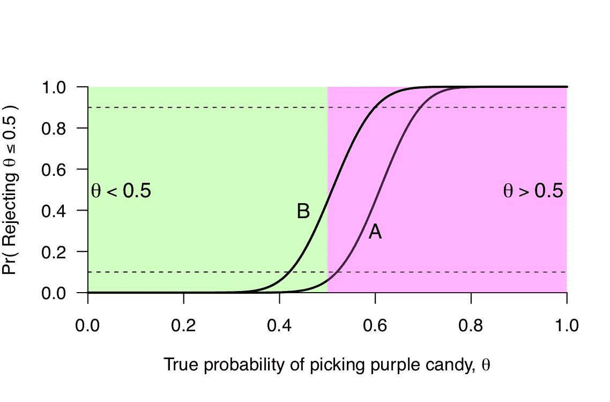

# 为什么你不应该说“这项研究动力不足”

> 原文：<https://towardsdatascience.com/why-you-shouldnt-say-this-study-is-underpowered-627f002ddf35?source=collection_archive---------5----------------------->

## 确保我们对权力的批评是相关的、清晰的，并基于良好的统计数据

最近在 Twitter 上，我批评了声称实验或研究“动力不足”的常见做法(有些人可能会说是“速记”)。这最终成为一条受欢迎的推文，这是我没有预料到的(这是一个相当神秘的统计点)，但鉴于它对实验设计中最近一些问题的重要性，我认为它值得在一篇博客帖子中重新审视。

首先，我们必须谈谈什么是权力，因为——具有讽刺意味的是——这被所有人误解了，包括统计改革运动。那些抱怨价值观被误解的人会继续搞砸权力。

正如我上面所说的，首先要澄清的是，学习或实验并没有动力不足；相反:

> 一个**设计和测试组合**可能不足以检测感兴趣的**假设效应大小。**

看到这一点的最简单的方法是，我可以选择对来自同一设计的数据应用许多测试；例如，我可能会选择使用符号检验、t 检验或 Wilcoxon 检验；我可能会选择检验一个关于方差而不是均值的假设，或者关于组中最小或最大观察值的假设。所有这些测试都有不同的“效果大小”，并且它们都可以应用于相同的设计，但是每一个都依赖于不同的数据汇总作为统计证据。功效还取决于“决策”标准的选择，该标准通常是参照选定的(但可变的)α(I 型误差)概率来选择的。

关于权力，有一个微妙但重要的点经常被忽略。定义中未提及所述效果大小的*实际值*。很奇怪，对吧？大多数人似乎认为，如果真的有影响的话，权力就是被计算出来的真实价值。这是一种误解。这将使显著性测试成为一种伪贝叶斯测试，我们需要指定一些我们认为似乎合理的量。但这不是显著性检验的工作方式。

相同的设计和统计测试组合具有**相同的功效(曲线)**，无论我们是否将其应用于具有大的、容易复制的效果的 Stroop 实验，或者说，没有任何效果的超感官知觉实验。有些人觉得这很奇怪，但这正是我们在其他情况下对敏感的看法。着火房屋中的相同设计的烟雾报警器与未着火房屋中的具有相同的灵敏度，因为灵敏度是基于*反事实*状态，而不是世界的*实际*状态。*可能是什么*，而不是*是什么*。

想象一下，如果不是这样:一个住在没有着火的房子里的人可能会说他们的烟雾报警器“功率低”(灵敏度)，仅仅是因为它从来没有响过。这类似于一些人试图从数据中“估计”功率的方式(例如，特设功率，或[估计“未知”功率](https://journals.sagepub.com/doi/abs/10.1177/0956797617723724))。事实上，这类工作与统计能力没有任何关系，除了数学方程式是相同的这一点。

我们最好考虑一下“设计灵敏度曲线”，而不是“功率”这个令人困惑的怪物。谈论第一类和第二类错误/概率(以及“自然状态”)使人们认为这些是离散的、真实的概率，而不是在*曲线上反映*可能性*。*

让我们建立一个例子。有几分钟的时间，忘掉α、β以及 I 型和 II 型误差“率”。

## 榜样的力量

假设我为一家糖果公司工作，已经决定我们的新糖果要么是绿色的，要么是紫色的。我们的任务是找出人们更喜欢绿色还是紫色的糖果，所以我们设计了一个实验，我们给人们两种糖果，看看他们先拿哪个。对每个人来说，答案不是“绿色”就是“紫色”。我们先把θ称为选紫色的概率，所以我们感兴趣的是θ是否> . 5(也就是优先选紫色)。没有理由我们不能测试糖果制造商可能感兴趣的其他假设(例如，θ>.7，“紫色基本上是首选”)；我们只是为了演示而构建这个测试。

Power/sensitivity curves for the candy example. The green region (left) represents when green candies are preferred; the purple region (right) represents when purple candies are preferred). A is the curve for deciding that “purple is preferred” when 31 or more people pick purple first; B is the curve for deciding that “purple is preferred” when 26 or more people pick purple first.

假设我们的设计是 N=50 人选择糖果色。我们现在需要一个测试。显然，在这种情况下，数据中的证据是由我们观察到的首先选择紫色的人数携带的。因此，我们为这个数字设定了一个标准，例如:“如果 31 人或更多人选择紫色，我们就说紫色是首选(即θ>.5)”。我们现在可以绘制设计和测试的功效/灵敏度曲线，给出所有潜在的假设效应大小(如左图所示，曲线“A”)。

“功率分析”就是简单地记录下这条曲线的特征(也许通过增加 N 来改变潜在的设计)。看曲线 a，如果首选绿色糖果(θ <.5 we="" have="" a="" very="" low="" chance="" of="" mistakenly="" saying="" that="" purple="" candies="" are="" preferred="" is="" good="" if="" substantially=""> .7)，我们很有可能正确的说首选紫色(也不错！).这些都是反事实，在任何情况下我们都可以用这种设计进行测试:糖果，真/假测试，掷硬币，等等。*这种力量不取决于什么是真的，只取决于什么可能是真的，以及我们如何设置设计/测试。*

现在让我们考虑这个设计的另一个测试:“如果 26 个或更多的人选择紫色，我们就说紫色是首选(θ>.5)”。这可能是因为每当数据似乎“偏爱”紫色时，我们就会声称紫色是真正的首选。这是上图中的曲线“B”。让我们做一个功率分析。如果紫色基本上是优选的(θ>.7)，我们基本上肯定正确地说紫色是优选的(好！).如果绿色糖果是首选，(θ <.5 we="" could="" have="" a="" high="" chance="" of="" mistakenly="" saying="" that="" purple="" candies="" are="" preferred="" is="" bad=""/>

Crucially, what determines our judgment about a power/sensitivity curve is whether it meets our purposes. We want to be sufficiently protected from often making false claims (saying “purple is preferred” when green actually is), and we want to be able to say “purple is preferred” when it is to some important degree. What is important is determined by us. Do I care if purple candies are preferred at θ=.500001? No. I don’t care about detecting effects that small. But if 70% of the time people reach for the purple candy, (θ> .7)，我会在意。所以我确保我的能力/灵敏度曲线在那个区域是高的。

设计灵敏度分析——通常称为功效分析——只是确保灵敏度在“零”为真的区域较低(用普通术语来说，“控制”α),并确保功效/灵敏度在我们关心的区域较高。这些都与从以前的结果中“估计”能量无关，也与真正的 T2 效应无关。

## 批判力

现在我们已经从正确的角度探索了权力的概念，我们可以更好地理解一个好的权力批判是什么样子的。这里有一些我们可以说的话来评论一项关于权力基础的研究。权力批判是设计批判！

先挑效果尺寸:**“这种设计即使是 X 非常大的效果尺寸，灵敏度也很差；这个实验一开始就不应该做。”**这是非常令人信服的设计评论，即使在研究完成之后。你不会因为一项设计糟糕的研究碰巧“意义重大”而得到好评。然而，重要的是，这种批评涉及到批评家承诺*某种*效果大小的兴趣。没有这种承诺，你就不能做出权力批判。“这个样本量感觉小”不够好。

首先选择功效:**“这种设计不超过 0.5 的功效来检测像 x 一样大的效果尺寸。看起来作者想要检测一种效果，如果它确实那么大的话”**。许多人很难理解什么是“重要的”效应大小。我同情；这就是为什么我认为选择 0.5 的“基础”功率，然后计算出 0.5 功率的效果大小比*选择*一个*足够重要的效果大小更容易。如果功率是 0.5，你会经常错过一个效果，因为检测到它，所以功率 0.5 是一个很好的起点来评估一个设计。这不是终点，但它可以很容易地捕捉到非常糟糕的设计。*

关注设计的其他方面:**“感兴趣的测试是适当的，但所选设计中的样本量太小，以至于很难或不可能检查测试的假设。”这是对可能导致你质疑结果的事物的敏感性的批判。数据分析的一个关键部分是质量控制，如果你不能在你感兴趣的分析之前进行质量控制，你应该对你的分析没有信心。设计计划不仅应该包括感兴趣的测试/效果，还应该包括任何质量检查。**

重要的是，这些批评是实验设计，而不是结果。你可以超越设计评论；另一方面，如果所讨论的影响是显著的，这意味着影响的大小必须非常大，因为如果它更小，它几乎没有机会被发现。鉴于什么可能*实际上*是真的，科学判断随后对结果的合理性发挥作用。但这种扩展不是权力批判，当他们的实际批判是一种似是而非的批判时，批评家不应该躲在“权力”的背后。似是而非的评论很难做出，因为它们是主观的，但是你必须拥有这种主观性并为之负责。

关于这个问题的更多信息，你可以参见 [Mayo 和 Morey(预印本)](https://osf.io/nepx9/)关于为什么涉及所谓的“后验预测值”或“错误发现率”的功效批评是有问题的(最多),或者 [Morey 和 Lakens(预印本)](https://medium.com/@richarddmorey/new-paper-why-most-of-psychology-is-statistically-unfalsifiable-4c3b6126365a)关于为什么功效在流行的复制研究中构思不佳。是的，我写这篇文章是为了拖延那些论文的修改和提交，但是我希望它是一个好的入门。