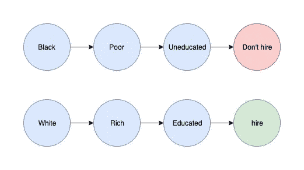

# 为什么你的人工智能可能是种族主义者，该怎么办

> 原文：<https://towardsdatascience.com/why-your-ai-might-be-racist-and-what-to-do-about-it-c081288f600a?source=collection_archive---------13----------------------->

Individually reasonable correlations can cause an AI to gain a racial bias

即使是设计良好的人工智能系统也可能最终出现偏差。

这种偏见会导致人工智能表现出种族主义、性别歧视或其他类型的歧视。完全出于偶然。

这通常被认为是一个政治问题，并被科学家忽视。结果就是只有非技术人员写这个话题。

这些人经常提出政策建议，以增加人工智能研究人员的多样性。

具有讽刺意味的是令人震惊的:一个黑人人工智能研究人员不会建立一个与白人人工智能研究人员有任何不同的人工智能。这使得这些政策建议本身带有种族主义色彩。出于其他原因，增加人工智能研究人员多样性仍然是有意义的，但它肯定不会有助于使人工智能系统不那么种族主义。

> 人类中的种族主义是一个社会问题，但人工智能中的种族主义是一个工程问题。

人工智能中的种族主义需要像任何其他类型的工程问题一样得到解决。政治化很可能适得其反，弊大于利。

# 那么，一个人工智能怎么会是种族主义者呢？

好消息是:

人工智能没有自己的政治议程。只有当它被训练成种族主义者时，它才是故意的种族主义者。

坏消息是:

一不小心把一个 AI 训练成种族主义者是非常容易的。

在这篇文章中，我将解释种族偏见是如何出现在人工智能中的。我还将讨论一些在技术层面上处理这个问题的方法。

(顺便说一句:同样的论点也适用于对女性的偏见或其他类型的歧视。)

## 1.偏置数据

通过对有偏差的数据进行训练，有可能使人工智能有偏差。除非你非常小心，否则这很容易意外发生。

以这篇文章为例，关于一个在公共数据上训练的人工智能。人工智能最终带有种族偏见，因为它的训练数据是基于互联网:【https://www.theregister.co.uk/2019/09/05/ai_racist_sexist/

众所周知，互联网不是最好的地方。经过训练的人工智能会接受它的先入之见，结果变得很可怕。训练人工智能的一般原则是:垃圾进，垃圾出。

也有可能使用合理的数据而没有任何种族偏见，但最终仍然得到一个有偏见的人工智能:

数据集必须具有来自每个种族群体的代表性数据量。这是因为人工智能在学习种族方面投入的努力量与它在数据集中的频率成正比。人脸识别人工智能往往比任何其他种族更适合白人。偏斜的训练数据集是造成这种情况的部分原因。

如果你认真的话，修复这个问题并不太难。通常，您可以更加努力地选择您的数据集，因此它包含更少的偏见，并且具有更具代表性的种族分布。

如果做不到这一点，至少可以用关于数据来源的指示变量来注释数据。通过这种方式，你可以教会人工智能显式地对训练数据中的偏差进行建模。之后，挑选最种族主义的数据来源。告诉人工智能忘掉任何与其他数据不同的东西。这就像指着最种族主义的人，命令人工智能不要模仿他们。这不是一个完美的解决方案，但总比没有强。

请注意，即使培训过程是公正的，也可能出现问题。有可能某个特定的人工智能算法只是客观上在某些任务上不如其他算法。

举个例子:自动驾驶汽车在夜间探测黑人比白人更困难，因为他们的皮肤在黑暗中更难被看到。这不是种族歧视，只是不幸。不过，这显然还是个问题。为了解决这个问题，你需要确保你付出了适当的努力来教会人工智能如何解决这些更困难的任务。

# 2.相关性不等于因果关系

一旦训练数据是公平公正的，我们仍然要处理 AI 本身的一个问题。如果你在这里使用神经网络，或者其他东西，这并不重要。事实上，所有流行的人工智能形式都存在这个问题:

我们的核心问题是，人工智能不知道它的任何输入在现实中意味着什么。

人工智能只是获得数字作为输入，而不理解它们在现实世界中的含义。它必须自己学习因果关系，但它只能猜测，而且往往会被证明是错误的。

例如，假设我们正在训练一个人工智能来接受或拒绝工作申请。这个城市的一个街区是犯罪猖獗的贫民区。该地区所有以前的申请者都是坏人。人工智能“知道”来自这个地区意味着你是一个糟糕的申请人。现在，人工智能收到了一份新的申请:一位年轻的黑人女性，她获得了诺贝尔奖。那个女人真的运气不好:人工智能不知道什么是“诺贝尔奖”,因为它以前从未在申请中遇到过。它只是注意到她来自同一个社区，在她之前的每个人都很糟糕。所以人工智能立即拒绝了这个申请。

更糟的是:

许多机器学习算法是无法解释的。这意味着不可能让人工智能解释其决策背后的原因。

有些算法是可以解释的，比如决策树。你可能会认为在可解释的算法中检测种族主义很容易。这只是部分正确。

在一个可解释的算法中，你可以直接检查“种族”是否被用来做决定。然而，这并不能让你注意到间接的相关性。也许人工智能“知道”在某个特定的街区长大会成为一个糟糕的候选人。恰好以黑人为主的街区。发现这种相关性并解释它们需要付出努力。

因此，为了防止种族偏见，我们必须找到一种方法来检测虚假的相关性。但是我们不能直接检查种族对数据的影响。这还不够，因为我们不能排除仍然导致种族偏见的间接相关性。

更糟糕的是:我们有时*确实*得到了种族和其他属性之间的真实关联。举个例子，我们正在建立一个医疗诊断系统。我们确实希望人工智能了解到一些疾病在不同种族中出现的频率更高。如果我们盲目地消除医学诊断系统中的所有种族相关性，我们可能会害死很多人。

**那么我们能做些什么来解决这个问题呢？**

我不能给一个明确的答案，因为这是一个极其复杂的问题，有很多特殊情况。以下方法可以作为基线，但绝不是完美的:

首先，确保你明确地使用种族作为你的人工智能的输入。这与你通常在政治正确性讲座中听到的相反。与人类不同，人工智能没有隐含的偏见，也不会采纳其创造者的任何偏见。这意味着，将种族作为一个特征加入进来，可以更容易地检验偶然的相关性，而且没有负面影响。

创建一个生成性对抗网络(GAN)。训练 GAN 制造假的训练数据。

这照顾到了数据中任何偶然的相关性:GAN 创建的假货将以人工智能无法区分的方式创建。这并不能保证人工智能不会学习虚假的相关性。那项任务是不可能的。然而，这将保证人工智能在后期阶段无法绕过自己的反种族主义机制。

现在到了棘手的部分:挑选一些你认为不应该影响预测的训练数据的特征。对于训练数据中的任何人，你现在可以要求 GAN 生成一个不同种族的“等同”人。在生成这些假人物时，您必须只改变所选的安全特征。这确保了假的人是真实的，但没有奇怪的特征，会摆脱预测。

现在，您可以创建假数据来减少数据集中的偏差。因为这些赝品只是在与任务无关的特征上有所不同，所以这不会有任何负面影响。

请注意，这只有在您对可能被更改的特性做出了正确选择的情况下才有效。

也有可能 GAN 将不能仅使用不相关的特征来创建任何好的赝品。如果发生这种情况，你可能在数据中有很多真正的种族关联。

一旦完成 GAN 的训练，实际的预测部分就开始了:

在现有 GAN 的鉴别器网络之上，构建您的主 AI 系统，即应该做出预测的系统。这确保了预测器网络将只使用我们知道不能包含种族偏见的派生要素。

现在用你所有的数据训练新系统。

在培训期间，你可以明确测试种族歧视。对于任何给定的人，你可以创建另一个种族的等效人，并测试该人的预测是否不同。通过对每个这样的案例给出负面反馈，你可以直接惩罚 AI 中的种族主义。

你现在有了一个训练有素的神经网络，它可以做你想让它做的任何事情，而且不太可能有种族偏见。

## 放弃

你不应该只是盲目地按照我刚才描述的方式来实现它。根据你的使用情况，可能会有很多副作用。它增加了许多复杂性和多重交互，这可能会在许多方面适得其反。这实际上只是对种族主义人工智能问题在理论上如何解决的一个概括描述。它还没有准备好实施。

**如果有人有更好的方法，我欢迎在评论中听到。**

还要注意，这给模型训练增加了很多开销。它可能会降低人工智能的性能，这是一个副作用。

如果人工智能也更笨，犯更多的错误，那么拥有一个更少种族歧视的人工智能值得吗？如果那个人工智能做出生死抉择呢？在这里，你如何量化什么是值得的权衡呢？这是一个政治问题，我不会用十英尺长的杆子去碰它。

您从这篇文章中应该得到的主要收获是:

1.  AI 很容易一不小心就种族歧视了。

2.防止这种情况非常困难。

3.这主要是一个工程问题，而不是社会问题。