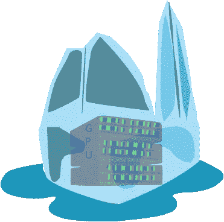

# 为什么你的机器学习模型可能正在融化冰山。

> 原文：<https://towardsdatascience.com/why-your-machine-learning-model-may-be-melting-icebergs-75985dc749d3?source=collection_archive---------29----------------------->

像你们中的许多人一样，我自学了机器学习，我还记得我第一次在模型训练中离开笔记本电脑的那一天，风扇嗡嗡作响，几个小时后回来时发现它仍然嗡嗡作响。“嗯”，我想，“也许我需要一个 GPU”。各位 DIY 思想家:试图拆开一台旧的 Xbox 不是一个好主意，但是你可以[自己组装一台。](/building-your-own-deep-learning-box-47b918aea1eb)在更久以前的日子里，我家的能源使用有时会在玩视频游戏和开空调之间做出选择:下雨的夏日午后，Xbox 风扇和额外的外部 Xbox 风扇都在与视频游戏和其他电子武器争夺声音优势。那是关于能源效率的讨论引发气候变化辩论之前的日子。现在我们有“绿色 AI”和“红色 AI”。

**人工/增强智能(AI)中所有新计算能力的碳足迹是多少？**什么是「绿色 AI」对「红色 AI」？对于那些需要快速查看的人来说，“绿色人工智能”是经过优化的人工智能，可以最大限度地减少资源利用和环境影响，无论是通过数据中心资源优化，平衡训练数据要求与准确性，选择资源密集度较低的模型，还是在某些情况下转移学习与新模型。另一方面，红色人工智能:胡安·德·迪奥斯·桑托斯上个月在他的文章中做了很好的工作，提供了更详细的评论。

在马萨诸塞大学的一项研究中，研究人员使用二氧化碳磅数作为“红色 AI”水平的相对测量值。他们估计从纽约到旧金山的一次往返飞行的载荷为 1984 磅。记住这个数字，你可以在高速沙丁鱼罐头中享受近 40 次海岸到海岸的飞行，以匹配 NLP 训练、调整和实验管道的二氧化碳当量(78，468 磅)。

如果你想为语言翻译开发一个完整的“Transformer”模型，并平衡该模型的碳足迹，那么你和你的四个朋友可以步行或骑自行车，并选择十年内不开车(普通客车每行驶一英里排放 0.78 磅二氧化碳)。你可以像我们在荷兰的朋友在这个[视频](https://www.youtube.com/watch?v=SYwUUyz6CDA)中一样享受在户外的旅行(视频时长 4 分钟，配有适合办公室的音乐)。

**我们怎样才能最大限度地减少这种“红色艾”能源对环境的影响？**已经尝试使用深度强化学习来解决冷却成本，如本[研究](https://arxiv.org/pdf/1709.05077.pdf)中所述，该研究将冷却成本降低了约 11%(超过手动配置的算法)。像碳继电器这样的公司正在将最大化数据中心的能源效率作为他们使命的一部分。

[其他人](https://arxiv.org/abs/1907.10597)已经提议将模型效率和成本与模型的准确性一起发布，以提供对机器学习解决方案的整体价值和成本的更平衡的分析。当涉及到医学诊断时，每项医学测试的真实成本最终会转嫁到病人身上。

随着世界各地的公司在人工智能和宣传自己对环境更加敏感方面取得进展，他们是否会根据云提供商的“绿色能源”选择做出这些选择将是一件有趣的事情:

随着越来越多的人工任务被人工智能自动化和优化，能源平衡正在发生变化，并为节省成本和最大限度地减少环境影响创造了机会。或者也许当我们“重启人工智能”时，这一切都将改变，正如我正在阅读的这本新书所建议的那样…

*图片由* [*詹姆斯·杜塞特*](https://www.linkedin.com/in/james-doucette-1698a3ba/?originalSubdomain=ca)