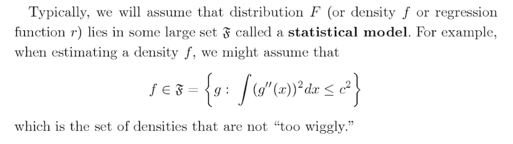
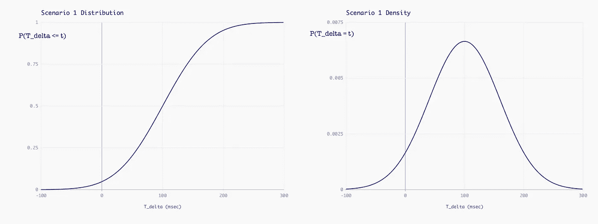
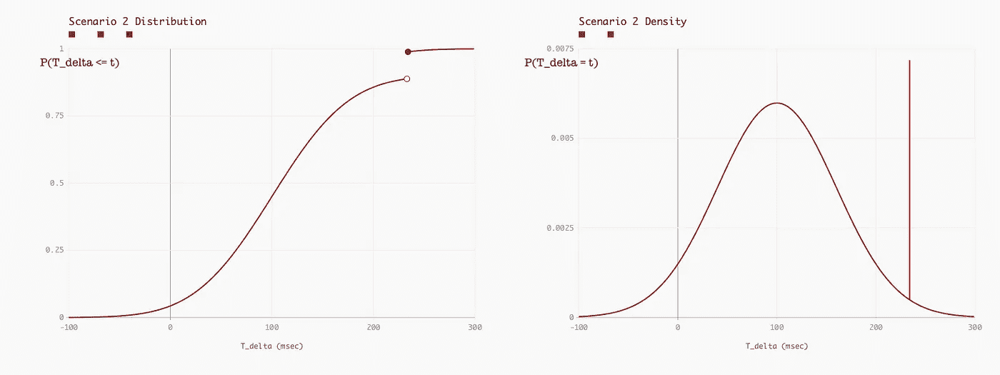

# 波动分布和非参数

> 原文：<https://towardsdatascience.com/wiggly-distributions-and-nonparametrics-4e277e3939cf?source=collection_archive---------20----------------------->

拉里·乏色曼的书，*所有的非参数统计，*开篇描述了当[研究非参数估计量时人们倾向于关注的分布类型:](https://books.google.com/books?id=MRFlzQfRg7UC&lpg=PP1&dq=all%20of%20nonparametric%20statistics&pg=PA3#v=onepage&q&f=false)

茱莉亚"[@ bork](http://twitter.com/b0rk)"埃文斯对这本书的介绍做了一个[的删减](https://jvns.ca/blog/2018/12/29/some-initial-nonparametric-statistics-notes/)，她问道:

> 不满足[积分]的概率密度函数的例子是什么？(可能是有无穷多个微小摆动的东西，我不认为我感兴趣的任何分布在实践中会有无穷多个微小摆动？)
> 
> 为什么密度函数“过于波动”会给非参数推断带来问题？

每当我看到这样的约束，试图限制函数的光滑度，我总是立即跳到世界上最不光滑的条件:不连续。随机变量的密度或分布中的任何一种不连续性——即使是一个，即使它真的很小——都会打破乏色曼约束。

我们来说说在哪里可能会看到不连续分布！然后，*muuuuch*更投机一点，让我们来谈谈为什么它可能对非参数估计器不利。

# 场景一:定时数据库查询

假设你运行一个让人们阅读博客文章的应用程序。每当读者加载任何特定的帖子时，您的应用程序都会并行地向两个独立的数据库发出两个查询:第一个返回博客作者的个人资料图片，第二个返回博客帖子的实际文本。

您想知道哪个查询通常会首先返回，以及多长时间返回。您的直觉是，有机会使用一个空闲的获取线程来做一些其他的准备工作，同时仍然等待它的兄弟查询完成。

为了查看您的快速获取线程正在处理哪种停机时间，您修改了应用程序以开始跟踪一些统计数据，您希望对这些数据执行一些非参数估计:

*   轨迹曲线 pic 的响应时间， *T_pic*
*   跟踪博客文本的响应时间， *T_text*
*   计算差值， *T_delta := T_pic — T_delta，*并记录结果

结果是今天是你的幸运日:你还不知道，但是分布
潜在的 *T_delta* 是高斯分布，平均值为 100 毫秒，
标准差为 60 毫秒。

正如 Evans 在她的原始帖子中所示，高斯分布绝对符合乏色曼的积分条件:

因此，就乏色曼的介绍来说，你想对这些数据进行的任何非参数估计，大部分结果应该是好的。或者至少，你会对该估计量的性能有一个很好的感觉:乏色曼的书提供的任何误差界限和保证仍然适用于你的数据，因为它的基本分布是如此平滑和良好。

为了便于我们稍后进行比较，下面是这个漂亮、平滑的高斯函数的分布和密度:

# 场景二:定时数据库查询，但有时会出问题

让我们像场景一中一样重新设置一切——两个查询，两个
响应时间，记录差异。除了现在想象一下，每隔一段时间，一些幽灵虫就会出现。对于一些病理病例，图片总是比文本多花*234 毫秒的时间来加载。*

(例如:也许一个善意的开发人员已经包含了一个代码路径，它只意味着在单元或集成测试期间出现。出于测试目的，能够控制相对的数据库获取时间是很好的。因此，令人难忘的人类神奇数字“234”除了不知何故，只应该在测试时发生的事情已经泄露到生产中了！)

在这种情况下，分布 *P(T_delta ≤ t)* 将在精确的 *t =* 234:

注意，重要的不是那个不连续的*大小*，而是它根本就是不连续的。即使只有百万分之一的 *T_delta* 是病态的 234 毫秒，右边的密度图仍然会有一个巨大的无限高的脉冲峰值。

# 这对非参数化意味着什么？

这种分布给我的印象是超级不平滑。我不是一个伟大的测量理论家，但我不认为这是可微的，更不用说满足乏色曼约束的密度了。事实上，在介绍的下一部分，乏色曼谈到了处理密度绝对连续或密度离散的情况，这让我想知道是否有像场景 2 这样的混合情况的计划。

这就是我不得不承认没有真正读过这本书的地方。也许在商店里有一个答案！

但是除此之外，我可以尝试一下为什么像场景 2 这样的混合分布在处理非参数方面特别棘手。

想象我们正在执行[核密度估计](https://en.wikipedia.org/wiki/Kernel_density_estimation)。这很像绘制直方图，但是没有你在面元之间看到的粗糙的边界跳跃。直觉告诉我们，如果我们观察到，比如说， *T_delta* = -30.5 ms，我们应该稍微涂抹一下。就像它在告诉我们，“不仅-30.5 毫秒是一个可能的结果，而且这可能意味着附近的值也是可能的。”我们将-30.5 毫秒出现在我们的数据集中视为一个理由，以增加我们对-30.8 毫秒和-29.2 毫秒以及其他类似值可能在未来出现的信念。

对于一个好的，平滑的分布，我可以看到这种情况。我敢打赌，对于漂亮、平滑的分布，在查看了从分布中抽取的 *N* 之后，你可以得到内核密度估计有多不正确的一些不错的误差界限。平滑度确实意味着观察到 *x* 的概率与看到 *x +/- ε* 的概率差不多。

场景 2 不是这样的，不是以同样的方式*。*因为有一个神奇的数字——234 毫秒——任何对该值的观察都与其余的 *T_delta* 空间完全不同。对于这些样本来说，密度在 234 ms 左右变化太快，无法进行健康的内核密度估计。不管分布的不连续间隙有多大，都是如此。

要考虑另一个非参数估计量，考虑场景 2 中的 bootstrap 抽样。您的引导亚群不包含任何*假的 234 ms 点的情况看起来与场景 1 完全一样——也许这些情况差异很大，使得它更难与其他样本结合。这种少于 234 的情况多久出现一次？*独家* -234 案呢？这些疯狂的样本对你的评估过程有什么影响？*

因此，场景 2 的误差范围现在不仅取决于你观察到的抽取次数，还取决于抽取病理性 234 ms 病例的普遍程度。乏色曼书中的误差范围可能没有给这种自由度留有余地。

虽然，如果这本书涵盖了所有非参数统计的*所有*,一定有关于这些混合密度的*一些东西*！我应该…读这本书。