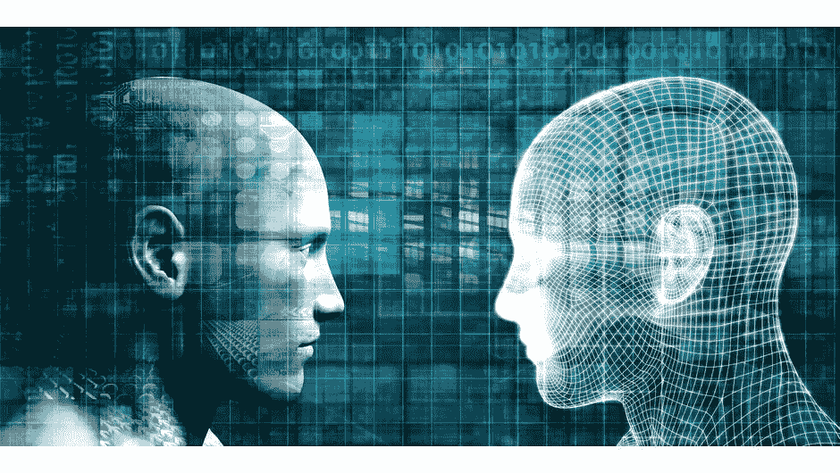
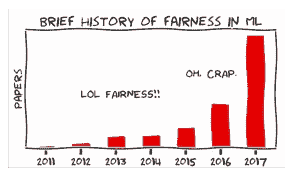
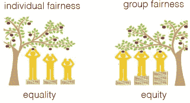

# 野生人工智能:负责任的数据科学

> 原文：<https://towardsdatascience.com/wild-wide-ai-responsible-data-science-16b860e1efe9?source=collection_archive---------16----------------------->

## 谁先开枪——新种族还是人类？

数据科学可以为我们做好事:它改善生活，让事情更有效率，更有效，并带来更好的体验。然而，数据驱动的分析已经出现了一些失误。以下是一些有意或无意滥用数据科学工具的例子:

*   2012 年，一组来自华尔街日报的调查记者发现，跨国供应零售公司 Staples 向生活在更富裕社区的买家提供更低的价格。史泰博的意图是为住在竞争对手商店附近的顾客提供折扣。然而，他们的竞争对手倾向于在富人区建商店。基于位置和社会地位之间的相关性，这导致了基于种族的价格歧视。史泰博和顾客都不知道这个副作用，直到一组调查记者发现了它。
*   2015 年，AdFischer 项目通过模拟证明，合成男性在线资料显示高薪工作广告的频率明显高于女性资料。结果是明显的基于性别的就业歧视([来源](https://www.theguardian.com/technology/2015/jul/08/women-less-likely-ads-high-paid-jobs-google-study))。由于在数据驱动的算法管道中有意或无意地缺乏责任感，这项研究开始浮出水面。
*   2016 年，ProPublica 的调查人员发现，法官在法庭上预测未来犯罪的软件往往不正确，而且具有种族主义色彩:黑人被贴上更高风险标签的可能性几乎是白人的两倍，但重新犯罪的可能性较小。该工具在白人中犯了相反的错误:他们比黑人更有可能被贴上低风险标签，但却继续犯下其他罪行。ProPublica 的研究非常有影响力。他们在 GitHub 上以 [Jupyter 笔记本](https://github.com/propublica/compas-analysis)的形式发布了数据集、数据方法以及数据处理代码。这一惊人的结果确实说明了这些工具的不透明和缺乏公平性，尤其是当它们被用于公共部门、政府和司法系统时。

# 数据科学公正吗？

人们经常声称数据科学是算法科学，因此不能有偏见。然而，我们在上面的例子中看到，所有传统的歧视罪恶都在数据科学生态系统中展现出来。偏差在数据和过程中都是遗传的，被推动和放大。

透明度是一种理念、一种思维模式、一套有助于防止歧视、促进公共辩论和建立信任的机制。当我们做数据科学时，我们与社会互动。我们做决定的方式必须是在一个我们从参与者和公众那里得到信任的环境中。单靠技术解决不了这个问题。用户参与、政策努力很重要。

# 数据责任

数据科学生态系统中的责任包括:公平、透明、多样性和数据保护。负责任的数据科学领域非常新，但已经处于所有顶级机器学习会议的边缘，因为这些是困难但有趣的相关问题。

Moritz Hardt

**什么是公平？**

哲学家、律师、社会学家多年来一直在问这个问题。在数据科学的背景下，我们通常解决预测分析的任务，根据过去或现在的一些观察(数据集)预测未来的性能或行为。当用于解决此类任务的模型与数据不符时，就会出现统计偏差。有偏差的模型不知何故是不精确的，不能正确地总结数据。当数据或模型不能正确代表世界时，就会产生社会偏见。当数据不具有代表性时，就会出现一个例子。如果我们只使用警察一次又一次去同一个街区的数据，并且我们只使用这些特定街区的犯罪信息，情况就是这样。我们对世界的定义也可能导致社会偏见。我们试图用预测分析影响的是现实世界还是理想世界？谁应该决定世界应该是什么样子？

**什么是歧视？**

在大多数法律制度中，有两个概念界定歧视:

*   区别对待是指基于受保护的特征(如种族、性别、年龄、宗教、性取向或国籍)而区别对待某个实体(如债权人或雇员)的非法行为。完全不同的待遇出现在对接受治疗的个人有一些好处或带来一些伤害的情况下，例如对他们判刑或允许他们上大学或给予他们信贷。这是一些实际上有切实的积极或消极影响的事情。
*   完全不同的影响是系统的完全不同的待遇的结果，在这种情况下，在
    受保护阶层的成员身上观察到不相称的不利影响。不同的国家保护不同的阶层或亚人群。

当我们谈论歧视时，我们会使用一些让人不舒服的术语，比如种族主义、性别、性取向。极端意义上的政治正确在这些关于负责任的数据科学的辩论中没有位置。我们必须能够说出概念的名称，才能谈论它们。一旦我们可以谈论这些概念，我们就可以采取纠正措施。

**公平的技术定义**

让我们考虑将结果分配给群体成员的供应商。这是最基本的情况，一个二元分类。积极的结果可能是:提供就业，接受学校，提供贷款，提供折扣。消极的结果可能是:被拒绝就业，被学校拒绝，被拒绝贷款，不提供折扣。在公平方面，我们担心的是结果如何分配给人口中的成员。让我们假设 40%的人得到了积极的结果。然而，这一过程可能会对一些亚群体进行不同的处理。让我们假设我们提前知道亚人群是什么，例如红头发的人。因此，我们可以把我们的人口分为两类:红头发的人和没红头发的人。在我们的例子中，我们观察到 40%的人得到了积极的结果，只有 20%的红发人得到了积极的结果。另一组的 60%得到了积极的结果。在这里，根据一些定义，我们观察到对红头发人群的不同影响。表示这种情况的另一种方式是统计奇偶性失效。这是不带条件的公平的基线定义。在现实生活中使用这种评估相当复杂，例如在法庭上。这一公平的基本定义已写入全球许多法律，它规定接受任何结果的个人的人口统计数据与潜在人口的人口统计数据相同。

**评估不同的影响**

供应商可以说他实际上并不打算或者根本没有考虑头发的颜色，而头发的颜色恰好是数据集中的敏感属性。取而代之的是，卖主会说他决定给头发长的人积极的结果。该供应商否认了这一指控，并表示他没有基于头发颜色进行歧视。问题是供应商对红发人产生了负面影响。我们关心的不是意图，而是对亚人群的影响。换句话说，致盲不是法律或道德上的借口。从供应商的结果分配流程中删除头发颜色并不能防止歧视的发生。完全不同的影响在法律上是根据影响来评估的，而不是根据意图。

**减轻不同的影响**

如果我们检测到违反统计奇偶性，我们可能想要减轻。在一个我们可以分配许多积极结果的环境中，我们必须交换一些结果。我们必须从非红发群体中的某个人那里获得积极的结果，并将其传递给红发群体中的其他人。不是每个人都同意交换结果。一个曾经得到积极结果的人将不再得到它。这将导致个人公平。它规定任何两个在特定任务中相似的人应该得到相似的结果。群体公平和个人公平之间存在一种不容易解决的紧张关系。

**个人对群体的公平性**

个人公平和群体公平被带到最高法院的一个例子出现在 2009 年 [Ricci 诉 DeStefano 案](https://www.britannica.com/event/Ricci-v-DeStefano)。消防员参加了一次晋升考试，该部门抛出了考试结果，因为黑人消防员没有一个得分高到可以晋升。消防部门担心，如果他们承认结果而不提拔任何黑人消防员，他们可能会因歧视和不同的影响而被起诉。但是后来诉讼是由那些本来有资格升职但却因此没有升职的消防员提起的。有一个关于个人公平的争论，一个关于不同待遇的争论。他们认为种族被用来对他们产生负面影响。这个案子的判决有利于白人消防员，有利于个人公平。

个人公平是平等的，每个人都得到相同的盒子到达树。群体公平是一种公平的观点，每个人都有足够多的盒子来够到树。股权成本更高，因为社会必须加大投资。这是两种本质上不同的世界观，我们无法从逻辑上决定哪一种更好。这只是两种不同的观点，没有更好的了。他们回到了我们所认为的世界现状，一个应该有的世界。真相会在中间的某个地方。理解哪种缓解与哪种信仰体系相一致是很重要的。

# 公平的正式定义

[弗里德勒等人。艾尔。在他们 2016 年的论文中，梳理出关于公平的信念和从这些信念逻辑上得出的
机制之间的差异。构建空间本质上是世界的状态。它是由我们无法直接衡量的东西组成的，如智力、勇气、犯罪倾向和风险倾向。然而，当我们决定录取谁进大学时，我们想衡量智力和勇气。我们想知道一个人重新犯罪的倾向和他在司法中的风险倾向。这些都是展示的原始属性，不能直接访问。相反，我们着眼于**观察空间**，那里有代理，或多或少与我们想要测量的属性一致。对于智力来说，可以用 SAT 分数来衡量，勇气可以用高中的 GPA 来衡量，犯罪倾向可以用家族史来衡量，风险倾向可以用年龄来衡量。然后**决策空间**由我们想要决定的东西组成:在大学的表现和累犯。](https://arxiv.org/abs/1609.07236)

公平性在这里被定义为通过观察空间从构造空间到决策空间的映射。**个体公平(平等)**认为观察空间忠实地代表了建构空间。例如，高中的 GPA 是一个很好的衡量勇气的标准。因此，从构造到决策空间的映射具有低失真。**群体公平(equity)** 然而，从建构空间到被观察空间，存在由结构偏差、社会偏差引起的系统性扭曲。此外，这种扭曲与群体结构相一致，与我们社会中受保护群体的成员相一致。换句话说，社会有系统地歧视。

*未完待续……*

**参考资料**:Julia Stoyanovich 教授(纽约大学)在哈佛大学关于负责任的数据科学的演讲——选自 Shoshana Zuboff 的《监控资本主义的时代》一书的章节——来自 Franç ois Chollet 的《人工智能让我担心什么》一文的思考。