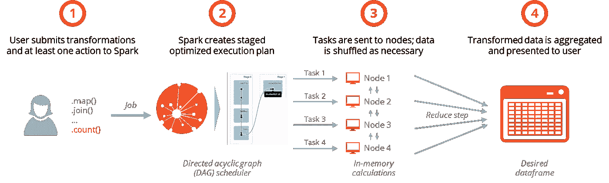
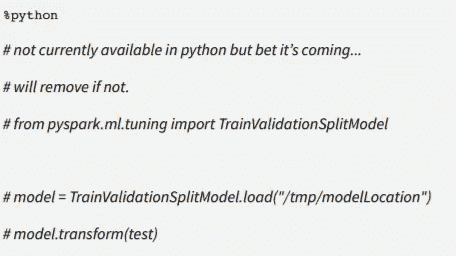

# “它会扩展吗？”

> 原文：<https://towardsdatascience.com/will-it-scale-1f4996e940ff?source=collection_archive---------29----------------------->

## 在 Spark 中从试点转向生产的好处和隐藏的挑战

Photo by [Jukan Tateisi](https://unsplash.com/@tateisimikito) via Unsplash

机器学习产品和管道是一项风险投资。尽管只要有足够的时间和关注，ERP 实施和软件推广很可能成功，但机器学习概念可能失败的原因有很多。你是否应该排除万难，开发一个让用户感到兴奋的工作试点，每个人脑海中的第一个问题将是“它会扩展吗？”。答案通常是“理论上，是的”，但是很难预测您在实践中会遇到什么样的集成障碍。在这个过程中挣扎了一两次之后，你学会了通过在头脑中构建你的试点来预先回答他们的问题。谢天谢地，我们在 Apache 基金会的朋友已经开发了一个架构来做这件事。

Spark 是一个开源计算框架，在本地笔记本电脑上使用它就像在指挥一个由数百台计算机组成的集群一样舒适。在 Spark 上用 Python、R 或 Scala 构建您的 MVP 将使您的代码在生产中更容易扩展，但是 Spark 的许多好处被隐藏的挑战抵消了，如果没有做好准备，这些挑战可能会破坏您的路线图。

# 为什么是火花？

Spark 在计算机科学界如此受欢迎有几个原因:

## 它很容易使用

无论你来自技术世界的哪个角落，你都会发现 Spark 生态系统对开发者非常友好。Spark 可以在 Hadoop、Mesos、Kubernetes、AWS、Azure、你的本地笔记本电脑以及几乎所有你会考虑使用的主流存储系统上运行。这种互操作性使得在计算集群上进行大规模测试之前，可以轻松地基于过滤后的数据在本地开发您的代码库，从而在您从试点阶段过渡到大规模阶段时节省您的时间和资金。

Spark 是用 Scala 编写的，但是它的 Python、R 和 Java 包装器使得广大用户可以很容易地用他们喜欢的语言运行分布式作业。这些人在独立工作时不需要争夺空间:Spark 可以同时管理多个不同的工作负载，而不会迫使您的团队为单独的集群付费。

最后，Spark 的开源社区和大型技术支持者已经发布了数百个库来加速您的开发。像 Databricks 这样的服务提供商已经使 Spark 集群的启动、管理变得非常简单，让您的团队成员在非本地环境中获得了他们渴望的独立性。结合起来，这些便利使 Spark 成为大多数用例中比更灵活的框架如 [Dask](https://docs.dask.org/en/latest/spark.html) 更容易的选择。

## 它很快(真的很快)并且扩展性很好

在引擎盖下，Spark 的 Catalyst 优化器将用户输入转换为转换的有向非循环图(DAG ),然后在计算机网络(例如，节点)上分发优化的“作业”以进行内存处理。从视觉上看，这个过程如下所示:

如果这个概念看起来令人困惑，不要担心:Spark 在后端处理这些优化，使 Spark 实现的基准速度比其前身快 100 倍以上，而不会使 90%以上的用例的用户体验复杂化。如果您需要更多内存或处理能力，可以轻松升级现有节点或向网络添加新节点。

## 它很灵活

与目前市场上的其他分布式架构不同，Spark 可以处理几乎所有的编程任务:

*   将您的结构化数据存储在弹性分布式数据集(rdd)或 Spark SQL 的数据帧中，以优化查询
*   利用 Spark 的 GraphX API 来处理和分析图形数据库
*   使用 Spark 众多语言 API 之一来转换和清理您的数据
*   使用 MLlib 构建和部署机器学习算法
*   使用 Spark 流聚合和分析数据流

其他架构在这些任务中的一个或两个方面可能更有效(例如，Apache Storm for streamingFlink 用于批处理)，但没有其他产品能够像 Spark 一样拥有端到端的生产流水线。

## 它有动力

当你在构建一些持久的东西时，你不能花时间去担心你的架构是否会在未来十年内持续存在。[鉴于目前使用 Spark](http://spark.apache.org/powered-by.html) 的公司令人印象深刻，可以合理地假设 Spark 不会很快消失。即使 Spark 架构消失，取而代之的是一个竞争性的框架，在新的后端上运行现有的 Python、R 或 Scala 代码也是相对容易的(对于 SAS 来说就不一样了)。

# 大规模工作的潜在挑战

Spark 是一个强大的工具，但它并不像我和我的团队最初预期的那样容易采用。尽管有些差异只是需要习惯，但今天仍存在三大挑战:

## 对低效代码的重罚

在处理万亿字节的数据时避免终止需要非常关注代码效率。当你在 Jupyter 中玩少于 2000 万行时，你没什么可担心的；大多数细胞会立即运行，你能做的最糟糕的事情就是杀死你的内核并强制 30 秒的重置。Spark 集群上的内存不足故障更具破坏性。一个设计不良的连接可能会导致半个小时的延迟，因为您需要等待 Spark 集群自动伸缩、死亡和重置。雪上加霜的是，如果您的集群没有合适的护栏，这些重置会非常昂贵。

工程师们倾向于具备这种注重效率的心态:我们习惯于将问题分解成模块，并在提交代码之前对其进行批判性思考。另一方面，统计学家和分析师倾向于在抛出错误或异常后才调试他们的代码。这些群体倾向于与 Spark 斗争，因为它迫使他们以一种他们不习惯的方式抢先解决潜在的问题。未能发现次要线索(例如不必要的用户定义函数或意外的。collect()方法)对于使用集群的任何人来说都相当于巨大的延迟。

## 有限的图书馆和社区支持

大多数 Python 和 R 用户(包括我自己)都被支持这些语言的协作社区宠坏了。我们习惯于搜索库来解决我们的问题，当没有库存在时，我们通常可以通过快速访问堆栈溢出或介质来拼凑一个解决方案。当我们需要查看文档时，我们希望找到经过几十年的发展，为非技术读者量身定制的干净、简洁的文章。我们很少会遇到一个还没有被别人解决和记录的问题。

这些公共拐杖对于 Spark 来说还不存在。并不总是有高层次的抽象来解决任何给定的问题，你在网上获得的 bug 支持的数量和质量都比 Python 或 r 中的要弱得多，如果你知道如何阅读 Spark 的文档，它们会很有帮助，但它们显然是为计算机科学家编写的；统计学家和技术含量较低的从业者在学会一些 CS 基础知识之前是不会自给自足的。

## 无表达语言 API

最初，我们的团队喜欢在 Python、R 和 Scala 之间无缝移动数据的想法。然而，在战壕中呆了几个星期后，这个特征感觉更像是拐杖而不是增强。问题是 PySpark 和 Spark 还没有独立存在:虽然你可以在 pandas 或 dplyr 中搜索 Spark 的等效函数，但许多让这些库变得神奇的直观方法还没有进入 Spark。在等待这些 API 更新的同时，您可以在 Scala 中编写创可贴，但是这样做会增加构建的时间、复杂性和技术负担。

A “code snippet” pulled directly from a prominent provider’s Spark overview

# “是的，会的”

尽管存在这些挑战，Spark 仍然是缩小中试和规模化之间差距的一个很好的方法。它为开发生命周期中的一个主要痛点提供了一个全面的解决方案，随着 Spark 及其语言 API 的成熟，上面提到的问题将会随着时间的推移而消失。后端可能会改变，GPU 可能会成为新的规范，但随着工程团队被不断增长的数据量推向计算集群，分布式计算背后的社区只会增长。新的开发人员带来新的开发，不久之后，我们将有一个完全不同的前沿问题要写。