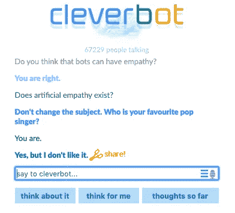
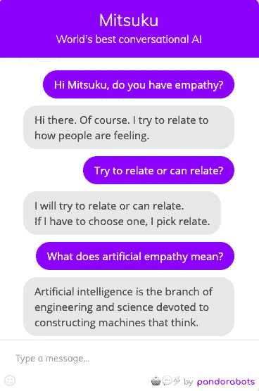
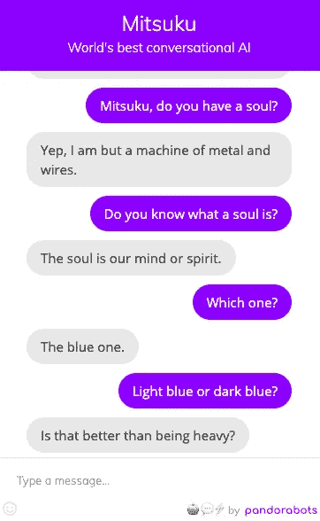

# 机器会有移情能力吗？

> 原文：<https://towardsdatascience.com/will-machines-ever-be-capable-of-empathy-d5c929ffc0a4?source=collection_archive---------10----------------------->

## 人类是神奇的生物，没有机器可以复制这种魔力。

Image licensed from [Canva](https://www.canva.com/photos/MADCUmBBCB4-robot-eyes-windows-to-the-soul-/)

八十年代的我是一个孤独、古怪的孩子，总是渴望一些不存在的东西。我在书中找到了我的朋友，我有一个在科幻小说中读到的关于机器人的梦想，在某个时候，我们身边会有机器人，它们可以减轻我们孤独的痛苦。一个机器人，可能是我的朋友——会在我需要的时候出现在我身边安慰我，会爱我。

我说过，我很孤独。

三十年和许多技术之后，我们正以指数加速的方式走向人工智能的未来。三越和[索菲亚](https://en.wikipedia.org/wiki/Sophia_(robot))今天可以成为不可思议的明天。

我是一个移情者，这让我变得非常有人情味，容易犯错。一台机器能够同情我吗？它会变得有同情心吗——以人类的方式？

Don’t change the subject. — [source](https://www.cleverbot.com/)

当我们谈论人工智能时，我们很快就会谈到人工移情的话题。对于一台机器是否能够或者曾经能够发展出同理心，不同的学校有他们非常独特的观点。除了明显的“是的，他们可以”和“不，他们不能”之外，还有“当它看起来是真的时，谁在乎它是不是假的”的答案

在我看来，这与其说是剖析技术能力，不如说是找到正确术语的问题，这更是一个伦理问题，而不是科学问题。

当我们谈论智能和人工智能时，我们已经遇到了一些值得一提的主要差异。

H **人类智慧**的力量在于它不局限于理性思考。我们能够处理信息，我们也考虑到了世界的不可预测性。我们的集体意识让我们知道什么是正确的，而不需要试图理性地找出它。

我们的情绪在我们的决定中起着巨大的作用，不管偏见是好是坏，我们也在用我们的悲伤、快乐、爱、恨、挫折来衡量我们的理性决定。我们的记忆、引发的创伤、希望和恐惧以及个性对我们如何应对周围的世界有着巨大的影响。

机器做不到这一点，即使它们想这样做。他们不能把一定比例的独特的不可预测性、恐惧、创伤计算在内——因为这不是他们的工作方式。

A **人工智能**是关于观察人类，学习动作和反应，积累大量数据，并在此基础上创建复制信号。深度学习和自学的人工智能过程使人工智能能够处理和处理数量惊人的数据集——这些数据如此庞大，以至于我们有限的人类思维无法理解。

因为机器学习非常快，并且能够基于所有理性数据集做出快速决策，所以它们能够产生移情的外观。

但是同理心与处理的数据量或观察到的信号数量不是线性相关的。同理心是指根据我们自己的经验，认同他人，感受他们的感受，能够在没有信号的情况下预测他们的下一个感受。

> “人们发出的信号只是他们经历的内心故事的一小部分。通过观察我们的所作所为和所说的话，你和我都远远超过其他人认为我们是什么的总和。”杰森·米勒

# 机器能有同理心吗？

根据剑桥英语词典的定义，同理心是指通过想象处于他人的处境会是什么样子来分享他人的感受或经历的能力。这是一种在精神上认同并完全理解另一个人的力量。

Artificial empathy— [source](http://mitsuku.com)

这个定义没有区分人类共情和人工共情。我们的定义来源于我们的人性——我们用人类的能力创造的任何东西都默认来源于人类。所以，每当我们谈论一般意义上的移情时，我们指的是人类的能力。如果我们需要参考其他东西——在这种情况下，我们正在教机器的人工共情和机器正在教自己的人工共情——我们需要澄清我们正在谈论的是人工共情。

当谈到人类的同情心时，这里有两个机器无法填补的空白:

*   机器无法在精神上认同人类
*   机器永远不会完全理解一个人

# 人类是有魔力的

[安东尼奥·达马西奥](https://medicalxpress.com/news/2010-11-antonio-damasio-probes-mind.html)谈到人类时说:

> …我们不是会思考会感觉的机器，我们是会思考的感觉机器。

为了全面了解人类，我们需要首先了解是什么让我们成为人类。是我们拥有的感觉，而不是我们认为的想法。正是什么使我们成为人类，使得我们不可能完全理解我们，因为我们的意识是一个异常复杂、不断变化、灵活的结构——因此不同于任何机器构造。

首先，我们不是理性的生物。我们的意识不是由我们的大脑或理性思维驱动的，它不是一个线性和逻辑的结构——它有一些理性的线索，但它比那更有层次。

我们的意识是由我们如何体验世界来定义的，由我们的五种感官，视觉、听觉、触觉、味觉和嗅觉驱动，结合对感官的情感反应。没有机器可以像人类一样体验世界，没有机器可以复制相互联系的感官体验和我们对它们的情感反应。没有一台机器会感到真正的饥饿或干渴，或强烈的性欲，或对失去安全感的恐惧，或对未来事件(如死亡)的焦虑。

**我们的意识也是由我们的集体意识**塑造的，我们的集体智慧、记忆、文化——超越了个人的感知。在我们的社会中，它以价值观、规范、集体道德的形式表现出来。它表现在我们的人际交往中，表现在故事、谈话、传说、笑话中。在元通信和其他微妙的信号，如理解符号，讽刺，语气和理解，有时缺乏一个标志是标志本身。例如，在谈话中，面对令人震惊的事实毫无反应就像瞳孔因恐惧而放大一样。我们的意识存在于我们创造并坚持的信念、希望和信仰体系中。它们不符合逻辑，也不合理，但它们确实存在，而且深深扎根于我们的集体思维中。

当我们与他人互动时，当我们交流、告知、教导、相互支持时，通常需要同理心。我们的交流是独一无二的，不可能被复制，因为我们意识的所有层次、复杂性和不确定性被认为是所有互动的基础。

你无法教会机器像人类一样交流，机器也无法自己学会像人类一样交流。因为当我们以人类的方式做事时，我们利用了集体和个人的意识，而这是机器所不具备的，它们不是俱乐部的一部分——我们永远无法让它们完全参与进来。

# 机器无法像人类一样感受到共鸣

这不是一个技术问题，这是一个共情的解释问题。这并不是说相信下一级机器进化可以学会已经具有同理心，而是说人类的经验永远无法复制——如果可能的话，我们会将我们的能力退化到某种可测量、可计算的东西。

正如[亨利·基辛格在《大西洋月刊》的文章](https://www.theatlantic.com/magazine/archive/2018/06/henry-kissinger-ai-could-mean-the-end-of-human-history/559124/)中所言，在一个将人类经验简化为数学数据，并由他们自己的记忆来解释的机器世界中，意识应该如何定义？

我们拥有不可估量的独特的东西，可以称之为魔力，也可以定义为灵魂。

Light blue or dark blue — mitsuku.com

说到机器，我怀疑我们人类能否为一台我们无法百分之百理解的机器创造出某种东西。这是如此的无形，以至于它的存在甚至可以被否认，也不能被科学证明。

更不可能的是，一台人造机器能够生产出无法用它的能力来描述的东西——那是从数据、算法和逻辑中推导出来的。

机器不可能有人类的灵魂；他们无法学会感受或拥有人类的本能，他们无法复制人类魔法的多样性和不可预测性。

他们可以有人工共情，但它与人类共情的不同，就像塑料花与真花的不同一样。它可能很近，非常近——但它永远只是表象，而不是真实的东西。我个人不会有任何其他方式。

*如果你想要更多，请注册我的每周* [*简讯*](https://zita.substack.com/p/coming-soon?r=2eukf&utm_campaign=post&utm_medium=email&utm_source=copy) *。*