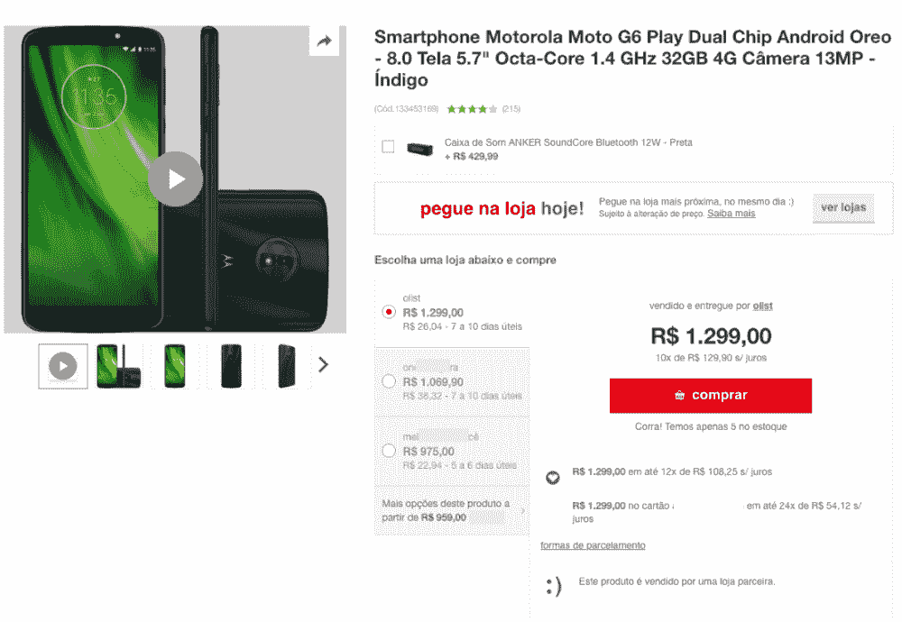
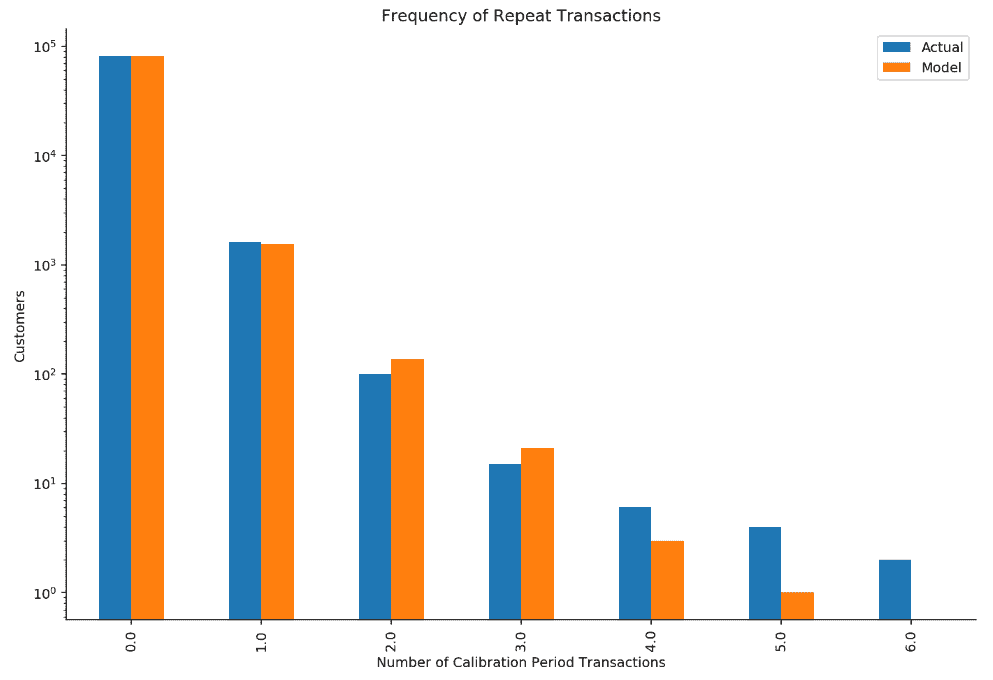
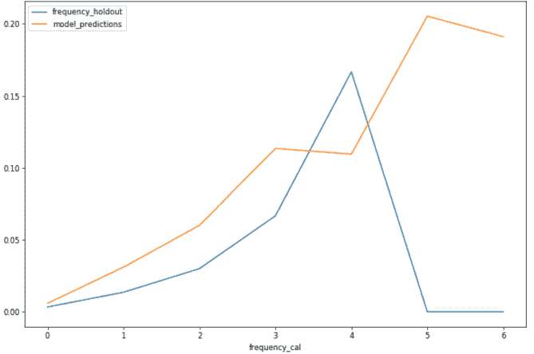
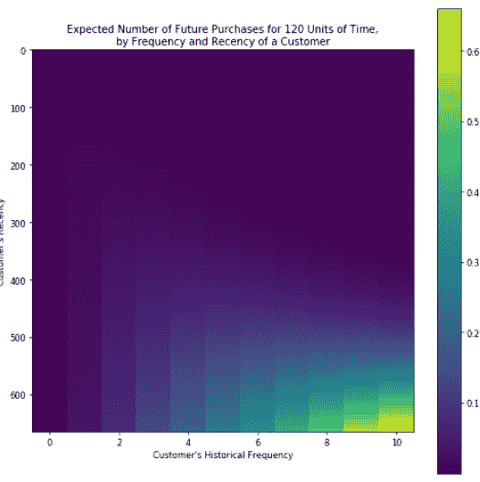
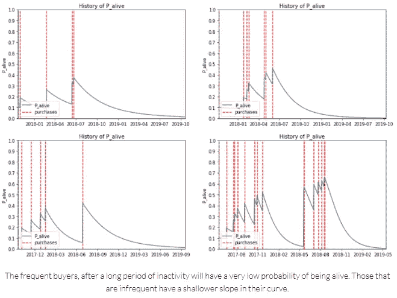
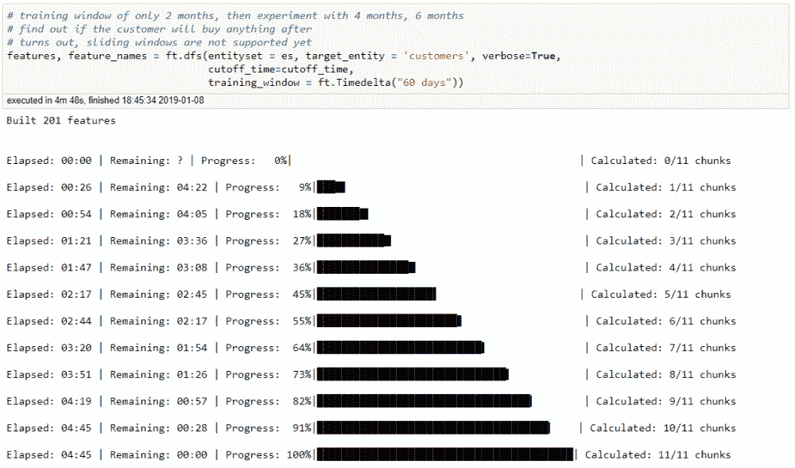
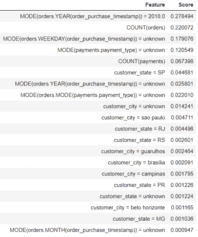

# 我的顾客会回来吗:和 CLV 一起玩

> 原文：<https://towardsdatascience.com/will-my-customer-come-back-playing-with-clv-2564cc48849a?source=collection_archive---------14----------------------->

自从 Kaggle 的 Olist 数据集上线以来，我已经在过去的几天里修补客户终身价值模型了。特别是，我想探索久经考验的概率模型，BG/NBD 和 GammaGamma 来预测未来的购买和利润。我还想看看机器学习方法是否能做得很好——简单地预测客户是否会重复购买。这些模型做同样的事情——预测客户购买——尽管方式不同。也许在一篇更新的文章中，我可以提出一些衡量标准，在平等的基础上对它们进行比较。不管怎样，我们开始吧。

笔记本可以在 Kaggle 找到。这里:[https://www . ka ggle . com/krsnewwave/CLV-with-lifetimes-and-feature tools](https://www.kaggle.com/krsnewwave/clv-with-lifetimes-and-featuretools)

Olist 是一家巴西电子商务网站，它在 2016 年至 2018 年期间如此慷慨地在其网站上分享了 10 万个订单。[数据可以在这里找到](https://www.kaggle.com/olistbr/brazilian-ecommerce/home)。

# 数据看起来像什么

该数据集包括约 95，000 名客户及其在该网站的订单，这些订单是约 73 个类别的约 33，000 种产品的约 100，000 个独特订单。它还包括商品的价格、客户支付的金额、信用卡分期付款，甚至与订单相关的恐惧成本。它的数据应该很像你自己的电子商务公司的数据。😉

购买模式似乎很正常，定期上涨，并在 2017 年 12 月大幅飙升。

数据显示，每位顾客的购买模式非常稀疏，每位顾客平均购买 1.03 份订单和 1.07 件商品。

# 英国地质调查局/NBD 模型

[对于概率模型，我使用了许多这种绅士内核的代码。](https://www.kaggle.com/dhimananubhav/customer-lifetime-value)寿命库对于快速构建这类分析非常有用。它需要 RFM 输入数据，这要求每个客户，我们有他们最近购买的信息，他们购买的频率和他们购买的总货币价值。

贝塔几何负二项分布解决了两个问题，1)客户活跃或不活跃的概率(在文献中是活着还是死了！)，以及 2)购买次数的概率。(1)由贝塔分布建模，以及(2)由泊松分布建模。对于这两个预测问题，每个个体或群体都有自己的参数。一个简单的方法是用一枚硬币和一个骰子来模拟(1)和(2)。

这里是衡量我们的模型性能的视觉效果。在校准期(左)和验证期(右)测试中可以看到，由于缺乏关于这一行为的数据，该模型在尝试预测 4 次或更多次购买时失败。

下图描述了 x 轴上的频率和 y 轴上的新近度。经常购买和最近购买的人在图表的最右边。在下图(a)中，未来 120 天的预期购买次数非常低(0.6 次)，即使是最忠实的买家(最近购买且经常购买)。在(b)中，即使是最忠实的买家也只有 60%的机会活跃。这是因为数据中每个客户的购买模式非常稀疏。

使用该模型，可以根据未来的预期购买次数输出客户的排名。该排名可用于确定不同细分市场的营销策略。这是前 4 名客户的每个购买模式后存活的概率。这些前 4 名是根据半年内的最高预期购买次数计算出来的。

我还尝试了一个 GammaGamma 模型，该模型考虑了所购物品的货币价值。然而，预测并不好，在维持集上只有 0.35 的相关性。这可能是因为购买模式的稀疏性。我将把它留给一个更深入的研究，看看 GammaGamma 模型相对于购买的稀疏性在哪里崩溃。

# 更广阔的视角

从上一节中，我们抽象出了购买物品的性质和数量、购买的离散时间窗口以及支付的上下文。所有这些都会对重复购买的问题产生影响。在本节中，我们将使用**特征工具**库为我们自动创建特征。

将数据集连接在一起的过程有点乏味，但回报是一个完全自动化的特征工程例程。实体集将如下所示:

在转换特征之前，我们声明一个截止日期和训练窗口。截止日期之后的交易将被截断，截止日期之前的*训练窗口期将构成我们的训练集。我们将预测客户是否会在截止日期*后购买*，因为她在截止日期*前*的所有交易都在*训练窗口内。我们的截止日期将是 2018 年 7 月 1 日。**

在 featuretool 的深度要素合成(DFS)的帮助下，数据集将如下所示。DFS 使用关系中声明的索引来创建聚合和基本功能。例如，我们可以有一些简单的东西，如付款总额(深度=1)，也可以有一些复杂的东西，如客户订单最大付款的平均付款额(深度=2)。回想一下，一个订单可以有多次付款，一个客户有多个订单。

模型的结果如下:

不算太坏。增加训练窗口显著提高了我们的指标，更复杂的模型并没有带来太多的改进。和以前一样，我们可以得到一个客户留下来的输出概率作为我们的排名。然后，我们可以围绕这些级别制定策略。

最后，我们将讨论最重要的特性。通过默认方式获得随机森林和梯度增强树的特征重要性是微不足道的-所有树的基尼系数的平均下降。我将让读者通过抽样来确定排列的重要性。

在 2018 年上半年购买的客户可能会在下半年再次购买。购买了许多订单并有许多付款(信用卡分期付款)的客户可能会再次购买。付款类型=未知可能表示全额付款。还有关于特定城市或州的特征，尽管这些仍然是可疑的，因为树偏向于具有许多级别的类别。

虽然，一些顶级功能是转移视线。谁听说过一个未知的星期几，月份或年份？这些可能是数据中的错误，模型以某种方式利用这些错误来获得优势。这项研究在投入生产之前还需要进一步的清理和完善。

感谢阅读。

*原载于 2019 年 1 月 9 日*[*【itstherealdyl.wordpress.com】*](https://itstherealdyl.wordpress.com/2019/01/09/will-my-customer-come-back-playing-with-clv/)*。*