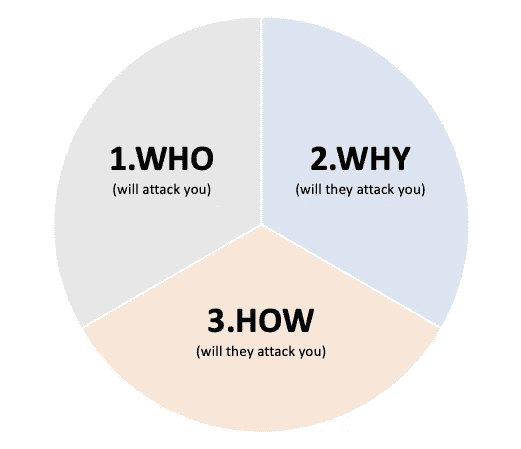
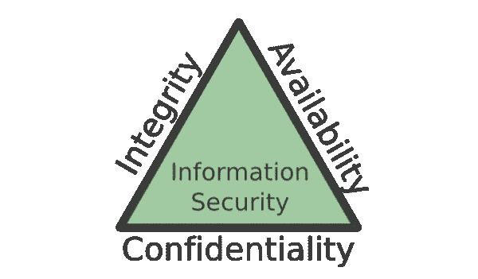
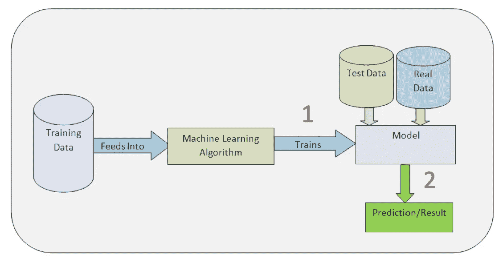
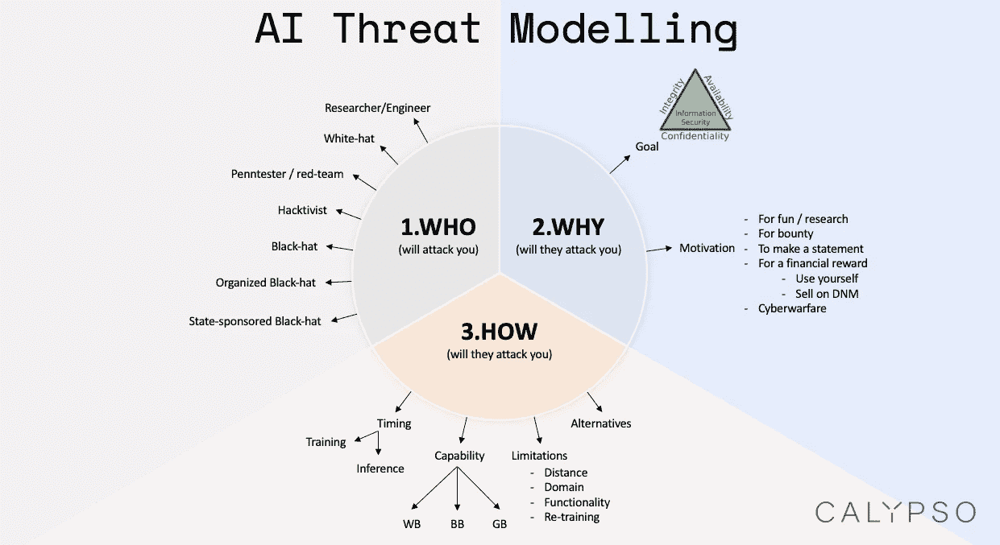
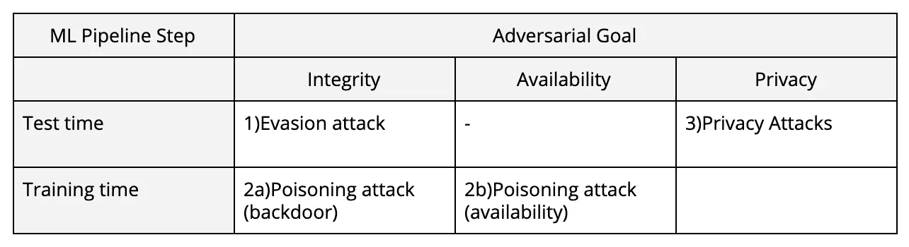

# 我的机器学习系统会被攻击吗？

> 原文：<https://towardsdatascience.com/will-my-machine-learning-be-attacked-6295707625d8?source=collection_archive---------19----------------------->

## [机器学习的安全性](https://towardsdatascience.com/tagged/security-for-ml)

## 打开 ML 安全威胁模型

[Source.](https://i.imgur.com/A1iax04.gif)

机器学习真正将小说带入了现实。但是任何新发明(包括 ML)的不幸事实是[新的能力伴随着新的漏洞供攻击者利用](https://medium.com/@iljamoisejevs/what-everyone-forgets-about-machine-learning-974752543849)。因此，如果您是组织中负责安全的 CISO 或项目经理，您应该如何看待这些新的漏洞？你的 ML 真的会被攻击吗？如果是这样的话，如何以及何时会发生违规？

以上问题的答案是一个 **ML 安全威胁模型**——一个结构化的框架，展示了您的 ML 系统上所有可能的威胁载体。

机器学习仍然是非常新的，它的威胁向量知之甚少。然而，在这篇文章中，我们将尽最大努力去思考它们，看看我们是否能在文章的结尾给出一个考虑 ML 安全性的坚实框架。

让我们试一试。

# 威胁模型派

在 [Calypso](http://calypsoai.com) ，当我们考虑威胁模型时，我们喜欢考虑三个独立的部分:

**世卫组织会攻击你吗？一切都始于世卫组织。袭击者。对手。另一边。你可以让定义世卫组织的工作变得非常简单或者非常困难。一方面，你可以说是“黑客”。另一方面，这实际上给了你什么信息？“一个了解机器学习如何工作的黑客”可能更好。“一个了解机器学习如何工作并有数学背景的黑客”更好。你能在世卫组织周围放得越详细越好。**

**他们为什么会攻击你？**为什么超级和世卫组织关系密切(下面我为什么把两者放在一起讨论)。“为什么”背后的想法很简单——他们可以攻击你，但是他们为什么要攻击你呢？那里一定有适合他们的东西。一笔赏金。奖励。同样，定义“为什么”可以简单到说“为什么不”(不推荐)，也可以难到说“违反保密性，然后将从我的 ML 系统中提取的数据出售给某个实体 X”(好得多！).

他们会如何攻击你？这是技术部分。现在你知道了世卫组织以及为什么会攻击你——下一个问题是他们会怎么做？如果我们在谈论机器学习——它们会在训练或推理过程中攻击你的 ML 吗？他们对你的系统有多少了解？一个非常有趣但也很有挑战性的方面是考虑如何选择。他们也许能够*黑掉你的 ML，但是如果黑掉你的数据管道更容易，他们会那样做吗？*

让我们进入更多的细节。

# 世卫组织+为什么

世卫组织。概括地说，我喜欢把对手想象成“严肃”的级别。我脑子里是这样想的:

1.  聪明的研究员/工程师摆弄着一个商业 ML 系统(可能是为了实际的研究——比如对 Clarifai.com[这里](https://arxiv.org/abs/1611.02770)的攻击)
2.  白帽子参与了一项赏金计划
3.  Penntester /红队队员进行测试
4.  黑客行动主义者攻击商业 ML 系统来证明一个观点
5.  黑帽攻击商业 ML 系统以赚取金钱奖励(无论是通过实际部署漏洞还是在暗网市场上出售)
6.  有组织的黑帽集团攻击商业传销系统(想想[匿名](https://en.wikipedia.org/wiki/Anonymous_(group))、[影子经纪人](https://en.wikipedia.org/wiki/The_Shadow_Brokers)和[末日军团](https://en.wikipedia.org/wiki/Legion_of_Doom_(hacking)))
7.  国家资助的组织(在这一点上，它基本上是网络战)

考虑你的对手有多严重是很重要的，因为这决定了他们可能获得的知识和工具的种类，从而决定了你的防御水平。

现在是为什么。为什么，在我脑子里，分解成两个问题:

1.  他们的目标是什么？
2.  他们的动机是什么？

在回答**目标**问题时，我喜欢用中情局三重奏:

[Source.](https://blogs.ucl.ac.uk/infosec/files/2017/08/The-CIA-triad-goals-of-confidentiality-integrity-and-availability-for-information-security-600x351-300x176.png)

三位一体的三个要素——机密性、完整性和可用性——指的是安全的三大支柱。如果你能保护好这三者——你就有了安全保障。

**保密性(或** [**隐私**](https://medium.com/@iljamoisejevs/privacy-attacks-on-machine-learning-a1a25e474276) **)攻击**旨在从你的 ML 系统中提取敏感信息。例如，攻击者可能想要推断某个特定的数据点(例如您)是否是某个特定训练数据集(例如[医院出院](https://arxiv.org/abs/1610.05820))的一部分。

**完整性攻击**让你的 ML 模型出错，但是——重要的是——悄悄地做。例如，攻击者可能希望您的分类器将恶意文件视为良性文件，而不影响其整体性能，因此您永远不会注意到。在 integrity 中，攻击者可以有许多子目标(从难到易):

*   **源/目标分类错误** —攻击者希望将特定类别(“恶意”)归类为特定的其他类别(“良性”)。
*   **有针对性的错误分类** —攻击者希望将特定类别(“停止”标志)归类为任何其他类别(例如“限速 60”或“限速 45”或“狗”或“人”或其他)。只要没有停)。
*   **误分类**——将任何一个类归入任何一个类。进入可用性攻击领域(见下文)。
*   **信心降低** —攻击者希望你的模型失去信心(当它对阈值起作用时很有用，例如在欺诈分数的情况下)。

可用性攻击旨在彻底摧毁你的 ML 系统。比如，如果在训练池中插入了足够多的坏数据，那么你的模型学习到的边界基本就是垃圾，模型就变得无用。是机器学习界的 DOS 攻击。

攻击者的目标旁边是攻击者的动机。这个更加主观，有点和世卫组织纠缠在一起。如果你是一个定义上的黑客行动主义者群体，你会试图发表某种声明，如果你是一个黑帽组织，你可能想要经济利益。

# 怎么

技术部分。怎么会有人真的去破坏你的模型呢？(在这里，我将重点关注特定于 ML 的漏洞，并排除传统的网络安全问题，如 ML 服务器上的 DDOS。)

我们可以从四个方面对洗钱攻击的方式进行分类:

1.  计时(训练/推理)
2.  功能(白盒/黑盒/灰盒)
3.  局限性(干扰距离/功能/领域/再训练频率)
4.  可供选择的事物

**时机** —这是指在 ML 部署管道中攻击发生的位置。这里有两个宽泛的选择——训练时间和推理时间。

[Source](https://www.sqlservercentral.com/articles/understanding-machine-learning).

1.  在**训练**时间的攻击意味着攻击者能够影响训练数据集(无限的力量，但很难做到和额外的限制)。
2.  在**推断**时间的攻击意味着攻击者只能干扰即时输入(可能强大，也可能不强大，这取决于模型，但更容易执行，因为只需要注入修改的输入)。

**能力** —这是指攻击者对 ML 系统内部的了解。具体来说:

*   **白盒**攻击假设攻击者知道底层数据的分布(可能访问部分数据)、模型的架构、使用的优化算法以及权重和偏好。
*   **黑盒**攻击假设攻击者对 ML 系统一无所知(所以以上事情都没有)。它们可以有两种类型:**硬标签**(当攻击者仅从分类器接收到预测标签时)和**置信度**(当攻击者从分类器接收到预测标签以及置信度得分时)。
*   灰箱攻击位于中间。例如，攻击者可能知道模型是什么样子，但不知道底层数据是什么——反之亦然。

你也可能在科学文献中遇到类似于 **NoBox** 的术语。NoBox 指的是对代理模型的攻击，攻击者基于他们对目标 ML 系统的理解(无论多么有限)来重建代理模型。我不认为单独对此进行分类是有意义的，因为一旦攻击者建立了代理模型，它实际上就变成了白盒攻击。

经验法则:更多的知识=对攻击者更有利，对我们更不利(要了解更多，请参见我在[闪避攻击](https://medium.com/@iljamoisejevs/evasion-attacks-on-machine-learning-or-adversarial-examples-12f2283e06a1)上的帖子)。

**限制**指的是限制攻击者行为的某些规则。这些确实是 ML 系统特有的。例如:

*   在图像中，通常将扰动空间限制为“距离”度量，通常选自李、或规范。顺便说一下，这里有一个有趣的争论，关于这是否真的有意义(阅读这篇 33 页的白皮书了解更多)。
*   在恶意软件中，攻击者只能在某些地方以某些方式扰乱文件，否则它将失去其恶意功能或破坏所有文件。
*   在部署在物理设备(卫星、汽车、无人机、监控摄像机)上的系统中，攻击者可能被限制在修改物理域中的输入。
*   在训练时的攻击中，攻击者需要两件事情:a)系统基于新数据不断地重新训练(否则他们不能注入坏数据),以及 b)系统从外部来源获取数据，最好没有人在循环中批准它。
*   在隐私攻击中，通常攻击者需要一个没有查询限制的公共端点，并输出置信度得分。可信度分数特别严格，例如大多数反病毒产品只是告诉你他们认为文件是“恶意”还是“良性”，没有进一步的细节。

**替代方案** —这是我想简要提及的最后一个方面。我曾经听一个做了 25 年保安的人用“电”来形容攻击者。他们总是选择阻力最小的道路。

这是一个很重要的标准，但我发现它经常被忽视，这个标准很容易建立或破坏威胁模型。攻击 ML 组件实际上是攻击者得到他们想要的东西的最简单的方法吗？例如，如果目标是侵犯隐私——他们会经历在你的分类器上构建[影子模型](https://arxiv.org/abs/1610.05820)的麻烦来获取数据，还是有更容易被利用的[漏洞](https://techcrunch.com/2018/09/28/everything-you-need-to-know-about-facebooks-data-breach-affecting-50m-users/)？

# 将这一切结合在一起

我给了你很多(事实上是我们 6 个月的研究和思考！).让我们一起来看看:

现在，让我们撒一些术语。

在对抗性 ML(ML 安全的学术方面)中，通常从“为什么”维度取“目标”,从“如何”维度取“时机”,来命名攻击。输出如下所示:

1.  **闪避攻击(也叫“对抗性例子”)**绝对是最受欢迎的类型。它们发生在推理时，利用了 ML 固有的漏洞(或者是“特性”？🤔—阅读我在[闪避攻击](https://medium.com/@iljamoisejevs/evasion-attacks-on-machine-learning-or-adversarial-examples-12f2283e06a1)上的帖子了解一下。
2.  **中毒攻击**发生在训练时间，可能有两个目标——完整性或可用性。攻击者可以在您的训练池中插入一些精心选择的示例，在其中构建一个“后门”(完整性)，或者他们可以插入如此多的坏数据，以至于模型的边界基本上变得无用(可用性)。了解所有关于中毒机器的知识[就在这里](https://medium.com/@iljamoisejevs/poisoning-attacks-on-machine-learning-1ff247c254db)。
3.  隐私攻击可能是最少被研究的，但尤其是在今天，一个[极其相关的威胁](https://techcrunch.com/2019/04/25/facebook-privacy-investigations/)。在这里，攻击者不想干涉你的机器学习模型的工作，相反，他们想从中提取私人的，可能是敏感的信息。在我的[完整文章](https://medium.com/@iljamoisejevs/privacy-attacks-on-machine-learning-a1a25e474276)中阅读隐私漏洞和修复方法。

就是这样！希望到现在为止，你已经对如何考虑你的 ML 系统的弱点有了一些概念。

保持安全。