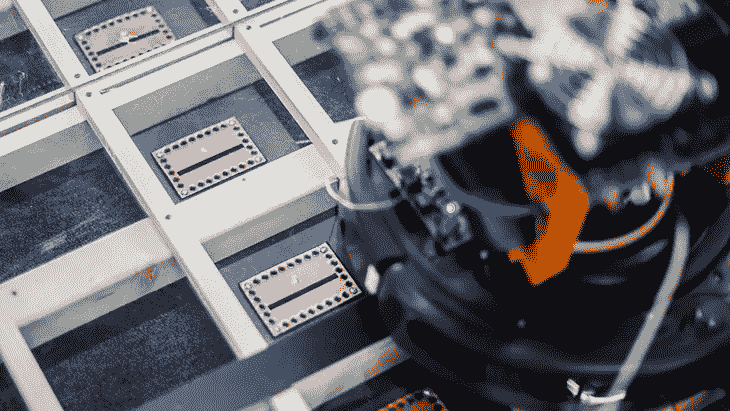
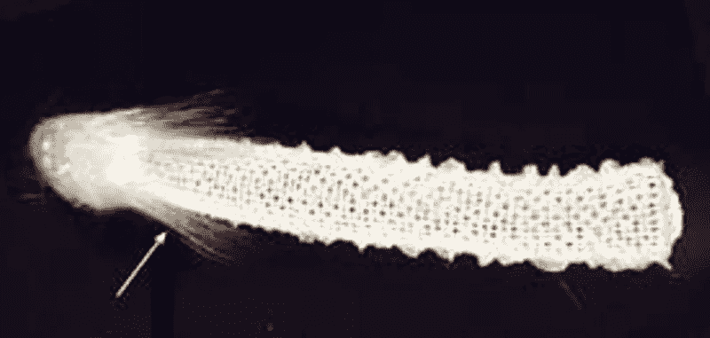

# 人类及其栖息地会成为未来通信网络的一个组成部分吗？

> 原文：<https://towardsdatascience.com/will-people-and-their-habitats-become-an-integral-part-of-tomorrows-communication-networks-1145c26f2072?source=collection_archive---------28----------------------->

## *2035 年电信网络愿景*

由于固定和移动电信网络似乎随时随地围绕着我们，我们可以获得广泛的通信服务。我们与世界另一端的朋友、同事或家人视频聊天，我们远程控制(半)自主机器人(从吸尘器到工业机器人)。

但是这些网络应该如何发展才能满足 2035 年的需求呢？让我们区分网络支持:(1)人与人之间的交流；(2)工业应用；以及(3)人工智能。之后，我们将简要考虑 2035 年后的网络可能会是什么样子。

# 100 Mbps 的“人类带宽”

对许多人来说，宽带连接已经成为一种必然——就像电一样。然而，经常旅行或经常在路上的人会认识到，拥有稳定的宽带连接不应该是理所当然的。

因此，我们对 2035 年的第一个期望是，我们将最终设法建立一个大型、稳定的网络，以支持人与人之间的通信以及人机交互；一个不再是电信运营商今天喜欢吹嘘的千兆速度的网络，而是一个符合我们的“人类带宽”的网络。

毕竟，无论我们谈论的是人与人之间的交流还是人机交互，都仅限于我们的感官能够处理的内容。研究表明，人类的带宽大约等于 100 兆比特每秒(Mbps)。

> 换句话说:一个能够为每个用户提供连续、有保证的 100 Mbps 带宽的网络足以让我们的感官饱和。这样的网络应该在 2035 年成为现实。

当然，问题是 2035 年我们是否还会有同样的生理(感官)限制。也许我们也能找到解决这些问题的方法？想想被用来检测神经疾病的神经探针。在未来，我们可能能够利用这项技术在我们的大脑中创建直接的输入和输出通道，这意味着无线通信将有可能通过我们大脑中的神经探针实现。

但是:仅仅因为我们的大脑中有一个直接的输入和输出通道，并且可以，至少部分地绕过我们的感官，这并不意味着我们的大脑会自动拥有处理额外刺激的吸收能力。因此，即使在这种情况下，似乎也不需要超过 100 Mbps 的带宽(无论是明天还是 2035 年)。

对于那些不热衷于植入的人来说，智能隐形眼镜和增强现实眼镜肯定也可以提供额外的输入。然而，矛盾的是，这些眼镜将需要超过 100 Mbps！为什么？因为我们的感官需要“正确的”100 Mbps。想起下面这个比喻:人们常说一张图等于千言万语；然而，找到精确的 1000 个词来完美地描述一张照片要困难得多……我们的感官也是如此:2035 年的智能眼镜将不得不传输更多的“词”来为我们提供我们实际需要的数据……

然而，无论你认为最有可能发生的场景是什么，都不会有任何空间让那些经常掉线的联系存在——今天依然如此。因此，我们预计电信行业将继续投资于(小蜂窝)网络，这些网络可以有效地为每个人提供 100 Mbps 的均匀且有保证的速度；将人的带宽放在中心位置的网络，而不是今天的(峰值)速率。

# 面向工业 4.0 应用的灵活网络

在工业环境中，我们将面临“工业 4.0”的需求——由于广泛的数字化，其特征是新的生产方法、新产品和新的商业模式。

工业 4.0 概念的成功取决于我们能够灵活满足新需求和趋势的程度。因此，难以重新配置的有线环境有被淘汰的风险。然而，与此同时，Wi-Fi 等无线技术在具有大量反射的生产设施中往往不够可靠…

> 在工业环境中，我们需要一个稳定可靠的网络，保证每台机器的无线带宽约为 10 Mbps，并且延迟有限。

因此，在工业环境中，我们也必须转向能够提供有保证的同质覆盖的网络，而不是部署能够提供高峰值速率的不稳定网络。如果人们预计配备增强现实眼镜的人类同事也将在未来的工厂里走动，情况将尤其如此。5G、大规模 MIMO 和分布式大规模 MIMO 等技术可以在实现这一未来愿景方面发挥重要作用。

# 人工智能:关注能效

普遍的预期是，到 2035 年，人工智能(AI)将使我们的生活变得更加轻松，并将帮助我们在生活的各个方面做出更好的决定。但我们如何确保这一愿景成为现实？

秘方可能是“分发”情报。如果我们想以有效的方式引入人工智能，将所有的智能放在大型中央数据中心不是一个选项；当然不是在必须做出实时决策或需要快速预测的场景中，比如无人驾驶汽车。另一方面，你不能把智能放在设备本身(传感器等)。)，因为它们的电池和存储容量有限。因此，智能必须放在所谓的网络“边缘”。

> 但是，即使将智能放在网络边缘可以确保没有过多的数据流通过网络(这将需要大量的能量和带宽)，我们仍然需要将网络的能效提高 10 到 100 倍，以使可持续的人工智能变得可行。

我们可以通过优化电路和技术的设计，也可以通过开发更好的(数据)压缩技术来做到这一点。

# 人类及其栖息地会成为未来电信网络不可或缺的一部分吗？

我们刚刚描述的三个网络在 2035 年的共同点是，它们将不再使用最大容量和峰值速率等指标进行评估。更重要的考虑因素是可靠性、能效和有保证的带宽。

一个例外(尽管可能只有在 2035 年之后)将是必须支持真正沉浸式应用的网络，如全息显示和虚拟现实应用。这些应用将需要一个由非常小的蜂窝组成的网络，该网络能够以极其节能的方式在仅几米的距离内提供数十千兆位每秒(Gbps)的传输。想想 ATTO 科技。

Imec researchers at Ghent University are developing ATTO technology that enables mobile connections of 100 Gbps with a latency of less than 10 microseconds — at short distances.

现在，让我们来看看，从长远来看，我们将如何塑造这样一个世界。如果我们真的考虑未来(甚至超过 2035 年)，我们将如何部署和管理所有这些无线蜂窝？今天，一些地区正在部署光纤网络来实现这一目标——但如何部署全球光纤网络，即使是在安装电缆非常昂贵和困难的地方？

也许大自然可以帮助我们。或许我们可以——例如通过基因操纵——培育出具有集成天线能力的杂交植物和灌木？

> 从长远来看，树根能包含有机穿过土壤的集成光纤电缆吗？

作为一个社会，我们必须真正接受蓝天思维，这主要是因为电信网络在未来将变得更加重要。事实上，这个想法不再是科幻小说:十年前，贝尔实验室/朗讯科技的研究人员已经试图开发一种海绵，它可以生长成光纤电缆来传输数据。当时，进一步的开发被证明在工业上是不可行的——但这个想法仍然很有趣。

Ten years ago, researchers from Bell Laboratories/Lucent Technologies already made an attempt to develop a sea sponge that grew into a fiber cable to transport data. (Copyright: J. Aizenberg / Lucent Technologies)

# 旁注:良好的连通性来换取关于你自己的信息？

拥有可靠的连接将是一件非常美妙的事情，但是总是有可能在那些可以使用它的人和那些不能使用它的人之间出现两极分化。换句话说:2035 年，世界上可能会有一些地方有很好的(尽管价格昂贵？)连接，以及其他没有连接的地方——或者人们根本负担不起良好连接的地方。这是否会导致未来大型零售商和服务提供商提供连接来交换你的信息？可能吧。

危险？无线大脑接口或智能隐形眼镜是为了交换连接而赞助的，这意味着那些“赞助商”可以看到你看到的一切，感受到你感受到的一切(并可以做出相应的回应)。这也可能意味着一个受赞助者商业利益控制的社会阶层出现了——而更富裕的阶层(可以为中立的连接付费)保留了其独立思考……一个噩梦般的场景？有可能——尽管另一方面，我们可以问问自己，这在今天还没有成为现实。此外，这种情况也促使我们考虑技术的社会影响…