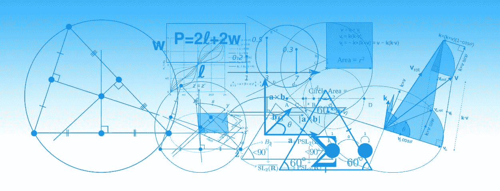

# 科学研究能够避免人工智能陷阱吗？

> 原文：<https://towardsdatascience.com/will-scientific-research-be-able-to-avoid-artificial-intelligence-pitfalls-b818e96c0cdd?source=collection_archive---------11----------------------->

现在很明显，人工智能、机器学习和深度学习不再是热门词汇，因为它们越来越多地出现在每个行业。尽管这一趋势在 2017 年被夸大了，但我们现在可以肯定，到 2020 年，这些技术将无处不在。

科学研究并没有落后，人工智能已经成为这一领域重大变革的导火索。机器学习技术，如医学图像处理、通过分割的生物特征识别和基于人工智能的医疗诊断，被健康研究人员以不加批判的方式正式采用。

AI 造成的这种颠覆性效果，终于很简单理解了。机器学习模型遵循一个不可避免的黄金法则:我们能提供给它们的(无偏见的)数据越多，它们就变得越准确和可靠。对于研究人员来说，高性能计算和大数据的融合似乎是圣杯，也是新发现的唯一可能途径。最近的一个例子加强了这一观点，在我们的星系中心发现了数千个黑洞——不是通过望远镜发现的，而是通过分析近 20 年前收集的长期存档数据发现的。

这种吸引力甚至不是一种趋势。在这些技术面前后退会被认为是一种科学蒙昧主义。我们进入了一个数据似乎能解答一切问题的时代。人类——尤其是研究人员和科学家——更倾向于相信其他人当中实验次数最多的代理人，这是完全合理的。让我们假设这样一种情况，你因为一个可能很严重的健康问题而不得不去看医生，你可以选择咨询一位有 20 年经验的著名专家，或者一位刚入行的年轻医生。你会看到谁？毫无疑问，我们都会选择第一个方案，我们将是正确的。

然而，休斯顿莱斯大学的 Genevera Allen 博士最近通过[提出了关于可重复性和缺陷模式的问题](https://www.bbc.co.uk/news/science-environment-47267081)，引起了科学界的警觉。根据 Steven N. Goodman、Daniele Fanelli 和 John P. A. Ioannidis 给出的定义:

*“方法再现性是指捕捉再现性的原始含义，即尽可能精确地实施实验和计算程序，使用相同的数据和工具，获得相同结果的能力。”*

再现性和重复性是验证任何关键研究结果的必要组成部分，忽视这些步骤会严重损害任何从科学经验中得出的假设或结论。这个问题可以通过分析大量数据得到部分解释，在这些数据中检测无意义模式的概率相当高。尽管存在一些实践来通过计算相关模式(与真实世界相匹配)应该被检测到的频率来防止这种复杂性，但是该指标类似于真正的正阈值，是不可靠的。最终，统计方法不适合成功地解决这个问题。只要人工智能代理既没有知识也没有世界模型，他们就不可能区分无意义和相关的模式。

为了更进一步，提到科学研究中最抽象的领域，也就是理论领域，会很有意思。让我们准确地以一个子领域即理论物理为例。这一研究领域旨在探索、描述和理解我们世界的性质，如地球上的物理现象、原子和分子的内部结构以及研究宇宙起源和演化的量子力学和宇宙学。与实验物理不同，理论物理的研究只能通过使用高度分析的概念和方法，通过将物理现象转化为数学模型来进行。

在最近一篇标题为“**人工智能能解决爱因斯坦不能解决的问题吗**”的[文章](https://www.forbes.com/sites/startswithabang/2018/05/02/could-artificial-intelligence-solve-the-problems-einstein-couldnt/)我们可以读到:

*“因此，像普朗克、爱因斯坦、海森堡、薛定谔、狄拉克等名字经常被誉为我们这个时代最伟大的科学天才。毫无疑问，他们解决了一些极其复杂的问题，而且做得非常出色。但人工智能很可能会做得更好。”*

我们是 2019 年，我个人不同意这个观点。我会重新表述，我的问题会变成:“**人工智能也能解决爱因斯坦能够解决的问题吗？**”

我只能同意这样一个事实，即机器学习和深度学习在分析大量数据时，以前所未有的速度找到相关性、可能的因果关系、以前未知的相关模式以及所有这些，对于许多任务来说，效率惊人——但我们也必须说，我们距离希尔伯特·西蒙在 1956 年达特茅斯学院(Dartmouth College)的一次动员会上的预测仍然非常远，他宣布能够挑战人类思维的思维机器“指日可待”。

我甚至不打算提到当我们不满足深度学习神经网络的过度数据胃口或当我们向它们提供有偏见的数据时，深度学习神经网络往往会以惊人的方式失败的情况。但是，即使是最好的人工智能仍然缺乏被认为是真正智能的基本要素。人类可以从事推理，因为他们有常识。由于这一点，他们可以对周围的世界进行逻辑推理。机器不会。

一个真正的人工智能应该能够转移它的学习和智能来解决一个它没有被训练过的问题。 **DeepMind，**一家目前由谷歌[拥有的英国人工智能公司强调了](https://www.wired.com/story/how-to-teach-artificial-intelligence-common-sense/)他们在游戏 *Breakout* 的实验中的差距。经过训练后，DeepMind 的人工智能知道如何正确地玩游戏，但事实证明，如果我们仅仅通过在积木中心添加一个牢不可破的区域来稍微改变规则，人工智能会非常缓慢地适应这些变化。在适应新的游戏配置时，人类玩家仍然比机器强。

但我想强调的主要问题是，人工智能无法生成一个假设，规定无法给出预期(最准确)的答案，因为解决问题的更多相关数据可能不会出现在训练数据集中。这正是为什么当想象一个具有高度抽象的人工智能时，它不可避免地会导致怀疑。深度学习不是深度理解的同义词，没有机器学习能够超越我们提供给它们的训练数据。

而且总的来说，AI 最大的死胡同就是一个 **AI 不知道它不知道**。

爱因斯坦没有数据，最重要的是，没有方程可解——他证明了麦克斯韦方程没有解，并由此开始概念化和介绍狭义和广义相对论。正如你所猜测的，即使我们将与麦克斯韦电磁理论(被认为是爱因斯坦推理的起点)相关的大量数据提供给最先进的 AI，也显然不可能获得作为输出的**新的空间和时间概念**。

唯一剩下的希望是，明天的伟大头脑将有后知之明，并有能力超越现有的工具，以抵御所有的恐惧，继续被锁定在一个既有希望又没有成果的系统中。

参考资料:

艾琳·迈耶，[为天文学的下一个重大发现挖掘长期存档的数据](https://thewire.in/space/archives-next-big-discovery-in-astronomy)(2018 年 5 月 15 日)，thewire.in

Pallab Ghosh，[美国科学促进会:机器学习‘引发科学危机’](https://www.bbc.co.uk/news/science-environment-47267081)(2019 年 2 月 16 日)，bbc.co.uk

伊森·西格尔，[人工智能能解决爱因斯坦不能解决的问题吗？](https://www.forbes.com/sites/startswithabang/2018/05/02/could-artificial-intelligence-solve-the-problems-einstein-couldnt/#3568872fdc55)(2018 年 5 月 2 日)，forbes.com

wired.com，Clive Thomson，[如何教授人工智能常识](https://www.wired.com/story/how-to-teach-artificial-intelligence-common-sense/)(2018 年 11 月 13 日)