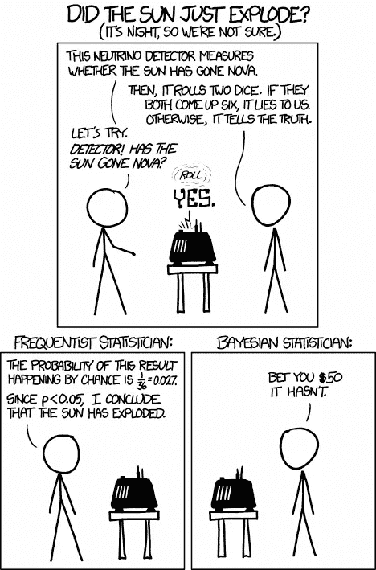

# 明天太阳会升起吗？机器学习的贝叶斯统计导论

> 原文：<https://towardsdatascience.com/will-the-sun-rise-tomorrow-introduction-to-bayesian-statistics-for-machine-learning-6324dfceac2e?source=collection_archive---------8----------------------->

## 你有没有问过自己，以前从未发生过的事件发生的概率是多少？

在本文中，我们将深入探讨贝叶斯统计的神秘世界，以及它的一些原则，如伯恩斯坦-冯米塞斯定理和克伦威尔法则，如何能够有助于分析现实世界的机器学习问题。

*“贝叶斯统计在思考困难的意义上是困难的”* —唐·贝里

如果你想深入研究贝叶斯统计背后的数学，这里不是你要找的地方(尽管我以后会发表这方面的文章)。这篇文章主要是向不熟悉这个概念的人介绍贝叶斯方法。

想象一下，你正在设计一座核电站。您的任务是使用数据来确定工厂是否正常运行。这可能看起来是一个相对简单的任务，直到你意识到你实际上没有任何关于核电站发生核泄漏时的数据。你怎么能预测这样的事情呢？

如果你是一个精明的机器学习专家，你可能会建议某种无监督的方法，如(受限的)玻尔兹曼机器，它能够学习“正常”的电厂是什么样子，从而知道什么时候事情有点不对劲(事实上，这是人们预测核电厂正常运行条件的一种方式)。

然而，如果我们从一个更普遍的意义上来思考这个问题，当我们几乎没有或者根本没有反面的例子来比较时，我们该怎么办呢？发生这种情况有几个原因:

*   该事件的概率如此之低，以至于在(有限的)样本数据中根本没有观察到该事件发生。**(低概率场景)**
*   观察到了，但很少。**(数据稀疏场景)**
*   失败的结果将是灾难性的，它只会发生一次，例如，太阳的毁灭。**(大灾难场景)**

传统统计学不太适合这类问题，通常需要不同的方法。

一个更普遍的问题是，我们如何处理极低(但严格非零)或极高(接近 1 但严格不是 1)的概率？让我们先来看几条规则，这些规则是为了研究数学家皮埃尔·西蒙·拉普拉斯提出的一个著名问题而开发的。

**日出问题**

想象有一天早上你醒来，太阳决定休息一天。这不仅(很可能)会毁了你的一天，打乱你的生物钟，还会直接改变你对太阳的感觉。你会自然而然地更有可能预测到也许第二天太阳也不会升起。或者，如果太阳只是度过了糟糕的一天，第二天又回来了，你对太阳会再次休息一天的预期会比之前高得多。

这里发生了什么？基于新的证据，我们改变了对事件发生概率的看法。这是所有贝叶斯统计的关键，并使用一个称为贝叶斯规则的等式进行正式描述。

**贝叶斯法则**

贝叶斯法则告诉我们，我们必须从某个事件发生的内在概率开始(在事实发生之前)。我们称之为先验概率。随着新的观察和证据不断呈现在我们面前，我们会基于对证据的观察和对当前立场可能性的判断来更新我们的信念。这个更新的信念被称为后验概率(在事实之后)。

回到我们的日出问题，每天我们都观察到太阳升起，每一次太阳升起我们都更加确定第二天太阳还会升起。然而，如果有一天我们发现太阳没有升起，这将极大地影响我们基于新证据的后验概率。

这在数学上表达为以下形式，乍一看令人望而生畏，但可以抽象出来:我们更新的信念是基于我们最初的信念和基于我们当前信念呈现给我们的新证据(可能性)。可能性表示我拥有的新证据，我的信念正确的可能性有多大？如果我相信明天太阳不升起的概率是百万分之一，然后它发生了，那么我的信念(我的模型)是错的可能性就很大，后验概率会更新预测它再次发生的可能性更大。

Bayes’ theorem.

这是一个非常漂亮的想法，它存在于许多不同的地方，尤其是当它涉及到人类和他们的信仰时。例如，假设你的朋友发信息告诉你，你最喜欢的一个名人去世了。最初，你可能会感到不安，还有点怀疑。当你开始你的一天时，你读报纸，它告诉你这个名人去世了，这种信念会进一步加强。也许你会在电视上看到新闻中对他们哀悼的家人的采访，你的信念会更加坚定。然而，如果你在电视上看到那个人正在接受采访，关于他们已经死亡的谣言正在传播，你对你朋友告诉你的事情的信任就会降低。

这是科学的一个重要方面，理论是通过实验和模拟来证明的，做这些实验和验证理论的人越多，这些理论就越可靠和可信。然而，举例来说，一些信教的人可能决定他们不需要经验证据(至少是同类的)来相信某件事，我们称之为信仰。

有趣的是，我们日常生活中如此普遍的东西对统计学和机器学习来说是如此重要，但它确实如此，我们将讨论为什么。然而，首先，我们需要看一下贝叶斯定理在极低概率下出现的一些问题。

克伦威尔法则

奥利弗·克伦威尔是英国历史上的杰出人物，他在 1658 年的苏格兰教会大会上说了一句名言

"我以基督的名义恳求你，想想你可能弄错了。"

这个短语的使用导致了丹尼斯·林德利(Dennis Lindley)对克伦威尔法则(Cromwell's rule)的定义，它提出了一个想法，如果一个人以等于零(我知道某事不是真的)或一(我知道某事是真的)的先验概率开始，那么不管向你展示什么证据，你的信念都不会被动摇。

这向我们展示了绝对主义观点的危险，当我们看待可以通过经验观察到的事物时。如果我坚信自己是对的，那么无论任何人说什么或做什么都无法说服我。这是无知的高度，而不是我们想要纳入机器学习模型的东西。如果我们回头看看贝叶斯定理，我们可以看到为什么会这样，如果我们的先验概率是零，那么乘以任何东西，我们的后验概率仍然是零。

原则上(参见[克伦威尔法则](https://en.wikipedia.org/wiki/Cromwell%27s_rule))，没有任何可能性的概率应该被设置为零，因为在物理世界中没有什么是绝对不可能的(尽管它可能是)，即使与所有的观察和当前的理论相反。

这种情况发生的理想例子是在神经网络中。当你启动一个神经网络时，你的节点从一些固有值开始。如果将这些节点的权重都指定为零，则这些节点将无法自我更新，因为梯度下降算法的所有迭代都将乘以零。相反，会进行随机初始化(通常用户看不到),这通常可以防止此类问题。

贝叶斯定理的另一个有趣的性质来自于我们对无数次观察后发生的事情的观察，这通常被称为伯恩斯坦-冯米塞斯定理。

**伯恩斯坦-冯·米塞斯定理**

简而言之，伯恩斯坦-冯·米塞斯定理告诉我们，随着我们获得更多的数据，我们的后验估计将渐近独立于我们的初始(先验)信念——当然，假设它遵循克伦威尔法则。这在某种程度上类似于频率统计中的法律数字定律，它告诉我们，随着我们获得越来越多的数据，样本的均值最终将与总人口的均值相同。

那么贝叶斯统计和正态统计有什么大的区别呢？为什么机器学习专家和数据科学家需要贝叶斯统计？

**贝叶斯统计 vs 频率统计**

对于那些不知道贝叶斯和频率主义是什么的人，让我来解释一下。频率主义者从频率的角度来看待数据。例如，假设我有一个两面都有头像的硬币。我掷硬币 10 次，10 次都是正面。如果我取所有掷硬币的平均结果，我得到 1，表明我的下一次掷硬币有 100%的机会是正面，0%的机会是反面，这是一种频率主义者的思维方式。

现在从贝叶斯的角度来看。我从一个先验概率开始，我选择 0.5，因为我假设硬币是公平的。然而，不同的是我选择如何更新我的概率。在每次抛硬币后，我会看看我的下一次观察有多大可能是给定我当前的信念(我有一个公平的硬币)。渐进，当我翻转更多的头时，我的概率将趋向于 1，但它永远不会明确地为 1。

贝叶斯方法和频率主义方法的根本区别在于随机性出现在哪里。在 frequentist 域中，数据被认为是随机的，而参数(如平均值、方差)是固定的。在贝叶斯领域，参数被认为是随机的，数据是固定的。

我现在很想强调一点。

**它不叫贝叶斯，因为你使用了贝叶斯定理(在频率主义者的观点中也经常使用)。**

它被称为贝叶斯，因为等式*中的术语有不同的潜在含义*。然后，从理论差异来看，你最终会得到一个非常有意义的*实际*差异:之前你只有一个参数作为你的估计器的结果(数据是随机的，参数是固定的)，现在你有了参数的分布(参数是随机的，数据是固定的)，所以你需要积分来获得数据的分布。这是贝叶斯统计背后的数学比正常统计更混乱的一个原因，人们必须求助于使用马尔可夫链蒙特卡罗方法从分布中取样，以便估计难以处理的积分的值。其他俏皮的技巧，比如无意识统计学家法则(多棒的名字，对吧？)，又名。LOTUS 可以在数学方面提供帮助。

那么哪种方法论更好呢？

这些方法本质上是一枚硬币的两面(双关语)，它们通常给你相同的结果，但它们实现的方式略有不同。谁也不比谁强。事实上，我在哈佛的班上甚至有教授经常争论哪个更好。普遍的共识是“这取决于问题”,如果有人认为这是共识的话。就个人而言，我发现贝叶斯方法更直观，但其背后的数学远比传统的频率主义方法复杂。

现在你(希望)明白了其中的区别，也许下面的笑话会让你发笑。

Bayesian vs frequentist joke.

**什么时候应该使用贝叶斯统计？**

贝叶斯统计包含一类可用于机器学习的特定模型。通常，人们出于一种或多种原因利用贝叶斯模型，例如:

*   具有相对较少的数据点
*   对事物如何运作有很强的直觉(来自已有的观察/模型)
*   具有高度不确定性，或强烈需要量化特定模型或模型比较的不确定性
*   想要声明关于*替代*假设的可能性，而不是简单地接受/拒绝零假设

看着这个列表，你可能会认为人们会一直想要在机器学习中使用贝叶斯方法。然而，事实并非如此，我怀疑机器学习的贝叶斯方法的相对缺乏是由于:

*   大多数机器学习都是在“大数据”的背景下完成的，其中贝叶斯模型的签名——先验——实际上并没有发挥多大作用。
*   在贝叶斯模型中采样后验分布在计算上是昂贵和缓慢的。

我们可以清楚地看到，频率主义者和贝叶斯方法之间有如此多的协同作用，特别是在大数据和预测分析变得如此突出的今天。我们有各种系统的大量数据，我们可以不断地对系统进行数据驱动的推理，并随着越来越多的数据可用而不断更新它们。由于贝叶斯统计提供了更新“知识”的框架，事实上，它在机器学习中被大量使用。

一些机器学习技术，如高斯过程和简单线性回归，有贝叶斯和非贝叶斯版本。也有纯粹的频率主义算法(如支持向量机，随机森林)，和纯粹的贝叶斯算法(如变分推理，期望最大化)。了解何时使用其中的每一项，以及为什么会这样，才能让你成为一名真正的数据科学家。

你本质上是贝叶斯主义者还是常客？

就我个人而言，我不属于这个或那个阵营，这是因为有时我在具有数千个特征的数据集上使用统计学/机器学习，而我对这些特征一无所知。因此，我没有事先的信念，贝叶斯推理似乎不合适。然而，有时我有少量的特征，并且我对它们了解很多，我希望将它们纳入我的模型中——在这种情况下，贝叶斯方法将为我提供更多我信任的结论性区间/结果。

**我应该去哪里了解贝叶斯统计的更多信息？**

有几个很棒的在线课程深入研究了机器学习的贝叶斯统计。我推荐的最佳资源是我在哈佛上的 AM207 课程:高级科学计算(随机优化方法，用于推理和数据分析的蒙特卡罗方法)。你可以在这里找到贯穿这些技术[的所有讲座资源、笔记，甚至 Jupyter 笔记本。](http://Advanced Scientific Computing: Stochastic Optimization Methods. Monte Carlo Methods for Inference and Data Analysis.)

[这里的](https://www.youtube.com/watch?time_continue=674&v=kLmzxmRcUTo)也是一个很棒的视频，它讲述了贝叶斯和频率主义领域之间的转换(在视频中大约 11 分钟)。

如果你想成为一名真正伟大的数据科学家，我建议你牢牢掌握贝叶斯统计以及如何用它来解决问题。这个旅程很艰难，而且是一个陡峭的学习曲线，但这是将你与其他数据科学家区分开来的一个很好的方式。根据我与参加数据科学面试的同事的讨论，贝叶斯建模是经常出现的事情，所以请记住这一点！

## 时事通讯

关于新博客文章和额外内容的更新，请注册我的时事通讯。

 [## 时事通讯订阅

### 丰富您的学术之旅，加入一个由科学家，研究人员和行业专业人士组成的社区，以获得…

mailchi.mp](https://mailchi.mp/6304809e49e7/matthew-stewart)