# 你的年收入会超过 5 万美元吗？机器学习可以分辨

> 原文：<https://towardsdatascience.com/will-your-income-be-more-than-50k-yr-machine-learning-can-tell-92138745fa24?source=collection_archive---------6----------------------->

Photo by [Artem Bali](https://unsplash.com/@belart84?utm_source=medium&utm_medium=referral) on [Unsplash](https://unsplash.com?utm_source=medium&utm_medium=referral)

机器学习正在包括金融在内的众多领域取得突破。如果我们可以使用机器学习模型来识别个人的收入，会怎么样？我找到了最合适的数据集，叫做[人口普查收入数据集](https://archive.ics.uci.edu/ml/datasets/census+income)。我使用数据集中的信息来预测某人的年收入是否会超过 5 万美元。

我从 UCI 机器学习知识库中收集数据，然后逐个解释每个特征。我使用了几个机器学习模型，得出的结论是**准确率为 84.27%** 和 **F1 得分为 0.65** ，使用**梯度增强分类器**和最大**曲线下面积为 0.90** 。您可以在 GitHub 链接中找到完整的代码。

 [## kb22/收入预测值

### 该项目涉及使用人口普查收入数据集上的机器学习来预测收入是高于还是低于 5 万美元每…

github.com](https://github.com/kb22/Income-Predictor) 

# 探索数据集

## 数据集描述

数据集的目标是**收入**。所以，首先我用`LabelEncoder`把它转换成`0`和`1`的标签。接下来，我使用`dataset.info()`探索数据集。

看一下输出，很容易看出整个 datatset 中共有 32561 个数据点。此外，似乎没有任何列缺少任何值。

## 连续特征与目标变量的关系

对于所有连续的特征，我绘制直方图。我使用的栏目是“年龄”、“最终体重”、“教育人数”、“资本收益”、“资本损失”和“每周小时数”。

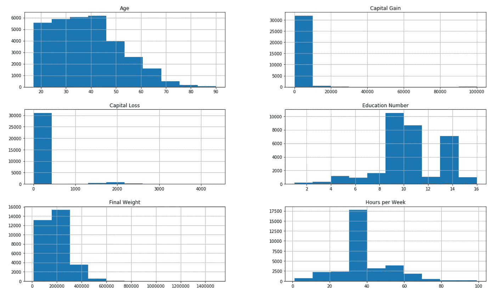

从上面的直方图中，我推断出以下几点:

1.  我可以将**年龄**列分组到箱中。
2.  对于**资本收益**和**资本损失**，数据严重左倾，需要解决。
3.  我们需要进一步分析**教育数字**，因为它可能与**教育**信息一致。
4.  **最终重量**也向左倾斜。
5.  每周的**小时数**也可以分成几个时间段。

然后，我用相关矩阵来确定它们与**收入**的关系。

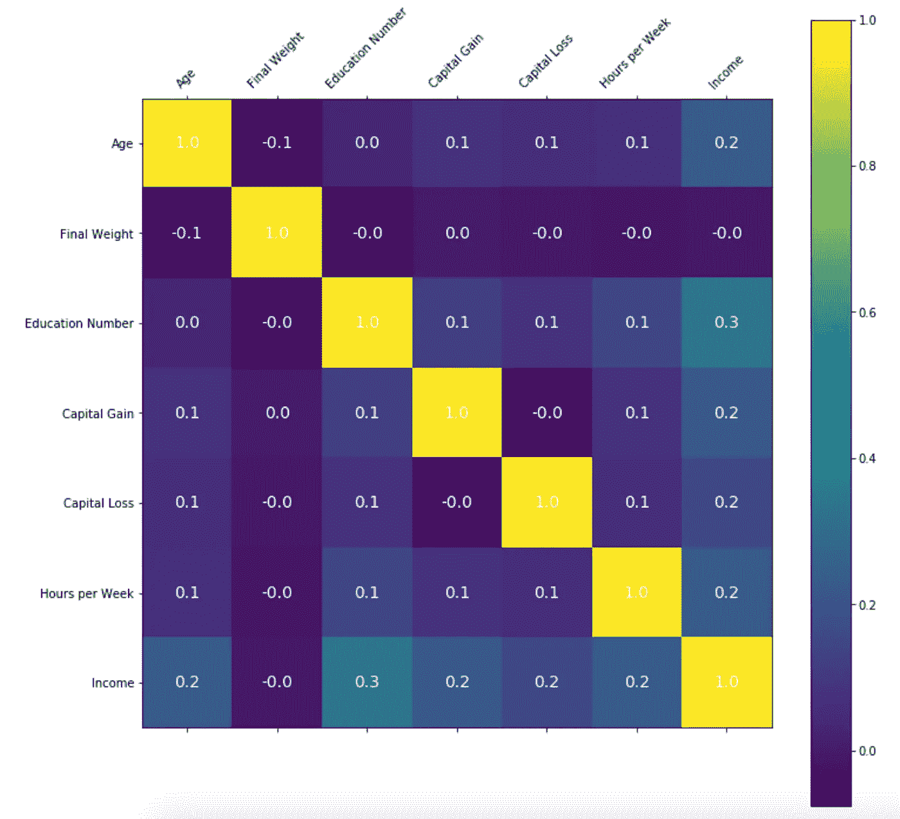

看一下上面的相关矩阵，很明显，任何连续特征和目标变量之间都没有高度的线性相关性。此外，`Final Weight`与输出类没有任何关联，因此，我稍后将删除这个专栏。

# 处理数据集

一旦我对数据集有了一些了解，我就可以单独研究每个特性及其与目标列分布的关系。

## 年龄

我决定为`Age` — `0-25`年创建三个桶，分别为`Young`、`25-50`、`50-100`和`Old`。

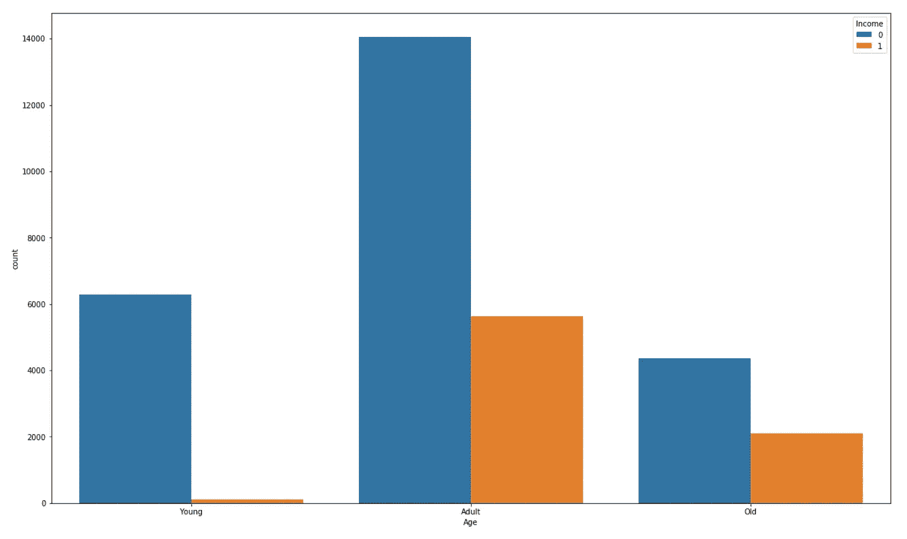

与`Young`和`Old`相比，数据集中有更多的`Adult`。此外，收入超过 5 万美元的人相对较少。

## 资本收益和资本损失

由于两者相关，我从`Capital Gain`中减去`Capital Loss`，并将值保存为`Capital Diff`。在分析数据时，我创建了两个桶，5000 美元到 5000 美元和 5000 美元到 100000 美元作为`Minor`和`Major`。

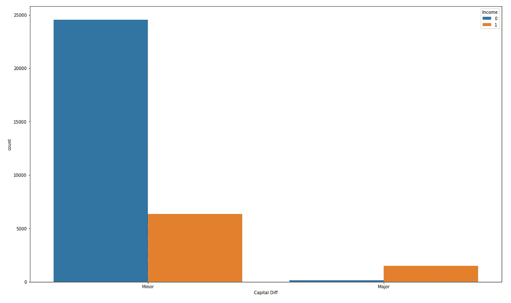

看一下结果，我可以看到`Minor`有更多的人收入低于 5 万美元，而`Major`有更多的人收入高于 5 万美元。这与以下事实完全一致:与`Capital Loss`相比`Capital Gain`较大的人`Income`拥有超过 50K 美元。

## 最后体重

如上所述，我删除了`Final Weight`一栏。

## 每周小时

考虑到通常的工作时间范围是 30-40 小时，我为不同的时间创建了时段。`0-30`为`Less Hours`，`30-40`为`Normal Hours`，`40-100`为`Extra Hours`。

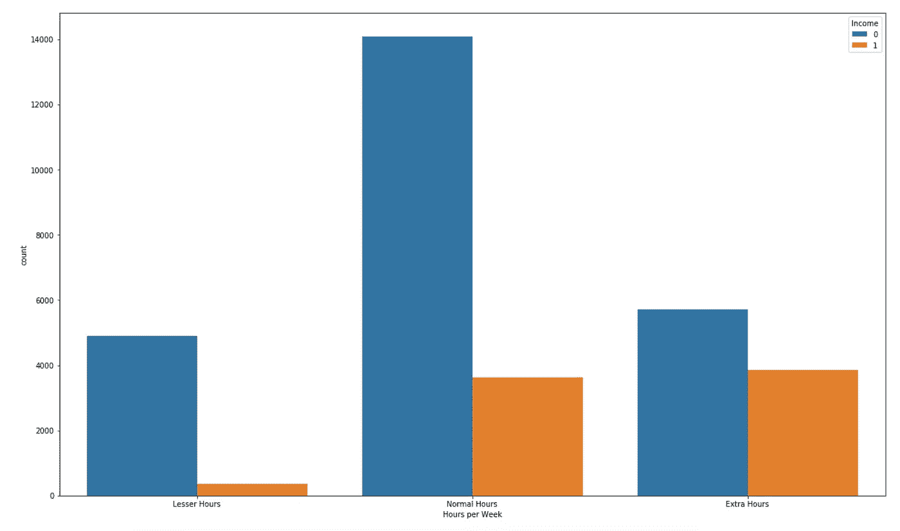

随着人们花更多的时间工作，他们可能会得到加班收入。这也与数据一致。拥有`Extra Hours`的人往往拥有更高比例的年薪超过 5 万美元的人。

## 工作类

这个特征定义了个人的工作阶级。我从绘制`Countplot`开始。

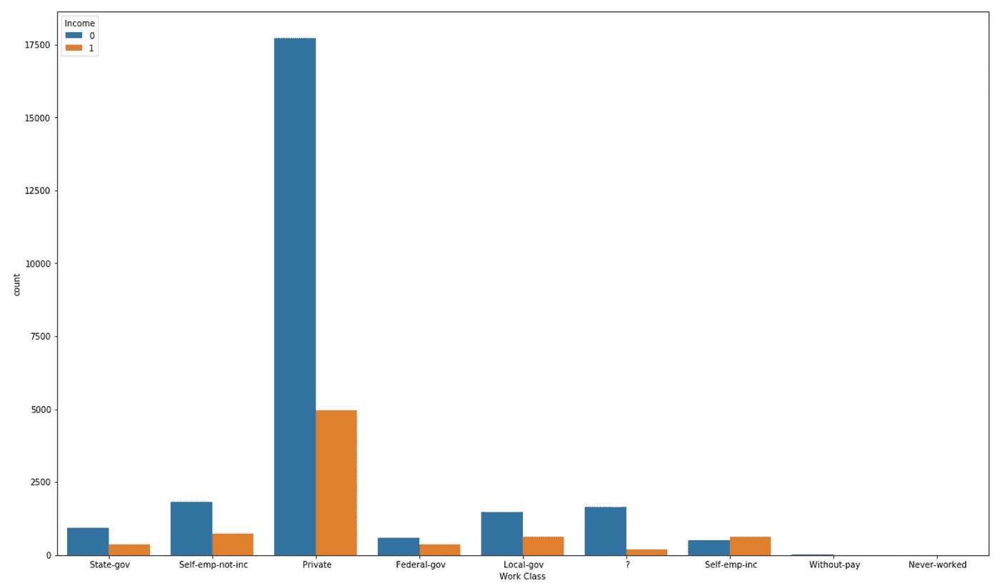

看一下上面的图，我可以看到有被定义为`?`的`Work Class`值，这似乎是错误数据。尽管我们最初确定没有丢失数据值，但我们个别地发现一些数据可能是错误的。我之所以能发现这一点，是因为我逐一分析了每个特征。

由于这些错误的数据非常多，我将简单地删除这些记录。同样，两个值`Without-pay`和`Never-worked`可以忽略不计，因此也可以安全地删除它们。

## 教育和教育编号

我的第一个想法是检查`Education`和`Education Number`之间是否有关联。对于`Education`的每个值，我都检查了对应的`Education Numbers`。

我发现了`Education`和`Education Number`之间的一一对应关系。我决定放弃`Education Number`专栏。此外，我开始进一步分析`Education`列的值。我**综合了从学前班到 12 年级**的所有信息，因为他们可以被认为是一个没有受过大学教育的班级。

## 婚姻状况和关系

两者都没有缺失值。两者之间有一些重叠，例如，如果一个人是丈夫或妻子，那么他们的婚姻状况应该是已婚。然而，由于没有完全重叠，我将保留这两列。

## 职业

我也为这个特性绘制了`Countplot`。

正如我们所看到的，不同职业的收入分配是不同的。类别已经是唯一可识别的了，我会保持原样。

## 人种

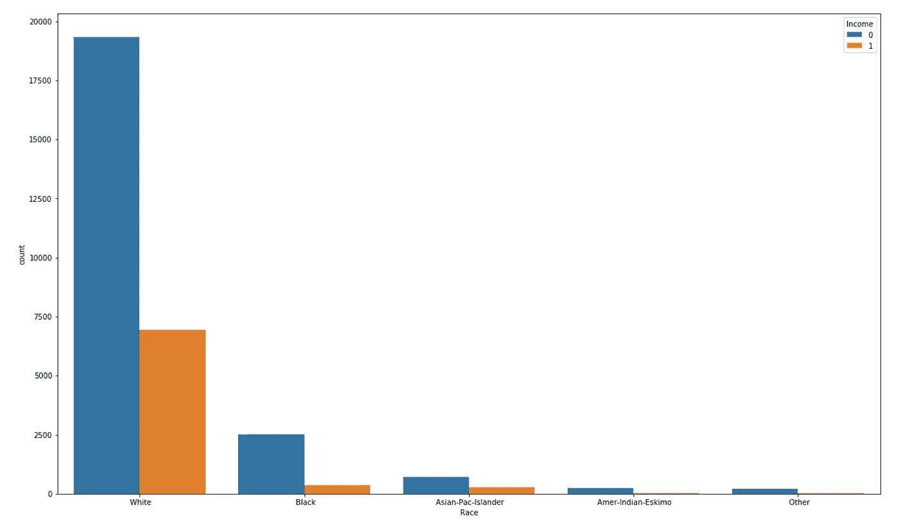

数据集包括关于`White`种族的大部分信息，而所有其他种族的数量较少。我将把所有其他比赛数据合并到一个类中作为`Other`。

## 性

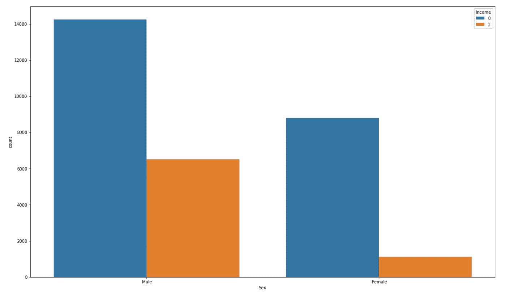

从上面的情节可以清楚地看出:

1.  男性参与者比女性参与者多
2.  当我们比较两种性别和相应的收入分配时，男性收入超过 5 万美元的比例高于女性

## 国家

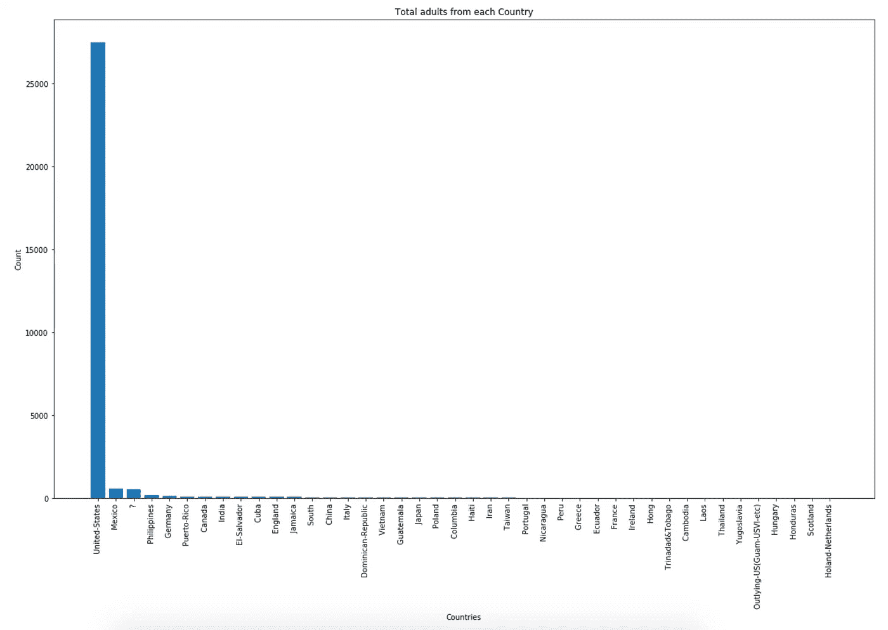

我注意到两件事:

1.  由`?`表示的国家/地区列中有一些缺失值。由于它们非常少，我将删除这些行。
2.  大多数成年人来自美国。因此，我们可以将列的值分配为`United-States`或`Other`。

# 数据操作

使用 pandas 方法`get_dummies`，我将所有的分类列转换成基于它们的类的单独的列。这将总功能提升至`56`。

我用 **70%的训练数据**和 **30%的测试数据**将数据集分成训练和测试两部分。

# 应用机器学习

在创建的训练和测试数据上，我决定应用 5 个机器学习模型:

1.  高斯朴素贝叶斯
2.  支持向量分类器
3.  决策树分类器
4.  随机森林分类器
5.  梯度推进分类器

为了评估这些车型，我计算了 **F1 的分数**。

基于以上结果，梯度推进分类器表现最好，F1 值最高`0.65`。

# 分析结果

一旦有了基本指标，我决定使用**精确度图**和 **ROC 曲线**进一步分析它们。

## 准确度图

我计算了测试数据的准确性，并在此基础上创建了一个条形图。

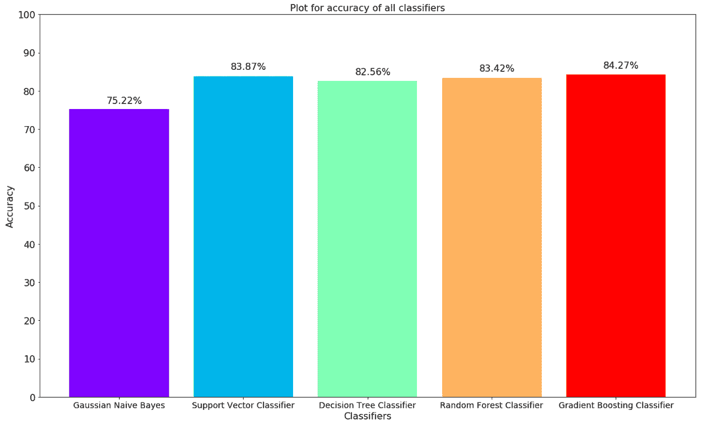

如上图所示，**梯度提升分类器**的准确率最高，为 **84.27%** 。

## 受试者工作特征曲线

作为一个分类问题，我决定使用 **ROC 曲线**来检查哪个分类器表现最好。

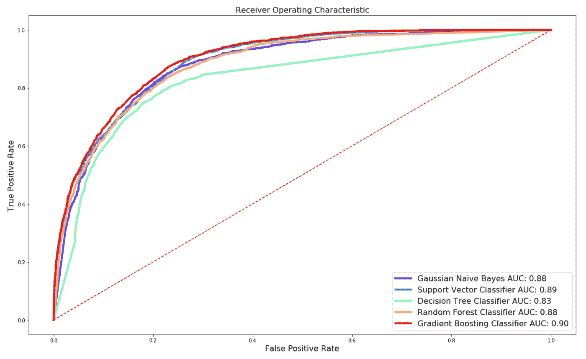

决策树分类器似乎具有最低的曲线下面积。**梯度推进分级机**在这里再次表现最佳，最大**曲线下面积为 0.90** 。

# 结论

在本文中，我处理了人口普查收入数据集，并逐一分析了每个特征。最后，我应用各种机器学习模型从数据中学习并做出预测。

## 我学到的重要事情

1.  相关矩阵可以揭示不相关的特征，我们可以删除它们
2.  虽然可能没有丢失的数据，但也可能有错误的数据。在这个例子中，我们有一些字段为`?`
3.  应用多个机器学习模型可以帮助我们选择一个在当前场景下表现最好的模型，因为没有一个模型适合所有人
4.  我们可以使用多个指标来确保模型正确运行，并且不会过度拟合数据

非常感谢您阅读完整的文章。我很乐意收到你的来信。请分享你的想法、想法和建议，或者通过 LinkedIn 联系我。

阅读我的其他文章:

 [## 使用机器学习预测心脏病的存在

### 机器学习在医疗保健中的应用

towardsdatascience.com](/predicting-presence-of-heart-diseases-using-machine-learning-36f00f3edb2c)  [## 让我们使用 LDA 构建一个文章推荐器

### 基于搜索查询推荐文章

towardsdatascience.com](/lets-build-an-article-recommender-using-lda-f22d71b7143e)  [## 使用 ROC 和 CAP 曲线的机器学习分类器评估

### 了解 ROC 和 CAP 曲线及其在 Python 中的实现

towardsdatascience.com](/machine-learning-classifier-evaluation-using-roc-and-cap-curves-7db60fe6b716)  [## 使用 Flask、Flask RESTPlus 和 Swagger UI 处理 API

### Flask 和 Flask-RESTPlus 简介

towardsdatascience.com](/working-with-apis-using-flask-flask-restplus-and-swagger-ui-7cf447deda7f)