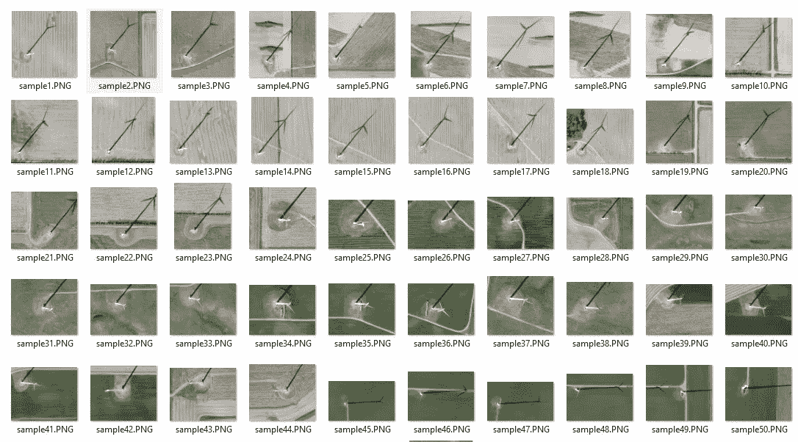
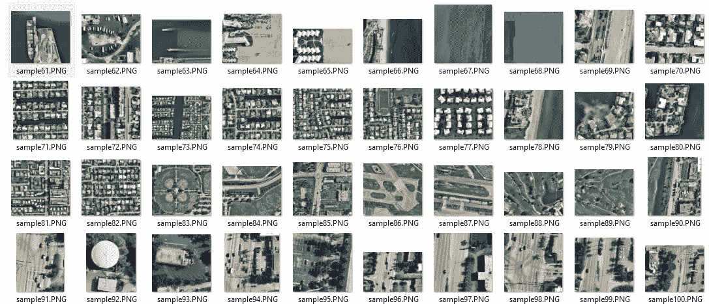
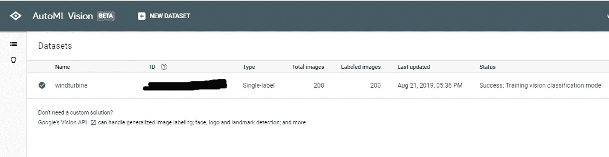
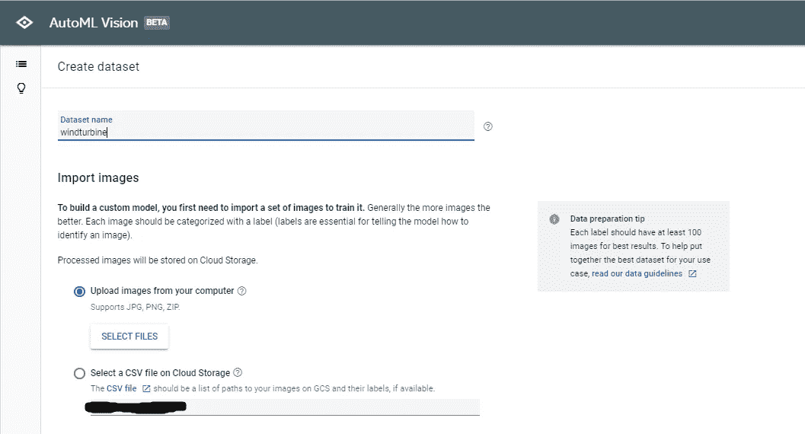
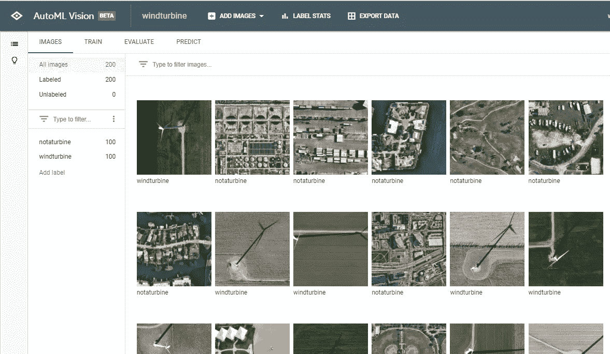
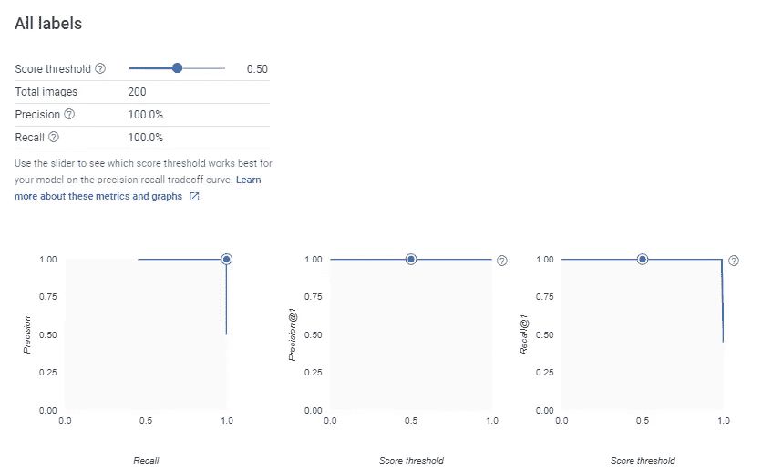
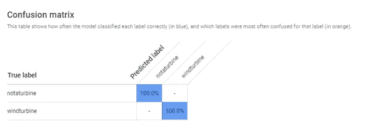
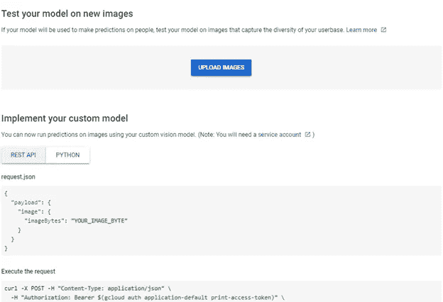
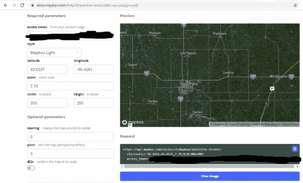
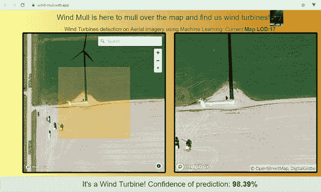

# Wind Mull——使用 Google Cloud AutoML Vision 和 MapBox 在航空影像上检测风力涡轮机

> 原文：<https://towardsdatascience.com/wind-mull-wind-turbine-detection-on-aerial-imagery-using-google-cloud-automl-vision-and-mapbox-b25a1fbec5a3?source=collection_archive---------14----------------------->

# 为什么是风呢？

我在地图上缩放/平移，探索 [MapBox 航空影像](https://www.mapbox.com/maps/satellite/)欣赏我们的绿色星球。我的脑海中浮现出我在美国中西部的公路旅行，以及从公路上看到的风力发电场阵列有多大。它们在夜晚发出同步的闪光，美得令人难以忘怀。然后，我开始放大一个有风力发电场的地图区域，在地图上看到了相当清晰的涡轮机，心想:“有了这张图像，如果我能应用机器学习来自动化并找到更多的风力涡轮机，那该多好啊”。我可以创建一个 GIS 地图图层，自动标注它们并分析哪些州/国家在风力发电上投资更多。直接进入源图像要容易得多:允许我们在全球水平上分析天线，而不是依赖个别国家发布的公共数据集，这些数据集既稀少又不可靠。此外，如果我可以将它们分段呢？哦，太多可能性了！我降低了自己的期望，从小处着手，只研究风力涡轮机的识别。

现在舞台已经搭建好了，让我们看看我是如何到达那里的。

我开始在网上寻找好的 ML 框架。我想尽快启动并运行，而不是花费大量时间进行身份验证。我发现谷歌的云 [AutoML 说:“用最少的努力和机器学习专业知识训练高质量的定制机器学习模型。”(他们没有开玩笑)与安装和做大量工作来运行 tensorflow 或 pytorch 相比，这听起来是一个很好的选择。所以，我决定继续使用 AutoML。](https://cloud.google.com/automl/?utm_source=google&utm_medium=cpc&utm_campaign=na-US-all-en-dr-bkws-all-all-trial-b-dr-1007179&utm_content=text-ad-none-any-DEV_c-CRE_338047716467-ADGP_Hybrid+%7C+AW+SEM+%7C+BKWS+%7C+RLSA+%7C+US+%7C+en+%7C+BMM+~+ML/AI+~+Cloud+AutoML+~+Google+Automl+Vision-KWID_43700042023344763-aud-658878224089:kwd-520671330914&utm_term=KW_%2Bgoogle%20%2Bautoml%20%2Bvision-ST_%2BGoogle+%2BAutoml+%2BVision&gclid=Cj0KCQjwwIPrBRCJARIsAFlVT890XryNhFVD6Cl0H6Yq6t63tgZ7t49Y0ZdeNyfaiJdjrC0bd9aX6dIaAo9eEALw_wcB)

# 数据准备和将图像加载到 AutoML

我从这里的[汽车视觉](https://cloud.google.com/vision/automl/docs/quickstart)的官方快速入门教程开始。

1.  我创建了一个名为“images”的目录，有两个文件夹“windturbine”和“notaturbine ”,如下所示。

2.我了解到，AutoML 视觉培训的最低要求是每个类别/标签 100 个图像示例。为了节省时间并了解这个想法是否可行，我开始从 MapBox 航空影像地图上快速拍摄南达科他州苏福尔斯附近的风力涡轮机。还有其他更简单的、商业上可接受的、自动化的方法来获取训练数据，但是对于这个练习，截图就足够了。

3.我保存了 100 张风力涡轮机的图片，保存在“windturbine”文件夹下

4.然后我保存了另外 100 个不是风力涡轮机的特征的截图。我故意包括道路、公园、高尔夫球场、停车场、水和建筑。

5.事后看来，我应该对所有训练图像的缩放级别进行严格选择，但一般来说，我保持在 17 和 19 之间(地图框 LOD ),这种方法返回了令人满意的结果。

6.我在谷歌云上创建了一个新的测试项目。

7.然后我访问了 AutoML Vision UI 来上传我的训练数据。

8.AutoML Vision 用户界面非常易于使用。当您单击“添加新数据集”时，您可以键入数据集名称并导入您的训练数据集。我选择了我的“图片”目录，系统足够智能，可以导入照片，并理解其中代表标签的文件夹名称，并正确标记“windturbine”和“notaturbine”。

9.这是我的数据集在导入完成后的样子

# 使用带有 AutoML 的训练图像的训练模型

1.  现在，我所要做的就是点击“训练”按钮，选择几个选项进行训练。

2.数据集越大，显然训练的时间就越长。但是由于我的数据很小，只有 200 张图片，训练在大约 20 分钟内完成。

# 使用 AutoML 评估模型:

1.现在开始评估结果！让我们看看我的训练进展如何。AutoML Vision 自动将 80%的图像用于训练，10%用于验证，10%用于测试。

2.我得到了 100%的精度分数，但这应该持保留态度，因为我的数据集是 AutoML 允许的最小大小。

3.我的混淆矩阵得到了满分，它 100%正确地预测了“风力涡轮机”和“非涡轮机”的图像。我决定进行下一步。

# 用 AutoML 预测

1.  现在这个模型已经训练好了，我进入了有趣的部分:预测。幸运的是，AutoML 自动将模型发布为服务，可以使用 REST API 或 python 调用该服务。还有一个测试操场上传程序，可以让你快速上传图片进行测试。

2.我用我从上传的训练集中保留的新的风力涡轮机图像测试了它，模型正确地预测了它是一个风力涡轮机！到目前为止潜力很大。

# Wind Mull 网络地图应用

1.既然我已经搞清楚了 ML 部分，是时候尝试识别世界上更多随机的风力涡轮机了。为了做到这一点，我创建了“风毛拉”网络应用程序。

2.我选择的 Javascript 框架是 Vue，因为我喜欢在其中进行原型开发，所以我用 Vue CLI 快速启动并运行了一个 VueJS 项目。

3.我将 MapBox lib 添加到 Vue 项目中，创建了一个地图 div，并在中心绘制了一个 geojson 多边形来指示检测区域。

4.我的第一种方法是从 MapBox raster API 请求切片，每次用户移动地图时获取航空切片，然后调用 prediction rest 端点来获取预测结果。

5.这“有点”奏效了，但是我永远也不能让瓦片与我在地图上看到的地方对齐。幸运的是，通过反复试验，我想出了一个更好的主意。

6.MapBox 有一个很棒的静态图像 API 游乐场，当你通过边界框时可以抓取图像。

7.这对于我的用例来说非常有效。我能够在距离地图中心一定距离的地方抓取边界框，获得我的航拍图像，然后将其传递给 AutoML Vision API，该 API 通过训练好的模型运行它，并返回给我一个预测标签和一个分数。

8.我不得不与一些烦人的图像格式和编码诡计作斗争，但这只是任何涉及照片的典型 web API 编程的一部分。

9.我最后以百分比的形式显示了预测分数(根据概率在 0 到 1 之间)以及地图框(没有双关语的意思！)是否包含风力涡轮机。

10.没有进入其他细节，我通过 Firebase 托管了这个项目(也是由 Google 托管的),一旦链接了这个项目，托管 Javascript 应用程序和执行 ML API 的权限就变得非常容易。

11.风魔来了，而且是真的！

1.如果你想试驾的话，这里有这个应用的链接:[这里](https://wind-mull.web.app)

2.有时，如果影像的分辨率较低，或者空中景观与训练影像中的相似，模型会出现一些问题，并错误地识别出一些例子。然而，总的来说，当我使用地址地理编码器并在美国伊利诺伊州的风力涡轮机和比利时的图像上尝试预测模型时，它得到了大多数正确的结果。

3.如果我添加更多的训练数据，我认为这将有助于提高准确性相当多，特别是在风景接近有风力涡轮机的地方。

# 值得深思的想法

Wind Mull 对我来说是一个有趣的练习，让我重新开始机器学习，并了解如何将其应用于 GIS，但我学到了很多关于 ML 和基于云的服务在短短几年内取得的进展。谷歌如何将这一过程产品化并降低准入门槛，以便来自许多学科的开发人员和数据科学家可以通过 AutoML 实验机器学习，这真是太棒了。

此外，风力发电机不必只关注风力涡轮机检测。我们可以从航空图像中进行各种特征检测，甚至用 CV(计算机视觉)进行特征提取。我认为这对于从空中获取新的 GIS 数据而不是手工数字化来说是巨大的。手动完成这项工作通常需要几天甚至几个月的时间。

# 值得注意的其他提及

1.MapBox 已经在开发这个库，它可以让你从 OpenStreetMap 图像中收集训练数据，并在天线上执行特征提取:[https://github.com/mapbox/robosat](https://github.com/mapbox/robosat)

2.ESRI 使用深度学习创建了一个游泳池检测和分类(干净或绿色):[https://medium . com/geoai/swimming-pool-detection-and-class ification-using-deep-learning-AAF 4a 3 a5 e 652](https://medium.com/geoai/swimming-pool-detection-and-classification-using-deep-learning-aaf4a3a5e652)

3.光栅视觉是一个很好的开源框架，Python 开发者可以在卫星、航空和其他大型图像集(包括倾斜的无人机图像)上构建 CV 模型【https://docs.rastervision.io/en/0.9/ 

如果你想和我聊聊 wind mull，请在 LinkedIn 上联系我，我将很高兴听到你的想法，并讨论 GIS 和机器学习之间的交集的其他伟大想法。