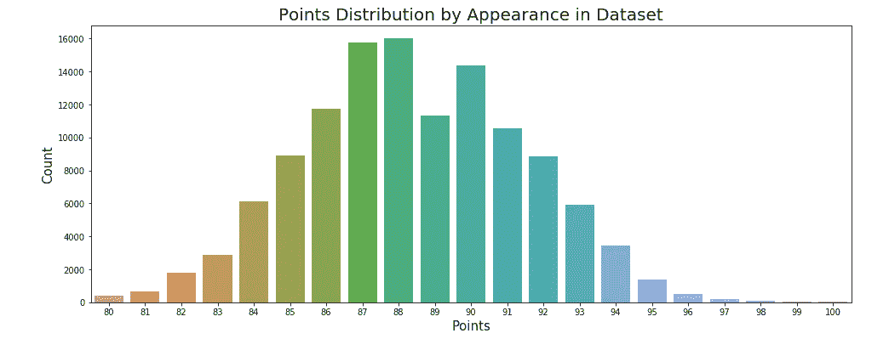
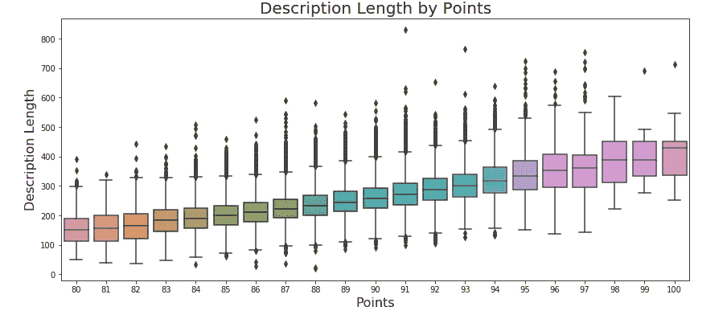

# 葡萄酒已经过时了

> 原文：<https://towardsdatascience.com/wine-is-osemn-feaf4ce30c63?source=collection_archive---------33----------------------->

酒棒极了。当你将数据科学生命周期的五个步骤中的每一个步骤应用于一个展示 2017 年葡萄酒爱好者评论的 [kaggle](https://www.kaggle.com/zynicide/wine-reviews) 数据集和一个关于红酒化学成分和质量的 [csv](https://www.kaggle.com/olivierg13/wine-ratings-analysis-w-supervised-ml) 时，这也是一个错误。那些步骤是什么？O**用于**O**获取数据。 **S** 是为了 **s** 擦洗你刚才扯皮的数据(也叫清洗)。 **E** 用于 **e** 探索数据，有时也称为 EDA——探索性数据分析。这一阶段通常包括检查汇总统计数据以及查看可视化效果，以便更清楚地了解数据试图讲述的故事。 **M** 用于 **m** 建模，涉及选择一个或多个机器学习模型应用于数据。 **N** 用于 i **n** 解释上一步的结果。这五个阶段将在这里应用，希望能从发酵的葡萄汁中获得一些有意义的见解。**

# 一.获得

虽然目前来说过于雄心勃勃，但我渴望从我最喜欢的应用程序之一 Vivino 中创建一些补充的葡萄酒数据。看看吧，它确实在葡萄酒行业和数据科学的交叉领域掀起了波澜。这里分析的数据已经引起了激烈的争论。红酒化学(酚类物质)的数据集来自 P. Cortez 等人 2009 年的科学研究。

# 二。矮树

审查数据集缺少一些信息，并且存在一些重复信息。丢失的值通过丢弃它们来处理，重复的值很好地说明了在清理数据时的虚伪誓言。理想情况下，重复的将被删除。然而，我证明了这样做造成的伤害(比好处多得多)是五倍。关于酚类物质的 Cortez 数据集既没有缺失条目，也没有重复条目。这是“在野外”遇到的相对罕见的事情，很可能是 Cortez 小组已经清理了数据的结果。前两个阶段占了整个数据科学生命周期的大部分。不是接近冰山下沉的百分比，通常，但接近。通常，您大约 60–80%的时间会用于获取和清理数据。

# 三。探索

Fairly Gaussian Distribution of Wine Ratings

上面显示的 seaborn 图不仅显示了正态分布，还提供了一些指导，说明了为了简化应该在哪里对这些点进行分组。这种简化的细节再次出现在我的 jupyter 笔记本上，这是我在 github 上主持的项目。

我在文中的形象化描述似乎证明了这样一个观点，即某个评论者对有问题的葡萄酒写得越多，他们就越喜欢它，对它的评价也越高(或者说它越贵，因此应该用更多的词来描述潜在买家的投资)。总的来说，一个简短的描述似乎是由于一个无动于衷的评论家。沉默寡言的品酒师的简洁很能说明问题。似乎是关键词。我们会看到的。

# 四。模型

我将使用的机器学习算法(随机森林)是为了分类，属于监督学习模型的范畴。首先，我检查数据集中葡萄酒描述的长度是否是一个令人满意的分类预测器，可以预测一种葡萄酒是否会被认为是高分(我的目标，或因变量)。我从我的 EDA 那里得到了这个关于有多少酒得到了什么样的分数。然后，在对葡萄酒价格进行分类的背景下，我检查了同一个独立变量，葡萄酒评论描述长度，这是我的下一个目标变量。在每个实例中，我使用随机森林分类(RFC)来查看该算法如何响应保持输入变量一致和改变输出变量。

在将分数简化或“宁滨”成更小的分组之前，第一个目标变量“分数”的精确度非常低。后来，它的分类只比偶然性稍好一点。第二个模型以价格为输出变量，在对价格高于 100 美元一瓶的昂贵葡萄酒进行分类时，被证明几乎同样有效(只是和随机机会一样好)。然而，在这个阈值以下，它给人留下了深刻的印象，分类准确率约为 96.5%。

我还在一个不同的数据集背景下检验了这个特殊的分类模型，这个数据集也涉及葡萄酒，但这次是红酒的酚类物质以及这些特征与质量的关系。酚类化合物是赋予红酒颜色的原因。这种化学成分非常迷人，它经常被认为是区分高质量葡萄酒和不那么高质量葡萄酒的因素。RFC 在这里证明了自己是一个非常有效的机器学习算法。

通常在机器学习中，许多不同的模型被迭代测试，以确定哪个提供最好的结果(无论你是为了准确度、精确度还是模型的一些其他特征)。在 RFC 的情况下，以及在其他决策树风格的方法中，这可能涉及到通过 GridSearch 之类的方法执行交叉验证(通常是 5 或 10 倍),这种方法通过输入数据组合地检查每种可能性。这是一种调整模型参数的简便方法，尽管这是一种计算量很大的穷举搜索。与其他最大似然算法相比，它往往是表现最好的，对数据中的噪声和方差有天然的抵抗力。

我确实利用 RFC 算法中的迭代来为我的酚类数据集找到最佳特征，以选择最高精度，但我没有为葡萄酒评论、价格和点数建模。这是我的项目中缺少的东西，在将来会是一个值得包含的东西。我在这里的理由是缩小 RFC 在两个不同的数据集上的具体功能，这两个数据集被一个共同的葡萄栽培主题所统一。

# 动词 （verb 的缩写）口译

> 巴克斯喜欢压力过大的葡萄。

我们已经到了数据科学过程的最后一步。我们应该如何看待我们所有的辛勤工作？在检查葡萄酒数据集的随机森林分类之前，我冒昧地猜测，品酒师越是把笔放在纸上，或者从技术上说，手指放在键盘上，他们对被采样的葡萄酒的评级就越高。

RFC 建模的结果相当具有决定性，我的假设实际上并不成立。

虽然简化点数指标的 RFC(未图示)在将葡萄酒描述长度划分为五个定义的类别方面确实比平均水平稍好，但它没有达到我最初制定这个项目时假设的程度。我的 EDA 中的这张图可能会说明原因:

线性回归模型在这里比分类更合适。

在 20 个不同的点类别的情况下，这被证明是特别正确的，但是当每 4 个点被分入更小的分组时，这仍然是正确的。

一个好得多的分类模型包括使用较短的描述来分类较便宜的葡萄酒(低于 100 美元)。包含向上的异常值在很大程度上帮助了这个模型。事实上，只包括价格高达 500 美元的葡萄酒对模型的准确性是有害的，在没有测试和验证的情况下，我是不会预见到的。在选择 100 美元作为质量门槛时，我有一些领域知识，超过这个门槛就是狂热状态。当一瓶酒的损害达到三位数时，在没有足够合理的质量指数增长的情况下，价格出现了巨大的差异。RFC 模型中反映的是对低于 100 美元的葡萄酒进行分类的高准确度，但对高于该阈值的葡萄酒来说，这不是一个比机会更好的分类模型。

我提出，绝大多数葡萄酒饮用者从未想过要花超过 100 美元买一瓶葡萄酒，或者很少这样做。该模型表明，通过随机森林算法，来自 2017 年葡萄酒评论子集的特定描述长度的葡萄酒能够以高精度和准确度被分类为低于该临界价格点。以上，审查的长度只是对每瓶酒的成本进行分类的机会。

综上所述，我认为这两个结果应该被解释为购买描述长度更长但价格仍低于 100 美元的葡萄酒是寻找下一个葡萄酒爱好者的最佳方法。因为它是一个较弱的模型，所以分数只能作为一个次要的方法来对真正最好的葡萄酒进行分类。

虽然我在这里没有涉及到它，但是在评论描述中，描述长度和词频可能有一些相互作用，这值得进一步研究。这将进入自然语言处理的领域，包括将给定文本中的单词外观转换成向量，以便能够测量频率。描述长度可能与某些单词出现的频率相协调，也可能不协调。这将是我在这里深入研究的一个有价值的扩展。

我们对酚类的研究给了我们一个决定性的分类。很自然。酚类是植物和动物作为其防御机制的一部分释放的有机化合物，具有中心环状苯环和不同数量的羟基作为取代基。所以，葡萄树受到的压力越大，它们产生的酚类物质就越多。这些化合物不仅会影响红葡萄酒的颜色，还会作为防腐剂影响味道。巴克斯喜欢压力过大的葡萄。

我的笔记本详细说明了，不管你是在处理我定义的“不是两块钱的查克”(好)还是“两块钱的查克”(坏)葡萄酒，对于这两种风格的葡萄酒中的一种，Random Forest 都是一个相当精确和准确的机器学习分类模型。它特别擅长辨别优质葡萄酒。当分析包含在高度分散的分布上运行的变量的数据集时，要素缩放总是值得应用的。然而，在这个具体的例子中，所有的特征甚至在缩放之前都是非常一致的。这一点，加上一些功能选择，为我进军机器学习和葡萄酒领域提供了一些额外的见解和深度。

尽管并不完美，但这个项目使数据科学生命周期在我看来更加具体。我希望它能在某种程度上为你做同样的事情。

**参考文献:**

https://github.com/harrisonhardin/Mod5Project

 [## 葡萄酒评论

### 13 万条葡萄酒评论，包括品种、地点、酒厂、价格和描述

www.kaggle.com](https://www.kaggle.com/zynicide/wine-reviews) 

页（page 的缩写）科尔特斯、塞德伊拉、阿尔梅达、马托斯和雷伊斯。通过物理化学特性的数据挖掘建立葡萄酒偏好模型。在决策支持系统中，爱思唯尔，47(4):547–553，2009。

[https://www . ka ggle . com/ka Bure/wine-review-s-understanding-python IC-EDA](https://www.kaggle.com/kabure/wine-review-s-understanding-pythonic-eda)

[https://www . ka ggle . com/olivierg 13/wine-ratings-analysis-w-supervised-ml](https://www.kaggle.com/olivierg13/wine-ratings-analysis-w-supervised-ml)

[https://www . ka ggle . com/UC IML/red-wine-quality-cortez-et-al-2009/downloads/wine quality-red . CSV/2](https://www.kaggle.com/uciml/red-wine-quality-cortez-et-al-2009/downloads/winequality-red.csv/2)

[https://www.winefrog.com/definition/515/phenolics](https://www.winefrog.com/definition/515/phenolics)