# 使用机器学习赢得 21 点

> 原文：<https://towardsdatascience.com/winning-blackjack-using-machine-learning-681d924f197c?source=collection_archive---------1----------------------->

## 遗传算法的一个实例

机器学习的一个伟大之处在于有如此多不同的方法来解决问题。*神经网络*非常适合在数据中寻找模式，从而产生令人印象深刻的预测能力。*强化学习*使用基于奖励的概念，随着时间的推移不断改进。还有一种叫做*遗传算法*的方法。

遗传算法(GA)利用进化原理来解决问题。它的工作原理是使用一个问题的潜在解决方案群体，反复选择和繁殖最成功的候选方案，直到经过若干代后最终的解决方案出现。

为了展示这种方法的有效性，我们将使用它来解决一个复杂的问题——创建一个玩赌场游戏[二十一点](https://en.wikipedia.org/wiki/Blackjack)(也称为“21”)的策略。

在这种情况下，术语“策略”是指涵盖所有情况的玩家行动指南。我们的目标是找到一个最好的策略，随着时间的推移获得最大的收益。

## **关于这个“制胜”策略**

当然，在现实中，21 点没有赢的策略——规则是这样制定的，所以赌场总是有优势。如果你玩的时间足够长，你*就会*输钱。

知道了这一点，最好的策略就是将损失最小化。使用这种策略可以让玩家尽可能地扩大资金，同时希望获得短期好运。这是在 21 点中获利的唯一方法。

正如你所想象的，数学家和计算机科学家已经研究 21 点很久很久了。早在 20 世纪 60 年代，一位名为[爱德华·o·索普](https://en.wikipedia.org/wiki/Edward_O._Thorp)的数学家写了一本名为*击败庄家*的书，书中包括显示最优“基本”策略的图表。

最优策略大概是这样的:

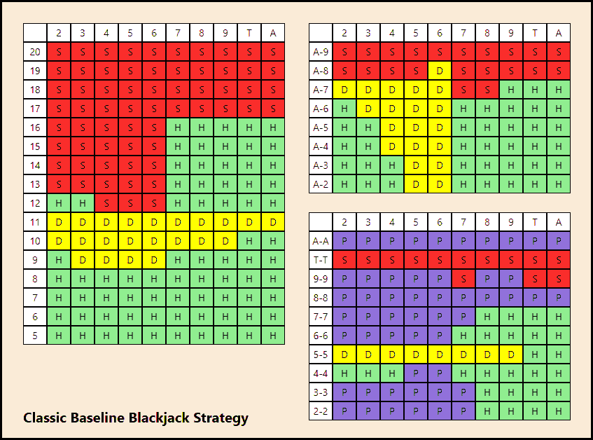

Optimal Strategy for Blackjack

这三张桌子代表了玩 21 点的完整策略。

左边的高桌子是给*硬手*用的，右上的桌子是给*软手*用的，右下的桌子是给*对*用的。

如果你不熟悉 21 点，软牌是指一手可以算成 1 或 11 的牌，但总牌值不超过 21。对子不言而喻，硬手基本就是其他的一切，折算成总手值。

三个表格顶部的列用于经销商 upcard，它影响策略。请注意，升级卡等级不包括杰克、皇后或国王。这是因为这些牌都是 10 张，所以它们都与 10(“T”)组合在一起，以简化表格。

要使用牌桌，玩家首先要确定他们是有一对牌，一手软牌还是一手硬牌，然后使用对应于他们手中牌的行和对应于庄家升牌的列来查找适当的牌桌。

当正确的策略是击打时，表格中的单元格将为“H”，当正确的策略是站立时，单元格将为“S”，双降时，单元格将为“D”，而(仅在 pairs 表格中)拆分时，单元格将为“P”。

知道这样一个问题的最优解实际上非常有帮助。将遗传算法的结果与已知的解决方案进行比较将展示该技术的有效性。

最后，在我们继续深入之前，还有一件事需要解决，那就是*非确定性*的概念。这意味着，如果相同的 GA 代码连续运行两次，将返回两个不同的结果。这是遗传算法由于其固有的随机性而发生的事情。软件以这种方式运行是不寻常的，但在这种情况下，这只是方法的一部分。

## **遗传算法如何工作**

遗传算法使用起来很有趣，因为它们非常容易理解:你从一群(最初，完全随机的)潜在解决方案开始，然后让进化去寻找解决方案。

这个进化过程是通过比较候选解决方案来驱动的。每个候选人都有一个健身得分，表明它有多好。对于所有候选人，每代计算一次该分数，并可用于相互比较。

在 21 点策略的情况下，适合度分数非常简单:如果你使用该策略玩 N 手 21 点，当完成时你有多少钱？(由于房子边缘，所有策略都会赔钱，也就是说所有的适应值都会是负数。一个策略的健康指数越高，仅仅意味着它比其他策略损失的钱更少。)

一旦创建了有效的适应度函数，使用 g a 时的下一个决策就是如何进行选择。

有许多不同的选择技术来控制选择在多大程度上由适应度分数和随机性驱动。一种简单的方法被称为*锦标赛选择*，它的工作原理是从人群中随机挑选 N 名候选人，并使用健康得分最高的一名。简单有效。

一旦两个父母被选中，他们就被杂交形成一个孩子。这就像正常的有性生殖一样——父母双方的遗传物质结合在一起。由于父母是着眼于健康而选择的，所以目标是将父母双方的成功因素传递下去。

自然地，在这种情况下,“遗传物质”仅仅是每个策略的三个表中的 340 个细胞。通过从两个父代中选择相应的单元格来填充子代中的单元格。通常，交叉与相对适应度分数成比例，因此如果一个父代具有明显更好的适应度分数，则他们可能最终比另一个父代贡献更多的表单元。

最后，就像在自然界一样，群体中的多样性也很重要。太小或太同质的群体总是比更大和更多样化的群体表现更差。

遗传多样性很重要，因为如果你没有足够的遗传多样性，就很容易陷入一种叫做*局部最小值*的东西，这基本上是一种比任何类似替代方案都表现更好的解决方案，但不如其他与它明显不同的解决方案。

为了避免这个问题，遗传算法有时使用突变(引入全新的遗传物质)来提高遗传多样性，尽管更大的初始种群也有帮助。

## **结果使用遗传算法**

关于气体的一件很酷的事情就是看着它们演化出一个解决方案。第一代是完全随机的解决方案。这是来自第 0 代(第一个随机代)中 750 个候选人的最佳解决方案(基于适应值):

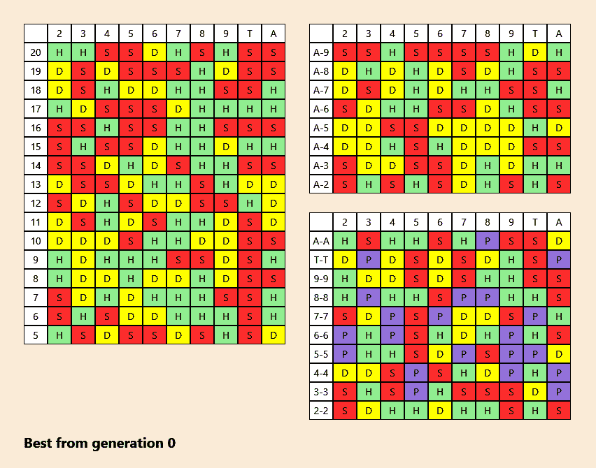

Randomly generated candidate from Gen 0

如你所见，这完全是随机的。到了第 12 代，一些东西开始成形:

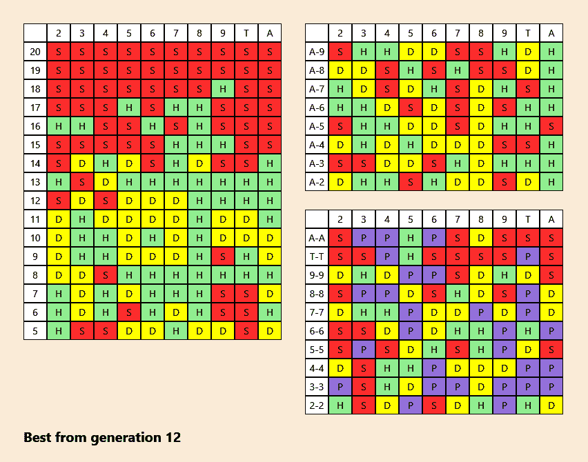

只有 12 代的经验，最成功的策略是那些坚持了 20、19、18 甚至 17 代的策略。策略的这一部分首先发展，因为它发生得如此频繁，并且有一个相当明确的结果。基本概念首先是用气体发展起来的，细节是在以后的世代中出现的。

该策略中的其他质量暗示是硬 11 和硬 10 持股。根据最优策略，这些应该大部分是双倍下注，所以看到这么多黄色是令人鼓舞的。

对子和软牌桌会持续到最后，因为这些牌很少出现。例如，一个玩家只有 6%的机会拿到对子。

到了第 33 代，事情开始变得清晰:

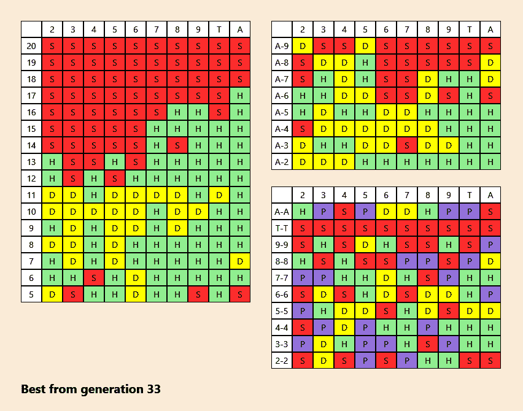

到了 100 代，左边的硬手桌就完全稳定了——一代不变。软牌和对子牌桌越来越精致:

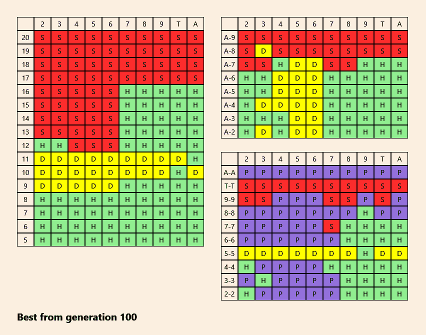

最后几代被用来改进策略。在这个阶段，代与代之间的变化要小得多，因为这实际上只是解决最小细节的过程。

最后，经过 237 代，找到了最佳解决方案:

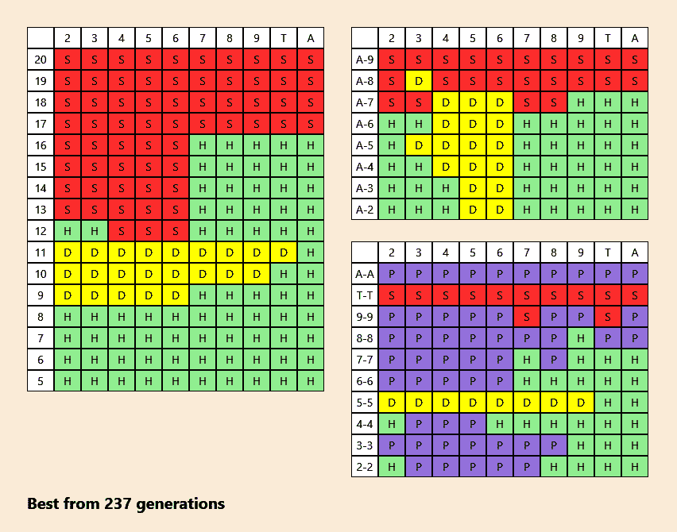

如你所见，最终结果与最优解并不完全相同，但非常非常接近。特别是硬手牌(左边的表格)几乎完全正确。软牌和对子表中有更多不匹配的单元格，但这可能是因为这些牌类型出现的次数远少于硬牌。

就结果而言，以每手 5 美元的价格玩 500，000 手牌的最佳策略将导致 176，040 美元的损失。使用计算机生成的策略将导致 176，538 美元的损失，与 50 万手相比相差 498 美元。

有一个[动画 GIF](https://github.com/GregSommerville/machine-learning-blackjack-solution/blob/master/images/animatedsolution.gif) 展示了这种策略在 237 代中的演变，但要注意它的大小是 19 MB，所以你可能不希望通过手机来查看它。

产生这些图像的软件的源代码是[开源](https://github.com/GregSommerville/machine-learning-blackjack-solution)。这是一个用 C#和 WPF 一起编写的 Windows 桌面应用程序。

## 组合暗示

尽管由此产生的战略令人印象深刻，但我们需要通过思考问题的范围来将其置于背景中。21 点的最佳策略是在 340 个牌桌单元(分布在三张牌桌上)中填入每种持有牌/庄家升牌组合的最佳选择，包括立牌、对打、双倍下注或分牌。

就组合而言，有 4 个⁰⁰可能的对子策略、3⁸⁰可能的软牌策略和 3 个⁶⁰可能的硬牌策略，总共有 5 x 10 个⁷⁴可能的 21 点策略:

4 ⁰⁰ x 3⁸⁰ x 3 ⁶⁰ = 5 x 10 ⁷⁴可能的 21 点策略

在这种情况下，遗传算法在 5×10⁷⁴可能答案的解空间中找到了接近最优的解。在一台标准的台式电脑上运行，大约需要 75 分钟。在那次运行中，评估了大约 178，000 个策略。

## 测试体能

遗传算法本质上是由适应度函数驱动的。如果没有一个好的方法来比较候选人，进化过程就无法进行。

适应度函数的概念很简单。尽管我们可能不知道问题的最佳解决方案，但我们确实有一种方法来衡量潜在的解决方案。适应度函数反映了传递给它的候选人的相对适应度水平，因此分数可以有效地用于选择。

为了找到一个 21 点策略，一个适应度函数很简单，它是一个在一定数量的牌局中使用该策略后返回预期最终收益的函数。

但是多少手才够呢？

事实证明，你需要用一个策略玩很多手牌才能确定它的好坏。由于一副牌天生具有随机性，所以需要打很多手牌，这样随机性在候选人之间就平衡了。

当我们的 GA 接近最终解决方案时，这一点尤为重要。在早期世代中，如果适应度分数不精确，这不是问题，因为坏的候选人和好的候选人之间的差异通常相当大，并且向最终解决方案的收敛继续没有问题。

然而，一旦遗传算法进入后代，被比较的候选策略将只有微小的差异，所以从适应度函数中获得准确的预期收益是很重要的。

幸运的是，找到所需的合适的手数非常简单。使用单个策略，运行多个测试，产生一组适应性分数。相同策略的不同回合之间的差异将揭示有多少可变性，这部分是由测试的手数决定的。玩的牌越多，变化就越小。

通过测量一组分数的标准偏差，我们可以了解在 N 手牌的测试中，一组分数的可变性有多大。但是，由于我们每次测试的牌局数量不同，我们无法比较标准偏差，原因如下:

标准差根据基础数据进行调整。我们无法比较使用不同牌局数的测试的体能分数(或其标准差),因为玩的牌局数越多，体能分数相应增加。

换句话说:假设一种策略有 34%的胜算。如果你用 25，000 手牌和 50，000 手牌进行比较，最后你会得到不同的总数。这就是为什么你不能简单地比较不同测试条件下的体能分数。如果你不能比较原始值，你就不能比较标准差。

我们通过将标准偏差除以每个测试值的平均健康得分(也就是玩的手数)来解决这个问题。这给了我们一个叫做*变异系数*的东西，它可以与其他测试值进行比较，而不管玩了多少局。

这里的图表展示了当我们玩更多手牌时，可变性是如何缩小的:

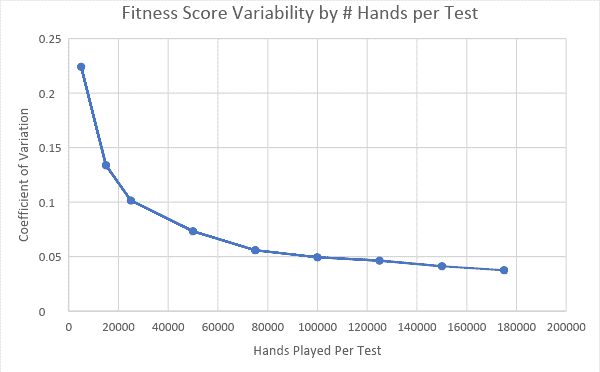

图表中有一些观察结果。首先，仅用 5000 或 10000 只手进行测试是不够的。在这些水平上，对于相同的策略，健康分数会有很大的波动。事实上，看起来最少 100，000 手可能是合理的，因为这是可变性开始变平的点。

我们能在每次测试中运行 500，000 或更多手吗？当然了。它减少了可变性并增加了适应度函数的准确性。事实上，50 万手的变异系数为 0.0229，明显优于 10 万手的 0.0494。但是这种改进绝对是收益递减的一个例子:测试的数量必须增加 5 倍，才能得到一半的可变性。

鉴于这些发现，策略的适应度函数将需要使用以下规则(在现实世界赌场中常见)玩至少 100，000 手 21 点:

*   使用混洗在一起的 4 副牌
*   庄家必须打到 17(软或硬)
*   你可以在你分开的一手牌上加倍下注
*   没有保险
*   21 点支付 3:2

## 遗传算法配置

使用 GA 的一个不寻常的方面是它有如此多的设置需要配置。可以为运行配置以下项目:

*   群体大小
*   选择方法
*   突变率和影响
*   终止条件

改变每一项都会产生不同的结果。确定这些设置值的最佳方式就是简单地进行实验。

**人口规模**

这是不同人口规模的每一代候选人平均适应度的图表:

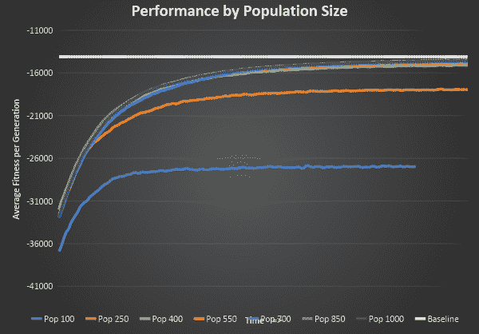

这个图的 X 轴是世代数(最多 200)，Y 轴是每代的平均适应度得分。最初的几代人并没有显示出当我们到达后代时的差异。

沿着图表顶部的扁平白线是已知的最佳基线策略的适应性分数。

首先要注意的是，两个最小的群体(分别只有 100 和 250 名候选人，以蓝色和橙色显示)在所有规模中表现最差。

这些小群体中缺乏遗传多样性，导致最终的适应性分数很低，同时寻找解决方案的过程也较慢。显然，拥有足够大的种群以确保遗传多样性是非常重要的。

另一方面，400 人、550 人、700 人、850 人和 1000 人之间没有太大的差异。

这与选择要测试的手数的情况类似，如果你选择的值太小，测试就不准确，但是一旦超过某个水平，差异就很小了。

## 选择方法

为交叉寻找好的候选者的过程被称为选择，有许多方法可以做到。锦标赛的选择已经介绍过了。以下是另外两种方法:

*轮盘赌选择*根据候选人的健康分数选择候选人。想象一个饼图，有三个大小分别为 1、2 和 5 的扇区。值为 5 的楔形区有 5/8 的时间被选中，值为 2 的楔形区有 2/8 的时间被选中，值为 1 的楔形区有 1/8 的时间被选中。这是轮盘赌轮盘选择背后的基本思想。与所有候选人的总得分相比，每个候选人的楔形大小与他们的健康得分成比例。

这种选择方法的一个问题是，有时某些候选人的健康得分很低，以至于他们从未被选中。如果幸运的话，有几个候选人的健康得分远远高于其他人，他们可能会被不成比例地选中，这降低了基因多样性。

解决方案是使用*排序选择*，它的工作方式是根据适合度对候选人进行排序，然后给最差的候选人 1 分，第二差的候选人 2 分，以此类推，一直到最佳候选人，最佳候选人得到的分数等于人口规模。一旦健身分数调整完成，将使用轮盘赌选择。

下图比较了使用各种选择方法的每一代人的平均适应度:

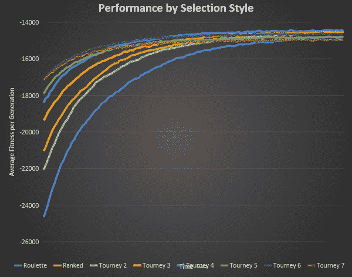

正如您所看到的，比赛选择很快收敛到一个最优解，事实上，比赛规模越大，平均健身分数提高得越快。这是有道理的，因为如果你随机选择 7 个候选人并使用最好的，质量会比只选择 2 个高得多。

尽管它有最快的初始改进，但 Tourney 7 最终产生了最差的结果。这是有道理的，因为尽管大规模的比赛会带来快速的进步，但它也将基因库限制在最好的范围内。所需的基因多样性丢失了，从长远来看，它的表现也不好。

表现最好的看起来是锦标赛 2、锦标赛 3 和锦标赛 4。给定 700 人的人口，这些数字提供了良好的长期结果。

## 精英主义

遗传算法中还有另一个概念叫做*精英主义*。它的思想是，当构建新一代时，首先按照适应度对人口进行排序，然后将一定比例的最佳候选人直接传递给下一代，而不进行改变。完成后，正常的交叉就开始了。

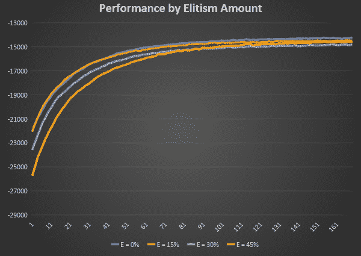

这个图表显示了四种不同的精英主义率的影响(仅为了显示细节，仅显示后代)。显然，没有精英主义或 15%是合理的，尽管 0%看起来更好一些。

这个图表有一点令人惊讶——精英主义程度越高，解决问题的收敛速度越慢。你可能认为故意包括每一代中最好的会加快速度，但事实上看起来只使用交叉候选人会给出最好的结果，也是最快的。

## 突变

保持高遗传多样性是很重要的，而突变是引入这一点的简单方法。

有两个因素与突变有关:它发生的频率有多高，以及当它发生时会产生多大的影响？

一个*突变率*控制着一个新产生的候选者被突变的频率。突变是通过杂交在创造后立即完成的。

*突变影响*控制一个候选者被突变的程度，以其细胞被随机改变的百分比来表示。所有三张牌桌(硬牌、软牌和对子)的变异百分比相同。

从 10%的固定影响率开始，下面是不同突变率的影响:

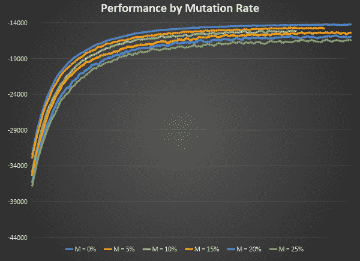

很明显，突变对这个问题没有帮助——受突变影响的候选人越多，结果就越糟糕。因此，不需要尝试不同的突变影响值——0%的突变率显然是解决此问题的最佳值。

## 终止条件

知道何时退出遗传算法可能很棘手。有些情况需要固定的世代数，但对于这个问题的解决方案是寻找停滞——换句话说，当遗传算法检测到候选不再改进时，它就会停止。

用于该测试的条件是，如果连续 25 代的整体最佳策略(或一代的平均分数)没有改善，则该过程终止，并且到该点找到的最佳结果被用作最终解决方案。

# 包扎

遗传算法是解决复杂问题的强大技术，并且具有易于理解的优点。对于因组合因素导致解空间巨大的问题，它们是极其有效的。

要了解更多关于 GA 的信息，请从这篇[维基百科文章](https://en.wikipedia.org/wiki/Genetic_algorithm)或者我写的 [PluralSight(付费)课程](https://www.pluralsight.com/courses/genetic-algorithms-genetic-programming)开始，它涵盖了这个主题的更多细节。