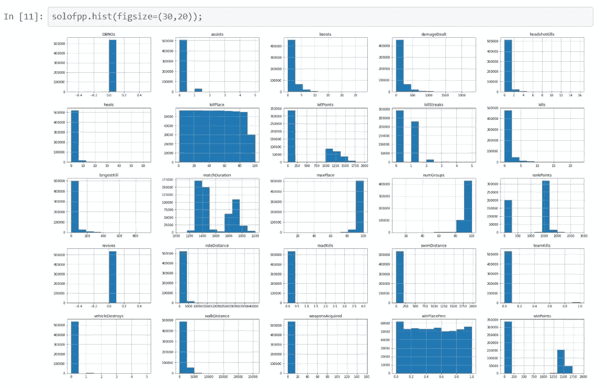
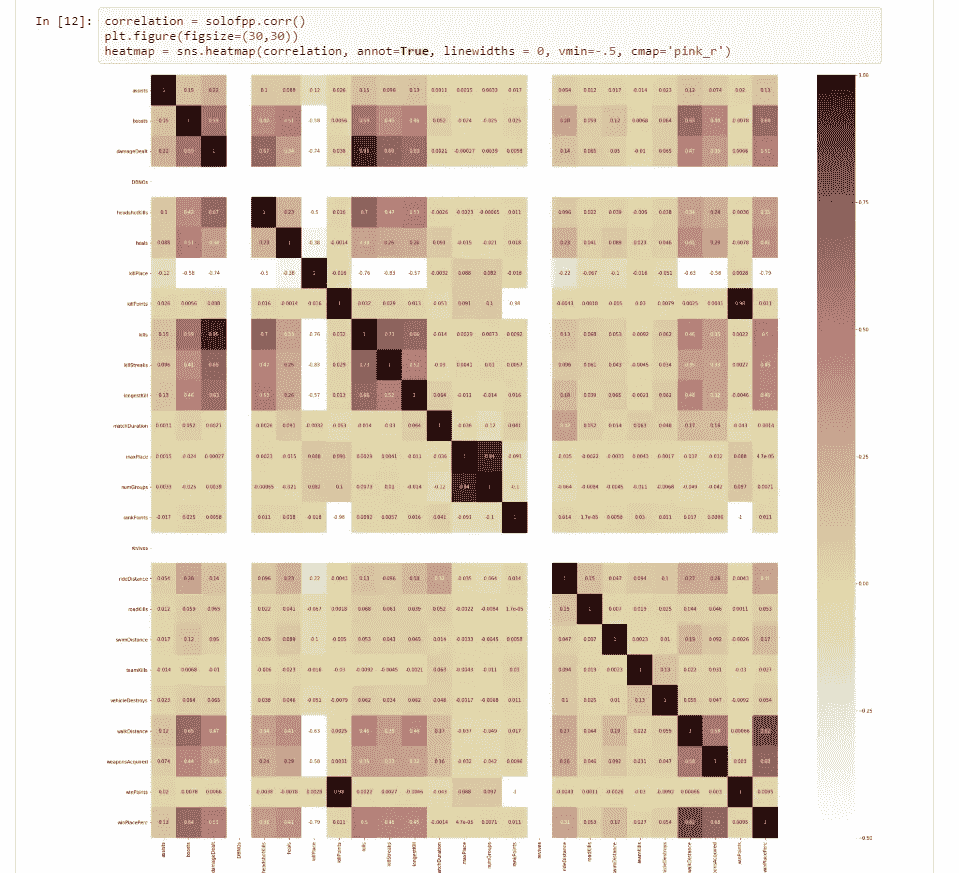
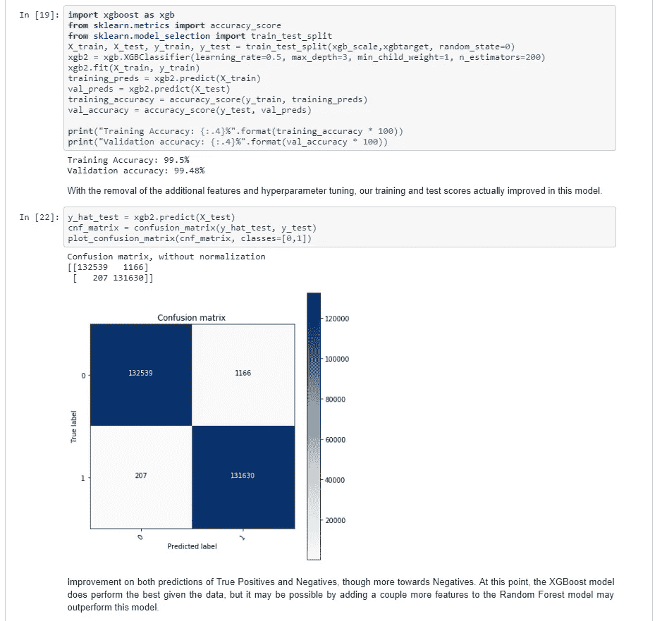

# 赢得 PUBG:干净的数据并不意味着现成的数据

> 原文：<https://towardsdatascience.com/winning-in-pubg-clean-data-does-not-mean-ready-data-47620a50564?source=collection_archive---------19----------------------->

到目前为止，这个项目的研究是我最喜欢的。如果你是一个粉丝，或者至少浏览过 Kaggle 的一些比赛，那么你可能已经看到了预测 PUBG 挑战赛的胜利。竞争早已过去，但我想解决这个问题，因为游戏和这个行业是一个有趣和令人兴奋的冒险。

数据本身就很吓人……仅在训练数据集中就有大约 450 万次观察，在测试集中还有大约 150 万次。我已经听说 Kaggle 数据集非常干净，但这个数据集几乎是完美的。只有一个…我指的是整个数据集中的一个空值。我最初的想法是，“这将是一件轻而易举的事情”，但是我想彻底地经历 OSEMiN 过程的清理和探索阶段(获取、清理、探索、建模、解释)。在这里，我了解到干净的数据并不一定意味着现成的数据。

在对这些特征进行一些初步研究后，我注意到有一些比赛类型(单人、双人、小队)是数据集的一部分。玩过这个游戏后，我知道每个模式都有一些不同的特点，这些特点在比赛中会更重要(团队对单人)。所以对我来说，第一步是把数据分成 solo，duo 和 squad。这将我的数据集缩减到更容易管理的大约 55 万次观察。

运行完。describe()方法来查看基本的统计信息，这是我注意到的第一个障碍。0s。数据中成百上千的 0。为什么？当比赛进行时，开始是死亡和毁灭的风暴。那些被立即杀死的玩家在特性栏中会有很多 0。当你归因于超过 20%的玩家在前 5 分钟被杀，你最终会在数据中得到一堆 0。

When the min, 25%, 50% and 75% quartiles are 0….that’s an issue.

接下来，有一些本质上是绝对的数据。在预测获胜时，我需要逻辑回归或分类器，所以必须要有分类数据。不过没什么大不了的，分类数据与胜利无关，只是 Id 信息。

然后，我用直方图和箱线图将数据可视化。直方图验证了数据严重偏向光谱的 0 端。它也影响了箱线图的外观。由于大多数数据都是 0，如果特性可能达到数百甚至数千，可视化就会看起来很遥远，事实也确实如此。一些特征甚至有大量的异常值。虽然这部分是由于不平衡，但我确实想略读一些功能。所以对数据帧做一点参数调整就行了！

Histograms of the dataset, look at all those 0s!!!!

The 0s make this plot look worse than it is (due to scale) but still some crazy outliers?!

现在来处理多重共线性。热图通常会说明问题，这里有几个没有值的要素和几个彼此高度相关的要素，因此我确定对模型影响不大的要素被删除了。

然而，仍然存在不平衡的问题。只有 1%的数据代表赢家，这是我们的目标。幸运的是，我们成功了。SMOTE 是一个方便的小软件包，可以对数据进行重采样以帮助平衡数据。预设为选择“非多数”数据进行重新采样，但如果需要，可以进行更改。好处是…一个更平衡的数据集，坏处是…我几乎加倍了观察值，这意味着以后会有更多的计算开销。

重点是，仅仅因为数据集是干净的(大多数都在 Kaggle 上)，不要忘记探索和清理数据。经过一些小的改动，我的 solo 数据的最终模型最终测试的准确率为 99.48%。我的 Github 婴儿床里有一本完整的笔记本…[https://github . com/Jason-M-Richards/Winning-at-PUBG-Binomial-class ification-](https://github.com/Jason-M-Richards/Winning-at-PUBG-Binomial-Classification-)。这是出于教育目的，但我的计划是重新访问和完成其他比赛类型的模型，并提交所有这些模型。比赛信息在 https://www.kaggle.com/c/pubg-finish-placement-prediction 的[。](https://www.kaggle.com/c/pubg-finish-placement-prediction)

