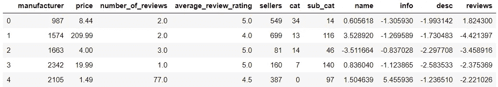
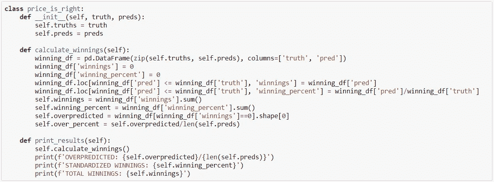
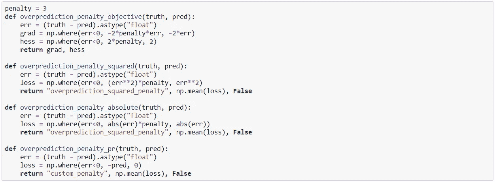
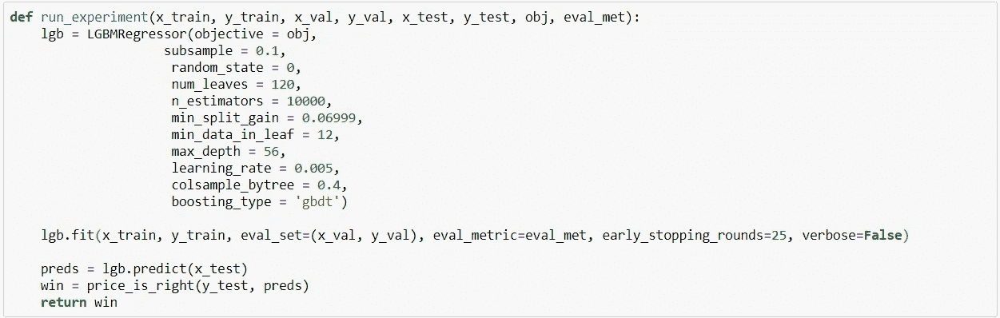
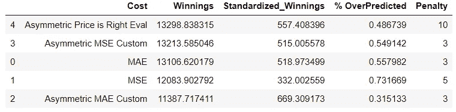
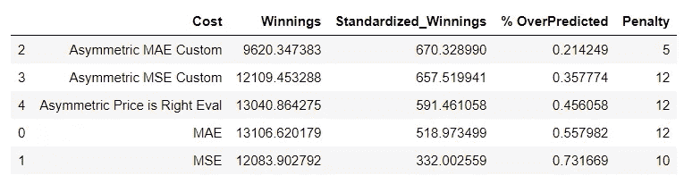

# 用 AI 赢得价格是对的

> 原文：<https://towardsdatascience.com/winning-the-price-is-right-with-ai-b77e6ade44e3?source=collection_archive---------34----------------------->

## 如何以及何时使用自定义成本函数

# 介绍

在机器学习中，我觉得成本函数是解决问题过程中经常被忽视的一部分。许多数据科学家对使用新模型或调整超参数以获得最佳性能感到兴奋。我们通常倾向于选择一个常见的成本函数，如均方差，然后毫不犹豫地继续训练。我认为，花时间思考和理解成本函数的含义以及它如何影响模型的性能，会对项目的结果产生重大影响。所以，为了进一步探索这个想法，我玩了一个热门游戏节目*的修改版《价格是对的》。*在我的这个实验中，我研究了不同的成本函数如何影响模型性能，包括我如何编写自己的函数来更具体地解决我想要解决的问题，以进一步改善结果。

# 成本函数的重要性

*注意:下一节是我如何看待成本函数适应整个问题解决过程的概述。如果你只是对* [*代码*](#4a1e) *或* [*实验*](#3327) *感兴趣，可以随意跳到下一节。*

这并不是对成本函数的介绍，而是假设对成本函数和梯度下降都有一定的了解。话虽如此，我还是想快速概述一下成本函数，然后深入探讨它们在问题解决过程中的影响。

## 什么是成本函数？

让我们看一个简单线性回归的基本例子来回顾成本函数。在线性回归中，我们试图解决找到最佳模型系数的问题，以绘制一条符合数据的直线。在机器学习中，这一般是通过梯度下降来完成的。梯度下降是一个过程，通过该过程，系数在成本曲线上缓慢下移，直到找到成本函数最小的位置。输入成本函数的重要性。

## 成本函数的作用

成本函数指导模型在进行预测时应该如何衡量不同的变量。它作为一个向导，帮助模型学习拟合数据的正确方法。所以你可以想象这可能真的很重要。如果一个模型被赋予了一个很差的成本函数，它就不会学会做出好的预测，也不会有用。

我发现思考成本函数的一个有价值的方法是将它们视为模型总体目标的反映。无论选择什么数学函数通过梯度下降来最小化，都应该尽可能地符合我们希望模型做的事情。我们以游戏节目*价格合适*为例。这个游戏的目标是尽可能准确地预测物品的价格，而不是猜测实际价格。那么成本函数如何反映这一点呢？我们希望我们的成本函数告诉我们的模型在不夸大事实的情况下做出预测。似乎不言自明，对吧？那么，为什么不是每个数据科学家总是为他们解决的每个不同的问题编写一个自定义损失函数呢？

## 选择成本函数

实际上，我认为为你试图解决的每个问题编写一个独特的成本函数是不现实的。对于某些任务，某些成本函数变得流行是有原因的。这是因为他们通常在解决某些类型的问题上做得很好。在 scikit-learn 等流行的框架中，这些函数中的许多已经变得非常容易实现。因此，在许多情况下，花时间编写一个自定义函数是没有意义的，因为它可能会花费更长的时间来最小化而不是改善您的结果。这并不是说不值得花时间来思考你的问题，以及哪个成本函数最有意义(我认为这是解决问题过程中非常宝贵的一部分)。但在现实中，你通常可以找到一个有助于解决你的问题的成本函数，而不需要花时间去写你自己的。

考虑到上面的警告，有时您可能会仔细考虑您的问题，并发现您可以创建自己的成本函数来提供更好的结果。本文的重点是向您展示充分理解您的问题以编写您自己的成本函数对您的项目成果的影响。现在舞台已经搭好，是时候进入*了，价格是正确的。*

# 价格合适

如果你不熟悉游戏节目*价格合适，*游戏相当简单。四名选手来到前面相互竞争。给他们展示物品，他们都要猜它的价格。猜得最接近实际价格的参赛者获胜，并进入下一轮。因此，大多数理性的人会问的一个明显的问题是:“我可以建立一个机器学习模型来帮助我在第一轮*价格合适*中获胜吗？”

## 数据

为了训练一个模型来帮助我赢得*价格是正确的*，我使用了来自[亚马逊玩具数据集](https://www.kaggle.com/PromptCloudHQ/toy-products-on-amazon)的数据，该数据集可在 Kaggle 上获得。在开始我的实验之前，我做了一些数据清理，并使用一些基本的 NLP 来创建特征，以预测数据中玩具的价格。如果你有兴趣看看我到底是怎么做的，你可以在这里查看[这个笔记本](https://github.com/ngriffiths13/custom_loss/blob/master/notebooks/data_cleaning.ipynb)。我最终的数据框如下所示:

## 实验装置

对于这个实验，我决定使用微软的 LightGBM。这是一个非常受欢迎的模型，目前是我的最爱之一。它还允许一些简单的方法来建立成本函数和评估。至于成本函数，我决定测试 5 个不同的变量。我使用了 2 个基线，即 LightGBM 已经实现的 MAE 和 MSE 函数。然后我写了 3 个自定义函数来测试。我将模型的超参数调整到 MAE，并在相同的随机状态下保持它们在所有模型迭代中的一致性。所以，如果有的话，我试图在我的实验中给基线优势。

接下来是对成本函数的评估。我决定评估模型性能的几个不同方面。第一个我称之为总奖金。为了在某种程度上复制*价格是正确的，*总奖金计算如下: ***如果预测高于事实，奖金等于零。如果预测低于事实，奖金与预测相等。*** 这种类型的评估对价值较高的项目给予较大的权重。正因为如此，我也评估了标准化的赢款，计算如下: ***如果预测高于事实，赢款等于零。如果预测低于事实，赢款等于预测除以事实。*** 这种方法对测试集中的每一个项目赋予相等的权重。除了这些方法，我还计算了每个模型过度预测的项目的百分比。下面是我创建的用来评估模型的类。

## 编写成本函数

LightGBM 使用两种不同类型的函数来训练模型。第一个就是我上面说的那个。它是目标函数。这是计算成本函数的梯度以帮助模型学习的函数。LightGBM 的独特之处在于它在学习中同时使用了一阶和二阶导数。你会看到我下面都有。第二种功能是评估功能。在这个实验中，我们使用评估集和提前停止来训练我们的模型。该模型使用评估函数来确定某个指标何时停止改善。当达到这一点时，模型停止训练以优化该指标。在我的实验中，我写了一个目标函数，并与三个不同的评估函数一起使用。

对于这些函数中的几个，我们使用一个惩罚来将我们的模型推向预测不足。这是一个在 Lasso 和 Ridge 回归中也用于有效分配系数权重的概念。在实验中，我观察了几个不同的罚值，并为每个函数选择了最好的一个。让我们快速看一下这些函数。

**超预测 _ 惩罚 _ 目标**:这是我们的目标函数。它是 MSE 的简单变体。我们计算 MSE 的一阶和二阶导数，并在预测值大于真实值时将损失乘以惩罚值。

**over prediction _ penalty _ squared:**这是我们的第一个评价函数。它也是 MSE 的一种变体，对过度预测进行惩罚。

**over prediction _ penalty _ absolute:**这是 MAE 的一个变体，对过度预测进行惩罚。

**over prediction _ penalty _ pr:**这是我专门针对这个问题写的一个独特的评价函数。在这本书里，我试图模拟我们实验的目标，通过返回一个与我们预测相等的损失，来哄骗我们的模型给我们尽可能高的回报。

这里是我写的运行实验的助手函数的快速浏览。您可以看到我使用的硬编码超参数以及早期停止和验证集。

## 结果

对于每个成本函数，我查看了总奖金和标准化奖金的最佳得分。这是总奖金的结果。

从这些结果中，我们可以看到，我们的自定义目标函数与我们的问题特定评估函数配对后，表现最好，其次是我们的自定义 MSE 评估函数。有趣的是，不同惩罚下的成本函数表现最佳。我会注意到，对于每个惩罚，这不是成本函数结束的顺序。在一些版本中，特定问题评估胜出，在一些版本中，自定义 MSE 胜出，在一个版本中，常规 MAE 胜出。这表明，在大多数情况下，您将不得不修改惩罚和超参数来确定最佳模型。现在是标准化的奖金。

在标准化奖金的情况下，低估价格的数量和奖金之间有很高的相关性(不出所料)。但是，我再次注意到，根据应用于问题的不同惩罚，顺序会发生变化。

# 最后的想法

编写定制成本函数的能力对我来说已经派上了好几次用场。有时是因为某个特定的问题更适合某个模型不支持的东西。我也遇到过这样的情况，我的模型简单地高估了，而不是低估，我想平衡一下。不管怎样，我相信这是一件值得修补和尝试的事情。这需要实验，就像数据科学领域的许多事情一样，但它有可能对模型的结果产生影响。

如果你对用其他方式编写定制函数感兴趣，scikit-learn 也支持它。你也可以在 TensorFlow 和 PyTorch 中编写自定义的成本函数。我认为值得花时间去理解成本函数，以及它们如何改变你的模型的性能。