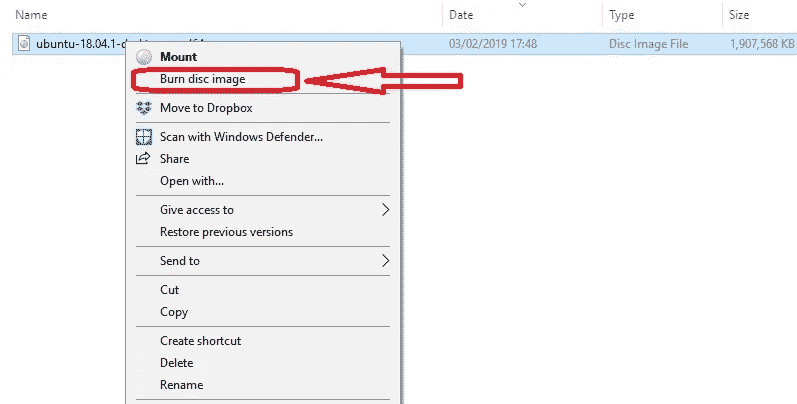
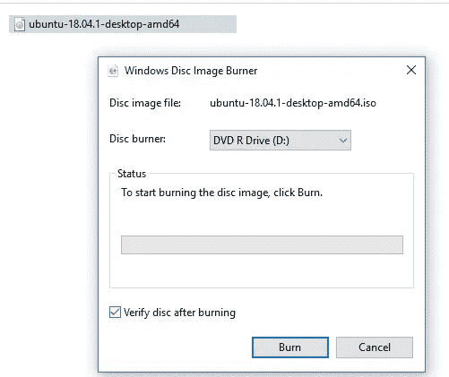
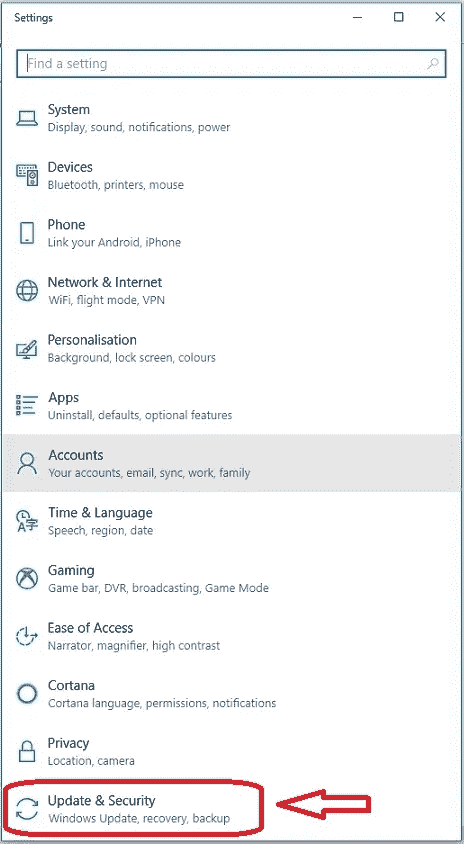
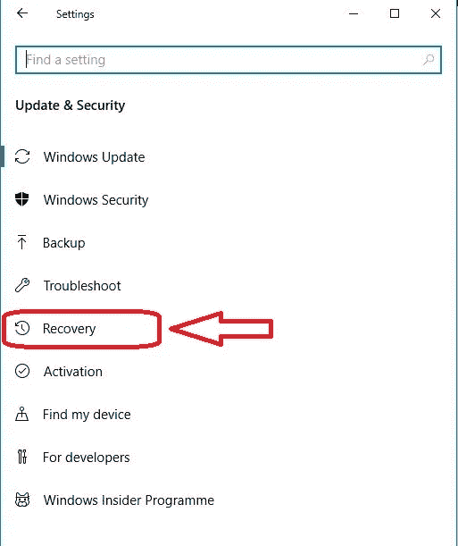
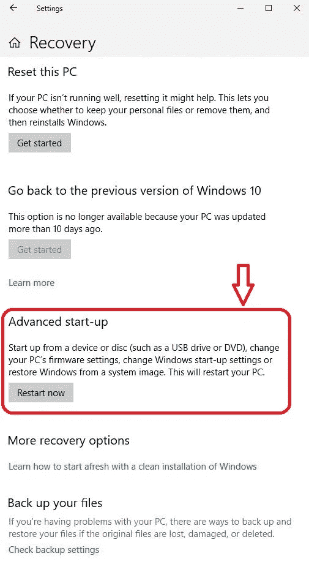
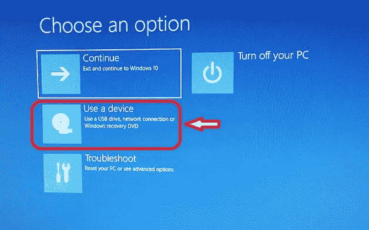
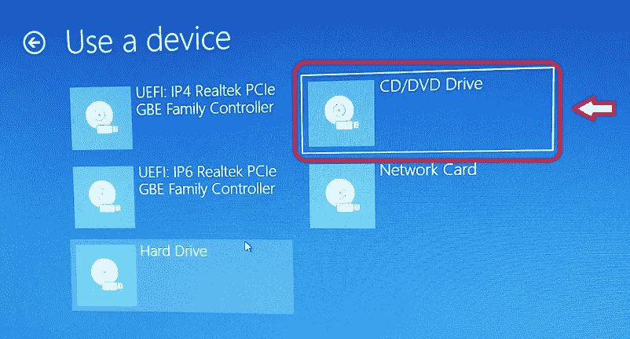
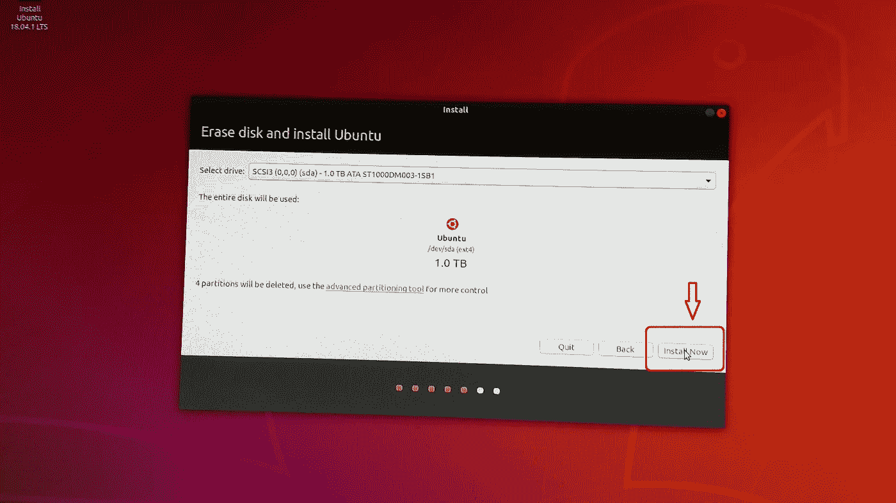

# 从你的电脑上删除 Windows 10 并安装 Ubuntu 18.04 LTS

> 原文：<https://towardsdatascience.com/wiping-windows-10-from-your-pc-installing-ubuntu-18-04-lts-7408973b057?source=collection_archive---------3----------------------->

# 为深度学习提升你的电脑——第 3 部分

在 [Part 1](/pimp-up-your-pc-for-machine-learning-d11f68c2815) 中，我展示了如何将 PC 的显卡升级到兼容 Nvidia CUDA 的 GPU，以实现更快的深度学习。为确保 GPU 安装完成而进行的所有软件检查都是在我的 Windows 10 家庭版上完成的。在[第二部](/installing-tensorflow-with-cuda-cudnn-and-gpu-support-on-windows-10-60693e46e781)中，我说过我会清除 Windows 10，用 Linux Ubuntu 取而代之(因为这通常比 Windows 更兼容机器学习项目)。第 3 部分介绍了擦拭和安装过程。

# 第 1 步:备份您电脑上的数据，并记下您的 Windows 10 激活密钥

在开始之前，请确保您已经备份并删除了 PC 中不可恢复的个人数据；一旦你安装了 Ubuntu 18.04，你的硬盘就会被清除。

同样，根据您的 Windows 在 PC 上的安装方式，您可能希望保留一个 25 位的 Windows 许可证密钥，以防您改变主意并希望重新加载 Windows。对我来说，这是在我的电脑外壳侧面的标签上。

# 第二步:为 Ubuntu 18.04 LTS 版制作一个可启动的 DVD 或 USB 驱动器

去官方 Ubuntu 18.04.1 LTS(仿生海狸)下载页面[这里](http://releases.ubuntu.com/18.04/)，或者[这里](https://www.ubuntu.com/download/desktop)获取 Ubuntu ISO 镜像。我正在下载 Ubuntu-18 . 04 . 1-desktop-amd64 . iso 的桌面图像。该文件的大小约为 1.8 GB。

您需要什么:

*   一个至少 2GB 的空 u 盘，用于存储可启动的 Ubuntu 18.04 映像。这需要在 FAT32 文件系统中进行格式化；**或**
*   一张可写/可读的 DVD，您可以在上面刻录 Ubuntu 18.04 ISO 映像。

**步骤 2a** (带镜像的可引导 USB 闪存驱动器)和**步骤 2b** (带可引导镜像的 DVD)是可选的，这取决于您使用 Ubuntu 18.04 ISO 镜像进行引导和安装的方式。我使用了**步骤 2b** ，因此仅简要提及**步骤 2a** 。如果您希望使用**步骤 2b**

# 步骤 2a:用 Ubuntu 18.04 ISO 镜像制作一个可启动的 USB 闪存驱动器

这里有一个很棒的 Ubuntu 教程，教你如何在闪存盘上制作可启动的 ISO 镜像。对于这篇文章，我没有制作 u 盘，而是刻录了一张 DVD。

# 步骤 2b:使用 Ubuntu 18.04 ISO 映像刻录 DVD

假设 Ubuntu ISO 镜像(在我的例子中称为 Ubuntu-18 . 04 . 1-desktop-amd64 . ISO)已经下载到了你的 PC 上——那里暂时还安装着 Windows 去找到。iso '文件。

在 Ubuntu 官方网站上，有专门的[在 Windows](https://tutorials.ubuntu.com/tutorial/tutorial-burn-a-dvd-on-windows#0) 上刻录 Ubuntu DVD 的教程。当您将 DVD 插入 PC 上的读/写驱动器时，如果您使用的是 Windows 10，您可以右键单击下载的文件，然后选择“刻录光盘映像”将 ISO 映像刻录到 DVD 上，如图 1 所示。

Fig 1: burning ISO image onto writable DVD

一个新的“Windows 光盘映像刻录机”窗口将出现，如图 2 所示。选择要刻录为(在本例中)“Ubuntu-18 . 04 . 1-desktop-amd64 . iso”的光盘映像文件。勾选标有“刻录后验证光盘”的方框，以确保刻录成功。

Fig 2: choosing where to burn the ISO image and verifying disk

在刻录过程结束时，您应该会在状态栏中看到一条消息，显示“光盘映像已成功刻录到光盘”。至此，你已经准备好使用你的 Ubuntu 了。iso 镜像来启动你的电脑，如步骤 3 所述。

# 步骤 3:使用 DVD(或 u 盘)上的 ISO 启动 Ubuntu

我选择用一张刻录了 Ubuntu ISO 的 DVD 启动。 [Ubuntu 说明书](https://tutorials.ubuntu.com/tutorial/tutorial-install-ubuntu-desktop#2)上写着:“从 DVD 上安装 Ubuntu 很容易。你需要做的是:

1.  将 Ubuntu DVD 放入光驱。
2.  重新启动计算机。

一旦你的电脑启动，你会看到欢迎窗口。"

我的 windows 10 电脑无法从 Ubuntu 自动启动。iso DVD，而是默认引导到 Windows 10，忽略可引导。驱动器中的 iso DVD。如果您遇到这种情况，请查看下面的步骤 3a。

# 步骤 3a(可选):如果你不能从新的启动到 Ubuntu，需要进一步的操作。iso DVD:

如果你的电脑正常启动到 Windows 10，但没有从 Ubuntu 自动启动。iso 磁盘，您可以

a) [用一个键](https://www.tomshardware.co.uk/bios-keys-to-access-your-firmware,review-34479.html)进入 BIOS(当你启动的时候，选项有时会短暂的闪烁——但是我的选项根本不会出现)或者，

b)使用 Window 10 的高级开始菜单。

对于选项 a)，[本文](https://neosmart.net/wiki/booting-from-a-cd-or-dvd/)还包含最常见 bios 选项的有用指导，以及如何进入 bios。它指出 F12 是调出系统启动菜单最常用的键，但是 Escape、F2 和 F10 也是常用的选择。它建议你在系统启动时寻找一个简短的信息，它可以通知你按哪个键来调出启动菜单。在我的情况下，这些选项根本没有闪现，也没有尝试 F12，F2，F10 等。因此，我选择使用 Window 10 的高级开始菜单，如步骤 4 所述。

# 第四步:使用 Window 10 的高级开始菜单启动 DVD

要使用 Windows 10 的高级开始菜单，请导航到“设置”(齿轮图标)，或在 Windows 10 开始菜单中搜索“设置”。在“设置”中，底部的选项(如图 3 所示)是“更新和安全”选项。

Fig 3: Windows 10 settings — the bottom setting in the list is “Update & Security”

选择“更新和安全”(图 3)将带你到一个更远的窗口，有更多的选项列表(图 4)。选择“恢复”。

Fig 4: Recovery option in Update & Security within Settings

当您从图 4 的选项中选择“恢复”时，会显示各种恢复选项(图 5)。

Fig 5: Recovery Options & Choosing ‘Advanced start-up’ option

在图 5 的恢复选项中，选择“高级启动”，这将允许从 USB 驱动器或 DVD 启动。选择此项将自动重启你的电脑。在这一阶段，确保你有装有 Ubuntu 的 DVD 或 u 盘。iso 文件，在适当的 PC 驱动器中。

# 使用 DVD 重启/重新启动

在这一阶段，您的电脑会自动重启，u 盘或 DVD 放在电脑驱动器中。图 6 显示了带有选项的启动窗口。在此窗口中，您应该选择使用一个设备(USB 驱动器或您的 DVD，视情况而定)进行引导。

Fig 6: Screenshot on Windows 10 PC restart where a device is chosen to boot from (USB or DVD with Ubuntu .iso)

在我的例子中，我选择了图 7 所示的 CD/DVD 驱动器选项，因为它包含了 Ubuntu。我需要安装的 iso 文件。

Fig 7: Choosing device type (in my case DVD) to boot up from

# 步骤 5:从 DVD 光盘启动 Ubuntu

一旦电脑再次启动，这次是进入 Ubuntu，Ubuntu 红色和紫色的桌面背景就会显示出来。会出现一个名为“安装 Ubuntu 18.04.LTS”的图标；这在图 8 的左上角可见。如果你双击图标，这将打开一个窗口(“擦除磁盘并安装 Ubuntu”)，这将开始完整的安装过程，如图 8 所示。单击该窗口上的“立即安装”按钮开始安装过程。Ubuntu 的最终安装是通过一系列窗口一步一步引导的，这里也描述了。

Fig 8: Clicking on the ‘Install Ubuntu’ icon (top left) starts the full disk erasure and Ubuntu installation process

# 结论

这篇文章阐述了 Ubuntu 仿生海狸(18.04 LTS)的安装，在这个过程中擦窗户 10。该系列未来的帖子将包括为 Ubuntu 18.04 LTS 安装 Nvidia 驱动程序、CUDA、cuDNN 和 Tensorflow。