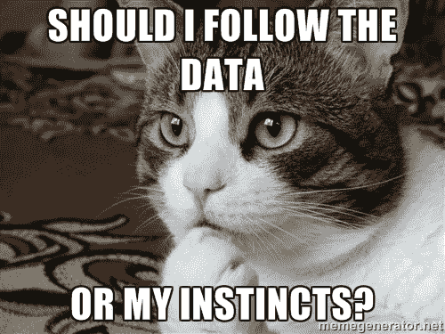

# 没有理论，数据科学只是关于猫的迷因

> 原文：<https://towardsdatascience.com/without-theory-data-science-is-just-about-cat-memes-5c3c3948d84f?source=collection_archive---------21----------------------->

## 仅依赖原始数据会限制您的数据科学工具的范围

数据科学的前景是巨大的，有时感觉你可以强行进入几乎任何有统计学意义的关系，而不用担心理论。那么我们真的应该就这样抛弃后者吗？

在下文中，我不争辩，因为:

1.你的数据是*从来没有*那么好

2.有因果关系:这很复杂

Lol cat, exhibit 1

## 炒作，炒作，万岁！

长期以来，理论(如经济学、语言学等。)在那里指导决策制定，同时在计算能力方面保持吝啬。然而，[摩尔定律](https://en.wikipedia.org/wiki/Moore%27s_law)将我们带到了一个阶段，计算机将在几秒钟内产生统计算法，这些算法在几年前被认为过于贪婪而无法实现。

媒体不失时机地给予关注，例如《连线》*2008 年的这篇文章:*

> *“忘掉分类学、本体论和心理学吧。谁知道人们为什么做他们所做的事？关键是他们做到了，我们可以以前所未有的保真度跟踪和测量它。有了足够的数据，数字就说明了一切。”*

*这当然是一个非常天真的说法，任何一个做过数学的人都会知道。但这里更重要的一点是，有些人愿意向你出售他们的数据科学蛇油，这不仅仅是夸大其词:他们通常是在公然对你撒谎。就拿同一篇文章来说吧:谷歌当时和现在的研究总监彼得·诺维格(Peter Norvig)被引述说:“所有的模型都是错的，越来越多的情况下，没有它们你也能成功。”结果是[他实际上从未说出被认为是他说的话](http://norvig.com/fact-check.html)，他甚至说了相反的话！*

## *只是没有深入到你的数据中*

*好吧，有些人夸大了它，但它有多糟糕呢？让我们面对现实吧:目前，数据科学最好的情况是识别猫的图片。现在，自动识别图片、识别口头指令或推荐打字内容显然非常有用，因为它可以增强用户体验，并自动完成单调乏味的劳动密集型任务。*

*但在 Siri 和谷歌翻译之外，商业环境中的人们通常对了解他们所做决定的效果感兴趣，看看他们是否应该做出这些决定。*

*一只猫有一些特征来定义它，包括耳朵、尾巴、胡须等等。所以最后，铲子就是铲子，猫就是猫。*

*但是当涉及到人类时，事情就变得更加混乱了。客户的购买习惯、欺诈者的盗用技术或优步司机的乘车模式都是人们对其环境做出反应的结果，并考虑了他们行为的成本和收益(尽管可能没有达到最大程度)。这些成本和收益会随着时间的推移而变化，例如，随着法律或可用技术的变化而变化。他们也可以因参与者的学习而改变。*

*一个例子可以更好地说明为什么在这种情况下理论变得非常重要:想象一下，我正试图以 1000 美元的价格卖给你一支普通的铅笔。你不会买它，可能会说:“不可能，这不是一支铅笔的价格！”。你是对的，因为我的提议不是价格，除非你我同意交换。*

*这个基本的玩具例子在现实世界中可能会产生戏剧性的后果:在与一家相对较大的科技公司的数据科学家的讨论中，他们真的很困惑地听说，供应商在其平台上发布的价格实际上只有在卖家遇到买家时才成为价格信息。这意味着至少 75%的数据应该被丢弃，因为大多数帖子最终都没有在交易中结束。*

*关于人类行为的数据充斥着这类问题，讨价还价只是其中之一。这意味着，任何一个盲目适合数据的模型都只会和它所适合的数据一样好，直到新的东西出现，改变了代理之间的交互的性质。因此，既然所有数据集的母体并不存在，那么理论所做的就是将人们从其他不相关的数据集中学到的知识编织成常识。这就是理论作为概括的明显作用。*

## *因果*

*现在，理论不仅证明在(永远)不完整数据集的情况下更稳健。数据科学越来越关注因果推理，试图回答这样一个问题:为什么会这样？这不仅仅是纯粹的相关性(例如，吸烟的人死得更早)，而是找出发生了什么，以便我们能够采取行动(例如，香烟烟雾中含有各种各样的东西，这些东西会滞留在肺部，有可能恶化为癌症:由此你可以有把握地得出结论，停止吸烟有助于避免过早死亡)。*

*纯粹基于统计理由建立因果推断有两个问题:稳健性和可解释性。稳健性问题是上一节提出的观点的另一种表现形式:如果你对观察结果背后的机制没有概念，你就不能仅仅根据你的数据安全地进行概括。*

*至于可解释性，决策总是需要关注价值和风险的正确驱动因素。在某种意义上，理论是一种变量选择工具，这是原始统计技术的目标。以 LASSO 和其他正则化技术为例:众所周知，基本变量通常取决于所选的数据子集。解释能力到此为止！不言而喻，本质上是高性能预测黑盒的深度学习技术在这方面甚至更差。*

*在某些情况下，人们可能能够使用 A/B 测试来隔离因果关系。然而，如果没有理论，这种方法在许多情况下会遭受所谓的干扰偏差，特别是对于平台。为了理解这一点，让我们想象 Deliveroo 要建立某种优先交付。在这种情况下，因为 Deliveroo 是一个多方面的平台，将客户、餐厅和送货员联系在一起，所以人们不能只是以通常的方式在参与者的代表性子集上进行测试。这里的问题是，该实验正在改变对照组(优先递送功能未被激活)和治疗组(消费者可以选择优先递送)之间的竞争格局。因此，需要理论(这里是供求分析，可能与博弈论或产业组织相结合)来指导实验的设置，以考虑外部性并中和任何不必要的影响。*

## *不要错过*

*总而言之，如果一个人对决策感兴趣的话，仅仅依靠理论上的数据是不可能的。如果尽管进行了上述讨论，你仍然心存疑虑，请记住，这不仅仅是我说的，还有计量经济学家如[库普曼斯](https://elaine.ihs.ac.at/~blume/koopmansres.pdf)，或计算机科学家如[彼得·诺维格](http://norvig.com/fact-check.html)或[朱迪亚·珀尔](https://www.quantamagazine.org/to-build-truly-intelligent-machines-teach-them-cause-and-effect-20180515/)。在他们之前，这种方法可以追溯到哲学家，如康德。相关性是一件美妙的事情，但是(套用舞韵合唱团的话)不要让自己被滥用！*